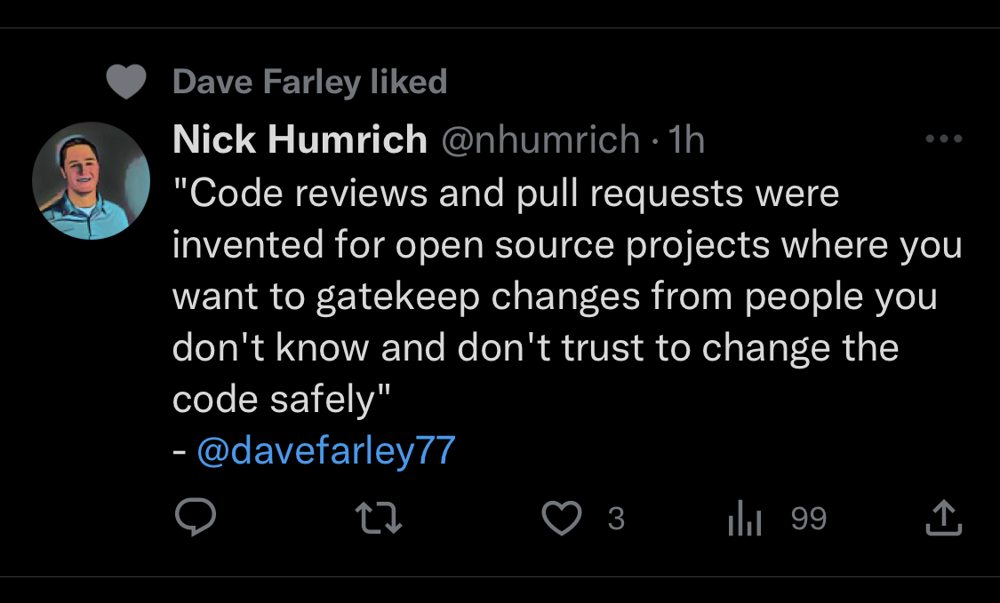

Graeme Lockley recently shared this tweet with me:

<!--truncate-->

I've seen this floating around. There is something to be said for low friction contribution for people that you trust. For that reason I definitely apply less scrutiny to PRs from people that I know / trust less as compared to people I know / trust more. However, to add a little more nuance:

## Pull Requests provide a "moment of consideration"

A moment to take stock of what's been built, and whether we'd be happy with it landing that way. Because I'm an equal opportunities kinda guy, I apply that to myself. When I raise a PR, before I let others know it's ready for review, I will tend to do a first review myself. It's amazing the different perspective you can have as the consumer of a PR as compared to a producer. I find I change things often before sharing with others as a consequence.

## Pull Requests provide a chance for communication

Engineers are not obligated to communicate about what they do. And famously many of us aren't very good at it either. You become good at things that you practice at. PRs provide an opportunity to express in clear language, the aim of a change and why it is implemented in a certain way. That allows the engineer to practice repeatedly the act of communication, which will make them a more useful engineer to those around them.

Very much related to this, PRs are a teaching opportunity. It's a way to level up the next generation of engineers that are learning from you. What we do is more than the code we write, it's the culture we create.

## Where does Automated Testing fit in?

Finally, automated testing. If you value automated testing, you must ask yourself the question: where does it fit into the contribution picture? Running automated tests against contributions is a good way to test the value those contributions provide. If you don't run them prior to contribution, then when do you run them? And how do you evidence the results?

## Conclusion

Low friction contribution is a good goal. In the case of very simple pull requests, automating from top to bottom with minimal need for human interaction is a great idea. In fact if you'd like to see an example of this in the wild, it's worth taking a look at the automation the TypeScript team, and in particular [Orta Therox](https://orta.io), applied to the [Definitely Typed](https://github.com/DefinitelyTyped/DefinitelyTyped) repo.

But, safe to say, I think there's a great deal more nuance to the topic than implied by the raw tweet.
