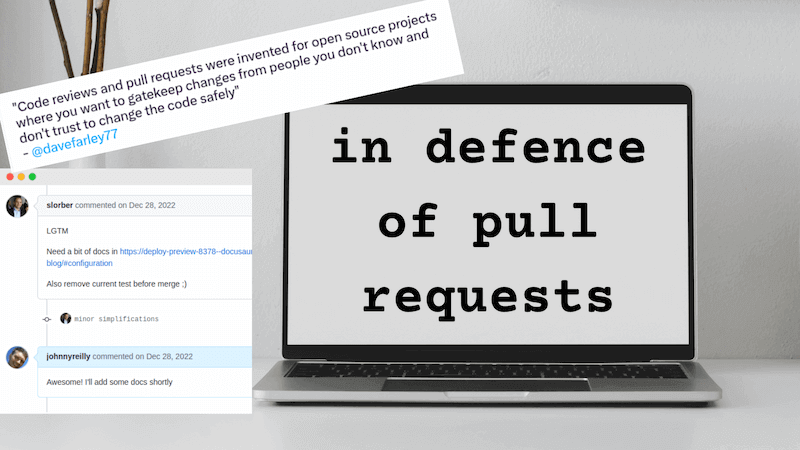
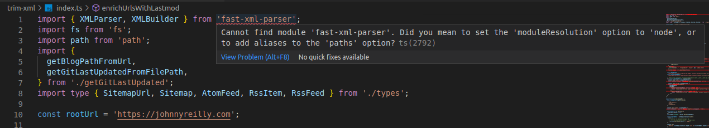

I've wanted to take a look at some of the alternative JavaScript runtimes for a while. The thing that has held me back is npm compatibility. I want to be able to run my code in a runtime that isn't Node.js and still be able to use npm packages. I've been using [`ts-node`](https://typestrong.org/ts-node/) for a long time now; it's what I reach for when I'm building any kind of console app. In this post I want to port a console app from `ts-node` to [`bun`](https://bun.sh/) and see how easy it is.



<!--truncate-->

## The app

trim-xml

## Installing bun

I installed bun on my Ubuntu machine using the following command:

```
curl -fsSL https://bun.sh/install | bash
```

Which resulted in the following output:

```
bun was installed successfully to ~/.bun/bin/bun

Added "~/.bun/bin" to $PATH in "~/.zshrc"

To get started, run:

 exec /usr/bin/zsh
  bun --help
```

I was a little weirded out by the inconsistent indentation in the output but I'm sure that's just a formatting issue. (I submitted a [PR to fix this](https://github.com/oven-sh/bun/pull/2175).) When I ran the suggested commands it looked like bun was happy and healthy.

## Porting the app

With bun in place I was ready to port the app. I opened up the (as I say, badly named) `trim-xml` directory and triggered installation of the dependencies using `bun install`:

```bash
cd trim-xml
bun install
```

Output looked like this:

```bash
bun install v0.5.7 (5929daee)
 + @types/node@18.14.1
 + fast-xml-parser@4.1.2
 + simple-git@3.16.1
 + typescript@4.9.5

 5 packages installed [2.34s]
```

And a new `bun.lockb` file had appeared in the directory. Although I can't find any documentation on it, I'm guessing that this is the bun equivalent of `package-lock.json` or `yarn.lock`. It's a binary file, so you can't read it. I did find this [project which allows you read bun.lockb files](https://github.com/JacksonKearl/bun-lockb) which looks like a useful way to solve that problem.

To avoid confusion, I also deleted the `yarn.lock` file. I'm not sure if that's necessary or not.

But anyway, yay - I've installed things! And pretty fast! What next?

## From `@types/node` to `bun/types`

As I looked at the output for the install I realised that the `@types/node` package had been installed. The `@types/node` package is a package that contains TypeScript definitions for the Node.js runtime. Given we're moving to using bun, it seemed likely that I didn't need these. But I likely did need something that represented the bun runtime types. (Which incidentally, I would imagine to be pretty similar to the Node.js runtime types.)

I had a quick look at the bun documentation and found the [`bun/types`](https://oven-sh.github.io/bun-types/) package. I added it to my project, whilst removing `@types/node` and `ts-node`:

```bash
bun remove @types/node
bun remove ts-node
bun add bun-types
```

Output looked like this:

```bash
bun remove v0.5.7 (5929daee)
 - @types/node

 1 packages removed [3.00ms]
bun remove v0.5.7 (5929daee)
 - ts-node

 1 packages removed [843.00ms]
bun add v0.5.7 (5929daee)

 installed bun-types@0.5.7


 1 packages installed [1.97s]
```

The docs also say:

> Add this to your `tsconfig.json` or `jsconfig.json`:
>
> {
> "compilerOptions": {
> "lib": ["ESNext"],
> "module": "esnext",
> "target": "esnext",
> // "bun-types" is the important part
> "types": ["bun-types"]
> }
> }

I aligned my existing `tsconfig.json` with the above. For my console app this meant the following changes:

```diff
  {
    "compilerOptions": {
-      "target": "ES2022",
+      "target": "esnext",
-      // "lib": [],
+      "lib": ["ESNext"],
-      "module": "NodeNext",
+      "module": "esnext",
-      // "types": [],
+      "types": ["bun-types"],
    },
  }
```

I'd imagined that at this point I'd be able to run the app, but when I navigated around in VS Code I saw that I had a bunch of errors. I was getting errors like this:



Ironically, the error message was suggesting I needed to explicitly state that I wanted to use the Node.js module resolution algorithm. Even though I was using bun. So I made one more change to my `tsconfig.json`:

```diff
  {
    "compilerOptions": {
-      // "moduleResolution": "node",
+      "moduleResolution": "nodenext",
    },
  }
```

This took away the errors. I now needed to do one more thing:

```diff
-    "start": "ts-node index.ts"
+    "start": "bun index.ts"
```

That's right; update the `start` script in `package.json` to use `bun` instead of `ts-node`. And now I was able to run the app with `bun start`:

```bash

```
