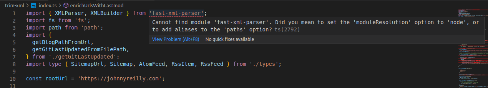
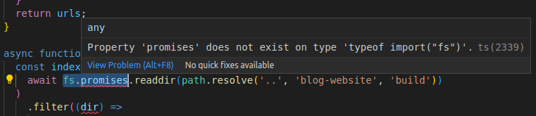

I've wanted to take a look at some of the alternative JavaScript runtimes for a while. The thing that has held me back is npm compatibility. I want to be able to run my code in a runtime that isn't Node.js and still be able to use npm packages. I've been using [ts-node](https://typestrong.org/ts-node/) for a long time now; it's what I reach for when I'm building any kind of console app. In this post I want to port a console app from ts-node to [Bun](https://bun.sh/) and see how easy it is.


<!--truncate-->

## The ts-node app

I have a [technical blog](https://johnnyreilly.com/) which is built on Docusaurus. I run a number of post processing scripts on the blog to do things like:

- update the `sitemap.xml` to include the `lastmod` date and truncate the number of entries
- patch the html files to use Cloudinary as an image CDN for open graph images

These scripts are implemented as a ts-node console app. For historical reasons it's called `trim-xml` (it originally just truncated the `sitemap.xml` file). It's a pretty simple app. It's a single file with a bunch of functions. It's not a particularly good name for the app but I'm not going to change it now.

What we're interested in, is porting this app from ts-node to Bun. The app has a few dependencies; so npm compatibility is important to us. Let's see how it goes.

## Installing Bun

I installed Bun on my Ubuntu machine using the following command:

```
curl -fsSL https://bun.sh/install | bash
```

Which resulted in the following output:

```
bun was installed successfully to ~/.bun/bin/bun

Added "~/.bun/bin" to $PATH in "~/.zshrc"

To get started, run:

 exec /usr/bin/zsh
  bun --help
```

I was a little weirded out by the inconsistent indentation in the output but I'm sure that's just a formatting issue. (I submitted a [PR to fix this](https://github.com/oven-sh/bun/pull/2175).) When I ran the suggested commands it looked like bun was happy and healthy.

## Porting the install from yarn to bun

With bun in place I was ready to port the app. I opened up the (as I say, badly named) `trim-xml` directory and triggered installation of the dependencies using `bun install`:

```bash
cd trim-xml
bun install
```

Output looked like this:

```bash
bun install v0.5.7 (5929daee)
 + @types/node@18.14.1
 + fast-xml-parser@4.1.2
 + simple-git@3.16.1
 + typescript@4.9.5

 5 packages installed [2.34s]
```

And a new `bun.lockb` file had appeared in the directory. Although I can't find any documentation on it, I'm guessing that this is the bun equivalent of `package-lock.json` or `yarn.lock`. It's a binary file, so you can't read it. I did find this [project which allows you read bun.lockb files](https://github.com/JacksonKearl/bun-lockb) which looks like a useful way to solve that problem.

To avoid confusion, I also deleted the `yarn.lock` file. I'm not sure if that's necessary or not.

But anyway, yay - I've installed things! And pretty fast! What next?

## From `@types/node` to `bun/types`

As I looked at the output for the install I realised that the `@types/node` package had been installed. The `@types/node` package is a package that contains TypeScript definitions for the Node.js runtime. Given we're moving to using bun, it seemed likely that I didn't need these. But I likely did need something that represented the bun runtime types. (Which incidentally, I would imagine to be pretty similar to the Node.js runtime types.)

I had a quick look at the Bun documentation and found the [`bun/types`](https://oven-sh.github.io/bun-types/) package. I added it to my project, whilst removing `@types/node` and `ts-node`:

```bash
bun remove @types/node
bun remove ts-node
bun add bun-types
```

Output looked like this:

```bash
bun remove v0.5.7 (5929daee)
 - @types/node

 1 packages removed [3.00ms]
bun remove v0.5.7 (5929daee)
 - ts-node

 1 packages removed [843.00ms]
bun add v0.5.7 (5929daee)

 installed bun-types@0.5.7


 1 packages installed [1.97s]
```

The docs also say:

> Add this to your `tsconfig.json` or `jsconfig.json`:
>
> {
> "compilerOptions": {
> "lib": ["ESNext"],
> "module": "esnext",
> "target": "esnext",
> // "bun-types" is the important part
> "types": ["bun-types"]
> }
> }

I aligned my existing `tsconfig.json` with the above. For my console app this meant the following changes:

```diff
  {
    "compilerOptions": {
-      "target": "ES2022",
+      "target": "esnext",
-      // "lib": [],
+      "lib": ["ESNext"],
-      "module": "NodeNext",
+      "module": "esnext",
-      // "types": [],
+      "types": ["bun-types"],
    },
  }
```

## `moduleResolution` with Bun

I'd imagined that at this point I'd be able to run the app, but when I navigated around in VS Code I saw that I had a bunch of errors. I was getting errors like this:



Ironically, the error message was suggesting I needed to explicitly state that I wanted to use the Node.js module resolution algorithm. Even though I was using bun. So I made one more change to my `tsconfig.json`:

```diff
  {
    "compilerOptions": {
-      // "moduleResolution": "node",
+      "moduleResolution": "nodenext",
    },
  }
```

This took away the module resolution errors.

## File APIs with Bun

However, I was still getting errors. This time they were about the [`fs.promises` API](https://nodejs.org/api/fs.html#promises-api). I was getting errors like this:



It looks like the version of bun I was using didn't support that API. As I dug through my code I realised that I was using the `fs.promises` API in a few places. I was using it in the following ways:

- `await fs.promises.readdir`
- `await fs.promises.readFile`
- `await fs.promises.writeFile`

For `fs.promises.readFile` and `fs.promises.writeFile` I was able to replace them with the Bun equivalents:

```diff
- `await fs.promises.readFile`
+ [`await Bun.file(path).text()`](https://bun.sh/docs/api/file-io#reading-files)
- `await fs.promises.writeFile(path, content)`
+ [`await Bun.write(path, content)`](https://bun.sh/docs/api/file-io#writing-files)
```

There was no Bun equivalent for `fs.promises.readdir`, so I had to use the sync Node.js API:

```diff
- `await fs.promises.readdir`
+ [`fs.readdirSync(path)`](https://nodejs.org/api/fs.html#fsreaddirsyncpath-options)
```

We now had code without any errors! (At least in VS Code as far as TypeScript was concerned. I still had to run the app to see if it worked.)

## Running the app

I now needed to do one more thing:

```diff
-    "start": "ts-node index.ts"
+    "start": "bun index.ts"
```

That's right; update the `start` script in `package.json` to use `bun` instead of `ts-node`. And now I was able to run the app with `bun start`:

```bash
Loading /home/john/code/github/blog.johnnyreilly.com/blog-website/build/sitemap.xml
Reducing 526 urls to 512 urls
```

The first positive thing about what I saw, was that we appeared to have running code. Yay! It also appeared to be executing instantaneously, which seemed surprising. Also, we seemed to be lacking many of the log messages I'd expect. I was expecting to see about 1000 log messages. Something wasn't right.

## Top level `await` and Bun

The issue was that my `main` function was asynchronous. However, because support for top level `await` wasn't available when I originally wrote the code, I'd called the `main` function synchronously, and fortunately Node didn't complain about that.

But bun looked like it was respecting the fact that `main` was asynchronous and that's why it was apparently executing so quickly; it wasn't waiting for the `main` method to complete. That very much aligns with the code that I'd written; I wasn't using top level `await`. I needed to. So I made the following change to my `index.ts` file:

```diff
- main();
+ await main();
```

And now I was getting the expected log messages; and the program appeared to be working as expected.

## GitHub Actions and Bun

I was now able to run the app locally. But I wanted to run it in GitHub Actions. I just needed to add the `setup-bun` action to my workflow, so bun was available in the GitHub Actions environment:

```yaml
- name: Setup bun 🔧
  uses: oven-sh/setup-bun@v1
  with:
    bun-version: latest
```

## Performance comparison; Bun vs ts-node

I was expecting Bun to be faster than ts-node. Let's take a run of our app with ts-node and compare it to a run of our app with Bun:

### ts-node

```
Post processing finished in 17.09 seconds
Done in 19.52s.
```

### bun

```
Post processing finished in 12.367 seconds
Done in 12.72s.
```

I haven't done any formal benchmarking, but it looks like Bun is about 50% faster than ts-node for this usecase. That's pretty good. It's also worth expanding on how this breaks down.

You'll notice in the logs above there's two log entries; the "Post processing" reflects the time taken to run the `main` function. The "Done" reflects the time taken to run the `bun` command end to end.

What does this tell us?

First of all, running code in ts-node takes 17 seconds, compared to 12 seconds with Bun. So Bun is about 40% faster at running code.

The end to end is 19 seconds with ts-node, compared to 14 seconds with Bun. So Bun is about 50% faster end to end. There's two parts to this; the time taken to compile the code and the time taken to start up. We're doing type checking with ts-node; which if deactivated would make a difference.

However, when you look at the difference between the end to end runtime and code runtime with Bun, it's a mere 0.353 seconds. ts-node clocks in at 2.43 seconds for the same. So ts-node is about 6.5 times slower at starting up. That's a pretty big difference.

## Conclusion

Moving from ts-node to Bun was a pretty easy process. I was able to do it in a few hours. I was able to run the app locally and in GitHub Actions. And I was able to run the app in less time.

This all makes me feel very positive about Bun. I'm looking forward to using it more in the future.
