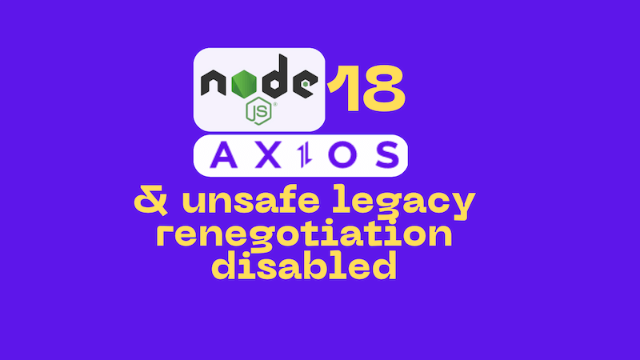

Node.js 18 doesn't allow legacy TLS renegotion by default. But some APIs still need it. Also, corporate network traffic network is often subject to SSL inspection and that can manifest as a downgrade in TLS negotiation. [Palo Alto Networks SSL Inbound Inspection is an example of an SSL inspector that can downgrade TLS](https://docs.paloaltonetworks.com/pan-os/9-1/pan-os-admin/decryption/configure-ssl-inbound-inspection).

This post shows how to support work around this issue with Axios.



<!--truncate-->

## The error

If you have code that uses Node.js and Axios, you may have encountered this error when you upgraded to Node.js 18:

```bash
EPROTO B8150000:error:0A000152:SSL routines:final_renegotiate:unsafe legacy renegotiation disabled
```

or if you're using the Azure SDK for JavaScript, you may have seen this:

```bash
RestError: write EPROTO 40736C4DF87F0000:error:0A000152:SSL routines:final_renegotiate:unsafe legacy renegotiation disabled:../deps/openssl/openssl/ssl/statem/extensions.c:922:
```

## Why does this happen?

The source of this error is Node.js 18 disabling unsafe legacy TLS renegotiation. The motivation for this is noble; it's to mitigate [CVE-2009-3555](https://cve.mitre.org/cgi-bin/cvename.cgi?name=cve-2009-3555).

Alas, there are APIs that still use legacy TLS negotiation. And SSL inspection can make APIs that actually do support modern TLS appear as though they do not. I first encountered this issue when working with the [Teams webhook API](../2019-12-18-teams-notification-webhooks/index.md), and for a while incorrectly thought that the fault was with the API. It was not, it lay with Palo Alto Networks SSL Inbound Inspection.

I subsequently encountered the self same issue with the [Azure SDK for JavaScript](https://github.com/Azure/azure-sdk-for-js) and [in discussion with the team the SSL inspection was identified as a likely cause](https://github.com/Azure/azure-sdk-for-js/issues/26310). We were further able to confirm that SSL inspection was the cause by working with our network team to disable SSL inspection for the API in question. This resolved the issue.

## Working around the issue

But what say you can't disable SSL inspection? Or what if you're using an API that doesn't support modern TLS negotiation? Well, you can work around the issue by allowing legacy TLS renegotiation.

[I found details on how to do this using Axios on Stack Overflow](https://stackoverflow.com/questions/74324019/allow-legacy-renegotiation-for-nodejs/74600467#74600467). I kept needing to come back to it again and again, so I wrote this up to make the solution easier for me to find.

So if you are facing this issue, here's how to work around it with Axios.

```ts
import crypto from 'crypto';
import https from 'https';

/**
 * Handle this problem with Node 18
 * write EPROTO B8150000:error:0A000152:SSL routines:final_renegotiate:unsafe legacy renegotiation disabled
 * see https://stackoverflow.com/questions/74324019/allow-legacy-renegotiation-for-nodejs/74600467#74600467
 **/
const allowLegacyRenegotiationforNodeJsOptions = {
  httpsAgent: new https.Agent({
    // for self signed you could also add
    // rejectUnauthorized: false,
    // allow legacy server
    secureOptions: crypto.constants.SSL_OP_LEGACY_SERVER_CONNECT,
  }),
};

function makeRequest(url: string, data: object) {
  return axios({
    ...allowLegacyRenegotiationforNodeJsOptions,
    url,
    headers: {
      Accept: 'application/json',
      'Content-Type': 'application/json',
    },
    method: 'POST',
    data: { some: 'data' },
  });
}
```

There's not much going on here; we're just telling Axios to use an https agent that allows legacy TLS renegotiation. No more than that. With this approach, you can make Axios requests to APIs that use legacy TLS renegotiation. I'd love to be able to do this with the Fetch API, but I haven't found a way to do that yet.

## Summary

Node.js 18 disables unsafe legacy TLS renegotiation by default. This can cause issues with APIs that still use legacy TLS renegotiation. It can also cause issues if your requests are subject to SSL inspection.

This post demonstrates how to work around the issue with Axios.
