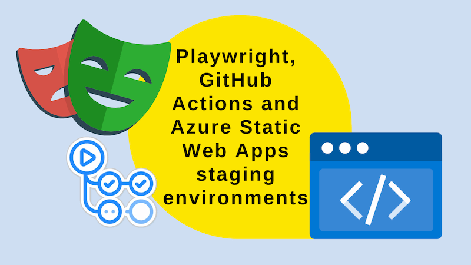
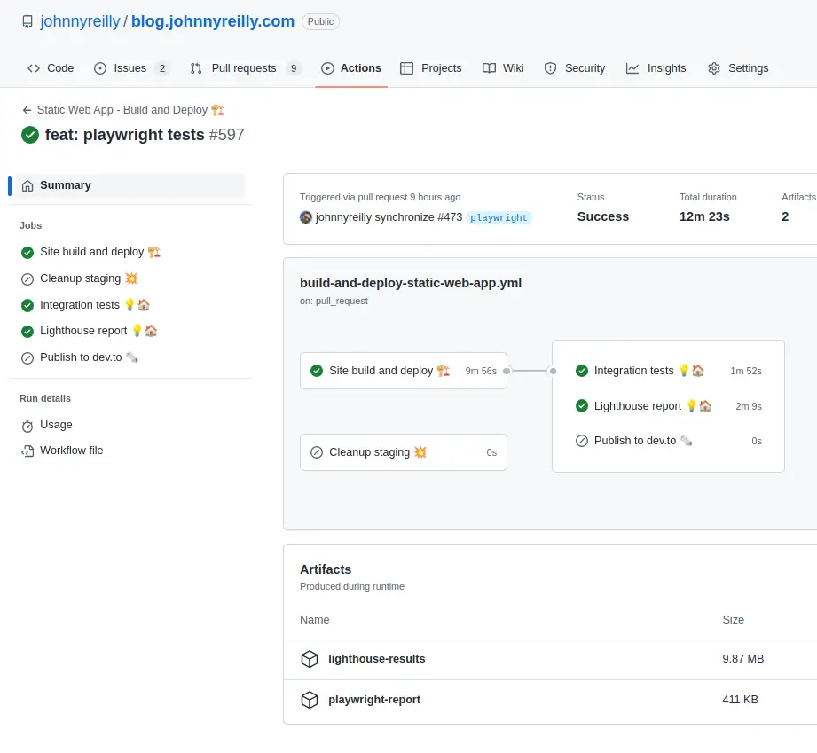
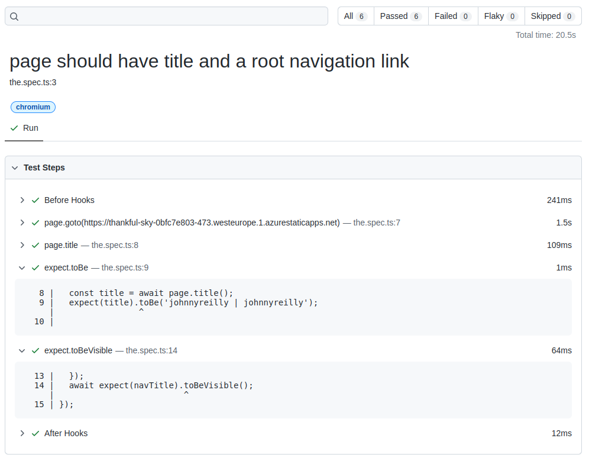

Azure Static Web Apps staging environments allow you to test changes before they go live. This post shows how to use Playwright against staging environments with GitHub Actions. It's a follow up to my previous post on [using Lighthouse with Azure Static Web Apps staging environments](../2022-03-20-lighthouse-meet-github-actions/index.md).



<!--truncate-->

## Playwright, GitHub Actions and Azure Static Web Apps

What's the problem we're trying to solve? Let's do our best Simon Sinek impression and start with "Why?". The "Why?" is that we want only to ship changes that haven't broken our application.

Now let's move onto "How?" The way we guard against breaking production is by running automated tests on all changes. Playwright is a tool that allows us to do that. We get a fully fledged staging environment available to us on all pull requests. We want to run Playwright integration tests against our staging environment. We want to do this as part of our CI/CD pipeline; in our GitHub Actions workflow.

I'm going to write about this in the context of my blog. My blog is open source and [you can find the code here](https://github.com/johnnyreilly/blog.johnnyreilly.com). I'm going to present a simplified solution in this post, but you can find the full solution on GitHub.

## Adding Playwright to the project

To add Playwright to my blog I followed the [instructions on the Playwright website](https://playwright.dev/docs/intro). Essentially I ran the following command:

```bash
npm init playwright@latest
```

By and large I accepted the defaults. However, I deleted the GitHub Actions workflow that was created, in favour of my own which we'll get to soon. I'd created my tests in a `blog-website-tests` directory. This sits alongside the `blog-website` directory which contains the code for my blog.

I made one tweak to the `playwright.config.ts` file that was created. I added the following line:

```ts
//...

/**
 * See https://playwright.dev/docs/test-configuration.
 */
export default defineConfig({
  //...

  use: {
    //...

    // WE WILL SET THIS IN THE GITHUB ACTIONS WORKFLOW
    baseURL: process.env.PLAYWRIGHT_TEST_BASE_URL || 'http://localhost:3000',
  },

  //...
});
```

What's going on here? I'm setting the `baseURL` to be the value of the `PLAYWRIGHT_TEST_BASE_URL` environment variable. If that's not set then I'm defaulting to `http://localhost:3000`, which is where my blog is served when running locally. I'll explain why I'm doing this in a moment.

## A test using `baseURL`

The [`baseURL`](https://playwright.dev/docs/api/class-testoptions#test-options-base-url) can be used in a Playwright test to determine where to run the tests. That's exactly what I'm doing in the following test file named `the.spec.ts`:

```ts
import { test, expect } from '@playwright/test';

test('page should have title and a root navigation link', async ({
  page,
  baseURL,
}) => {
  await page.goto(baseURL!);
  const title = await page.title();
  expect(title).toBe('johnnyreilly');

  const navTitle = page.getByRole('link', {
    name: 'Profile picture of John Reilly John Reilly ❤️🌻',
  });
  await expect(navTitle).toBeVisible();
});

test('can navigate to about page', async ({ page, baseURL }) => {
  await page.goto(baseURL!);
  await page.getByRole('link', { name: 'About', exact: true }).click();

  const navTitle = page.getByRole('heading', {
    name: "Hi! I'm John Reilly - welcome! ❤️🌻",
  });
  await expect(navTitle).toBeVisible();
});
```

The `baseURL` is used in the `page.goto` call. This means that the tests will run against the URL that I specify. In the case of the GitHub Actions workflow, I'll specify the URL of the staging environment. These are simple tests that check that the title of the page is correct and that I can navigate to the about page. Consider them smoke tests.

## Creating a GitHub Actions workflow

We now have a test that we can run against a URL. We need to create a GitHub Actions workflow that will run the test against the staging environment. I've created a workflow file named `build-and-deploy-static-web-app.yml` in the `.github/workflows` directory. It looks like this:

```yml
name: Static Web App - Build and Deploy 🏗️

on:
  push:
    branches:
      - main
  pull_request:
    types: [opened, synchronize, reopened, closed]
    branches:
      - main
  workflow_dispatch:

permissions:
  id-token: write # Require write permission to Fetch an OIDC token.
  contents: write
  pull-requests: write

env:
  LOCATION: westeurope
  STATICWEBAPPNAME: blog.johnnyreilly.com

jobs:
  build_and_deploy_swa_job:
    if: github.event_name == 'push' || (github.event_name == 'pull_request' && github.event.action != 'closed')
    runs-on: ubuntu-latest
    name: Site build and deploy 🏗️
    steps:
      - name: Checkout 📥
        uses: actions/checkout@v3

      # Auth between GitHub and Azure is handled by https://github.com/jongio/github-azure-oidc
      # https://github.com/Azure/login#sample-workflow-that-uses-azure-login-action-using-oidc-to-run-az-cli-linux
      # other login options are possible too
      - name: AZ CLI login 🔑
        uses: azure/login@v2
        with:
          client-id: ${{ secrets.AZURE_CLIENT_ID }}
          tenant-id: ${{ secrets.AZURE_TENANT_ID }}
          subscription-id: ${{ secrets.AZURE_SUBSCRIPTION_ID }}

      - name: Get preview URL 📝
        id: static_web_app_preview_url
        uses: azure/CLI@v2
        with:
          inlineScript: |
            DEFAULTHOSTNAME=$(az staticwebapp show -n '${{ env.STATICWEBAPPNAME }}' | jq -r '.defaultHostname')

            PREVIEW_URL="https://${DEFAULTHOSTNAME/.[1-9]./-${{github.event.pull_request.number }}.${{ env.LOCATION }}.1.}"

            echo "PREVIEW_URL=$PREVIEW_URL" >> $GITHUB_OUTPUT

      - name: Setup Node.js 🔧
        uses: actions/setup-node@v3
        with:
          node-version: '18'
          cache: 'yarn'

      - name: Install and build site 🔧
        run: |
          cd blog-website
          yarn install --frozen-lockfile
          yarn run build
          cp staticwebapp.config.json build/staticwebapp.config.json

      - name: Get API key 🔑
        id: static_web_app_apikey
        uses: azure/CLI@v2
        with:
          inlineScript: |
            APIKEY=$(az staticwebapp secrets list --name '${{ env.STATICWEBAPPNAME }}' | jq -r '.properties.apiKey')
            echo "APIKEY=$APIKEY" >> $GITHUB_OUTPUT

      - name: Deploy site 🚀
        id: static_web_app_build_and_deploy
        uses: Azure/static-web-apps-deploy@v1
        with:
          azure_static_web_apps_api_token: ${{ steps.static_web_app_apikey.outputs.APIKEY }}
          repo_token: ${{ secrets.GITHUB_TOKEN }} # Used for Github integrations (i.e. PR comments)
          action: 'upload'
          skip_app_build: true
          app_location: '/blog-website/build' # App source code path
          api_location: '/blog-website/api' # Api source code path - optional

    outputs:
      preview-url: ${{steps.static_web_app_preview_url.outputs.PREVIEW_URL}}

  integration_tests_job:
    name: Integration tests 💡🏠
    needs: build_and_deploy_swa_job
    if: github.event_name == 'pull_request' && github.event.action != 'closed'
    runs-on: ubuntu-latest
    steps:
      - uses: actions/checkout@v3

      - name: Wait for preview ${{ needs.build_and_deploy_swa_job.outputs.preview-url }} ⌚
        id: static_web_app_wait_for_preview
        uses: nev7n/wait_for_response@v1
        with:
          url: '${{ needs.build_and_deploy_swa_job.outputs.preview-url }}'
          responseCode: 200
          timeout: 600000
          interval: 1000

      - uses: actions/setup-node@v3
        with:
          node-version: 18

      - name: Install dependencies
        run: npm ci
        working-directory: ./blog-website-tests

      - name: Install Playwright Browsers
        run: npx playwright install --with-deps
        working-directory: ./blog-website-tests

      - name: Run Playwright tests
        env:
          PLAYWRIGHT_TEST_BASE_URL: '${{ needs.build_and_deploy_swa_job.outputs.preview-url }}'
        run: npx playwright test
        working-directory: ./blog-website-tests

      - uses: actions/upload-artifact@v3
        if: always()
        with:
          name: playwright-report
          path: blog-website-tests/playwright-report/
          retention-days: 30

  close_pull_request_job:
    if: github.event_name == 'pull_request' && github.event.action == 'closed'
    runs-on: ubuntu-latest
    name: Cleanup staging 💥
    steps:
      - name: AZ CLI login 🔑
        uses: azure/login@v2
        with:
          client-id: ${{ secrets.AZURE_CLIENT_ID }}
          tenant-id: ${{ secrets.AZURE_TENANT_ID }}
          subscription-id: ${{ secrets.AZURE_SUBSCRIPTION_ID }}

      - name: Get API key 🔑
        id: apikey
        uses: azure/CLI@v2
        with:
          inlineScript: |
            APIKEY=$(az staticwebapp secrets list --name '${{ env.STATICWEBAPPNAME }}' | jq -r '.properties.apiKey')
            echo "APIKEY=$APIKEY" >> $GITHUB_OUTPUT

      - name: Destroy staging environment 💥
        id: closepullrequest
        uses: Azure/static-web-apps-deploy@v1
        with:
          azure_static_web_apps_api_token: ${{ steps.apikey.outputs.APIKEY }}
          action: 'close'
```

As I said earlier, this has been chopped down from the full version in my repo. It contains specific variables from my own project, but you can see the general structure of the workflow.

Let's look at what happens above; there are 3 jobs:

1. Site build and deploy 🏗️ - This is the main job that builds the site and deploys it to the Static Web App.
2. Integration tests 💡🏠 - This job runs the Playwright tests against the preview URL of our Static Web App.
3. Cleanup staging 💥 - This job runs when a pull request is closed, and destroys the staging environment.

Let's dig into 1 and 2 a bit more. We'll ignore 3 as it's pretty self explanatory.

### Site build and deploy 🏗️

This job is the main job that builds the site and deploys it to the Static Web App. It's a bit long, but it's not too complicated. Let's break it down:

1. Checkout 📥 - This is the first step, and it checks out the code from GitHub.
2. AZ CLI login 🔑 - This step logs into Azure using the `azure/login` action. This is required to run the `az` CLI commands.
3. Get preview URL 📝 - This step constructs the preview URL of the Static Web App using the `defaultHostname`, the location of deployment, the pull request number and the partition id.

   The partition id is the `1` in the URL. It matches whichever partition id that exists for the domain. Right now, if you create a new SWA, you will not get a `1` since SWA is now on partition `2`. When that partition gets filled, it will move on to partition `3`. Ultimately, you just need to find out what the partition id for your SWA is, then you can hardcode it into your workflow.

   The complete preview URL is required to run the Playwright tests against the preview URL.

4. Setup Node.js 🔧 - This step sets up Node.js, which is required to build the site.
5. Install and build site 🔧 - This step installs the dependencies and builds the site - we build our SWA ourselves; you can generally just leave this to the `Azure/static-web-apps-deploy@v1` task. We don't because [we have some post processing to do that requires Bun](../2023-03-18-migrating-from-ts-node-to-bun/index.md).
6. Get API key 🔑 - This step gets the API key for the Static Web App. This is required to deploy the site.
7. Deploy site 🚀 - This step deploys the site to the Static Web App.

### Integration tests 💡🏠

Our tests job depends upon the previous job; specifically the preview URL of our Static Web App. You can't run Playwright tests if you've nothing to run them against! Again, let's dig into it:

1. Checkout 📥 - This is the first step, and it checks out the code from GitHub.
2. Wait for preview ... ⌚ - This step waits for the preview URL to be available. This is required because the Static Web App takes a few minutes to deploy, and we don't want to run the tests until it's deployed.
3. Setup Node.js 🔧 - This step sets up Node.js, which is required to run the tests.
4. Install dependencies - This step installs the dependencies for the tests.
5. Install Playwright Browsers - This step installs the browsers that Playwright will use to run the tests.
6. Run Playwright tests - This step runs the Playwright tests.
7. Upload test report - This step uploads the test report as an artifact. This is useful if you want to see the test report after the tests have run.

## How does it look?

When we put all this together and push it up to GitHub, we see that tests run as part of the pull request:



This screenshot is taken directly from my own blog, and so includes things like Lighthouse that are excluded from this post. But what you can see is that tests are indeed running; and we can see the test report as an artifact:



## Conclusion

So there you have it; a simple way to run Playwright tests against your Static Web App. I hope you found this useful, and if you have any questions, please feel free to reach out to me.
