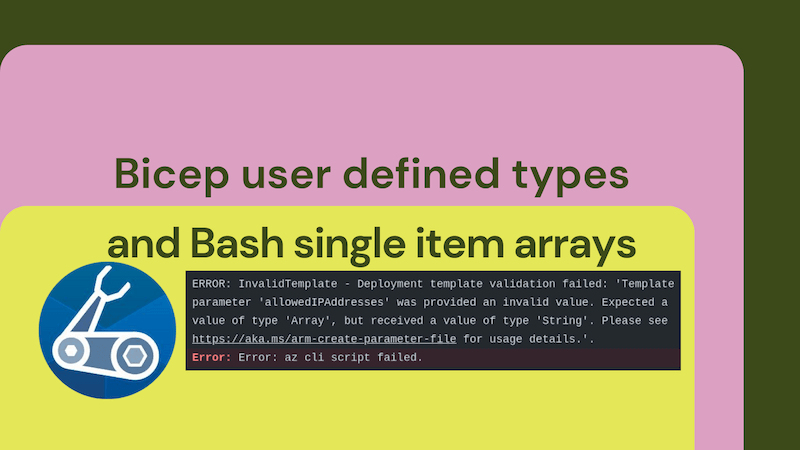

When sending a single item array to a Bicep template you may get an error like this:

```bash
ERROR: InvalidTemplate - Deployment template validation failed: 'Template parameter 'allowedIPAddresses' was provided an invalid value. Expected a value of type 'Array', but received a value of type 'String'.
```

This is down to the fact that Bash arrays when used with the Azure CLI can be a little surprising. If we initialise a single item array then it's not an array. It's a string. This is a bit of a pain when you're trying to pass a single item array to a Bicep template. It's possible to work around this with JSON and Bicep user defined types. Let's see how.



<!--truncate-->

## Expected a value of type 'Array', but received a value of type 'String'

I had a Bicep template that took a parameter of type `array`:

```bicep
param allowedIPAddresses array
```

I was invoking this template using the Azure CLI, in a Bash script. (Technically using GitHub Actions; but that's somewhat by the by.) I wanted to pass a single item array to the template. I did this:

```bash
az deployment group create \
  --resource-group testgroup \
  --template-file <path-to-template> \
  --parameters allowedIPAddresses='("8.8.8.8")'
```

Surprisingly, this resulted in the error:

```bash
ERROR: InvalidTemplate - Deployment template validation failed: 'Template parameter 'allowedIPAddresses' was provided an invalid value. Expected a value of type 'Array', but received a value of type 'String'.
```

Despite following the [documentation for passing arrays](https://learn.microsoft.com/en-us/azure/azure-resource-manager/templates/deploy-cli#inline-parameters), passing a single item array to the template did not work.

I'm not the only person who has wrestled with this. There's a [GitHub issue](https://github.com/Azure/bicep/issues/5936) on the Bicep repo that discusses this. The issue is that Bash arrays when used with the Azure CLI can be a little surprising. If I initialise a single item array then it's not an array. It's a string. This is a bit of a pain when you're trying to pass a single item array to a Bicep template.

## Workaround: JSON and Bicep user defined types

There are ways to make the array syntax work, but they're not very intuitive. I wanted to avoid this; I put a premium on understanding my code and make choices to optimise for that. The solution I came up with was to use JSON and Bicep user defined types.

Passing JSON to the Azure CLI is pretty easy. You just need to wrap the JSON in single quotes. I could do this:

```bash
anArrayInJSON='{"allowedIPAddresses":["8.8.8.8"]}'
az deployment group create \
    --name showJSON  \
    --resource-group myResourceGroup \
    --template-file $templateFile \
    --parameters anArrayInJSON="$anArrayInJSON"
```

The syntax is very simple and, as we can see, it's possible to have properties which are arrays. This is great. I can pass a JSON object to the Azure CLI and it'll be parsed correctly. So I can do this:

```bicep
param anArrayInJSON object

//...

var allowedIPAddresses = anArrayInJSON.allowedIPAddresses
```

This works, but I miss the type safety of Bicep. I want to be able to say that `allowedIPAddresses` is an array. And if I can go further, I'd like to say it's a `string` array also. I can do this with a [Bicep user defined type](https://learn.microsoft.com/en-us/azure/azure-resource-manager/bicep/user-defined-data-types). It's worth noting that user defined types are a new feature in Bicep and you'll need to use the latest version of Bicep to use them and opt in by putting this option in your `bicepconfig.json` file:

```json
{
  "experimentalFeaturesEnabled": {
    "userDefinedTypes": true
  }
}
```

With that in place we can redefine `anArrayInJSON` as a user defined type:

```bicep
param anArrayInJSON {
  allowedIPAddresses: string[]
}
```

This is a little more verbose, but it's a lot more explicit. We're saying that `anArrayInJSON` is an object with a property called `allowedIPAddresses` which is an array of strings. This is great. We can now use `anArrayInJSON.allowedIPAddresses` in our template and we'll get type safety. We'll also get helpful error messages if we pass the wrong type of data to the template:

```bash
ERROR: InvalidTemplate - Deployment template validation failed: 'Template parameter 'anArrayInJSON.allowedIPAddresses' was provided an invalid value. Expected a value of type 'Array', but received a value of type 'Null'. Please see https://aka.ms/arm-create-parameter-file for usage details.'.
```

## Conclusion

Interestingly, I'd say that I'm unlikely to ever use a Bicep parameter of type `array` again, precisely for the reason that I've outlined here. So none of this:

```bicep
param anArray array
```

And none of its user defined type equivalent:

```bicep
param anArray string[]
```

I'll probably use the approach I've outlined here instead. I'll pass a JSON object to the template and then use a user defined type to define the properties of that object. This is a little more verbose, but it's a lot more explicit. I think that's a good trade-off.
