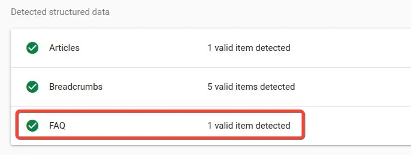
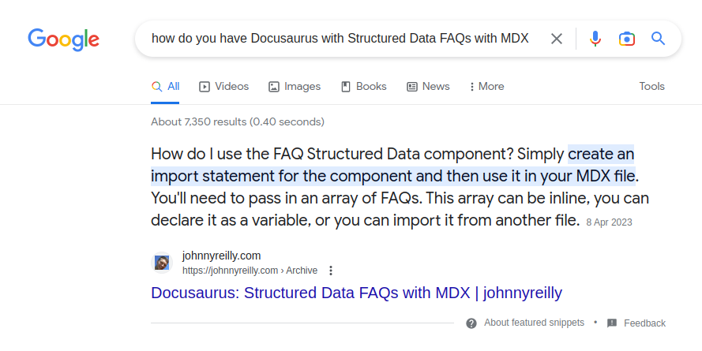

import FAQStructuredData from "../../src/theme/MDXComponents/FAQStructuredData";

export const faqs = [
{
question: "How do I use the FAQ Structured Data component?",
answer:
"Simply create an import statement for the component and then use it in your MDX file. You'll need to pass in an array of FAQs. This array can be inline, you can declare it as a variable, or you can import it from another file.",
},
{
question: "How do I use the FAQ Structured Data component in a blog post?",
answer:
"The usage is the same as in a regular MDX file. But the import statement will sit after the frontmatter of the blog post.",
},
{
question:
"Can I use the FAQ Structured Data component in a regular MD file?",
answer: "Yes! It just works™️.",
},
];

I've written previously about [using Structured Data with React](../2021-10-15-structured-data-seo-and-react/index.md). This post goes a little further and talks about how to use Structured Data with Docusaurus and MDX. More specifically it looks at how to create a component that both renders FAQs into a page, and the same information as Structured Data.


<!--truncate-->

## FAQs and Structured Data

I've been working with [Growtika](https://growtika.com/) to repair my SEO after [shredding it somehow last year](../2023-01-15-how-i-ruined-my-seo/index.md). One of the experiments we ran was to add [FAQs to a post](../2023-02-01-migrating-from-github-pages-to-azure-static-web-apps/index.md), and with that, the equivalent FAQ Structured Data. The intent being to see if this would help with the SEO for that post.

My blog is written in [MDX](https://mdxjs.com/), and hosted on [Docusaurus](https://docusaurus.io/). I wanted to see if I could create an MDX component that would render the FAQs into a page, and the same information as Structured Data. The [Docusaurus docs suggested this was feasible](https://docusaurus.io/docs/markdown-features/react), and I wanted to see if I could make it work.

And it turns out that other people are interested in this too; there's a feature request on [Docusaurus's Canny](https://docusaurus.io/feature-requests/p/creation-of-structured-faq) for exactly this.

So I created a component that could be used to render FAQs into a page as markdown, and the same information as Structured Data. I thought it would be useful to share that component with the world. Hello world, herewith the component:

## The FAQStructuredData MDX component

I created a directory called `FAQStructuredData` in the ``src/theme/MDXComponents` directory. This directory is where I keep my custom MDX components. I then created an `index.js` file in that directory. This is the file that contains the component:

```jsx title="src/theme/MDXComponents/FAQStructuredData/index.js"
/**
 * @typedef { import('./types').FAQStructuredDataProps } FAQStructuredDataProps
 * @typedef { import('./types').FAQStructuredData } FAQStructuredData
 */

import React from 'react';

/**
 * A component that renders a FAQ structured data and markdown entries
 *
 * @see https://developers.google.com/search/docs/appearance/structured-data/faqpage
 * @param {FAQStructuredDataProps} props
 * @returns
 */
export default function FAQStructuredData(props) {
  /** @type {FAQStructuredData} */ const faqStructuredData = {
    '@context': 'https://schema.org',
    '@type': 'FAQPage',
    mainEntity: props.faqs.map((faq) => ({
      '@type': 'Question',
      name: faq.question,
      acceptedAnswer: {
        '@type': 'Answer',
        text: faq.answer,
      },
    })),
  };
  return (
    <>
      <script
        type="application/ld+json"
        dangerouslySetInnerHTML={{ __html: JSON.stringify(faqStructuredData) }}
      />

      <h2>FAQs</h2>
      {faqStructuredData.mainEntity.map((faq) => (
        <React.Fragment key={faq.name}>
          <h3>{faq.name}</h3>
          {faq.acceptedAnswer.text}
        </React.Fragment>
      ))}
    </>
  );
}
```

```ts title="src/theme/MDXComponents/FAQStructuredData/types.d.ts"
export interface FAQ {
  question: string;
  answer: string;
}

export interface FAQStructuredDataProps {
  faqs: FAQ[];
}

export interface FAQStructuredData {
  '@context': string;
  '@type': string;
  mainEntity: FAQQuestionStructuredData[];
}

export interface FAQQuestionStructuredData {
  '@type': 'Question';
  name: string;
  acceptedAnswer: {
    '@type': 'Answer';
    text: string;
  };
}
```

Some things to note about this component:

- The code is written in JavaScript, but it's using [TypeScript types via JSDoc](../2021-11-22-typescript-vs-jsdoc-javascript/index.md). I don't believe you can write MDX components in TypeScript (please someone let me know if it turns out this is possible). But static typing is useful, and still possible thanks to JSDoc.
- On that, we have a `types.d.ts` file that contains the types for the component. Using TypeScript directly is still possible alongside JSDoc, as long as there is no runtime code in the file, and a definition file (which the `types.d.ts` file is), has no runtime code. We can simply use it to store types that we import into the component.
- The component expects an `faqs` prop. This is an array of FAQs. Each FAQ is an object with a `question` and `answer` property. The component then renders the FAQs as markdown, and the same information as JSON-LD Structured Data. We're using the Google guidelines for [FAQ Structured Data](https://developers.google.com/search/docs/appearance/structured-data/faqpage#examples).
- The component renders a `h2` tag titled "FAQs". Under that, each FAQ is rendered with a `h3` tag and the answer sits directly below it.

## Importing our MDX component

Now the `FAQStructuredData` component is created, we can use it in our MDX (or straight MD) files. We can import the component and create an array called `faqs` like so:

```mdx
---
slug: docusaurus-structured-data-faqs-mdx
title: 'Docusaurus: Structured Data FAQs with MDX'
authors: johnnyreilly
tags: [Docusaurus, Structured Data]
image: ./title-image.png
description: 'This demos how to make an MDX component that renders FAQs into a page, and the same information as Structured Data. It also shows how to use it with Docusaurus.'
hide_table_of_contents: false
---

import FAQStructuredData from '../../src/theme/MDXComponents/FAQStructuredData';

export const faqs = [
  {
    question: 'How do I use the FAQ Structured Data component?',
    answer:
      "Simply create an import statement for the component and then use it in your MDX file. You'll need to pass in an array of FAQs. This array can be inline, you can declare it as a variable, or you can import it from another file.",
  },
  {
    question: 'How do I use the FAQ Structured Data component in a blog post?',
    answer:
      'The usage is the same as in a regular MDX file. But the import statement will sit after the frontmatter of the blog post.',
  },
  {
    question:
      'Can I use the FAQ Structured Data component in a regular MD file?',
    answer: 'Yes! It just works™️.',
  },
];

;
```

Note we're doing this in a blog post and the import statement is after the frontmatter. Then we can use the component like so:

```mdx
<FAQStructuredData faqs={faqs} />
```

We'll do that, right here, right now:

<FAQStructuredData faqs={faqs} />

## Testing the Structured Data

You can see, we have FAQs rendered in the body of our blog post. If we put the URL of the post into the [Google Structured Data Testing Tool](https://search.google.com/test/rich-results?url=https%3A%2F%2Fjohnnyreilly.com%2Fdocusaurus-structured-data-faqs-mdx), we can see that the Structured Data is being rendered correctly:



We can even go one better, shortly after I posted this article, I did a search in Google for "how do you have Docusaurus with Structured Data FAQs with MDX" and I got this:



That's our FAQs being surfaced as a [featured snippet](https://support.google.com/websearch/answer/9351707?hl=en-GB&visit_id=638180439903372599-4066254776&p=featured_snippets&rd=1#zippy=%2Cwhy-featured-snippets-may-be-removed). Nice!

## Conclusion

We've now got a reusable FAQs component that renders the FAQs as markdown, and the same information as Structured Data. We can use it in our MDX files, and we can use it in our blog posts. We can also use it in regular MD files. Yay! I've only used this in the context of Docusaurus, but I suspect it can be used in other contexts too.

I'd rather like it if this was built into Docusaurus, and if it could read directly from the Markdown files. But this is a good start. I hope you find it useful.
