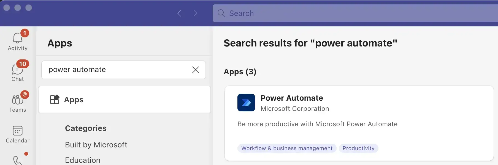
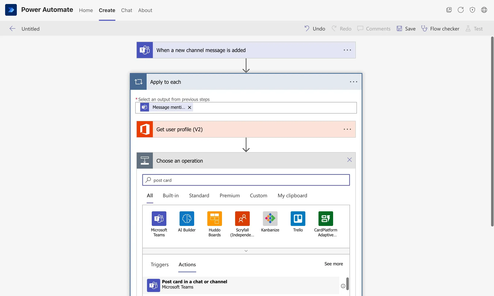
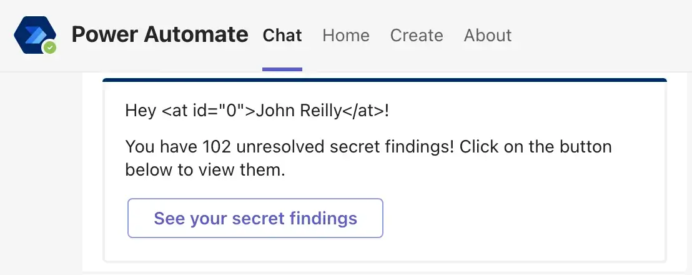

I've written previously about [sending Teams notifications using a webhook](../2019-12-18-teams-notification-webhooks/index.md), and it's a technique I've used a lot. But I've always wanted to be able to send a direct message to a user, and that's not possible with the webhook approach. I work with a marvellous fellow named Chris Tacey-Green, and he's figured out a way to do this using Power Automate and the Teams Notification API. I'm going to describe how he did it here, with a little help from him.

It's probably worth saying, both Chris and I work for Investec, and we're going to share some of the things we've learned about using Teams and Power Automate in the hope that it's useful to others. But we're not speaking on behalf of Investec, and we're not suggesting that this is the best way to do things. This is likely in the "do things that do not scale" category. Significantly though, it works!

You will see some screenshots of our internal Teams environment, but we've tried to keep them to a minimum, and we're not going to share any sensitive information.


<!--truncate-->

## What are we trying to do?

Teams is a great way to keep people informed of what's going on. But sometimes you want to send a message to a specific person. You can @mention them in a channel, but that's not the same as a direct message. And you can send them an email, but that's not the same as a direct message either. What we want is a way to send a direct message to a user in Teams, via an API. Because we want to automate. Tragically, sending DMs in Teams via an API is not supported at the time of writing (or if it is - please let us know!)

All is not lost.

## Power Automate

Power Automate is a tool that allows you to automate tasks. It's a low-code/no-code tool that allows you to create workflows that can be triggered by events. It's a great tool for automating tasks. And it's a great tool for sending direct messages in Teams. Or so it turns out.

You see, it's possible to send a notification to a user in Teams using the Teams Notification API. And it's possible to trigger a Power Automate workflow using the "when a new channel message is added" trigger. So if we can get a notification to the Teams Notification API, we can trigger a Power Automate workflow. And if we can trigger a Power Automate workflow, we can send a direct message to a user in Teams.

This post will do two things:

1. Describe how to set up a Power Automate workflow that sends a direct message to a user in Teams
2. Describe how to trigger that workflow using the Teams Notification API and Adaptive Card messages

## Setting up the Power Automate workflow

First things first, we need to create a Power Automate workflow that sends a direct message to a user in Teams. This is pretty straightforward, but when it came to doing this, I knew _nothing_.

Before we start this, I should warn you there's going to be lots of screenshots. As far as I'm aware, there's not a code-first way to create Power Automate flows, so point and click is the only game in town.

The first thing to do, is fire up Teams and install the Power Automate app:



This allows us to access the Power Automate app. There we can create a new workflow (from blank) with the "when a new channel message is added" trigger:


We then need to select the team and channel that we want to trigger the workflow:


You'll note in the screenshot above, we've got a dedicated channel for this workflow. This is because we don't want to disturb channels people are already using with the messages we will write to this channel. To all intents and purposes, this channel could actually be invisible to users - we just need it to exist to be our carrier pidgeon.

With the trigger in place, we need to create the action. We're going to use the "apply to each" control, which will run for every message that comes through. We want to use the "Message mentions" output, which will give us the user that was mentioned in the message. We don't want to use the similarly named "Message mentions item":


The message mention gives us our user, we'll then use the "Get user profile (V2)" operation so we can look up that user up.

It's at this point, that we start to do something slightly more complicated in the Power Automate UI. We're going to need to supply an id to the "Get user profile (V2)" operation. We're going to use an expression to determine this id. The expression we're going to use is:

```
triggerOutputs()?['body/mentions'][0].mentioned.user.id
```

This expression is operating on JSON similar to the following:

```json
{
  "@odata.type": "#microsoft.graph.chatMessage",
  "etag": "1683099494281",
  "messageType": "message",
  "createdDateTime": "2023-05-03T07:38:14.281Z",
  "lastModifiedDateTime": "2023-05-03T07:38:14.281Z",
  // ...
  "mentions": [
    {
      "id": 0,
      "mentionText": "John Reilly",
      "mentioned": {
        "application": null,
        "device": null,
        "conversation": null,
        "tag": null,
        "user": {
          "@odata.type": "#microsoft.graph.teamworkUserIdentity",
          "id": "my-id-it-is-a-guid",
          "displayName": "John Reilly",
          "userIdentityType": "aadUser"
        }
      }
    }
  ]
  // ...
}
```

So that expression is just some JavaScript that gets us to the value we need; the id of the first mentioned user. We provide that in the "Expression" field and then click the "OK" button:


Now it's time for our final action - sending on the message with the "post card in chat or channel" operation:



We'll post as the Flow bot, post in a chat with the Flow bot and make our recipient "Mail" (which behind the scenes is the expression `outputs('Get_user_profile_(V2)')?['body/mail']`).


Finally, it's once more expression time, as we use this value for our Adaptive Card:

```
triggerOutputs()?['body/attachments'][0]['content']
```


Hopefully, what you've realised is that we're just taking the Adaptive Card from the message that triggered the workflow and passing it on to the recipient. We're intentionally doing as little as possible in the Power Automate workflow, as it's the trickiest part of our solution to work with. (Debugging Power Automate workflows is possible, but it's not the most fun you'll ever have.)

We now have our complete workflow, and it looks like this:


## Triggering the Power Automate workflow

Whilst we have a workflow, we don't have anything to trigger it yet. To do that, we'll need to send a message to the channel we created earlier. We can do this using the Teams Notification API. And it needs to be a special kind of message; it needs to be an Adaptive Card, which includes a mention of the person we want to direct message.

My post on [sending Teams notifications using a webhook](../2019-12-18-teams-notification-webhooks/index.md) describes how to send a message to a channel using the Teams Notification API. We're going to use the same technique, but we're going to send an [Adaptive Card](https://github.com/Microsoft/AdaptiveCards/) instead of a plain message. I won't repeat the details of creating a webhook connector here, instead let's just focus on what we need to send to the API.

Ultimately, it's just a [POST request to the webhook connector](../2023-03-09-node-18-axios-and-unsafe-legacy-renegotiation-disabled/index.md), with a JSON body that looks like this:

```json
{
  "type": "message",
  "attachments": [
    {
      "contentType": "application/vnd.microsoft.card.adaptive",
      "contentUrl": null,
      "content": {
        "type": "AdaptiveCard",
        "version": "1.0",
        "body": [
          {
            "type": "TextBlock",
            "size": "medium",
            "text": "Hey <at>John Reilly</at>!\n\nYou have 102 unresolved secret findings! Click on the button below to view them.",
            "wrap": true
          }
        ],
        "$schema": "http://adaptivecards.io/schemas/adaptive-card.json",
        "msteams": {
          "entities": [
            {
              "type": "mention",
              "text": "<at>John Reilly</at>",
              "mentioned": {
                "id": "John.Reilly@investec.co.uk",
                "name": "John Reilly"
              }
            }
          ]
        },
        "actions": [
          {
            "type": "Action.OpenUrl",
            "title": "View findings",
            "url": "https://some.url.com/",
            "role": "button"
          }
        ]
      }
    }
  ]
}
```

The part that's relevant to us is the `msteams` property. This is where we specify the user we want to mention. We do this by specifying the `id` and `name` properties. The `id` property is the email address of the user we want to mention. The `name` property is the display name of the user we want to mention.

This is the secret sauce that allows our Power Automate flow to work. It reads these values and uses them to send a message to the user we want to mention. Alongside that, the `msteams.entities[].text` property must be in your message body. That's what Teams uses to link the mention to the part of the message that's "doing the mentioning" (thanks Chris for pointing this out).

## Testing it out

So far, so screenshots and code. Does it work? Let's find out.

When we run our tool for triggering the Teams Notification API, we get a message in our channel:


Note that it has the @mention of the user: me. Now that this message in the relevant channel exists, our Power Automate workflow will be triggered. I've seen it take between 2 and 10 minutes for the trigger to fire. When it does, the flow runs and we get a direct message from the Flow bot:



And this is our handrolled direct message to a user in Microsoft Teams. It's the same message we sent to the channel, just forwarded on by the Flow bot. Brilliant. The eagle eyed amongst you will note the ugly `<at id="0">John Reilly</at>`; we're losing something in our forwarding. This could be remedied if we made our Power Automate flow a little more complex, but as mentioned, we're trying to keep our flow as simple as possible. The `<at id="0">` is a small price to pay for the simplicity of our flow.

## User blocked the conversation with the bot

As you look at your Power Automate Flow runs, you can sometimes spot failures along these lines:


If you look to the right on that screenshot you can see the error message:

```json
Request to the Bot framework failed with error:

{
  "error": {
    "code":"ConversationBlockedByUser",
    "message":"User blocked the conversation with the bot."
  }
}
```

These kinds of failures appear to be a consequence of someone having blocked the Power Automate Flow bot. If you dig into the inputs ("Click to download" in the screenshot) you can discover the user who blocked the bot and have a conversation with them about it. Unblocking seems to be fairly straightforward; you just need to right-click / ctrl-click on the Power Automate app in Teams and select "Unblock":


In our experience, this is a rare occurrence, but it's worth being aware of.

## Conclusion

Together we've built a mechanism for sending a direct message to a user in Microsoft Teams. We've used the Teams Notification API to send a message to a channel, and we've used Power Automate to pick up that message and send it on to the user we want to mention.

Thanks so much to Chris for coming up with this novel way of sending a direct message to a user in Microsoft Teams. I hope you've found this post useful.
