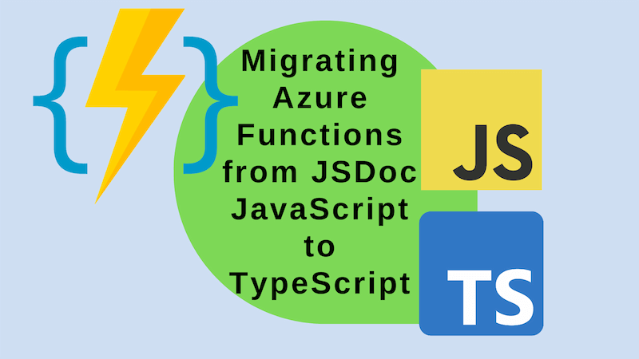

I wrote previously about how to implement a [dynamic redirect mechanism for Azure Static Web Apps using Azure Functions](../2022-12-22-azure-static-web-apps-dynamic-redirects-azure-functions/index.md). I implemented this using JSDoc JavaScript. I've since migrated this to TypeScript and I thought it would be interesting to share the process.



<!--truncate-->

## Why migrate from JSDoc JavaScript to TypeScript?

As regular readers will know, I'm both a big fan of TypeScript and a big fan of JSDoc JavaScript. I think both are great. So why migrate from JSDoc JavaScript to TypeScript? For me it's mostly about the developer experience; JSDoc is more verbose, and the wider ecosystem does a lot more TypeScript than it does JSDoc JavaScript. So when you get beyond a simple application, for me at least, TypeScript is a better choice.

[My blog](https://johnnyreilly.com/) is an [Azure Static Web App](https://docs.microsoft.com/en-us/azure/static-web-apps/overview) with an Azure Functions back end. I've been using JSDoc JavaScript for my Azure Functions. This post will take the back end and migrate it to TypeScript. There's various affordances that I have in place already that I don't want to lose along the way:

- I can debug in VS Code
- I deploy using GitHub Actions
- I have automated tests in place using Jest

All of these affordances are available to me with TypeScript, and I want to keep them. Let's begin migrating. Incidentally, the code for this migration [lies in this PR](https://github.com/johnnyreilly/blog.johnnyreilly.com/pull/558).

## Migrating the `tsconfig.json`

Our `tsconfig.json` manages the way the TypeScript compiler interacts with our code. We'll start by migrating this:

```diff title="tsconfig.json"
{
  "compilerOptions": {
-    "noEmit": true,
+    "noEmit": false,
+    "outDir": "dist",
+    "rootDir": ".",
+    "sourceMap": true,

+    "allowJs": false,
+    "checkJs": false,

+    "moduleResolution": "node",
  }
}
```

Let's look at the changes we've made:

- We're now emitting files from our compilation thanks to `noEmit` being set to `false`. We will no longer be actually running the code we write, but we will run the JavaScript we emit.
- We're specifying an `outDir` of `dist` - this is where our compiled JavaScript will be emitted.
- We're specifying a `rootDir` of `.` - this is the root of our TypeScript source files.
- We're creating source maps for our emitted JavaScript files - this will help us debug our original source code. (Even though we're not running it.)
- We're no longer allowing JavaScript files to be part of our program thanks to `allowJs` being set to `false`. (And we're not checking them either thanks to `checkJs` being set to `false` - I suspect this is implicitly set to `false` to `allowJs` being `false` - just to be clear I've specified it.)
- We're specifying a `moduleResolution` of `node` - this is how TypeScript will look up a file from a given module specifier.

## Migrating the `package.json`

To migrate our `package.json` we'll need to add some dependencies and tweak our scripts:

```diff title="package.json"
  "scripts": {
    "build": "tsc",
+    "watch": "tsc -w",
+    "prestart": "npm run build",
    "start": "func start",
    "test": "jest"
  },
  "devDependencies": {
    "@azure/functions": "^3.5.0",
+    "@types/jest": "^29.2.5",
+    "@types/node": "^18.x",
    "jest": "^29.3.1",
+    "ts-jest": "^29.1.0",
    "typescript": "^5.0.0"
  }
}
```

We're adding two scripts:

- `watch` - this will watch our TypeScript files and recompile them when they change - we don't need this really; but it can be useful depending on your preferred workflow.
- `prestart` - this will run before `start` and will ensure our TypeScript files are compiled, and we have up to date JavaScript to run.

In our `devDependencies` we're adding dependencies for Jest and Node.js. We're also adding `ts-jest` which will allow us to run Jest tests written in TypeScript.

## Migrating `.vscode/settings.json` and `.vscode/tasks.json`

I mentioned debugging earlier - to get that in place we need to work on the `settings.json` and `tasks.json` files in the `.vscode` folder. First the `settings.json`:

```diff title="settings.json"
-  "azureFunctions.projectLanguage": "JavaScript",
+  "azureFunctions.projectLanguage": "TypeScript",
```

The above is pretty self explanatory. We're changing the language of our Azure Functions project from JavaScript to TypeScript. Now the `tasks.json`:

```diff title="tasks.json"
{
  "version": "2.0.0",
  "tasks": [
+    {
+      "type": "shell",
+      "label": "npm build (functions)",
+      "command": "npm run build",
+      "dependsOn": "npm install (functions)",
+      "problemMatcher": "$tsc",
+      "options": {
+        "cwd": "${workspaceFolder}/blog-website/api"
+      }
+    },
  ]
}
```

We've got a new task in place here that runs our `npm run build` script. This will compile our TypeScript files to JavaScript. We've also got a `cwd` set to `blog-website/api` - this is the folder where our Azure Functions live - your own will likely be different. Alongside this new script, there's some tweaks to existing tasks to make them depend on our new build task:

```diff title="tasks.json"
{
  "version": "2.0.0",
  "tasks": [
    {
      "type": "func",
      "label": "func: host start",
      "command": "host start",
      "problemMatcher": "$func-node-watch",
      "isBackground": true,
+      "dependsOn": "npm build (functions)",
+      "options": {
+        "cwd": "${workspaceFolder}/blog-website/api"
+      }
    },
    // ...
    {
      "type": "shell",
      "label": "npm prune (functions)",
      "command": "npm prune --production",
+      "dependsOn": "npm build (functions)",
      "problemMatcher": [],
      "options": {
        "cwd": "${workspaceFolder}/blog-website/api"
      }
    }
  ]
}
```

## Migrate our Azure Functions

This isn't going to be an exhaustive guide of migrating from JSDoc JavaScript to TypeScript. I'm going to focus on the things that I found most relevant to Azure Functions. Let's start with the `fallback/function.json` file that powers our dynamic redirects and lives at `/api/fallback`:

```diff title="fallback/function.json"
{
  "bindings": [
    {
      "authLevel": "anonymous",
      "type": "httpTrigger",
      "direction": "in",
      "name": "req",
      "methods": ["get", "post"]
    },
    {
      "type": "http",
      "direction": "out",
      "name": "res"
    }
  ],
+  "scriptFile": "../dist/fallback/index.js"
}
```

There's one addition here, to repoint the `scriptFile` to the compiled JavaScript.

Now let's look at the code for the function. Originally a JavaScript file named `index.js`; it must be renamed to `index.ts`. The original code looked like this:

```js title="fallback/index.js"
const redirect = require('./redirect');
const saveToDatabase = require('./saveToDatabase');

/**
 *
 * @param { import("@azure/functions").Context } context
 * @param { import("@azure/functions").HttpRequest } req
 */
async function fallback(context, req) {
  //...
}

module.exports = fallback;
```

After renaming to `index.ts` and adding some TypeScript types, it looks like this:

```ts title="fallback/index.ts"
import type { AzureFunction, Context, HttpRequest } from '@azure/functions';

import { redirect } from './redirect';
import { saveToDatabase } from './saveToDatabase';

const httpTrigger: AzureFunction = async function (
  context: Context,
  req: HttpRequest,
): Promise<void> {
  //...
};

export default httpTrigger;
```

As we can see, the type importing becomes much more succinct. We're also exporting the function as `default` rather than `module.exports`. This is because we're using ES Modules rather than CommonJS modules for authoring. We can also see that we're using `import` rather than `require` to import our functions. Whilst CommonJS was more straightforward to use, the syntax for ES Modules feels much nicer to use; at least to me. (It's worth noting that we're not using ES Modules in our compiled JavaScript - we're still using CommonJS there; but we don't need to think about that when we're writing our code.)

I won't walk through migrating the other files, but the process is the same. Rename the file to `.ts`, add TypeScript types, and use `import` rather than `require`.

## Migrating our tests

We're pretty much on the home stretch now; we just need to migrate our tests. Let's start with the `jest.config.js`:

```diff title="jest.config.js"
+  preset: 'ts-jest',
+  testPathIgnorePatterns: ['<rootDir>/node_modules/', '<rootDir>/dist/'],
```

We're adding a `preset` of `ts-jest` which will allow us to run TypeScript tests. If you recall we added the `ts-jest` dependency earlier; it was for this.

We're also adding `dist` to our `testPathIgnorePatterns` - this is because we don't want to run our tests against our compiled JavaScript - we'd end up running the tests twice without this.

Let's turn our attention to the tests directly. Again we do the classic rename from `.js` to `.ts`, and our imports become terser and more ES Module-y:

```diff title="redirect.test.ts"
-/**
- * @typedef { import("@azure/functions").Logger } Logger
- */
+import type { Logger } from '@azure/functions';
-const { describe, expect, test } = require('@jest/globals');
+import { describe, expect, test } from '@jest/globals';
-const redirect = require('./redirect');
+import { redirect } from './redirect';
```

Beautiful. Finally we've got some tweaks to the code of the tests themselves. Firstly, declaring our mock becomes much easier:

```diff title="redirect.test.ts"
-/** @type {jest.Mock<Logger>} */ const mockLogger = jest.fn();
+const mockLogger: jest.Mock<Logger> = jest.fn();
```

Secondly, casting our mock to the type we want is much more straightforward:

```diff title="redirect.test.ts"
-/** @type {any} */ (mockLogger)
+mockLogger as unknown as Logger
```

I have no real how to `as` cast twice in JSDoc - and now I don't need to.

## Conclusion

We now have a TypeScript Azure Functions codebase, with all of the debugging / testing / deployment affordances we had before. We didn't have to do anything around deployment, because it just works™️. I hope this post has been useful to you!
