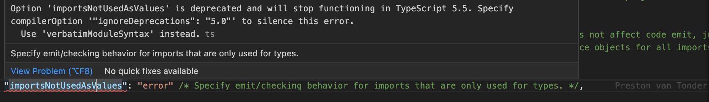

I really like type imports that are unambiguous. For this reason, I've made use of the `"importsNotUsedAsValues": "error"` option in `tsconfig.json` for a while now. This option has been deprecated in TypeScript 5.0.0, and will be removed in TypeScript 5.5.0. This post will look at what you can do instead.


<!--truncate-->

## What `"importsNotUsedAsValues": "error"` provided

Prior to TypeScript 5.0, if you wanted to make your type imports explicit, you could use the `"importsNotUsedAsValues": "error"` option in `tsconfig.json`. This would mean that you would need to use `import type` for type imports, and `import` for value imports. Consider the following:

```ts
import { ResourceGraphClient } from '@azure/arm-resourcegraph';
```

In my code I was only using `ResourceGraphClient` as a type, so I would need to change it to:

```ts
import type { ResourceGraphClient } from '@azure/arm-resourcegraph';
```

_or_

```ts
import { type ResourceGraphClient } from '@azure/arm-resourcegraph';
```

And if I rebelled, the TypeScript compiler would complain:

> `This import is never used as a value and must use 'import type' because 'importsNotUsedAsValues' is set to 'error'.ts(1371)`


## TypeScript 5 deprecates `importsNotUsedAsValues`

However, when I upgraded to TypeScript 5, I started seeing the following error:

> `Option 'importsNotUsedAsValues' is deprecated and will stop functioning in TypeScript 5.5. Specify compilerOption '"ignoreDeprecations": "5.0"' to silence this error. Use 'verbatimModuleSyntax' instead.`



The error was the result of [this pull request](https://github.com/microsoft/TypeScript/pull/52203). The message made me think I just needed to migrate to `verbatimModuleSyntax`, like so:

```diff title="tsconfig.json"
-    "importsNotUsedAsValues": "error",
+    "verbatimModuleSyntax": true,
```

However, when I did so, my terminal became a sea of errors:

```bash
src/telemetry.ts:7:13 - error TS1286: ESM syntax is not allowed in a CommonJS module when 'verbatimModuleSyntax' is enabled.

import * as task from './task.json';
            ~~~~

src/telemetry.ts:9:1 - error TS1287: A top-level 'export' modifier cannot be used on value declarations in a CommonJS module when 'verbatimModuleSyntax' is enabled.

export async function sendTelemetry({
```

It turns out that in `verbatimModuleSyntax`, you can't write ESM syntax in files that will emit as CommonJS - which is exactly what my codebase is doing. [Andrew Branch](https://github.com/andrewbranch), who is part of the TypeScript team, sent me an explanation from a draft of some new TypeScript docs:

> In TypeScript 5.0, a new compiler option called `verbatimModuleSyntax` was introduced to help TypeScript authors know exactly how their `import` and `export` statements will be emitted. When enabled, the flag requires imports and exports in input files to be written in the form that will undergo the least amount of transformation before emit. So if a file will be emitted as ESM, imports and exports must be written in ESM syntax; if a file will be emitted as CJS, it must be written in the CommonJS-inspired TypeScript syntax (`import fs = require("fs")` and `export = {}`). This setting is particularly recommended for Node projects that use mostly ESM, but have a select few CJS files. It is not recommended for projects that currently target CJS, but may want to target ESM in the future.

It further turns out that `importsNotUsedAsValues` was never intended to be used in in the way that I did; effectively as a linting mechanism. Andrew [said this on the topic](https://github.com/microsoft/TypeScript/pull/52203#issuecomment-1476574601):

> `importsNotUsedAsValues` was made to serve the opposite purpose you (and basically everyone) were using it for. By default, TypeScript elides unneeded import statements from JS emit even without marking them as `type` imports. `importsNotUsedAsValues` was created as a way to escape that behavior, not (primarily) to make it more explicit. `verbatimModuleSyntax` allows you to escape the elision behavior, and takes the explicitness of what your imports mean a step further by making you write CJS-style imports when emitting to CJS. So in my book, all the important cases that `importsNotUsedAsValues` (and `preserveValueImports`) covered, plus more, are covered by `verbatimModuleSyntax`, which is way more explainable. It’s mostly a matter of reducing complexity for the sake of explanation.

Until the world has finished migrating to ES Modules (which will be a while), I'm going to need to stick with CommonJS as my emit target, whilst still planning to write ES Module imports in my code. But I really like being explicit about my imports. So what can I do?

## ESLint and `@typescript-eslint/consistent-type-imports` to the rescue

I mentioned that I was using `importsNotUsedAsValues` essentially as a linting mechanism. And it transpires that the answer to my need lives in ESLint itself. There's a rule named [`@typescript-eslint/consistent-type-imports`](https://typescript-eslint.io/rules/consistent-type-imports/) which tackles exactly this. If you're using [ESLint](https://eslint.org/) and [typescript-eslint](https://typescript-eslint.io/), you can add this rule to your `.eslintrc.js`:

```js title="eslintrc.js"
module.exports = {
  // ...
  rules: {
    // ...
    '@typescript-eslint/consistent-type-imports': 'error', // the replacement of "importsNotUsedAsValues": "error"
  },
};
```

Or if you prefer to have the type imports inline, you can use:

```js title="eslintrc.js"
module.exports = {
  // ...
  rules: {
    // ...
    '@typescript-eslint/consistent-type-imports': [
      'error',
      {
        fixStyle: 'inline-type-imports',
      },
    ], // the replacement of "importsNotUsedAsValues": "error"
  },
};
```

With this in place, we're back to where we were before; just with a different engine:

> All imports in the declaration are only used as types. Use `import type`.eslint@typescript-eslint/consistent-type-imports


And we even have the ability to auto-fix the errors as well now. Thanks `typescript-eslint`!

## `no-import-type-side-effects`

We are not quite done. There's another typescript-eslint rule that we can use to help us. [`no-import-type-side-effects`](https://typescript-eslint.io/rules/no-import-type-side-effects/) is a rule that will warn you if you have any side effects in your type imports. What does that mean? Well, consider the following code:

```ts
import { type A, type B } from 'mod';

// is transpiled to
import {} from 'mod';

// which is the same as
import 'mod';
```

You may not want a runtime import at all. You can do that by using a **top-level** `type` qualifier for imports when it only imports specifiers with an inline `type` qualifier:

```ts
import type { A, B } from 'mod';

// is transpiled to.... nothing! Hence no side effects
```

So if side effects is something you're concerned about, consider this rule as well. Note that whether `import { type A } from 'mod'` transpiles to a side-effect import or gets completely removed depends on your `tsc` options, or what transpiler you’re using. But `import type` statements _always_ get removed.

## Make VS Code prefer type imports

One of the delightful features of TypeScript in VS Code is TypeScript generated auto-imports. Thanks in large part to the work of [Andrew Branch](https://github.com/andrewbranch) on the TypeScript team, the editor will often generate the `import` that you need when you're coding. However, it will generally create value imports; _not_ type imports. So it might auto add this:

```ts
import { ResourceGraphClient } from '@azure/arm-resourcegraph';
```

Not this:

```ts
import type { ResourceGraphClient } from '@azure/arm-resourcegraph';
```

As of TypeScript 5.3, this is now an editor-specific option. In Visual Studio Code, it can be enabled in the settings UI under "TypeScript › Preferences: Prefer Type Only Auto Imports", or as the JSON configuration option `typescript.preferences.preferTypeOnlyAutoImports`. You can read about this in the [TypeScript 5.3 release notes](https://devblogs.microsoft.com/typescript/announcing-typescript-5-3/#settings-to-prefer-type-auto-imports).

Turn it on - it'll make you happy!

## Summary

Thanks to Andrew Branch for reviewing this post, and massively improving it! Any mistakes are mine, not his.
