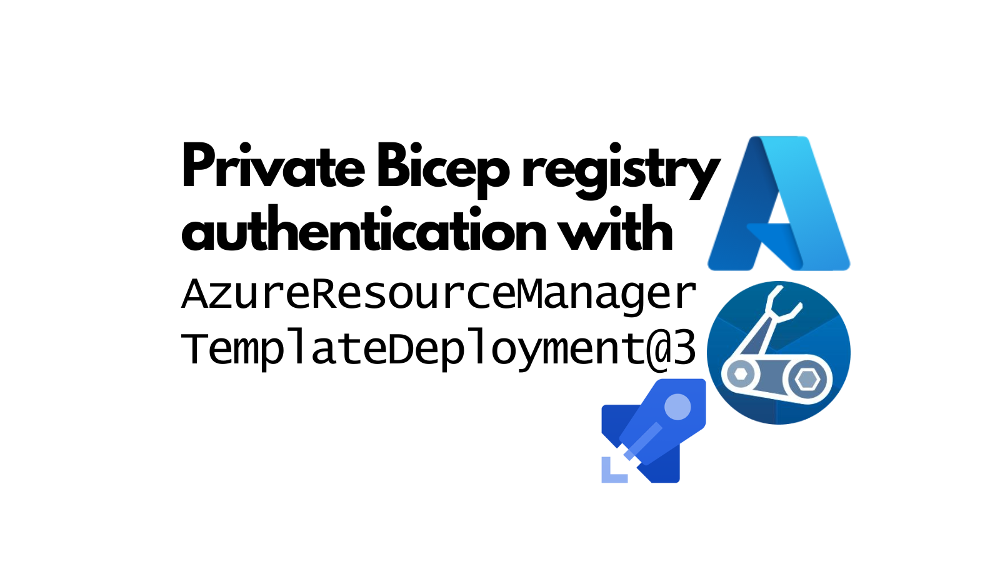
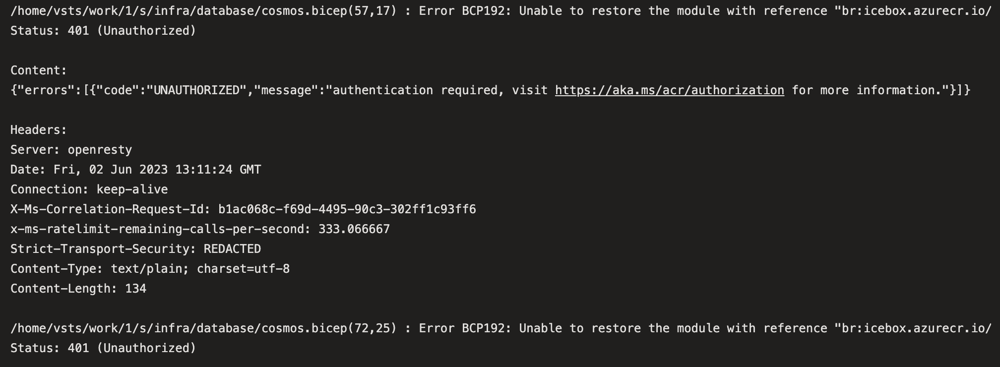
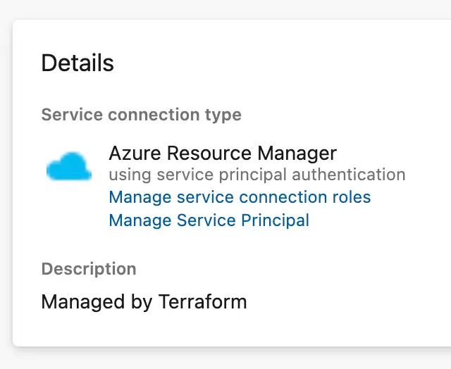

If you deploy Bicep templates to Azure in Azure DevOps, you'll likely use the dedicated Azure DevOps task; the catchily named [`AzureResourceManagerTemplateDeployment@3`](https://learn.microsoft.com/en-us/azure/devops/pipelines/tasks/reference/azure-resource-manager-template-deployment-v3?view=azure-pipelines). This task has had support for deploying Bicep since early 2022. But whilst vanilla Bicep is supported, there's a use case which isn't supported; private Bicep registries.



<!--truncate-->

## "Unable to restore the module... Status: 401 (Unauthorized)"

[Private Bicep registries](https://learn.microsoft.com/en-us/azure/azure-resource-manager/bicep/private-module-registry?tabs=azure-powershell) are a great way to share Bicep modules across your organisation. We use them in the organisation that I'm part of; it's a good a way to help us move faster and to share common security baselines.

Alas it turns out that the `AzureResourceManagerTemplateDeployment@3` task doesn't presently play well with private Bicep registries. This is because it's necessary to authenticate to a private registry before you can consume modules. And that's not supported by the `AzureResourceManagerTemplateDeployment@3` task. What does that mean? Well take a look at the following Azure Pipeline:

```yml
- task: AzureResourceManagerTemplateDeployment@3
  name: DeployInfra
  displayName: Deploy infra
  retryCountOnTaskFailure: 3
  inputs:
    deploymentScope: Resource Group
    azureResourceManagerConnection: ${{ variables.serviceConnection }}
    subscriptionId: $(subscriptionId)
    action: Create Or Update Resource Group
    resourceGroupName: $(resourceGroupName)
    location: $(location)
    templateLocation: Linked artifact
    csmFile: 'infra/main.bicep'
```

You'll note that it passes a Bicep file to the `csmFile` property. This is the file that will be deployed. But what if that file references modules from a private registry? Well, you'll see an error like this:



As you can see from the `Status: 401 (Unauthorized)`, we have an authentication problem; the task doesn't know how to authenticate to the private registry.

## Workaround

You might think, "oh well that's it then, I can't use private Bicep registries with the `AzureResourceManagerTemplateDeployment@3` task". But you'd be wrong. There's a workaround. Essentially, when the `AzureResourceManagerTemplateDeployment@3` task runs, it attempts to restore the modules it needs as a first step to compiling the Bicep in to ARM. But it only does this if it needs to. If we perform the restore manually first, then the task won't need to do it again. That's the trick.

Before the `AzureResourceManagerTemplateDeployment@3` task runs, we can run a task to restore the modules. We can use the `AzureCLI@2` task to do this. Here's an example:

```yml
- task: AzureCLI@2
  displayName: Bicep restore
  inputs:
    azureSubscription: service-connection-with-access-to-registry
    scriptType: bash
    scriptLocation: inlineScript
    inlineScript: |
      bicep restore infra/main.bicep
```

Where `service-connection-with-access-to-registry` is an Azure Resource Manager service connection using service principal authentication which has access to the private Bicep registry.



So if the above task runs _prior_ to the `AzureResourceManagerTemplateDeployment@3` task, then the modules will be restored and the `AzureResourceManagerTemplateDeployment@3` task will be able to compile the Bicep in to ARM and deploy it to Azure. This solves the problem; albeit at the cost of an extra task in the pipeline.

## In the box, in the future?

It would be tremendous if authentication to private Bicep registries was supported by the `AzureResourceManagerTemplateDeployment@3` task. I've raised a feature request for this [here](https://github.com/microsoft/azure-pipelines-tasks/issues/18426). If you'd like to see this too, please do add your voice to the issue.
