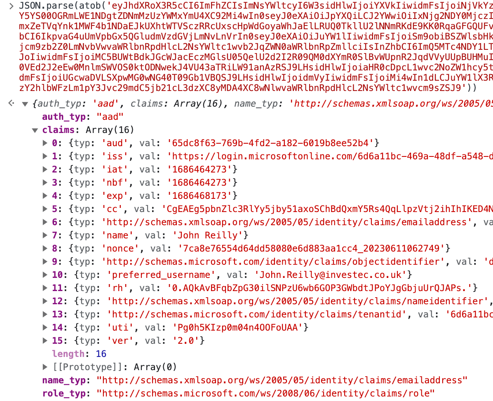

Easy Auth is a great way to authenticate your users. However, when used in the context of Azure Container Apps, .NET applications do not, by default, recognise that Easy Auth is in place. You might be authenticated but .NET will still act as if you aren't. `builder.Services.AddAuthentication()` and `app.UseAuthentication()` doesn't change that. This post explains the issue and solves it through the implementation of an `AuthenticationHandler`.


<!--truncate-->

If you're looking for information about Easy Auth and roles with .NET and Azure App Service, you can find it here:

- [Azure App Service, Easy Auth and Roles with .NET](../2021-01-14-azure-easy-auth-and-roles-with-dotnet-and-core/index.md)
- [Azure App Service, Easy Auth and Roles with .NET and Microsoft.Identity.Web](../2021-01-17-azure-easy-auth-and-roles-with-net-and-microsoft-identity-web/index.md)

## `User.Identity.IsAuthenticated == false`

When I'm building an application, I want to focus on the problem I'm solving. I don't want to think about how to implement my own authentication system. Rather, I lean on an auth provider for that, and if I'm working in the Azure ecosystem, that often means Easy Auth, usually with Azure AD.

I recently started building a .NET application using Easy Auth and deploying to Azure Container Apps. One thing that surprised me when I tested it out was that, whilst I was being authenticated, my app didn't seem to be aware of it. When I inspected the `User.Identity.IsAuthenticated` property in my application, it was `false`. The reason why lies [in the documentation](https://learn.microsoft.com/en-us/azure/container-apps/authentication#access-user-claims-in-application-code):

> For all language frameworks, Container Apps makes the claims in the incoming token available to your application code. The claims are injected into the request headers, which are present whether from an authenticated end user or a client application. External requests aren't allowed to set these headers, so they're present only if set by Container Apps. Some example headers include:
>
> `X-MS-CLIENT-PRINCIPAL-NAME`
>
> `X-MS-CLIENT-PRINCIPAL-ID`
>
> _Code that is written in any language or framework can get the information that it needs from these headers._

The emphasis above is mine. What it's saying here is this: **you need to implement this yourself**.

## Examining the headers

Sure enough, when I inspected the headers in my application, I could see these:


The `X-MS-CLIENT-PRINCIPAL` header is particularly interesting. From the appearance, you might assume it's a [JWT](https://jwt.io/). It's not. It's actually a base 64 encoded JSON string that represents the signed in user and their claims. It's actually super easy to decode in your browser devtools:

```js
JSON.parse(atob(xMsClientPrincipal));
```

If you decode it, you'll see something like this:



Given that this information is present, let's tell .NET about it.

## Implementing `AddAzureContainerAppsEasyAuth()`

We're going to implement an `AuthenticationHandler` that takes the information from the `X-MS-CLIENT-PRINCIPAL` header and uses it to create a `ClaimsPrincipal`:

```cs title="AzureContainerAppsEasyAuth.cs"
using Microsoft.AspNetCore.Authentication;
using Microsoft.Extensions.Logging;
using Microsoft.Extensions.Options;
using System.Security.Claims;
using System.Text.Encodings.Web;
using System.Text.Json;
using System.Text.Json.Serialization;

/// <summary>
/// Support for EasyAuth authentication in Azure Container Apps
/// </summary>
namespace Azure.ContainerApps.EasyAuth;

public static class EasyAuthAuthenticationBuilderExtensions
{
    public const string EASYAUTHSCHEMENAME = "EasyAuth";

    public static AuthenticationBuilder AddAzureContainerAppsEasyAuth(
        this AuthenticationBuilder builder,
        Action<EasyAuthAuthenticationOptions>? configure = null)
    {
        if (configure == null) configure = o => { };

        return builder.AddScheme<EasyAuthAuthenticationOptions, EasyAuthAuthenticationHandler>(
            EASYAUTHSCHEMENAME,
            EASYAUTHSCHEMENAME,
            configure);
    }
}

public class EasyAuthAuthenticationOptions : AuthenticationSchemeOptions
{
    public EasyAuthAuthenticationOptions()
    {
        Events = new object();
    }
}

public class EasyAuthAuthenticationHandler : AuthenticationHandler<EasyAuthAuthenticationOptions>
{
    public EasyAuthAuthenticationHandler(
        IOptionsMonitor<EasyAuthAuthenticationOptions> options,
        ILoggerFactory logger,
        UrlEncoder encoder,
        ISystemClock clock)
        : base(options, logger, encoder, clock)
    {
    }

    protected override async Task<AuthenticateResult> HandleAuthenticateAsync()
    {
        try
        {
            var easyAuthProvider = Context.Request.Headers["X-MS-CLIENT-PRINCIPAL-IDP"].FirstOrDefault() ?? "aad";
            var msClientPrincipalEncoded = Context.Request.Headers["X-MS-CLIENT-PRINCIPAL"].FirstOrDefault();
            if (string.IsNullOrWhiteSpace(msClientPrincipalEncoded))
                return AuthenticateResult.NoResult();

            var decodedBytes = Convert.FromBase64String(msClientPrincipalEncoded);
            using var memoryStream = new MemoryStream(decodedBytes);
            var clientPrincipal = await JsonSerializer.DeserializeAsync<MsClientPrincipal>(memoryStream);

            if (clientPrincipal == null || !clientPrincipal.Claims.Any())
                return AuthenticateResult.NoResult();

            var claims = clientPrincipal.Claims.Select(claim => new Claim(claim.Type, claim.Value));

            // remap "roles" claims from easy auth to the more standard ClaimTypes.Role / "http://schemas.microsoft.com/ws/2008/06/identity/claims/role"
            var easyAuthRoleClaims = claims.Where(claim => claim.Type == "roles");
            var claimsAndRoles = claims.Concat(easyAuthRoleClaims.Select(role => new Claim(ClaimTypes.Role, role.Value)));

            var principal = new ClaimsPrincipal();
            principal.AddIdentity(new ClaimsIdentity(claimsAndRoles, clientPrincipal.AuthenticationType, clientPrincipal.NameType, ClaimTypes.Role));

            var ticket = new AuthenticationTicket(principal, easyAuthProvider);
            var success = AuthenticateResult.Success(ticket);
            Context.User = principal;

            return success;
        }
        catch (Exception ex)
        {
            return AuthenticateResult.Fail(ex);
        }
    }
}

public class MsClientPrincipal
{
    [JsonPropertyName("auth_typ")]
    public string? AuthenticationType { get; set; }
    [JsonPropertyName("claims")]
    public IEnumerable<UserClaim> Claims { get; set; } = Array.Empty<UserClaim>();
    [JsonPropertyName("name_typ")]
    public string? NameType { get; set; }
    [JsonPropertyName("role_typ")]
    public string? RoleType { get; set; }
}

public class UserClaim
{
    [JsonPropertyName("typ")]
    public string Type { get; set; } = string.Empty;
    [JsonPropertyName("val")]
    public string Value { get; set; } = string.Empty;
}
```

There's a few things to note from the above:

- `EasyAuthAuthenticationHandler` is an `AuthenticationHandler` that takes the information from the `X-MS-CLIENT-PRINCIPAL` header and uses it to create a `ClaimsPrincipal`.
- The `MsClientPrincipal` class is a representation of the decoded `X-MS-CLIENT-PRINCIPAL` header.
- `AddAzureContainerAppsEasyAuth` is an extension method for the `AuthenticationBuilder` object - this allows users to make use of the handler in their application.
- With Easy Auth, role claims arrive in the custom `"roles"` claim.  This is somewhat non-standard and so we remap `"roles"` claims to be `ClaimTypes.Role` / `"http://schemas.microsoft.com/ws/2008/06/identity/claims/role"` claims as well. This should ensure that anything built with the expectation of that type of claim behaves in the way you'd expect.

## Using `AddAzureContainerAppsEasyAuth()`

Now we've written our handler, we can use it in our application. We do this by calling `AddAzureContainerAppsEasyAuth()` in our `Program.cs`:

```cs title="Program.cs"
//...

builder.Services
    .AddAuthentication(EasyAuthAuthenticationBuilderExtensions.EASYAUTHSCHEMENAME)
    .AddAzureContainerAppsEasyAuth(); // <-- here
builder.Services.AddAuthorization();

//...

var app = builder.Build();

//...

app.UseAuthentication();
app.UseAuthorization();

//...
```

Now when we run our application, we'll see that `User.Identity.IsAuthenticated` is `true` when we're authenticated in Azure Container Apps!

## Easy Auth differs Azure App Service, Azure Container Apps, Azure Static Web Apps and Azure Functions

One thing that became very clear to me as I worked on this, is that Easy Auth is implemented differently in Azure App Service, Azure Container Apps, Azure Static Web Apps and Azure Functions. Whilst the authentication appears to be the same, the headers are different across the services. So the code above will work in Azure Container Apps; for other Azure services I can't vouch for it.

The code in this post is very similar to that in [`MaximeRouiller.Azure.AppService.EasyAuth`](https://github.com/MaximRouiller/MaximeRouiller.Azure.AppService.EasyAuth). But it's not quite the same, as that library depends upon a `WEBSITE_AUTH_ENABLED` environment variable, which isn't present in Azure Container Apps.

Likewise, the `Microsoft.Identity.Web` package [supports Easy Auth, but for Azure App Service](https://github.com/AzureAD/microsoft-identity-web/wiki/1.2.0#integration-with-azure-app-services-authentication-of-web-apps-running-with-microsoftidentityweb). If you [take a look at the code](https://github.com/AzureAD/microsoft-identity-web/blob/c7f146e93180deece63f879453e98a872cdda658/src/Microsoft.Identity.Web/AppServicesAuth/AppServicesAuthenticationInformation.cs#L38), you'll see it is powered by environment variables and headers, which aren't present in Azure Container Apps.

So whilst it would be tremendous if this was built into .NET, or in a NuGet package somewhere. I'm not aware of one at the time of writing, so I made this. Perhaps this should become a NuGet package? Let me know if you think so!

I've also raised a [feature request in the `Microsoft.Identity.Web` repo to support Azure Container Apps](https://github.com/AzureAD/microsoft-identity-web/issues/2274). If you'd like to see this, please upvote it!
