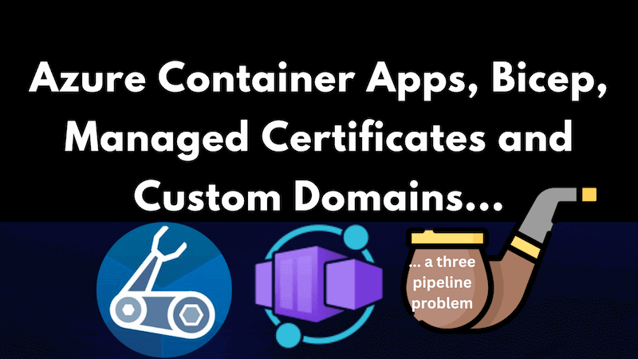

Azure Container Apps support managed certificates and custom domains. However, deploying them with Bicep is not straightforward - although it is possible. It seems likely there's a bug in the implementation in Azure, but I'm not sure. Either way, it's possible to deploy managed certificates and custom domains using Bicep. You just need to know how.

If, instead, you're looking to make use of the "bring your own certificates" approach in Azure Container Apps using Bicep, then you might want to take a look at [this post on the topic](../2023-07-20-azure-container-apps-bicep-bring-your-own-certificates-custom-domains/index.md).

## Updated 08/11/2025 - with `bindingType: 'Auto'` you can deploy in one go

Since originally writing this post, the [need to use multiple pipeline runs to deploy has been resolved](https://github.com/microsoft/azure-container-apps/issues/796). It is now possible to deploy managed certificates and custom domains to Azure Container Apps using a single Bicep deployment. To do that you'll need to use the [Microsoft.App containerApps 2025-07-01](https://learn.microsoft.com/en-us/azure/templates/microsoft.app/2025-07-01/containerapps?pivots=deployment-language-bicep) API version (or newer).

That API version introduced the ability to create a managed certificate resource without needing to first create a disabled custom domain on the container app. This means you can now do it all in one go. This is achieved with the use of a new `bindingType` value of `Auto` on the `customDomains` property.

Using the new approach, the Bicep required to create a managed certificate and custom domain looks like this:

```bicep
resource containerApp 'Microsoft.App/containerApps@2025-07-01' = {
  //...
  properties: {
    configuration: {
      //...
      ingress: {
        //...
        customDomains: empty(customDomainName) ? [] : [
          {
            name: customDomainName
            bindingType: 'Auto'
          }
        ]
        //...
      }
      //...
    }
    //...
  }
  //...
}

resource managedEnvironmentManagedCertificate 'Microsoft.App/managedEnvironments/managedCertificates@2025-07-01' = if (!empty(customDomainName)) {
  parent: managedEnvironment
  name: '${managedEnvironment.name}-cert'
  location: location
  tags: tags
  properties: {
    subjectName: customDomainName
    domainControlValidation: 'CNAME'
  }
  dependsOn: [
    containerApp
  ]
}
```

### `azd deploy` with Microsoft.App containerApps 2025-07-01

If you're using [Azure Developer CLI (azd)](https://learn.microsoft.com/en-us/azure/developer/azure-developer-cli/overview) to deploy your Azure Container Apps, as described in [this post](../2024-07-15-using-azd-for-faster-incremental-azure-container-app-deployments-in-azure-devops/index.md), then you'll find that an issue can present when you try to deploy the custom domain and managed certificate using the `Microsoft.App/containerApps@2025-07-01` API version.

The following error shows up when using `azd deploy`:

```
ERROR: failed deploying service 'app': updating container app service: getting container app: getting container app: unmarshalling type *armappcontainers.ContainerApp: unmarshalling type *armappcontainers.ContainerApp: struct field Properties: unmarshalling type *armappcontainers.ContainerAppProperties: struct field Configuration: unmarshalling type *armappcontainers.Configuration: struct field Ingress: unmarshalling type *armappcontainers.Ingress: struct field CustomDomains: unmarshalling type *armappcontainers.CustomDomain: struct field BindingType: json: cannot unmarshal number into Go value of type armappcontainers.BindingType
Suggestion: set 'apiVersion' on your service in azure.yaml to match the API version in your IaC:

services:
  your-service:
    apiVersion: 2025-02-02-preview
```

In fairness, this is a quite helpful error message. It suggests that you can resolve it by specifying the API version in your `azure.yaml` file like so:

```yaml
# yaml-language-server: $schema=https://raw.githubusercontent.com/Azure/azure-dev/main/schemas/v1.0/azure.yaml.json

name: my-container-app
metadata:
  template: azd-init@1.9.4
services:
  app:
    image: myregistry.azurecr.io/${CONTAINER_IMAGE_NAME}:${APP_VERSION_TAG}
    host: containerapp
    resourceName: ${CONTAINER_APP_NAME}
    apiVersion: 2025-07-01
```

With this in place, `azd deploy` will work as expected. Hopefully one day, supplying the API version in `azure.yaml` won't be necessary. I've raised an issue about this [here](https://github.com/Azure/azure-dev/issues/6092).

Anyway, if for some reason you can't use the `Microsoft.App/containerApps@2025-07-01` API version, then you can still use the three pipeline approach described below. Back to the original post...

## The dreaded message

I've facetiously subtitled this post "a three pipe(line) problem" because it took three Azure Pipelines to get it working. This is not Azure Pipelines specific though, it's just that I was using Azure Pipelines to deploy the Bicep. Really, this applies to any way of deploying Bicep. GitHub Actions, Azure CLI or whatever.

If you're here because you've encountered the dreaded message:

> `Creating managed certificate requires hostname '....' added as a custom hostname to a container app in environment 'caenv-appname-dev'`

Then you're in the right place. I'm going to explain how to get past that error message and get your custom domain working with your Azure Container App whilst still using Bicep. It's going to get ugly. But it will work.



<!--truncate-->

## A three pipe(line) problem

I spent much of the last week attempting to attach a custom domain to an Azure Container App. I was using Bicep to deploy the infrastructure and I was using Azure DevOps to deploy the Bicep.

There wasn't any documentation I could find about this, and so I decided to try and work it out for myself. I was able to get it working, but it was a bit of a journey. I'm going to share the steps I took here in the hope that it helps someone else.

I titled this section "A three pipe(line) problem" because it turned out it required three Azure Pipeline runs to deploy a custom domain with a managed certificate. That, and the fact that it seemed a great way to get a Sherlock Holmes pun into the mix. I feel justified; there was no small amount of detective work involved.

## Reverse engineering the Bicep from the Azure Portal

I knew that to get a custom domain working with an Azure Container App I would need to do two things:

1. Create a managed certificate on my managed environment
2. Create a custom domain on my container app

So I fired up the Azure Portal and did those two things. Then I went to the export template option and downloaded the ARM template. I was hoping to see how the Azure Portal did it. Since my eyes bleed a little when I attempt to read ARM templates, I [decompiled the ARM template into the Bicep equivalent](https://learn.microsoft.com/en-us/azure/azure-resource-manager/bicep/decompile?tabs=azure-cli).

It actually seemed relatively simple. First there was a [`Microsoft.App/managedEnvironments/managedCertificates`](https://learn.microsoft.com/en-us/azure/templates/microsoft.app/2022-11-01-preview/managedenvironments/managedcertificates?pivots=deployment-language-bicep) resource which created the managed certificate:

```bicep
resource managedEnvironmentManagedCertificate 'Microsoft.App/managedEnvironments/managedCertificates@2022-11-01-preview' = {
  parent: managedEnvironment
  name: '${managedEnvironment.name}-certificate'
  location: location
  tags: tags
  properties: {
    subjectName: customDomainName
    domainControlValidation: 'CNAME'
  }
}
```

Then there was the addition of a [`customDomains`](https://learn.microsoft.com/en-us/azure/templates/microsoft.app/containerapps?pivots=deployment-language-bicep#customdomain) property to the `Microsoft.App/containerApps` resource which referenced the managed certificate:

```bicep
resource containerApp 'Microsoft.App/containerApps@2022-11-01-preview' = {
  //...
  properties: {
    configuration: {
      //...
      ingress: {
        //...
        customDomains: [
          {
            name: managedEnvironmentManagedCertificate.properties.subjectName
            certificateId: managedEnvironmentManagedCertificate.id
            bindingType: 'SniEnabled'
          }
        ]
        //...
      }
      //...
    }
    //...
  }
  //...
}
```

It looked simple enough. I added those two resources to my Bicep file and ran the pipeline. It failed. I got this error:

> `Creating managed certificate requires hostname '....' added as a custom hostname to a container app in environment 'caenv-appname-dev'`

Googling that error message led me to [this issue](https://github.com/microsoft/azure-container-apps/issues/607) on the Azure Container Apps GitHub repo. Other people were having similar issues. I was able to gather enough clues from that issue to get me to a working approach. I may be the first person in the world to have got this far... Wouldn't that be special?

## The three pipe(line) solution

So whilst the original approach I came up with looked like it should work, it did not. What succeeded was an approach where I ran one pipeline to deploy some Bicep, a second pipeline to deploy some tweaked Bicep, and a third pipeline to deploy some more tweaked Bicep. Then profit.

Herewith the details of the three pipelines / three Bicep deployments:

### Bicep template 1: Create a disabled custom domain

Our first Bicep template is going to create a custom domain on our container app. However, we're going to set the `bindingType` property to `Disabled`.

```bicep
resource containerApp 'Microsoft.App/containerApps@2022-11-01-preview' = {
  //...
  properties: {
    configuration: {
      //...
      ingress: {
        //...
        customDomains: [
          {
            name: customDomainName
            bindingType: 'Disabled'
          }
        ]
        //...
      }
      //...
    }
    //...
  }
  //...
}
```

Deploy the above template and you'll have a custom domain on your container app, but it won't be active. This will be graduated to an active custom domain in the third Bicep template.

### Bicep template 2: Create the managed certificate

Now we're going to create the managed certificate by adding the following resource to our Bicep template:

```bicep
resource managedEnvironmentManagedCertificate 'Microsoft.App/managedEnvironments/managedCertificates@2022-11-01-preview' = {
  parent: managedEnvironment
  name: '${managedEnvironment.name}-certificate'
  location: location
  tags: tags
  properties: {
    subjectName: customDomainName
    domainControlValidation: 'CNAME'
  }
}
```

At present there's no relation between the managed certificate and the custom domain. We'll fix that in the third Bicep template. Deploy this template and you'll have a managed certificate. However, the deployment will likely fail with the following error of the following form:

```json
{
  "status": "Failed",
  "error": {
    "code": "AuthorizationFailed",
    "message": "The client 'GUID-GOES-HERE' with object id 'GUID-GOES-HERE' does not have authorization to perform action 'Microsoft.App/locations/managedCertificateOperationStatuses/read' over scope '/subscriptions/SUBSCRIPTION-ID-GOES-HERE/providers/Microsoft.App/locations/West Europe/managedCertificateOperationStatuses/GUID-GOES-HERE' or the scope is invalid. If access was recently granted, please refresh your credentials."
  }
}
```

Don't sweat it. You should have a managed certificate. That's what we need.

### Bicep template 3: Create an active custom domain

Ready for the big finish? We're going to take our Bicep template back to what we originally tried:

```bicep
resource managedEnvironmentManagedCertificate 'Microsoft.App/managedEnvironments/managedCertificates@2022-11-01-preview' = {
  parent: managedEnvironment
  name: '${managedEnvironment.name}-certificate'
  location: location
  tags: tags
  properties: {
    subjectName: customDomainName
    domainControlValidation: 'CNAME'
  }
}

resource containerApp 'Microsoft.App/containerApps@2022-11-01-preview' = {
  //...
  properties: {
    configuration: {
      //...
      ingress: {
        //...
        customDomains: [
          {
            name: managedEnvironmentManagedCertificate.properties.subjectName
            certificateId: managedEnvironmentManagedCertificate.id
            bindingType: 'SniEnabled'
          }
        ]
        //...
      }
      //...
    }
    //...
  }
  //...
}
```

Note that the `customDomains` property of the `Microsoft.App/containerApps` resource now references the managed certificate and is `SniEnabled`. Deploy this template and you'll have a working managed certificate and a working custom domain on your container app. Huzzah!

## Conclusion

I write this post purely to help others who may be struggling with this. I'm assuming this is some kind of bug, and I'm hoping the Azure Container Apps team will fix it soon. I've raised a specific issue on the Azure Container Apps GitHub repo for this problem. You can find it [here](https://github.com/microsoft/azure-container-apps/issues/796).

## Attributions

<a href="https://www.flaticon.com/free-icons/bad-habit" title="bad habit icons">Pipe icon in title image created by Freepik - Flaticon</a>
