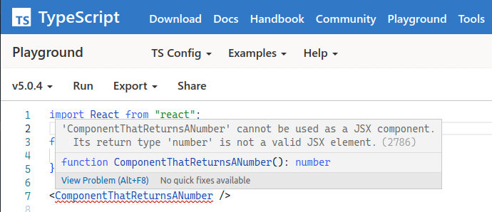

A new feature arrives with TypeScript 5.1, [it is described as "Decoupled Type-Checking Between JSX Elements and JSX Tag Types"](https://devblogs.microsoft.com/typescript/announcing-typescript-5-1-beta/#decoupled-type-checking-between-jsx-elements-and-jsx-tag-types).

It's all about handing control of JSX type definitions to libraries. With this feature, libraries can control what types are used for JSX elements. Why does this matter? Great question! Until version 5.1, TypeScript did an imperfect job of representing what is possible with JSX. This feature allows libraries to do a better job of that, and we'll look into it in this post.

It's probably worth saying, that this is a complicated feature. If you don't understand it (and as the author of this post I'll confess that I had to work quite hard to understand it), **that is okay**. This is a low level feature that is only likely to be used by library / type definition authors. It's a primitive that will unlock possibilites for people writing JSX - but it's something that people will mainly feel the benefit of, without directly doing anything themselves, or necessarily noticing that things have changed for the better.


<!--truncate-->

## What's the problem?

TypeScript creates a type system which sits on top of JavaScript, and provides static typing capabilities. As the language has grown more sophisticated, it has been able to get closer and closer to representing the full range of possibilities that JavaScript offers. As an example of this evolution, if you remember the early days of TypeScript, you'll remember a time before union types. Back then, you had to use `any` to represent a value that could be one of a number of types. That imperfect representation of JavaScript was solved with union types:

```diff
-function printStringOrNumber(stringOrNumber: any) {
+function printStringOrNumber(stringOrNumber: string | number) {
    console.log(stringOrNumber);
}
```

The problem we're looking at here is in the same vein. But it specifically applies to JSX; which is widely used in libraries like React. With JSX support in TypeScript (up to and including 5.0), it was not possible to accurately represent all JSX possibilities. This is because the type of a JSX element returned from a function component was always `JSX.Element | null`. This is a type that is defined in the TypeScript compiler, and is not something that can be changed by a library author.

How does this play out? Well, let's take a look at a simple example. Let's say we have a function component that returns a number. We might write something like this:

```tsx
function ComponentThatReturnsANumber() {
  return 42;
}

<ComponentThatReturnsANumber />;
```

The above is legitimate JSX, but it is not legitimate TypeScript. The TypeScript compiler will complain:



[You can see this in the TypeScript Playground](https://www.typescriptlang.org/play?#code/JYWwDg9gTgLgBAJQKYEMDG8BmUIjgIilQ3wG4AoczAVwDsNgJa4BhXSWpWmAFQAsUMZDGpRaAZwCCAOWogARkigAKAJRwA3uThwiIsXAAsAJgoBfSgB424Jl14ChSfRJlzFUOAHoAfOSA)

This errors because function components that return anything but `JSX.Element | null` are not allowed as element types in React according to TypeScript. However, in React, function components **can** return a `ReactNode`. That type includes `number | string | Iterable<ReactNode> | undefined` ([and will likely include `Promise<ReactNode>` in the future](https://github.com/reactjs/rfcs/pull/229)).

As an aside, a return value of `number` would be perfectly fine in class components - the restrictions are different there. I spoke to Sebastian about this and he said:

> An interesting note is that before function components we did have full control. Due to `ElementClass`, class components already could return `ReactNode` at the type level. It was just function components that were missing full control (or any other component types Suspense or Profiler).

So this is the problem: is not possible to represent in TypeScript today what is actually possible in React (or other JSX libraries). Furthermore, what's returned from JSX may change over time, and TypeScript needs to be able to represent that.

## The arrival of `JSX.ElementType`

Sebastian Silbermann [opened a pull request to TypeScript](https://github.com/microsoft/TypeScript/pull/51328). It had the title "RFC: Consult new JSX.ElementType for valid JSX element types". In that PR Sebastian explained the issue we've just looked at above, and proposed a solution. The solution was to introduce a new type, `JSX.ElementType`.

To illustrate the what `JSX.ElementType` actually is as compared to a JSX element, consider this illustration:

```
// <Component />
//  ^^^^^^^^^    JSX element type
// ^^^^^^^^^^^^^ JSX element
```

The significance of `JSX.ElementType` is that it is used to represent the type of a JSX element and **allow library authors to control what types are used for JSX elements**. This control was not available before.

The TypeScript pull request was merged, and so Sebastian (who helps maintain the React type definitions) exercised the new powers in [this pull request to the DefinitelyTyped repository for the React type definitions](https://github.com/DefinitelyTyped/DefinitelyTyped/pull/65135). At the time of writing, this pull request is still open, but once merged and shipped the React community will feel the benefits.

The changes are subtle; You can see in this pull request that `ReactElement | null` is generally replaced with `ReactNode`:

```diff
     type JSXElementConstructor<P> =
-        | ((props: P) => ReactElement<any, any> | null)
+        | ((props: P) => ReactNode)
         | (new (props: P) => Component<any, any>);
```

Remember how we mentioned earlier on that function components couldn't return numbers? Let's look at the updated tests in the PR:

```diff
    const ReturnNumber = () => 0xeac1;
+   const FCNumber: React.FC = ReturnNumber;
    class RenderNumber extends React.Component {
        render() {
          return 0xeac1;
        }
    }
```

With this change, React components that return numbers are now valid JSX elements. This is because `JSX.ElementType` is now `ReactNode`, which includes numbers. Essentially this represents that new things are possible as a consequence of this change. The library and type definition author now has more control over what is possible in JSX.

To quote Sebastian again:

> Now we have control over any potential component type.

Let's look again at our component that produces a number again:

```tsx
function ComponentThatReturnsANumber() {
  return 42;
}

<ComponentThatReturnsANumber />;
```

With Sebastian's changes, this becomes valid TypeScript. And as React, and other JSX libraries evolve, TypeScript compatibility can also.

## Summary

The TL;DR of this post is "TypeScript will better allow for the modelling of JSX in TypeScript 5.1". I'm indebted to [Sebastian Silbermann](https://github.com/eps1lon) and [Daniel Rosenwasser](https://github.com/DanielRosenwasser) for their explanations of this feature. Thanks in particular to Sebastian for implementing this feature and for reviewing this post.

I hope this post helps you understand the feature a little better.

[This post was originally published on LogRocket.](https://blog.logrocket.com/declaring-jsx-types-typescript-5-1/)

<head>
    <link rel="canonical" href="https://blog.logrocket.com/declaring-jsx-types-typescript-5-1/" />
</head>
