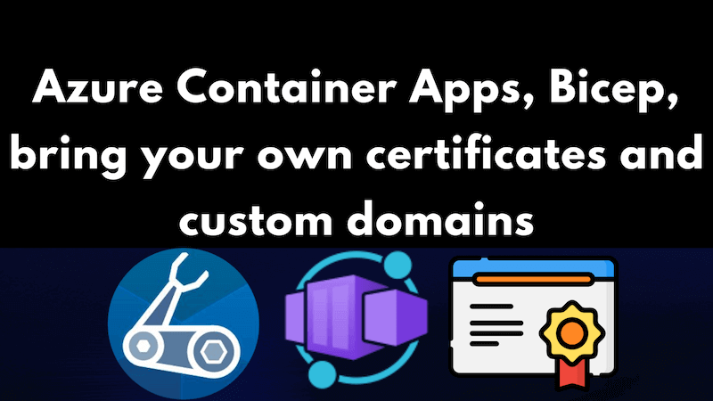

Azure Container Apps supports custom domains via certificates. If you're looking to make use of the managed certificates in Azure Container Apps using Bicep, then you might want to take a look at [this post on the topic](../2023-06-18-azure-container-apps-bicep-managed-certificates-custom-domains/index.md).

This post will instead look at how we can use the "bring your own certificates" approach in Azure Container Apps using Bicep. Well, as much as that is possible; there appear to be limitations in what can be achieved with Bicep at the time of writing.



<!--truncate-->

This post assumes you already have an Azure Container App in place and you want to bind a custom domain to it. If you don't have an Azure Container App in place, then you might want to take a look at [this post on the topic](../2021-12-27-azure-container-apps-build-and-deploy-with-bicep-and-github-actions/index.md).

## Make a certificate

So the first thing we need to do is make a certificate. This is pretty simple, and in my case amounts to the following command:

```shell
sudo openssl req -x509 -newkey rsa:4096 -sha256 -days 3650 -nodes \
  -keyout poorclaresarundel.org.key -out poorclaresarundel.org.crt -subj "/CN=poorclaresarundel.org" \
  -addext "subjectAltName=DNS:poorclaresarundel.org,DNS:www.poorclaresarundel.org,IP:8.8.8.8"
sudo chmod +r poorclaresarundel.org.key
cat poorclaresarundel.org.crt poorclaresarundel.org.key > poorclaresarundel.org.pem
```

This makes a certificate with a 10 year expiry date. You'll note the `8.8.8.8` listed as the IP address above. You should replace that with the static IP address of your Container Apps Environment. You can find that in the Azure Portal. It's listed on the "Overview" tab of your Azure Container App. It's the "Static IP" value:


You'll also note the `poorclaresarundel.org` listed as the domain name above. You should replace that with your domain name. You'll need to do that in two places; in the `openssl` command and in the `subjectAltName` value. More on the significance of that particular domain name later.

## Container apps environment and certificates

Now, we'll crack open our Azure Container App's environment in the Azure Portal and navigate to the "Certificates" tab. Then we need to click on the "Bring your own certificates (.pfx)" tab, and we are presented with a screen like this:


Note the "Add certificate" button. Use that to upload your certificate - in my case that's the `poorclaresarundel.org.pem` file. You'll need to provide the password for the certificate too. Oh and you'll be asked for a friendly name. We'll remember the friendly name you use - we'll need it later.

This is a real world example; my aunt's website. My aunt is Poor Clare nun and, for years, I've done an average job of maintaining her [convent's website](https://www.poorclaresarundel.org/). If I was her, I'd be wishing her nephew was a designer rather than an engineer. Or maybe an engineer with more of a sense what looks good. But here we are - she's a nun and so consequently much too nice to say that. Anyway, I digress. The point is, I've got a certificate for her website and I'm going to use it here.


## Bicep for the custom domain

I haven't managed to work out how one would handle the certificate upload in Bicep (and I rather suspect it is not supported). However, I have worked out how to handle the certificate in the Azure Container App once it's been uploaded with regards to custom domains. Find the `Microsoft.App/containerApps` resource in your Bicep and add a `customDomains` property to it. It should look something like this:

```bicep
resource environment 'Microsoft.App/managedEnvironments@2022-10-01' = {
  name: environmentName
  // ...
}

resource webServiceContainerApp 'Microsoft.App/containerApps@2022-10-01' = {
  name: webServiceContainerAppName
  tags: tags
  location: location
  properties: {
    // ...
    configuration: {
      // ...
      ingress: {
        // ...
        customDomains: [
          {
              name: 'www.poorclaresarundel.org'
              // note the friendly name of "poorclaresarundel.org" forms the last segment of the id below
              certificateId: '${environment.id}/certificates/poorclaresarundel.org'
              bindingType: 'SniEnabled'
          }
        ]
      }
    }
    // ...
  }
}
```

## Conclusion

With the above post you should be able to deploy an Azure Container App with a custom domain and provide your own certificate, which is then referenced using Bicep. If you'd like to see the full Bicep file, then you can find it [here](https://github.com/johnnyreilly/poorclaresarundel-aca/blob/main/infra/main.bicep).

## Attributions

<a href="https://www.flaticon.com/free-icons/certificate" title="certificate icons">Certificate icon in title image created by Freepik - Flaticon</a>
