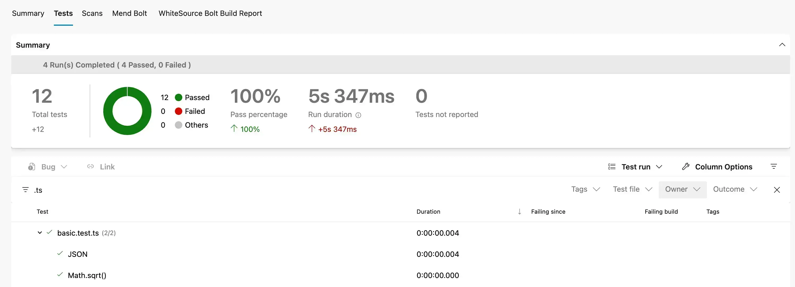

This post explains how to integrate the tremendous test runner [Vitest](https://vitest.dev/) with the continuous integration platform [Azure Pipelines](https://azure.microsoft.com/en-gb/products/devops/pipelines/). If you read [the post on integrating with Jest](../2020-12-30-azure-pipelines-meet-jest/index.md), you'll recognise a lot of common ground with this. Once again we want:

1. Tests run as part of our pipeline
2. A failing test fails the build
3. Test results reported in Azure Pipelines UI


<!--truncate-->

This post assumes we have a Vitest project set up and an Azure Pipeline in place. Let's get started.

## Tests run as part of our pipeline

First of all, lets get the tests running. We'll crack open our `azure-pipelines.yml` file and, in the appropriate place add the following:

```yml
- bash: npm run test:ci
  displayName: 'npm test'
  workingDirectory: src/client-app
```

The above will, when run, trigger a `npm run test:ci` in the `src/client-app` folder of the project (it's here where the app lives). What does `test:ci` do? Well, it's a script in the `package.json` that looks like this:

```json
"test": "vitest",
"test:ci": "vitest run --reporter=default --reporter=junit --outputFile=reports/junit.xml",
```

You'll note above we've got 2 scripts; `test` and `test:ci`. The former is the default script that Vitest will run when you run `npm test`. The latter is the script that we'll use in our pipeline. The difference between the two is that the `test:ci` script will:

1. Doesn't run in watch mode
2. Fail the build if any tests fail
3. Produce a JUnit XML report which details test results. This is the format that Azure Pipelines can use to ingest test results.

The test results are written to `reports/junit.xml` which is a path relative to the `src/client-app` folder. Because you may test this locally, it's probably worth adding the `reports` folder to your `.gitignore` file to avoid it accidentally being committed.

## Report test results in Azure Pipelines UI

Our tests are running, but we're not seeing the results in the Azure Pipelines UI. For that we need the [`PublishTestResults` task](https://learn.microsoft.com/en-us/azure/devops/pipelines/tasks/reference/publish-test-results-v2).

We need to add a new step to our `azure-pipelines.yml` file _after_ our `npm run test:ci` step:

```yml
- task: PublishTestResults@2
  displayName: 'supply npm test results to pipelines'
  condition: succeededOrFailed() # because otherwise we won't know what tests failed
  inputs:
    testResultsFiles: 'src/client-app/reports/junit.xml'
```

This will read the test results from our `src/client-app/reports/junit.xml` file and pump them into Pipelines. Do note that we're _always_ running this step; so if the previous step failed (as it would in the case of a failing test) we still pump out the details of what that failure was.

And that's it! Azure Pipelines and Vitest integrated.



## Putting it all together

The complete `azure-pipelines.yml` additions look like this:

```yml
- bash: npm run test:ci
  displayName: 'npm test'
  workingDirectory: src/client-app

- task: PublishTestResults@2
  displayName: 'supply npm test results to pipelines'
  condition: succeededOrFailed() # because otherwise we won't know what tests failed
  inputs:
    testResultsFiles: 'src/client-app/reports/junit.xml'
```

Please note, there's nothing special about the `reports/junit.xml` file. You can change the name of the file and/or the location of the file. Just make sure you update the `testResultsFiles` value in the `PublishTestResults` task to match.
