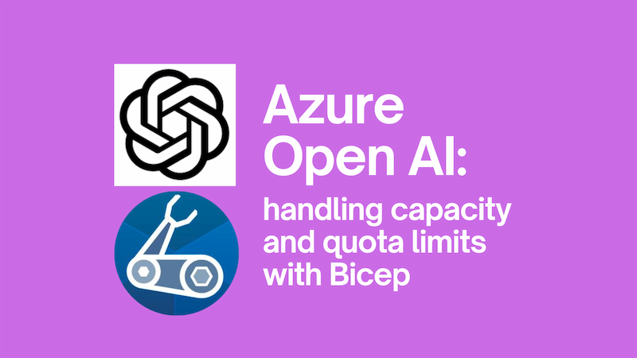
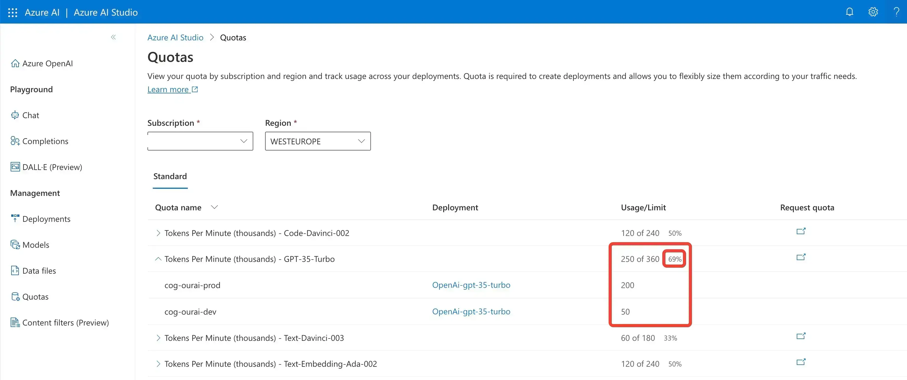

We're currently in the gold rush period of AI. The world cannot get enough. A consequence of this, is that rationing is in force. It's like the end of the second world war, but with GPUs. This is a good thing, because it means that we can't just spin up as many resources as we like. It's a bad thing, for the exact same reason.

If you're making use of Azure's Open AI resources for your AI needs, you'll be aware that there are [limits known as "quotas"](https://learn.microsoft.com/en-us/azure/ai-services/openai/how-to/quota?tabs=bicep) in place. If you're looking to control how many resources you're using, you'll want to be able to control the capacity of your deployments. This is possible with Bicep.

This post grew out of a [GitHub issue](https://github.com/Azure/bicep-types-az/issues/1660#issuecomment-1643484703) around the topic where people were bumping on the message `the capacity should be null for standard deployment` as they attempted to deploy. At the time that issue was raised, there was very little documentation on how to handle this. Since then, things have improved, but I thought it would be useful to have a post on the topic.



<!--truncate-->

## Viewing capacity and quota limits in the Azure Open AI Studio

If you take a look at the [Azure Open AI Studio](https://oai.azure.com/) you'll notice a "Quotas" section:



You'll see above that we've got two deployments of GPT-35-Turbo in our subscription. Both of these contribute towards an overall limit of 360K TPM. If we try and deploy resources and have an overall capacity total that exceeds that, our deployment will fail.

That being the case, we need to be able to control the capacity of our deployments. This is possible with Bicep.

## Controlling capacity and quota limits with Bicep

Consider the following `account-deployments.bicep`:

```bicep
@description('Name of the Cognitive Services resource')
param cognitiveServicesName string

@description('Name of the deployment resource.')
param deploymentName string

@description('Deployment model format.')
param format string

@description('Deployment model name.')
param name string

@description('Deployment model version.')
param version string = '1'

@description('The name of RAI policy.')
param raiPolicyName string = 'Default'

@allowed([
  'NoAutoUpgrade'
  'OnceCurrentVersionExpired'
  'OnceNewDefaultVersionAvailable'
])
@description('Deployment model version upgrade option. see https://learn.microsoft.com/en-us/azure/templates/microsoft.cognitiveservices/2023-05-01/accounts/deployments?pivots=deployment-language-bicep#deploymentproperties')
param versionUpgradeOption string = 'OnceNewDefaultVersionAvailable'

@description('''Deployments SKU see: https://learn.microsoft.com/en-us/azure/templates/microsoft.cognitiveservices/2023-05-01/accounts/deployments?pivots=deployment-language-bicep#sku
eg:

sku: {
  name: 'Standard'
  capacity: 10
}

''')
param sku object

// https://learn.microsoft.com/en-us/azure/templates/microsoft.cognitiveservices/2023-05-01/accounts?pivots=deployment-language-bicep
resource cog 'Microsoft.CognitiveServices/accounts@2023-05-01' existing = {
  name: cognitiveServicesName
}

// https://learn.microsoft.com/en-us/azure/templates/microsoft.cognitiveservices/2023-05-01/accounts/deployments?pivots=deployment-language-bicep
resource deployment 'Microsoft.CognitiveServices/accounts/deployments@2023-05-01' = {
  name: deploymentName
  parent: cog
  sku: sku
  properties: {
    model: {
      format: format
      name: name
      version: version
    }
    raiPolicyName: raiPolicyName
    versionUpgradeOption: versionUpgradeOption
  }
}

output deploymentName string = deployment.name
output deploymentResourceId string = deployment.id
```

We can use this to deploy.... deployments (naming here is definitely confusing) to Azure like so:

```bicep
var cognitiveServicesDeployments = [
  {
    name: 'OpenAi-gpt-35-turbo'
    shortName: 'gpt35t'
    model: {
      format: 'OpenAI'
      name: 'gpt-35-turbo'
      version: '0301'
    }
    sku: {
      name: 'Standard'
      capacity: repositoryBranch == 'refs/heads/main' ? 100 : 10 // capacity in thousands of TPM
    }
  }
]

// Model Deployment - one at a time as parallel deployments are not supported
@batchSize(1)
module openAiAccountsDeployments35Turbo 'account-deployments.bicep' = [for deployment in cognitiveServicesDeployments: {
  name: '${deployment.shortName}-cog-accounts-deployments'
  params: {
    cognitiveServicesName: openAi.outputs.cognitiveServicesName
    deploymentName: deployment.name
    format: deployment.model.format
    name: deployment.model.name
    version: deployment.model.version
    sku: deployment.sku
  }
}]
```

We're currently only deploying a single account deployment in our array, but we do it this way as it's not unusual to deploy multiple deployments together. Notice the `sku` portion above:

```bicep
    sku: {
      name: 'Standard'
      capacity: repositoryBranch == 'refs/heads/main' ? 100 : 10
    }
```

Here we provision a larger `capacity` for our feature branch deployments than our `main` branch deployments. This demonstrates our own usage, whereby we deploy a smaller capacity for our feature branches so that we can test things out, but then deploy a larger capacity for our main branch deployments.

Significantly, we're controlling the capacity of our deployments. The way in which you choose to decide on the capacity of your deployments is up to you, but the above demonstrates how you can do it with Bicep and stick within your quota limits.
