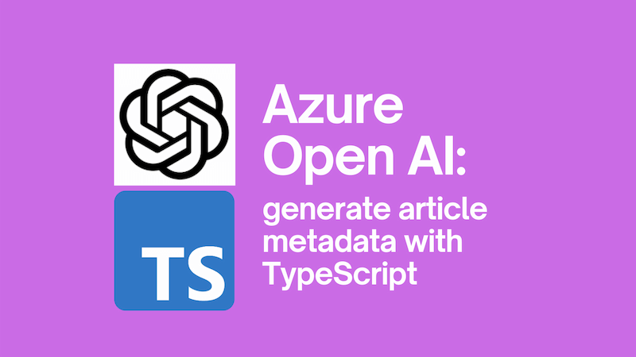

This post grew out of my desire to improve the metadata for my blog posts. I have been blogging for more than ten years, and the majority of my posts lack descriptions. A description is meta tag that sits in a page and describes the contents of the page. This is what this posts description meta tag looks like in HTML:

```html
<meta
  name="description"
  content="Use the TypeScript Azure Open AI SDK to generate article metadata."
/>
```

Descriptions are important for search engine optimisation (SEO) and for accessibility. You can [read up more on the topic here](https://developers.google.com/search/docs/appearance/snippet). I wanted to have descriptions for _all_ my blog posts. But writing around 230 descriptions for my existing posts was not something I wanted to do manually. I wanted to automate it.



<!--truncate-->

## TypeScript Azure Open AI SDK

I've been using Azure Open AI for a while now, and I've been using the [TypeScript SDK in the `@azure/openai` package](https://github.com/Azure/azure-sdk-for-js/blob/main/sdk/openai/openai/README.md) to interact with it. What I wanted to do, was to use the SDK to generate descriptions for my blog posts based on the content. Since my blog is powered by Docusaurus and each post is a Markdown file, I had easy access to a individual files that could be summarised.

## What I wanted to do

The plan was, to build a script to do the following:

- read all of my blog posts without descriptions
- for each one, generate a description using Azure Open AI
- write the description to the Markdown file

I wanted to use [Bun](https://bun.sh/) for this as it supports TypeScript by default. Using Node.js would equally be possible; but it wouldn't have been so easy to use TypeScript.

## Reading the blog posts

I started off by creating a new Bun project:

```bash
mkdir open-ai-description
cd open-ai-description
bun init
```

Then adding the various packages we needed, including the Azure Open AI one:

```bash
bun add @azure/openai @azure/identity
bun add --dev bun-types typescript
```

I then created an `index.ts` file and added the following code:

```typescript
import fs from 'fs';
import path from 'path';
import { produceSummary } from './summarizer';

const docusaurusDirectory = '../blog-website';

async function getBlogDirsOrderedDescending() {
  const rootBlogPath = path.resolve(docusaurusDirectory, 'blog');
  const blogDirs = (await fs.promises.readdir(rootBlogPath))
    .filter((file) => fs.statSync(path.join(rootBlogPath, file)).isDirectory())
    .map((file) => path.join(rootBlogPath, file));

  blogDirs.sort().reverse();

  return blogDirs;
}

interface BlogPost {
  path: string;
  content: string;
}

interface BlogPostWithDescription extends BlogPost {
  description: string;
}

async function generatePostsWithDescription() {
  const blogDirs = await getBlogDirsOrderedDescending();

  const postsWithoutDescription: BlogPost[] = [];

  for (const blogDir of blogDirs) {
    console.log(`Processing ${blogDir}`);

    const indexMdPath = path.join(blogDir, 'index.md');
    const blogPostContent = await fs.promises.readFile(indexMdPath, 'utf-8');

    const frontMatter = blogPostContent.split('---')[1];
    const hasDescription = frontMatter.includes('\ndescription: ');
    if (!hasDescription) {
      postsWithoutDescription.push({
        path: indexMdPath,
        content: blogPostContent,
      });
    }
  }

  console.log(
    `Found ${postsWithoutDescription.length} posts without description`,
  );

  const postsWithDescription: BlogPostWithDescription[] = [];

  for (const post of postsWithoutDescription) {
    const [, frontmatter, article] = post.content.split('---');

    console.log(
      `** Generating description for ${post.path
        .replace('/index.md', '')
        .split('/')
        .pop()}`,
    );
    const description = await produceSummary(article);

    if (description) {
      postsWithDescription.push({ ...post, description });
      console.log(`** description: ${description}`);

      await fs.promises.writeFile(
        post.path,
        `---${frontmatter}description: '${description.replaceAll("'", '')}'
---${article}`,
      );
    } else {
      console.log(`** no description generated`);
    }
  }

  return postsWithDescription;
}

async function main() {
  const startedAt = new Date();

  const postsWithDescription: BlogPostWithDescription[] =
    await generatePostsWithDescription();

  const finishedAt = new Date();
  const duration = (finishedAt.getTime() - startedAt.getTime()) / 1000;
  console.log(
    `${postsWithDescription.length} summaries generated in ${duration} seconds`,
  );
}

await main();
```

The code above does the following:

- reads all of the blog posts in my blog; they're all directories in the `blog` directory with an `index.md` underneath so it's pretty easy
- for each post, it checks to see if there is a description in the front matter ([front matter is a metadata section at the top of the Markdown file](https://docusaurus.io/docs/markdown-features#front-matter))
- if there is no description, it adds the post to a list of posts without descriptions
- it then loops through the posts without descriptions and generates a description for each one using the `produceSummary` function - more on that in a moment

## Generating the descriptions

So far, so text wrangling. Let's look at the `produceSummary` function in the `summarizer.ts` file:

```typescript
import { OpenAIClient } from '@azure/openai';
import { AzureCliCredential } from '@azure/identity';

// Make sure you have az login'd and have the correct subscription selected
// debug with:
// bun --inspect-brk open-ai-description/index.ts
// or:
// cd open-ai-description
// bun --inspect-brk index.ts

interface OpenAiClientAndDeploymentName {
  openAIClient: OpenAIClient;
  deploymentName: string;
}

let openAiClientAndDeploymentName: OpenAiClientAndDeploymentName | undefined;

function getClientAndDeploymentName(): OpenAiClientAndDeploymentName {
  if (openAiClientAndDeploymentName) {
    return openAiClientAndDeploymentName;
  }

  // You will need to set these environment variables or edit the following values
  const endpoint = process.env['ENDPOINT'];

  if (!endpoint) {
    throw new Error(
      'Missing ENDPOINT environment variable with a value like https://<resource name>.openai.azure.com',
    );
  }

  // This will use the Azure CLI's currently logged in user;
  // make sure you've done `az login` and have the correct subscription selected
  const credential = new AzureCliCredential();
  const openAIClient = new OpenAIClient(endpoint, credential);
  const deploymentName = 'OpenAi-gpt-35-turbo';

  openAiClientAndDeploymentName = { openAIClient, deploymentName };

  return openAiClientAndDeploymentName;
}

export async function produceSummary(article: string): Promise<string> {
  const { openAIClient, deploymentName } = getClientAndDeploymentName();
  const minChars = 120;
  const maxChars = 156;

  const messages = [
    {
      role: 'system',
      content: `You are a summarizer. You will be given the text of an article and will produce a summary / meta description which summarizes the article. The summary / meta descriptions you produce must be between ${minChars} and ${maxChars} characters long. If they are longer or shorter than that they cannot be used. Avoid using the \`'\` character as it is not supported by the blog website - you may use the \`’\` character instead. Do not use the expression "the author" or "the writer" in your summary.`,
    },
    {
      role: 'user',
      content: `Here is an article to summarize:

${article}`,
    },
  ];

  let attempts = 0;
  const maxAttempts = 10;
  let summary = '';
  while (attempts++ < maxAttempts) {
    console.log(`Attempt ${attempts} of ${maxAttempts}`);

    // This will use the Azure CLI's currently logged in user;
    // make sure you've done `az login` and have the correct subscription selected
    const result = await openAIClient.getChatCompletions(
      deploymentName,
      messages,
      {
        temperature: 0.9,
      },
    );

    for (const choice of result.choices) {
      summary = choice.message?.content || '';

      if (summary.length >= minChars && summary.length <= maxChars) {
        return summary;
      }
      console.log(`Summary was ${summary.length} characters long; no good`);
    }

    messages.push(
      {
        role: 'assistant',
        content: summary,
      },
      {
        role: 'user',
        content:
          summary.length < minChars
            ? `Too short; try again please - we require a summary that is between ${minChars} and ${maxChars} characters long.`
            : `Too long; try again please - we require a summary that is between ${minChars} and ${maxChars} characters long.`,
      },
    );

    console.log(messages);

    await sleep(500);
  }

  console.log(`Failed to produce a summary in ${maxAttempts} attempts`);
  return '';
}

function sleep(ms: number) {
  return new Promise((resolve) => setTimeout(resolve, ms));
}
```

There's a lot going on here, so let's break it down.

### Authentication

Oftentimes the fiddliest part of using Azure Open AI is authentication. In this case, I'm using the Azure CLI credential. So to run this you need to authenticate with the Azure CLI with `az login`. (Remember to make sure you have the correct subscription selected. You can check this by running `az account show` and checking that the `isDefault` property is set to `true`.)

Once you're logged in, this code will use the currently logged in user to authenticate with Azure Open AI.

```typescript
const credential = new AzureCliCredential();
const openAIClient = new OpenAIClient(endpoint, credential);
const deploymentName = 'OpenAi-gpt-35-turbo';
```

You need to set the `endpoint` variable to the endpoint of your Azure Open AI resource. You can find this in the Azure Portal by going to your Azure Open AI resource. Look for something like `https://<resource name>.openai.azure.com`. You'll also need to get the name of your deployment. In my case this is `OpenAi-gpt-35-turbo`.

### Producing the summary

Once you've authenticated and got the client you can start to summarise. The first thing to do is provide a system message to prime the model with context on what we're trying to do. As part of writing a good description, there's a sweet spot to hit in terms of length; too short and it's not useful, too long and it gets truncated. So we're going to aim for between 120 and 156 characters. We're also going to encourage the AI to avoid certain wording constructs and also avoid using the `'` character as it upsets the front matter.

Once primed, we hand over the blog content to the AI and ask it to produce a summary.

```typescript
const minChars = 120;
const maxChars = 156;

const messages = [
  {
    role: 'system',
    content: `You are a summarizer. You will be given the text of an article and will produce a summary / meta description which summarizes the article. The summary / meta descriptions you produce must be between ${minChars} and ${maxChars} characters long. If they are longer or shorter than that they cannot be used. Avoid using the \`'\` character as it is not supported by the blog website - you may use the \`’\` character instead. Do not use the expression "the author" or "the writer" in your summary.`,
  },
  {
    role: 'user',
    content: `Here is an article to summarize:

${article}`,
  },
];
```

The way we interact with the Azure Open AI is with the `getChatCompletions` method, which is effectively a strongly typed wrapper for the [chat-completions endpoint in Azure](https://learn.microsoft.com/en-us/azure/ai-services/openai/reference#chat-completions).

```typescript
let attempts = 0;
const maxAttempts = 10;
let summary = '';
while (attempts++ < maxAttempts) {
  console.log(`Attempt ${attempts} of ${maxAttempts}`);

  // This will use the Azure CLI's currently logged in user;
  // make sure you've done `az login` and have the correct subscription selected
  const result = await openAIClient.getChatCompletions(
    deploymentName,
    messages,
    {
      temperature: 0.9, // the closer to 1, the more creative the AI will be
    },
  );

  for (const choice of result.choices) {
    summary = choice.message?.content || '';

    if (summary.length >= minChars && summary.length <= maxChars) {
      return summary;
    }
    console.log(`Summary was ${summary.length} characters long; no good`);
  }

  messages.push(
    {
      role: 'assistant',
      content: summary,
    },
    {
      role: 'user',
      content:
        summary.length < minChars
          ? `Too short; try again please - we require a summary that is between ${minChars} and ${maxChars} characters long.`
          : `Too long; try again please - we require a summary that is between ${minChars} and ${maxChars} characters long.`,
    },
  );

  console.log(messages);
}

console.log(`Failed to produce a summary in ${maxAttempts} attempts`);
return '';
```

What's quite interesting, is that you really can't rely on the AI do what you ask it to do. It _may_ create a description of an appropriate length. It may not. So we need to check what it gives us, and if it doesn't satisfy our needs, then we ask it to try again. We'll give it a maximum of 10 attempts per post, as surprisingly, every now and then it struggles to meet the brief and infinite loops are to be avoided.

## Running the script

When the script ran (after I'd `az login`-ed) it produced descriptions for all my blog posts. I reviewed each summary and tweaked them where necessary. If I really didn't like a description I'd delete and run the script again. In the end I had descriptions for all my blog posts that I was pretty happy with. If you take a look at [this giant PR](https://github.com/johnnyreilly/blog.johnnyreilly.com/pull/656) you can see them all landing.

Hopefully this post provides a useful example of how to use the TypeScript Azure Open AI SDK to generate article metadata. You can see the raw code [here](https://github.com/johnnyreilly/blog.johnnyreilly.com/tree/main/open-ai-description).
