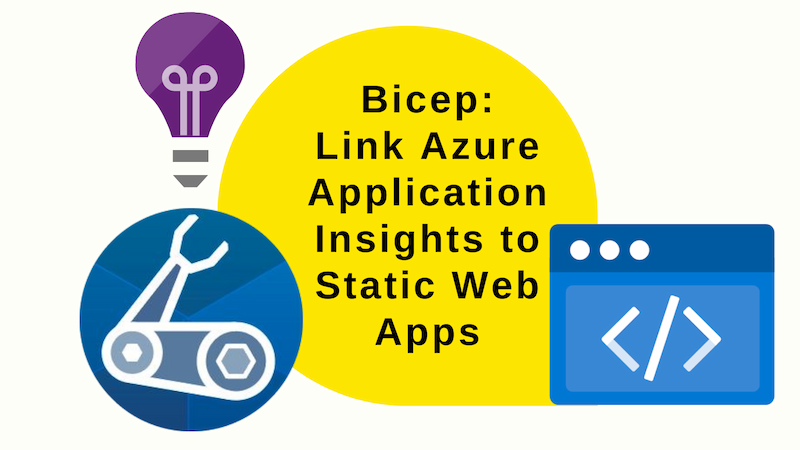
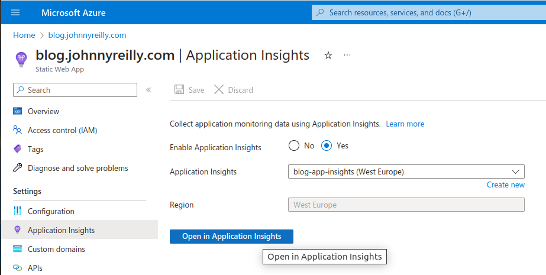

If you're looking into a Production issue with your Azure Static Web App, you'll want to be able to get to your logs as fast as possible. You can do this by linking your Static Web App to an Azure Application Insights instance. If you've used the Azure Portal to create your Static Web App, the setup phase will likely have done this for you already. But if you're using Bicep to create your Static Web App, you'll need to do this yourself.

This post will show you how to do that using Bicep.



<!--truncate-->

## A linked Azure Application Insights instance

What we want to achieve can be summmed up by this screenshot:



Inside the Azure Portal, inside our Static Web App, we want to see the App Insights tab and we want to see a linked App Insights instance. We do. But how?

## Bicep linking

The Bicep code to achieve this is pretty simple:

```bicep title="static-web-app.bicep"
var tagsWithHiddenLinks = union({
  'hidden-link: /app-insights-resource-id': appInsightsId
  'hidden-link: /app-insights-instrumentation-key': appInsightsInstrumentationKey
  'hidden-link: /app-insights-conn-string': appInsightsConnectionString
}, tags)

resource staticWebApp 'Microsoft.Web/staticSites@2022-09-01' = {
  name: staticWebAppName
  location: location
  tags: tagsWithHiddenLinks // <--- here
  sku: {
    name: 'Free'
    tier: 'Free'
  }
  properties: {
    repositoryUrl: 'https://github.com/johnnyreilly/blog.johnnyreilly.com'
    repositoryToken: repositoryToken
    branch: branch
    provider: 'GitHub'
    stagingEnvironmentPolicy: 'Enabled'
    allowConfigFileUpdates: true
    buildProperties:{
      skipGithubActionWorkflowGeneration: true
    }
  }
}
```

Consider the code above; it's a fairly standard Bicep resource declaration for a Static Web App. The only difference is the `tags` property. We're using the `union` function to add three additional tags to the `tags` property that has been passed into the `static-web-app.bicep` module. These tags are the `hidden-link` tags that link the Static Web App to the App Insights instance.

Luke Murray has a great post on [`hidden-` tags in Azure](https://luke.geek.nz/azure/hidden-tags-in-azure/) that I recommend you read if you want to know more about them. Essentially, hidden tags are tags that don't show up in the Azure Portal and have some metadata purpose. `hidden-link` tags are a subset of those that are used to link resources together.

## Where would you get the values for the `hidden-link` tags?

In the case of the `hidden-link` tags we're using here, we need to know the `id`, `InstrumentationKey` and `ConnectionString` of the App Insights instance we want to link to. We can get these values from the App Insights instance itself. Because of the way Bicep works, it's necessary to get those in a parent module to the Static Web App module. Here's an example:

```bicep
resource appInsightsResource 'Microsoft.Insights/components@2020-02-02' existing = {
  name: appInsightsName
}

module staticWebApp './static-web-app.bicep' = {
  name: '${deployment().name}-staticWebApp'
  params: {
    // ...
    appInsightsId: appInsightsResource.id
    appInsightsConnectionString: appInsightsResource.properties.ConnectionString
    appInsightsInstrumentationKey: appInsightsResource.properties.InstrumentationKey
    // ...
  }
}
```

## Summary

With this is place we have the linking we need to get to our logs quickly as we navigate around inside the Azure Portal. And we have it in place in a way that's repeatable and consistent. I hope you find this useful.
