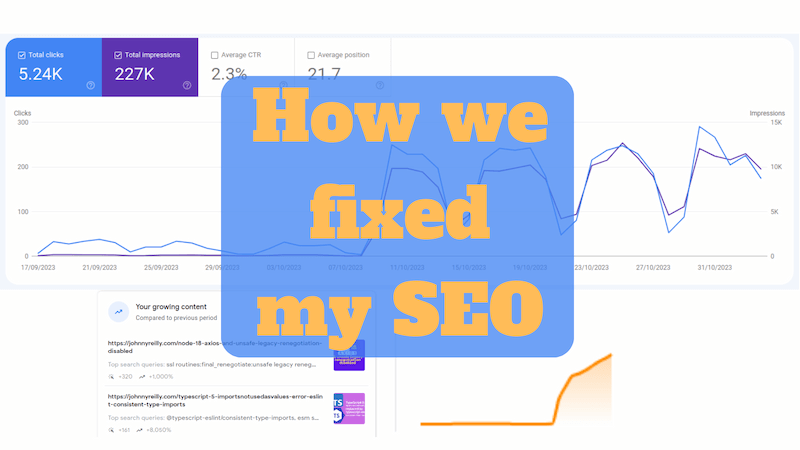
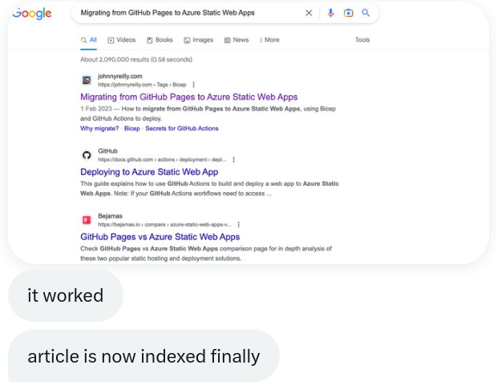
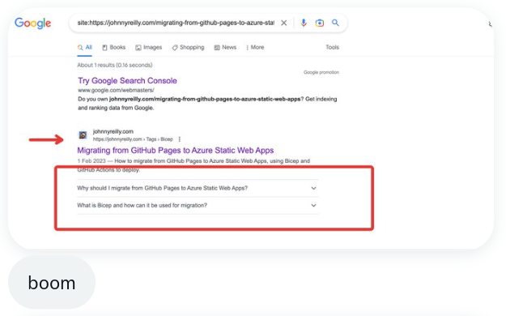

This is a follow up to my ["How I ruined my SEO"](../2023-01-15-how-i-ruined-my-seo/index.md) post. That was about my blog's SEO dropping off a cliff in October 2022. This post is about how [Growtika](https://growtika.com/) and I worked together to fix it.

## Growtika answers my cry for help

I wrote ["How I ruined my SEO"](../2023-01-15-how-i-ruined-my-seo/index.md) almost as self therapy. I was frustrated that my blog's traffic had dropped. I knew it didn't really matter; my motivation for writing my blog is mostly creating a long term memory for myself. But I was still frustrated. I write things that I know others find useful, and so it was suboptimal that my blog was no longer being found by them.

I shared the post on Hacker News, not really expecting much to happen. But it ranked, and in amongst the conversation that followed, [someone named Growtika offered to help](https://news.ycombinator.com/item?id=34389421#34390189). I hadn't heard of [Growtika](https://growtika.com/) before; SEO is not my world. SEO was very much Growtika's world though, and they offered to assist me. Never one to look a gift horse in the mouth, I leapt at the offer.

## Growtika's initial analysis

I spent some time with Growtika talking through my blog. They made some suggestions around getting my blog to align with best practices. They also schooled me on some of the basics of SEO. I was very much a novice in this area, and so I was grateful for the education.

Here's the thing: SEO is a mystery. Google doesn't publish the rules of the game. They do publish [SEO guidelines](https://developers.google.com/search/docs/fundamentals/seo-starter-guide), but they are just that: guidelines. They are not the rules of the game. They have a secret algorithm that is ever evolving. And so, whilst there are best practices, there is no guarantee that following them will result in success.

What's more, the feedback loop for changes is **long**. It's not like fixing a program with a bug, where you tweak the code, run the tests and see if it's fixed. It's more like making a change to a program, and then waiting 6 months to see if it's fixed. And if it's not, you have to wait another 6 months to see if the next change you make fixes it. It's a long, slow, frustrating process.

One of the deeply frustrating aspects about this, is that when you make changes

we made sure your site follow all the guidelines

- not needed pages were removed or marked as noindex
- improved crawlability
- added bio and author box to make the site follow the E-E-A-T algorithm update
- improved the internal links to strategic articles
- cleaned subdomain and everything that's not needed
- follow the new sitemap guidelines
- docosaurus by default have the tagging system and every tag page just copied all the content from the article without canonical tag, we changed it to avoid having the same content on hundreds of pages
- improved the about me page
- meta optimization
- robots txt
- optimized the speed (i think it was done at one point you can check, not sure haha)

## What I did

[robots.txt added](https://github.com/johnnyreilly/blog.johnnyreilly.com/pull/405)

https://reportcontent.google.com/forms/dmca_search?hl=en&utm_source=wmx&utm_medium=deprecation-pane&utm_content=legal-removal-request

DMCA takedown request for my own content

not sharing their details as I dont like them

## Profile title and link changed

https://github.com/johnnyreilly/blog.johnnyreilly.com/commit/240adb439de0232697e1d458c0341fd679420d64

I used to have no title next to my profile, and the link was to my blog. Growtika suggested adding a title to demostrate my expertise and authority on topics, and also linking to my about page instead of Twitter. This also gave me the chance to power up my about page. JSON-LD structured data support etc

## Add custom 404 page with "Back to Homepage" link

https://github.com/johnnyreilly/blog.johnnyreilly.com/commit/57d722905204d48e0e0512e5e7f4798b30880157

https://github.com/facebook/docusaurus/discussions/6030

Added privacy policy https://github.com/johnnyreilly/blog.johnnyreilly.com/commit/743e80f0205cafc7e1ef90c9e9b6da7f1e810b43

## Improve performance with fetchpriority on LCP image / no lazy loading

[I've implemented an approach to tackle this on my blog](../2023-01-18-docusaurus-improve-core-web-vitals-fetchpriority/index.md):

It does 2 things:

- swizzles the img component to opt out of lazy loading
- implements a rehype plugin which sets `fetchpriority` on the first image and lazy loading on the rest

It would be good to get this into Docusaurus if it makes sense - the question is: does it? And if it does, what sort of implementation makes sense?

## JSON-LD breadcrumbs

https://github.com/johnnyreilly/blog.johnnyreilly.com/pull/425

this was refined in https://github.com/johnnyreilly/blog.johnnyreilly.com/pull/664 to use dangerouslySetHtml.

## Reduce duplicate content

start using truncate to have summaries and reduce duplicate content https://github.com/johnnyreilly/blog.johnnyreilly.com/pull/419

rationalise tags:

- https://github.com/johnnyreilly/blog.johnnyreilly.com/pull/420
- https://github.com/johnnyreilly/blog.johnnyreilly.com/pull/418

## remove date from urls with `slug`

https://github.com/johnnyreilly/blog.johnnyreilly.com/pull/423

## Added a "Where has this blog featured? section" in about

Fix link to https://johnnyreilly.com https://github.com/johnnyreilly/blog.johnnyreilly.com/commit/ec6dcc9ea7e173bed01c7dba870b6aaaa2bd102e

## Reported to webmaster tools

It turns out there's a kind of Stack Overflow for SEO called [webmaster tools / Search Console help](https://support.google.com/webmasters/community?hl=en). Growtika encouraged me to put a report up there which I did:

https://support.google.com/webmasters/thread/197869844?hl=en

There wasn't any response so I resubmitted a week later with a little more detail: https://support.google.com/webmasters/thread/199296507?hl=en

I then received two responses; one friendly but essentially just saying "wait and see". The other response wasn't so friendly, but it turned out that poster has something of a pattern of unhelpfulness.

Either way, whilst we tried to get help from the community here, we rather drew a blank I'm afraid.

8 recent posts, 20 posts per page:
https://github.com/johnnyreilly/blog.johnnyreilly.com/commit/56ff7b76efc74e43494daa2ebe55b86f9806b5b5

## Redirect URLs but once

This PR moves the redirect mechanism to redirect only once, and to fully qualified URLs. Aligned with this, we'll also remove the redirect from blog.johnnyreilly.com -> johnnyreilly.com that sits in Cloudflare. https://github.com/johnnyreilly/blog.johnnyreilly.com/pull/471

## FAQs with Structured Data

One of the experiments we ran was to add FAQs to a post, and with that, the equivalent FAQ Structured Data. The intent being to see if this would help with the SEO for that post.

https://github.com/johnnyreilly/blog.johnnyreilly.com/pull/516

Growtika resubmitted the page we added FAQs to Google for indexing and two things happened. Firstly, the page was indexed:

## Site wide structured data

[This PR](https://github.com/johnnyreilly/blog.johnnyreilly.com/pull/676) uses the `headTags` API in docusaurus to add site wide JSON-LD structured data containing the following schema types:

- Website
- Organisation / Brand
- Person

We no longer need to swizzle the `BlogListPage` anymore as a result.

In this change we are _heavily_ borrowing from https://yoast.com/features/structured-data/

## Footer

Add links to significant posts in the footer

https://github.com/johnnyreilly/blog.johnnyreilly.com/pull/692

## Reduced number of tags used on blogs significantly

https://github.com/johnnyreilly/blog.johnnyreilly.com/pull/686
