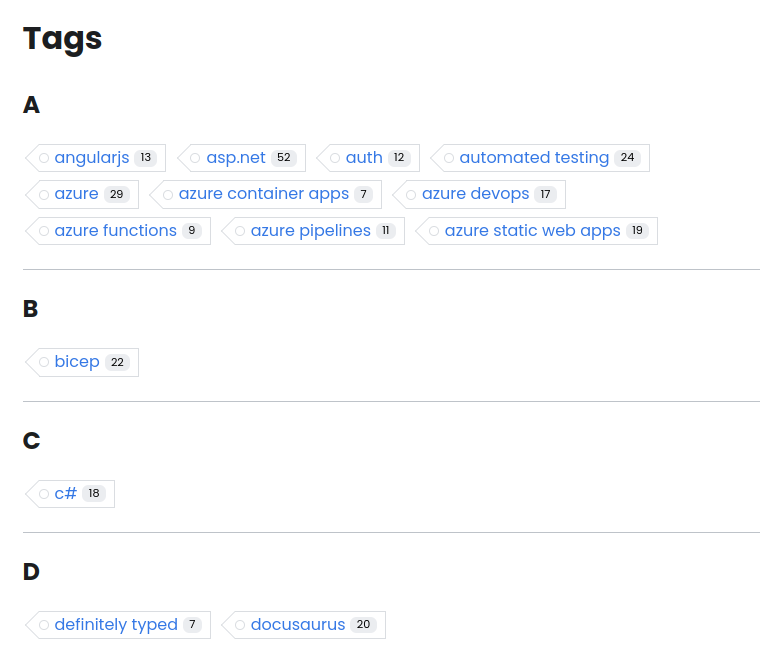
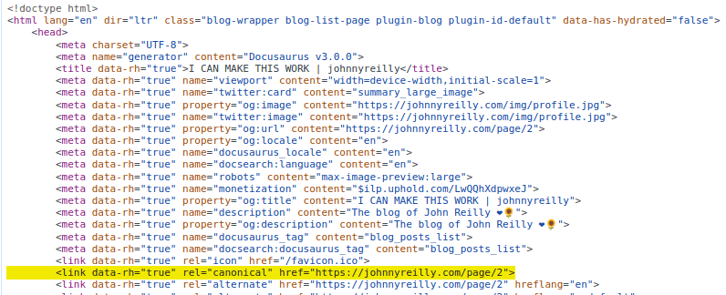
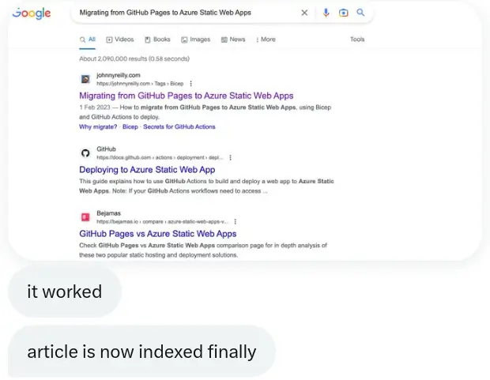
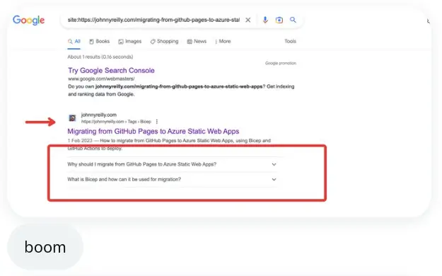
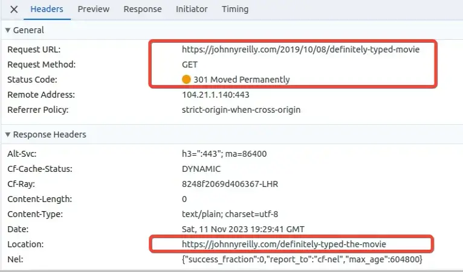

This is a follow up to my ["How I ruined my SEO"](../2023-01-15-how-i-ruined-my-seo/index.md) post. That was about my blog's SEO dropping off a cliff in October 2022. This post is about how [Growtika](https://growtika.com/) and I worked together to fix it.

It's a biggie; so buckle up!


<!--truncate-->

## Growtika answers my cry for help

I wrote ["How I ruined my SEO"](../2023-01-15-how-i-ruined-my-seo/index.md) almost as self therapy. I was frustrated that my blog's traffic had dropped. I knew it didn't really matter; my motivation for writing my blog is mostly creating a long term memory for myself. But I was still frustrated. I write things that I know others find useful, and so it was suboptimal that my blog was no longer being found by them.

And I'll admit it, when I'm trying to remember how to do something that I once knew how to do, I'll often Google it. And so I was frustrated that my blog was no longer being found by me. I was missing me. Vanity.

I shared the post on Hacker News, not really expecting much to happen. But it ranked, and in amongst the conversation that followed, [someone named Growtika offered to help](https://news.ycombinator.com/item?id=34389421#34390189). I hadn't heard of [Growtika](https://growtika.com/) before; SEO is not my world. Bit it was theirs, and they offered to assist me. Never one to look a gift horse in the mouth, I leapt at the offer.

## The mysterious SEO feedback loop

I spent some time with Growtika talking through my blog. They made some suggestions around getting my blog to align with best practices. They also schooled me on some of the basics of SEO. I was very much a novice in this area, and so I was grateful for the education.

Here's the thing: SEO is a mystery. Or at least, it's not fully understood. Like Coke haven't published their recipe, Google doesn't publish its (ever evolving) algorithm. They do publish [SEO guidelines](https://developers.google.com/search/docs/fundamentals/seo-starter-guide), but they are just that: guidelines. And so, whilst there are best practices, there is no guarantee that following them will result in success.

What's more, the feedback loop for changes is **long**. It's not like fixing a program with a bug, where you tweak the code, run the tests and see if it's fixed. It's more like making a change to a program, and then waiting weeks or months to see if it's fixed. And if it's not, you have to wait again to see if the next change you make fixes it.

Cause and effect are just not obvious when it comes to SEO.

## Growtika's suggestions

Growtika made a number of suggestions for changes to my blog. I'm going to go through them over the rest of the post. I'll also share some of the rationale for the changes.

### Updated profile and about page

There's a concept used by Google for ranking known as Experience, Expertise, Authoritativeness, and Trust (E-E-A-T). It's about how much Google trusts the content on your site. Growtika suggested that I update the profile on my blog and about page to demonstrate my expertise and authority on topics.

On each blog post I have a profile that looks like this:


I used to have no text next to my profile; it was just a link that said "John Reilly" which lead to my Twitter profile page. At Growtika's behest I added a title to demonstrate my expertise and authority on topics, and also I switched the link to my about page instead of Twitter.

The about page itself was also updated to include a richer bio and a list of places where my blog has been featured. This was to demonstrate my expertise and authority on topics.

### Remove or `noindex` unnecessary pages

My blog is built using [Docusaurus](https://docusaurus.io/). Docusaurus has a number of pages that are generated by default that duplicate content. There are "pagination" pages which allow you to navigate click by click through the whole history of a blog.

Also there are "tags" pages that reproduce blog posts under tags that have been added to blog posts:



In both cases, these pages duplicate content. Rather frustratingly, the pagination and tags pages feature `canonical` tags which rather suggest that they are the canonical source of the content:



Growtika spotted that some of these pagination or tags pages were being prioritised over original blog posts. They suggested that I remove or `noindex` the pagination and tags pages to provide a clear signal to search engines about which pages were the most important. I chose to `noindex` them. My blog is hosted on Azure Static Web Apps and so I was able to achieve this fairly easily by adding the following to my `staticwebapp.config.json` file:

```json title="staticwebapp.config.json"
{
  "route": "/page/*",
  "headers": {
    "X-Robots-Tag": "noindex"
  }
},
{
  "route": "/tags/*",
  "headers": {
    "X-Robots-Tag": "noindex"
  }
},
```

This meant that the pagination and tags pages were still available, but search engines were encouraged not to index them.

Growtika also encouraged me to do something of a tag rationalisation. I had a lot of tags, and many of them were not used on more than one blog post. I removed a lot of tags and also added a number of tags to blog posts that were missing them. This was to help search engines understand the content of my blog posts.

### Structured data

One of the most intriguing suggestions that Growtika made was to build on the structured data support in blog. Structured data is a way of providing metadata about a page in a machine readable format. It's a way of providing a clear signal to search engines about the content of a page; it makes their lives easier.

As it turned out, I already had some structured data support in my blog; [I'd written about how to add it previously](../2021-10-15-structured-data-seo-and-react/index.md). But Growtika suggested that I add more structured data to my blog. They suggested that I add:

#### FAQs with Structured Data

One of the experiments we ran was to add FAQs to a post, and with that, the equivalent FAQ Structured Data. The intent being to see if this would help with the SEO for that post. So, because I'm super meta, I wrote a [post about how to do that](../2023-04-08-docusaurus-structured-data-faqs-mdx/index.md) **which included** FAQs and the equivalent structured data.

I also added FAQ structured data to another post and Growtika resubmitted it to Google for indexing. Then two things happened. Firstly, the page was indexed:



And then the page started feature FAQs in the search results:



I've included the reactions at the bottom of each screenshot above - we were quite excited!

#### Site wide structured data

Beyond adding individual structured data to each page and post, Growtika suggested that I add site wide structured data. This would proclaim from the rooftops about the nature of my site.

So I decided to add site wide structured data for:

- Website
- Organisation / Brand
- Person

You can see how it's implemented in [this PR](https://github.com/johnnyreilly/blog.johnnyreilly.com/pull/676). We used the [`headTags` API in Docusaurus](https://docusaurus.io/docs/api/docusaurus-config#headTags) to add site wide JSON-LD structured data. Funnily enough, [I contributed the `headTags` API to Docusaurus](https://github.com/facebook/docusaurus/pull/8151) long before I thought I'd end up using it for this!

In this change we are _heavily_ inspired by the work [Yoast have done with structured data](https://yoast.com/rich-results-schema-structured-data-story/).

With this in place, every page that search engines index on my blog will have structured data that describes the site as a whole.

#### Breadcrumbs with Structured Data

Finally Growtika suggested that I add breadcrumbs to my blog posts. Breadcrumbs are a way of indicating to search engines where a page sits in the hierarchy of a site. [I wrote about how I did this](../2023-02-05-docusaurus-blogs-adding-breadcrumb-structured-data/index.md). It's worth noting that the approach outlined in that post I've subsequently simplified. Originally I added a breadcrumb for the page structure and also one per tag on the post. I've since removed the tag breadcrumbs as they were not adding much value. Less is more.

### Do backlinks better!

I mentioned in ["How I ruined my SEO"](../2023-01-15-how-i-ruined-my-seo/index.md) that I had a number of backlinks to my blog. I also mentioned that I had a number of backlinks that were broken by my carelessness. Growtika suggested that I fix the broken backlinks and also that I do a better job of backlinks in general.

I'd already [implemented support for dynamic redirects on my blog](../2022-12-22-azure-static-web-apps-dynamic-redirects-azure-functions/index.md); aiming to ensure that at least some of the broken backlinks were redirected to the correct place. (Using Azure Static Web Apps as my hosting mechanism really helped me out here as the dynamic redirect mechanism I had was super powerful.)

Growtika said what I had was good, but I could do better. They suggested that I:

- exhaustively fix all my broken backlinks; getting them all to redirect to the correct place. Tedious, but worth it.
- add a redirect from my old blog domain to my new one (blog.johnnyreilly.com -> johnnyreilly.com)
- redirect **only once**. I had a number of redirects that were chained together. Growtika suggested that I redirect only once. This was to ensure that search engines didn't have to follow a chain of redirects to get to the content they were looking for. They don't like that; you lose "link juice" the more redirects there are. Also, multi redirects makes my website work harder than it needs to.

With this done, I had a much better backlink story.

### Remove date from urls

It used to be the case that the URLs for my blog posts always featured the date of publication. This was a hangover from when I used to use Blogger as my blogging platform. I'd migrated from Blogger to Docusaurus, and I'd kept the date in the URL. It so happens that Docusaurus has a similar behaviour too.

Growtika suggested that I remove the date from the URL. This was to make the URLs shorter and more readable. It was also to make the URLs more stable; if I ever changed the date of a blog post, the URL would change. This would break any backlinks to the blog post.

I must admit, I didn't really want to make this change. I rather liked having the date in the URL. But, in Growtika we trust. I did it.

Where you used to go to:
https://johnnyreilly.com/2019/10/08/definitely-typed-movie

... You now go to:
https://johnnyreilly.com/definitely-typed-the-movie

And of course, we made sure the redirect mechanism was in place to ensure that the old URLs still worked.



To implement this we used the [`slug feature of Docusaurus`](https://docusaurus.io/docs/api/plugins/@docusaurus/plugin-content-blog#slug). If you want to see the mega PR that implemented this on nearly 300 blog posts [it's here](https://github.com/johnnyreilly/blog.johnnyreilly.com/pull/423/files). You won't be surprised to learn I scripted this change - life's too short to do boring things by hand.

### Improve crawlability

rename archive to blog

we made sure your site follow all the guidelines

- not needed pages were removed or marked as noindex
- improved crawlability
- added bio and author box to make the site follow the E-E-A-T algorithm update
- improved the internal links to strategic articles
- cleaned subdomain and everything that's not needed
- follow the new sitemap guidelines
- docosaurus by default have the tagging system and every tag page just copied all the content from the article without canonical tag, we changed it to avoid having the same content on hundreds of pages
- improved the about me page
- meta optimization
- robots txt
- optimized the speed (i think it was done at one point you can check, not sure haha)

## What I did

[robots.txt added](https://github.com/johnnyreilly/blog.johnnyreilly.com/pull/405)

https://reportcontent.google.com/forms/dmca_search?hl=en&utm_source=wmx&utm_medium=deprecation-pane&utm_content=legal-removal-request

DMCA takedown request for my own content

not sharing their details as I dont like them


## Add custom 404 page with "Back to Homepage" link

https://github.com/johnnyreilly/blog.johnnyreilly.com/commit/57d722905204d48e0e0512e5e7f4798b30880157

https://github.com/facebook/docusaurus/discussions/6030

Added privacy policy https://github.com/johnnyreilly/blog.johnnyreilly.com/commit/743e80f0205cafc7e1ef90c9e9b6da7f1e810b43

## Improve performance with fetchpriority on LCP image / no lazy loading

[I've implemented an approach to tackle this on my blog](../2023-01-18-docusaurus-improve-core-web-vitals-fetchpriority/index.md):

It does 2 things:

- swizzles the img component to opt out of lazy loading
- implements a rehype plugin which sets `fetchpriority` on the first image and lazy loading on the rest

It would be good to get this into Docusaurus if it makes sense - the question is: does it? And if it does, what sort of implementation makes sense?

## Reported to webmaster tools

It turns out there's a kind of Stack Overflow for SEO called [webmaster tools / Search Console help](https://support.google.com/webmasters/community?hl=en). Growtika encouraged me to put a report up there which I did:

https://support.google.com/webmasters/thread/197869844?hl=en

There wasn't any response so I resubmitted a week later with a little more detail: https://support.google.com/webmasters/thread/199296507?hl=en

I then received two responses; one friendly but essentially just saying "wait and see". The other response wasn't so friendly, but it turned out that poster has something of a pattern of unhelpfulness.

Either way, whilst we tried to get help from the community here, we rather drew a blank I'm afraid.

8 recent posts, 20 posts per page:
https://github.com/johnnyreilly/blog.johnnyreilly.com/commit/56ff7b76efc74e43494daa2ebe55b86f9806b5b5

## Footer

Add links to significant posts in the footer

https://github.com/johnnyreilly/blog.johnnyreilly.com/pull/692
