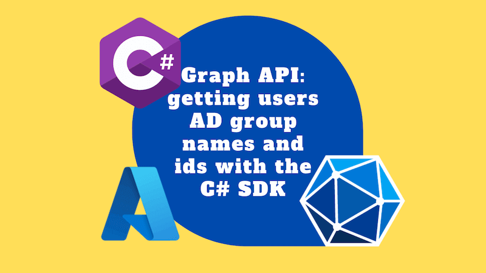
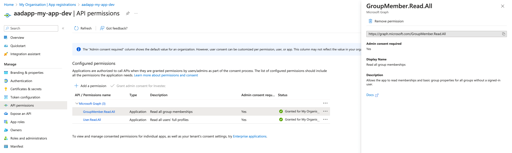
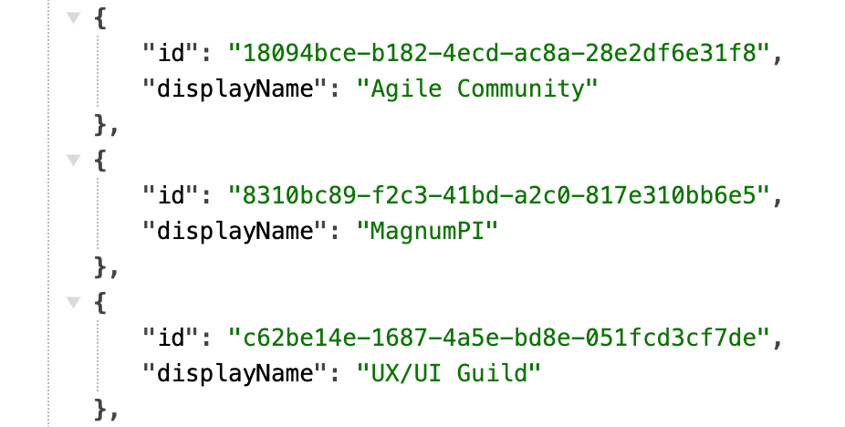

The Graph API is a great way to get information about users in Azure Active Directory. I recently needed to get the names and ids of the Active Directory groups that a user was a member of. Here's how to do it with the C# SDK.

I'm writing this post as, whilst it ends up being a relatively small amount of code and configuration required, if you don't know what that is, you can end up somewhat stuck. This should hopefully unstick you.



<!--truncate-->

## Azure AD app registration API permissions

To query the Graph API, we'll need:

- an Azure AD app registration
- a client id and client secret for that app registration
- the tenant id for the Azure AD tenant that the app registration is in
- `GroupMember.Read.All` and `User.Read.All` API application permissions

Of the above, it's the API permissions that I want to draw your attention to. Ultimately, you'll need to get your Azure AD admin to grant consent to these permissions for your app registration so you have the necessary permissions to query the Graph API:



How did I know that I needed these permissions? Great question! I found the answer in the ["directoryObject: getMemberGroups / group memberships for a user" documentation](https://learn.microsoft.com/en-us/graph/api/directoryobject-getmembergroups?view=graph-rest-1.0&tabs=http#group-memberships-for-a-user).

The Application `User.Read.All` and `GroupMember.Read.All` permissions are the least privileged permissions that allow you to query the Graph API for the information we need. If you're interested in the other permissions available, check out the [Microsoft Graph permissions reference](https://learn.microsoft.com/en-us/graph/permissions-reference).

## Querying the Graph API

Now we've configured our app registration, we can query the Graph API. I'm going to show you how to do this with the C# SDK. If you're using a different language, you'll need to find the equivalent SDK for your language.

### Install the SDK

The first thing we need to do is install the SDK. I'm using the [Microsoft.Graph](https://www.nuget.org/packages/Microsoft.Graph/) package. At the time of writing, the latest version is 5.35.0.

Once you have added it, you'll have an entry in your `.csproj` along these lines:

```xml title="MyApp.csproj"
<PackageReference Include="Microsoft.Graph" Version="5.35.0" />
```

If you're interested in the underlying project, you can find it as [`msgraph-sdk-dotnet` on GitHub](https://github.com/microsoftgraph/msgraph-sdk-dotnet).

### Create a GraphServiceClient

Next, we need to create a `GraphServiceClient`. This is the object that we'll use to query the Graph API. For that we'll need a credential which we'll construct using the `tenantId`, `clientId` and `clientSecret` that we got from our app registration:

```cs
using Azure.Identity;
using Microsoft.Graph;

// ...

// The client credentials flow requires that you request the
// /.default scope, and pre-configure your permissions on the
// app registration in Azure. An administrator must grant consent
// to those permissions beforehand.
var scopes = new[] { "https://graph.microsoft.com/.default" };

// using Azure.Identity;
var options = new ClientSecretCredentialOptions
{
    AuthorityHost = AzureAuthorityHosts.AzurePublicCloud,
};

// https://learn.microsoft.com/en-us/graph/sdks/choose-authentication-providers?tabs=csharp#using-a-client-secret
// https://learn.microsoft.com/dotnet/api/azure.identity.clientsecretcredential
var clientSecretCredential = new ClientSecretCredential(
    tenantId, clientId, clientSecret, options);

_graphClient = new GraphServiceClient(clientSecretCredential, scopes);
```

The above code is based on the ["client credentials provider / using a client secret" documentation](https://learn.microsoft.com/en-us/graph/sdks/choose-authentication-providers?tabs=csharp#using-a-client-secret). It's possible that you might want to use a different authentication provider. If so, check out the ["choose authentication providers" documentation](https://learn.microsoft.com/en-us/graph/sdks/choose-authentication-providers?tabs=csharp). Because we're querying for application permissions, we need to use the client credentials provider. We could, if we wanted to, use the client certificate approach instead. I'm not going to cover that here.

### Query the Graph API

Now we come to the fun part. We're going to query the Graph API for the groups that a user is a member of. We'll need to pass in the `usernameOrId` of the user that we're interested in. I'm using the user's email address as the `usernameOrId` in my application. You might want to use the user's id instead. It's up to you.

```cs
List<GroupIdDisplayName> groupIds = new();

Microsoft.Graph.Models.GroupCollectionResponse? response = await _graphClient.Users[usernameOrId].MemberOf.GraphGroup.GetAsync(requestConfiguration =>
{
    requestConfiguration.QueryParameters.Select = ["id", "displayName"];
    requestConfiguration.QueryParameters.Top = 100;
});

var pageIterator = PageIterator<
    Microsoft.Graph.Models.Group,
    Microsoft.Graph.Models.GroupCollectionResponse?
>.CreatePageIterator(_graphClient, response, (group) =>
{
    groupIds.Add(new GroupIdDisplayName(Id: group.Id, DisplayName: group.DisplayName));
    return true;
});

await pageIterator.IterateAsync();
```

Let's unpack the code above. It does the following:

1. Creates an empty list of `GroupIdDisplayName` objects. This is the type that I'm using to store the group ids and display names. You can use whatever type you want.
2. It indexes into the `Users` collection on the `GraphServiceClient` using the `usernameOrId` that we passed in. From there we make use of `MemberOf.GraphGroup` and call `GetAsync` on that, passing in a request configuration method. This is where we specify the `Select` and `Top` query parameters. We're using `Select` to specify only the properties that we want to return - by default lots more data would come back than we require. We're using `Top` to specify the maximum number of results that we want to return. I'm using 100 as that's the maximum that the Graph API will allow. We'll need to use a `PageIterator` to get all of the results. More on that in a moment.
3. Because we want to get all of the results, we need to use a `PageIterator`. We create one using the `CreatePageIterator` method on the `PageIterator` class. We pass in the `GraphServiceClient` that we created earlier, the `response` that we got from the `GetAsync` call and a delegate that will be called for each result. In our delegate, we add the `GroupIdDisplayName` to our list and return `true` to indicate that we want to continue iterating. If we wanted to stop iterating, we'd return `false`. Finally we call `IterateAsync` on the `PageIterator` to get all of the results.

The `PageIterator` is somewhat confusing, in my opinion. I'm used to paging through results, but this way of doing it did puzzle me. If you're interested in learning more about the `PageIterator`, check out the ["paging" documentation](https://learn.microsoft.com/en-us/graph/sdks/paging?tabs=csharp). I also found [this documentation helpful](https://github.com/microsoftgraph/msgraph-sdk-dotnet/blob/dev/docs/upgrade-to-v5.md#pageiterator).

Initially the `PageIterator` was throwing an exception when I used it. [I found the answer to that on StackOverflow](https://stackoverflow.com/questions/75860298/graphserviceclient-pageitarator-failes-with-the-parsable-does-not-contain-a-col). It turns out that the types you specify for the `PageIterator` need to be correct for the request above; and if not you may be impaced by type mismatches at runtime. The entries that are returned from the API may be wider or simply different to what you require. I've the correct types in my code now - but I mention it just in case.

## Putting it all together

Ultimately I wrote a `GroupService` that I could use to get the groups for a user. That service looks like this:

```cs title="GroupService.cs"
using Azure.Identity;
using Microsoft.Graph;

namespace ZebraGptContainerApp.Services.Implementations;

public record GroupIdDisplayName(
    string? Id,
    string? DisplayName
);

public interface IGroupService
{
    Task<List<GroupIdDisplayName>> GetGroups(string usernameOrId);
}

public class GroupService : IGroupService
{
    private readonly GraphServiceClient _graphClient;
    private readonly ILogger<GroupService> _logger;

    // new this up in program.cs
    public GroupService(ILogger<GroupService> logger, string tenantId, string clientId, string clientSecret)
    {
        _logger = logger;

        // The client credentials flow requires that you request the
        // /.default scope, and pre-configure your permissions on the
        // app registration in Azure. An administrator must grant consent
        // to those permissions beforehand.
        var scopes = new[] { "https://graph.microsoft.com/.default" };

        // using Azure.Identity;
        var options = new ClientSecretCredentialOptions
        {
            AuthorityHost = AzureAuthorityHosts.AzurePublicCloud,
        };

        // https://learn.microsoft.com/en-us/graph/sdks/choose-authentication-providers?tabs=csharp#using-a-client-secret
        // https://learn.microsoft.com/dotnet/api/azure.identity.clientsecretcredential
        var clientSecretCredential = new ClientSecretCredential(
            tenantId, clientId, clientSecret, options);

        _graphClient = new GraphServiceClient(clientSecretCredential, scopes);
    }

    public async Task<List<GroupIdDisplayName>> GetGroups(string usernameOrId)
    {
        // https://stackoverflow.com/questions/75860298/graphserviceclient-pageitarator-failes-with-the-parsable-does-not-contain-a-col
        try
        {
            List<GroupIdDisplayName> groupIds = new();

            Microsoft.Graph.Models.GroupCollectionResponse? response = await _graphClient.Users[usernameOrId].MemberOf.GraphGroup.GetAsync(requestConfiguration =>
            {
                requestConfiguration.QueryParameters.Select = ["id", "displayName"];
                requestConfiguration.QueryParameters.Top = 100;
            });

            var pageIterator = PageIterator<
                Microsoft.Graph.Models.Group,
                Microsoft.Graph.Models.GroupCollectionResponse?
            >.CreatePageIterator(_graphClient, response, (group) =>
            {
                groupIds.Add(new GroupIdDisplayName(Id: group.Id, DisplayName: group.DisplayName));
                return true;
            });

            await pageIterator.IterateAsync();

            return groupIds;
        }
        catch (Exception ex)
        {
            _logger.LogError(ex, "Problem getting groups with usernameOrId {usernameOrId}", usernameOrId);
            throw new Exception($"Problem getting groups with usernameOrId {usernameOrId}", ex);
        }
    }
}
```

It is constructed in `Program.cs`:

```cs title="Program.cs"
// ...

builder.Services.AddSingleton<IGroupService>(serviceProvider =>
    new GroupService(
        logger: serviceProvider.GetRequiredService<ILogger<GroupService>>(),
        tenantId: builder.Configuration.GetValue<string>("TenantId")!,
        clientId: builder.Configuration.GetValue<string>("ClientId")!,
        clientSecret: builder.Configuration.GetValue<string>("ClientSecret")!
    )
);

// ...
```

Then I can use it in my controller:

```cs title="GroupsController.cs"
using Microsoft.AspNetCore.Mvc;

namespace MyApp.Controllers;

[ApiController]
public class GroupsController : ControllerBase
{
    readonly IGroupService _groupService;
    readonly ILogger<MeController> _log;

    public GroupsController(IGroupService groupService, ILogger<MeController> log)
    {
        _groupService = groupService;
        _log = log;
    }

    [HttpGet("api/groups")]
    public async Task<IActionResult> GetGroups()
    {
        string? email = User?.Identity?.Name; // email in my context
        try
        {
            if (string.IsNullOrEmpty(email))
                return Unauthorized();

            var groups = await _groupService.GetGroups(email);
            return Ok(groups);
        }
        catch (Exception ex)
        {
            _log.LogError(ex, "Problem getting groups for {email}", email);
            return BadRequest($"Problem getting groups for {email}");
        }
    }
}
```

When you browse to `/api/groups`, you'll get a JSON response with the group ids and display names:



And if you're anything like me, you'll discover that you are in _way_ more groups than you thought you were.

## Conclusion

This post has demonstrated both the configuration and the code required to query the Graph API for the groups that a user is a member of. Hopefully it also provides something of a reference for acquiring different types of Graph API permissions and using the C# SDK to query the Graph API.
