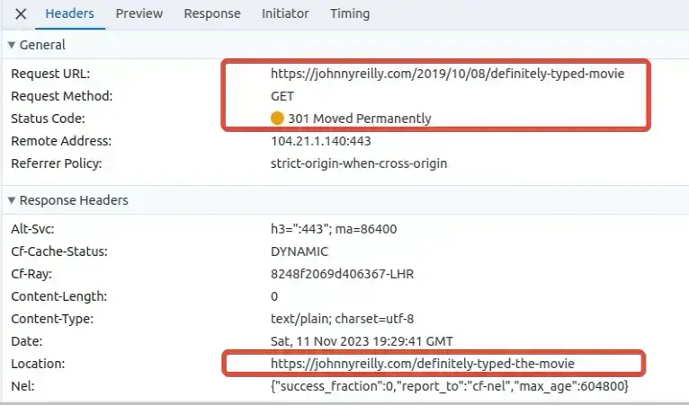

This is a follow up to my ["How I ruined my SEO"](../2023-01-15-how-i-ruined-my-seo/index.md) post. That was about how my site stopped ranking in Google's search results around October 2022. This post is about how [Growtika](https://growtika.com/) and I worked together to fix it.

As we'll see, the art of SEO (Search Engine Optimisation) is a mysterious one. We made a number of changes that we believe helped. All told, my site spent about a year out in the cold - barely surfacing in search results. But in October 2023 it started ranking again. And it's been ranking ever since.

I put that down to the assistance rendered by Growtika. What was the nature of that assistance? I'll tell you. This post is a biggie; so buckle up!


<!--truncate-->

## Growtika steps up!

I wrote ["How I ruined my SEO"](../2023-01-15-how-i-ruined-my-seo/index.md) almost as self therapy. I was frustrated that my site's traffic had dropped. I knew it didn't really matter; my motivation for writing my blog is, in large part, about creating a long term memory for myself. But I was still frustrated. I write things that I know people find useful, and so it was suboptimal that my posts were no longer being found.

I should include myself in that. When I'm trying to remember how to do something, and I know I once knew how to do it, I'll often Google it. So it was frustrating that my own site was no longer being found by me. I was missing me. Vanity, I know.

I shared the post on Hacker News, not really expecting much to happen. But it ranked, and in amongst the conversation that followed, [someone named Growtika offered to help](https://news.ycombinator.com/item?id=34389421#34390189).


I hadn't heard of [Growtika](https://growtika.com/) before; SEO is not my world. But it turned out that Growtika specialise in helping organisations with that. Out of the goodness of their hearts, they offered to assist me. Never one to look a gift horse in the mouth, I leapt at the offer.

## The mysterious SEO feedback loop

I spent some time with Growtika talking through my site. They made some suggestions around getting my site to align with best practices. They also schooled me on some of the basics of SEO. I was very much a novice in this area, and so I was grateful for the education.

Here's the thing: SEO is a mystery. Or at least, it's not fully understood. Like Coke haven't published their recipe, Google doesn't publish its (ever evolving) algorithm. They do publish [SEO guidelines](https://developers.google.com/search/docs/fundamentals/seo-starter-guide), but they are just that: guidelines. And so, whilst there are best practices, there is no guarantee that following them will result in success.

What's more, the feedback loop for changes is **long**. It's not like fixing a program with a bug, where you tweak the code, run the tests and see if it's fixed. It's more like making a change to a program, and then waiting weeks or months to see if it's fixed. And if it's not, you have to wait again to see if the next change you make fixes it.

Cause and effect are just not as obvious as you might like, when it comes to SEO. So whilst I'm going to share what we did, I can't say for sure what actually lead to the improvement in my site's SEO. I'm confident that they were all good things to do. But I cannot be certain which of them made the difference.

## Growtika's suggestions

Over the time we worked together, Growtika made a number of suggestions. Changes we might make that could improve my SEO. I'm going to go through the suggestions over the rest of the post. I'll also share some of the rationale.

### Updated profile and about page

There's a concept used by Google for ranking known as Experience, Expertise, Authoritativeness, and Trust (E-E-A-T). It's about how much Google trusts the content on your site. Growtika suggested that I update the profile on my site and the about page to demonstrate my expertise and authority on topics.

On each blog post I have a profile that looks like this:


I used to have no text next to my profile; it was just a link that said "John Reilly" which lead to my Twitter profile page. At Growtika's behest I added a title to demonstrate my expertise and authority on topics, and also I switched the link to my about page instead of Twitter.

The about page itself was also updated to include a richer bio and a list of places where my site has been featured. This was to demonstrate my expertise and authority on topics. We even snuck in some structured data - more on that later!

### Remove or `noindex` unnecessary pages

My site is built using [Docusaurus](https://docusaurus.io/). Docusaurus has a number of pages that are generated by default that duplicate content. There are "pagination" pages which allow you to navigate click by click through the whole history of a blog.

Also there are "tags" (or category) pages that reproduce blog posts under tags that have been used to categorise the posts:


In both cases, these pages duplicate content. Rather frustratingly, the pages also feature `canonical` link tags which rather suggest that they are the canonical source of the content:


Growtika spotted that some of these pagination or tags pages were being prioritised over original blog posts. They suggested that I remove or `noindex` the pagination and tags pages to provide a clear signal to search engines about which pages were the most important. I chose to `noindex` them. My site is hosted on [Azure Static Web Apps](../2023-02-01-migrating-from-github-pages-to-azure-static-web-apps/index.md) and so I was able to achieve this fairly easily by adding the following to my `staticwebapp.config.json` file:

```json title="staticwebapp.config.json"
{
  "route": "/page/*",
  "headers": {
    "X-Robots-Tag": "noindex"
  }
},
{
  "route": "/tags/*",
  "headers": {
    "X-Robots-Tag": "noindex"
  }
},
```

This meant that the pagination and tags pages (which were served up under URLs beginning `/page/` and `/tags/` respectively) were still available, but search engines were encouraged [not to index them by the `X-Robots-Tag: noindex` header](https://developers.google.com/search/docs/crawling-indexing/robots-meta-tag#xrobotstag) that these pages now served.

Growtika also encouraged me to do something of a tag rationalisation. I had a lot of tags, and many of them were not used on more than one blog post. I removed a lot of tags and also added a number of tags to blog posts that were missing them. This was to help search engines understand the content of my blog posts.

### `sitemap.xml` and `robots.txt`

Alongside `noindex`ing the pagination and tags pages, Growtika suggested that I take a look at my `sitemap.xml` - this is automatically generated by Docusaurus. They suggested that I remove the pagination and tags pages from the `sitemap.xml` as it's a little confusing to `noindex` a page and then include it in the `sitemap.xml`.

Further to that, I write posts for other websites sometimes and cross post it on my own blog, with a canonical pointing to the original post. Growtika suggested that I remove these posts from the `sitemap.xml` as they are not the canonical source of the content.

I've a number of post processing steps that run in my sites build step and I included this filtering in it. In the end it amounted to [filtering an XML file; which is pretty straightforward - I wrote about it to demonstrate](../2022-11-22-xml-read-and-write-with-node-js/index.md).

As well as filtering my `sitemap.xml`, I went a little further and added `lastmod` timestamps to the `sitemap.xml` based on the git commit date of the markdown file that the blog post was generated from. This was to help search engines understand the how recent of the content on my site is. [I wrote about how I did this](../2022-11-25-adding-lastmod-to-sitemap-git-commit-date/index.md). Google have subsequently announced that they use [`lastmod` as a signal for scheduling re-crawling URLs](https://developers.google.com/search/blog/2023/06/sitemaps-lastmod-ping#the-lastmod-element) and so this turns out to have been a helpful change to make.

Alongside this, I added a `robots.txt` to my site. These are files that search engines use to understand the structure of a site and what they should and should not index. I didn't previously have one and the one I added was pretty rudimentary:

```text title="robots.txt"
User-agent: *
Allow: /

Sitemap: https://johnnyreilly.com/sitemap.xml
```

I don't know how much this helped, but it certainly didn't hurt.

### Structured data

One of the most intriguing suggestions that Growtika made was to build on the structured data support in my site. Structured data is a way of providing metadata about a page in a machine readable format. It's a way of providing a clear signal to search engines about the content of a page; it makes their lives easier.

As it turned out, I already had some structured data support in my site; [I'd written about how to add it previously](../2021-10-15-structured-data-seo-and-react/index.md). But Growtika suggested that I add more structured data to my site. They suggested that I add:

#### 1. FAQs with Structured Data

One of the experiments we ran was to add FAQs to a post, and with that, the equivalent FAQ Structured Data. The intent being to see if this would help with the SEO for that post. So, because I'm super meta, I wrote a [post about how to do that](../2023-04-08-docusaurus-structured-data-faqs-mdx/index.md) **which included** FAQs and the equivalent structured data.

I also added FAQ structured data to another post and Growtika resubmitted it to Google for indexing. Then two things happened. Firstly, the page was indexed:


And then the page started featuring FAQs in the search results:


I've included the reactions at the bottom of each screenshot above - we were quite excited!

#### 2. Site wide structured data

Beyond adding individual structured data to each page and post, Growtika suggested that I add site wide structured data. This would proclaim from the rooftops about the nature of my site.

So I decided to add site wide structured data of the following types: (there are many types of structured data which you can read about at https://schema.org/ and in [this Google document on the topic](https://developers.google.com/search/docs/appearance/structured-data/search-gallery))

- Website
- Organisation / Brand
- Person

You can see how the structured data is implemented in [this PR](https://github.com/johnnyreilly/blog.johnnyreilly.com/pull/676). We used the [`headTags` API in Docusaurus](https://docusaurus.io/docs/api/docusaurus-config#headTags) to add site wide JSON-LD structured data. Funnily enough, [I contributed the `headTags` API to Docusaurus](https://github.com/facebook/docusaurus/pull/8151) long before I thought I'd end up using it for this!

In this change we are _heavily_ inspired by the work [Yoast have done with structured data](https://yoast.com/rich-results-schema-structured-data-story/); particularly in the sense of having a full structured data graph.

With this in place, every page that search engines index on my site will have structured data that describes the site as a whole.

#### 3. Breadcrumbs with Structured Data

Finally Growtika suggested that I add breadcrumbs to my blog posts. Breadcrumbs are a way of indicating to search engines where a page sits in the hierarchy of a site. [I wrote about how I did this](../2023-02-05-docusaurus-blogs-adding-breadcrumb-structured-data/index.md). It's worth noting that the approach outlined in that post I've subsequently simplified. Originally I added a breadcrumb for the page structure and also one per tag on the post. I've since removed the tag breadcrumbs as they were not adding much value. Less is more.

### Do backlinks better!

I mentioned in ["How I ruined my SEO"](../2023-01-15-how-i-ruined-my-seo/index.md) that I had a number of backlinks to my site. I also mentioned that I had broken a number of the backlinks by my carelessness. Growtika suggested that I fix the broken backlinks and also that I do a better job of backlinks in general.

I'd already implemented support for dynamic redirects on my site. What this meant was, if someone linked through to a non-existent page on my site, rather than having just a 404 Not Found, I could do some fairly sophisticated work to redirect them to the correct URL. Thus protecting (and unbreaking previously broken) backlinks. By the way, using Azure Static Web Apps as my hosting mechanism really helped me out here as the dynamic redirect mechanism I had was super powerful - I wasn't limited to regexes. If you want see how I did that [have a read of this](../2022-12-22-azure-static-web-apps-dynamic-redirects-azure-functions/index.md).

Growtika said what I had was good, but I could do better. They suggested that I:

- exhaustively fix all my broken backlinks; getting them all to redirect to the correct place. This meant logging broken backlinks and repairing them over time. Tedious, but worth it.
- add a redirect from my old site domain to my new one (blog.johnnyreilly.com -> johnnyreilly.com)
- redirect **only once**. I had a number of redirects that were chained together. 301 leading to 301 leading to 301 (yes!) and only then leading to a 200. Growtika suggested that I redirect only once. This was to ensure that search engines didn't have to follow a chain of redirects to get to the content they were looking for. Search engines don't like that by all accounts; you lose "link juice" the more redirects there are. Also, multi redirects make my website work harder than it needs to.

Again, less is more. With these changes made, I had a much better backlink story.

### Remove date from urls

It used to be the case that the URLs for my blog posts always featured the date of publication. This was a hangover from when I used to use Blogger as my blogging platform. I'd [migrated from Blogger to Docusaurus](../2021-03-15-definitive-guide-to-migrating-from-blogger-to-docusaurus/index.md), and I'd kept the date in the URL. It so happens that Docusaurus has a similar behaviour too.

Growtika suggested that I remove the date from the URL. This was to make the URLs shorter and more readable. Search engines also have a preference both for shorter URLs and for pages that are recent, rather than pages that are old. So removing the date from the URL would help with both of those things. Or at least it would stop search engines that looked for the date in the URL from thinking that older content was irrelevant. (And with our `lastmod` timestamps in the `sitemap.xml` we were already helping search engines understand how recent the content on my site was.)

I must admit, I didn't really want to make this change. I rather liked having the date in the URL. But, in Growtika we trust. I did it.

Where you used to go to:

https://johnnyreilly.com/2019/10/08/definitely-typed-movie

You now go to:

https://johnnyreilly.com/definitely-typed-the-movie

And of course, we made sure the redirect mechanism was in place to ensure that the old URLs still worked. You can test it if you like!



To implement this we used the [`slug feature of Docusaurus`](https://docusaurus.io/docs/api/plugins/@docusaurus/plugin-content-blog#slug). If you want to see the mega PR that implemented this on nearly 300 blog posts [it's here](https://github.com/johnnyreilly/blog.johnnyreilly.com/pull/423/files). You won't be surprised to learn I scripted this change - life's too short to do boring things by hand.

### Improving site performance

Another aspect which factors into SEO is performance. Google has a [Core Web Vitals](https://web.dev/articles/vitals) measurement which is about evaluating the performance of websites. It covers how fast a website loads, how responsive it is / how quickly it becomes interactive.

The thing that was hurting my site's performance was images. The images on my site were generally not optimised at all. They were also not lazy loaded. This meant that the images were slowing down the loading of my site, and this reflected in my [Lighthouse](https://developer.chrome.com/docs/lighthouse/overview/) scores.

I took a number of actions to improve the site image performance.

#### 1. Improved performance using TinyPNG's image optimisation API

The first, and most obvious, was to optimise the images on my site. There's many ways you can do this; I chose to use [TinyPNG's API](https://tinypng.com/developers). I wrote about [how I did this](../2023-01-22-image-optimisation-tinypng-api/index.md). Ultimately I wrote a script that optimised all the images on my site, and allowed me to run it on demand for the images of a particular post.

This shrunk the file size of images on my site served significantly, and improved the performance. Once again, less is more.

I also [added Lighthouse to my site's build step](../2022-03-20-lighthouse-meet-github-actions/index.md), so I could get some performance measurements surfaced into my pull requests. This made it easy to catch potential regressions, where I might accidentally add unoptimised images to my site.

#### 2. Improved performance using Cloudinary's on demand image transformation CDN

Having tackled the low hanging fruit of images not being optimal in the first place, I then went further. Cloudinary offer a [CDN that can transform images on demand](https://cloudinary.com/documentation/image_transformations). This means that you can serve the same image in different sizes, formats and qualities depending on the device that is requesting it. This is a great way to improve performance.

I was able to plug the Cloudinary CDN into my site using by building a the [`rehype-cloudinary-docusaurus` plugin](https://github.com/johnnyreilly/rehype-cloudinary-docusaurus) which can be used to integrate Cloudinary into Docusaurus. You can [read more about how it works here](../2022-12-26-docusaurus-image-cloudinary-rehype-plugin/index.md).

Now when my site serves an image, it serves the optimal image for the device that is requesting it. This improves the performance of my site. (And you can do this too if you're using Docusaurus!)

In fact I went a little further and scripted the patching of my [Open Graph images](../2021-12-12-open-graph-sharing-previews-guide/index.md) to make use of Cloudinary too. This meant that the images that were shared on social media were also optimised for the device that was requesting them. I don't think this helped with SEO, but I'd noticed that large and / or slow loading Open Graph images aren't always used by platforms that support the Open Graph protocol. With the Cloudinary image transformation CDN in place, this became much less of an issue.

Incidentally, Cloudinary got wind of this change and invited me onto their [DevJams live stream to talk about it](https://youtube.com/watch?v=G4WTEEwI6Qs). I was very flattered to be asked and it was a lot of fun!

#### 3. Improved performance using `fetchpriority="high"` and `loading="lazy"`

So far we'd handled the performance of images on my site by optimising them and serving them in an optimal way. But there was more we could do. We could also make sure that the images on my site were loaded in an optimal way.

We did this by adding `fetchpriority="high"` to the first image on each blog post; the "title" image if you will. This is a hint to the browser that the image is important and should be loaded as soon as possible. We also added `loading="lazy"` to all the other images on a given blog post. This is a hint to the browser that those images (the "below the fold" images) are not as important, and can be loaded later if and when they are required.

The effect of these two changes combined, is that when a browser lands on a blog post it loads the first image as soon as possible, and then it doesn't immediately load the rest images; it focuses on giving the user a usable page. The upshot of this is that the Largest Contentful Paint (LCP) is loaded as soon as possible and the browser remain more responsive. The remaining images may be loaded... Or they may not - it depends on whether people scroll down to them. This translates into improved perceived performance / user experience.

And again: less is more. [I've written about how using `fetchpriority="high"` and `loading="lazy"` was implemented in depth here](../2023-01-18-docusaurus-improve-core-web-vitals-fetchpriority/index.md).

### Internal linking / footer links

Growtika advised that it was worth taking a look at our internal linking strategy. This is about how we link to other pages on our blog from within our blog posts. The idea is that we should link to other pages on our blog that are relevant to the topic of the blog post. This helps search engines understand the structure of our blog and the relationships between the pages.

This was something that I did a little, but I didn't really think about. I'm now much more intentional around internal linking. I'm very much an editor of my content, and as I'm editing my posts / writing new posts I'll take a look at whether I'm linking to other relevant posts on my blog and whether perhaps I should be.

You'll possibly have noticed a good number of internal links in this post! I'm careful about how I do this - I have internal links where they are relevant and where I think it adds value. I don't have internal links for the sake of it. Whilst I want to improve my SEO, the main readers of my blog are humans, and I want to make sure that I'm not making the experience worse for them.

Alongside upping my internal linking game, Growtika suggested that the footer of my site was a prime place to add links to notable posts on my site, and also to provide an indication of topics that this site seeks to cover.

A picture is worth a thousand words, so here's what the footer of my site used to look like:


And here is what it looks like now:


As you can see, the difference is significant. With the new enhanced footer I can call out particular articles around themes that I cover, I can highlight popular articles, and I can also emphasise articles that I think are particularly important, or recently updated. This is both about helping search engines understand what I consider to be important in my site, it's also helpful for humans that might scroll that far down. And goshdarnit, I think it looks rather fine too!

### Add meta description to blog posts

The final suggestion we're going to cover, is that Growtika suggested adding meta descriptions to my blog posts. This is a short description of the content of the blog post that is included in the HTML of the page. It's not visible to humans, but it is visible to search engines. And it's kind of visible to humans at one remove, in that it is often used as the description of the page in search results.

I'd previously not included meta descriptions on my blog posts. But since Growtika suggested that I add them, I found myself with the daunting task of writing meta descriptions for nearly 300 blog posts. I decided to script it. I wrote a script that would generate a meta description for each blog post based on the content of the blog post, powered by Azure Open AI. I then ran the script and added the meta descriptions to my blog posts. I wrote about [how I did this here](../2023-09-25-azure-open-ai-generate-article-metadata-with-typescript/index.md).

This left me with meta descriptions for all my blog posts. It was also rather fun to use AI for something that was not GPT or copilot related!

## The results

As I mentioned earlier, my SEO has now recovered. I'm ranking again in search results. I'm not ranking as highly as I was before, but I'm ranking. I think my site is possibly still in the throes of recovery, but it's definitely trending in the right direction. Here's a graph from ahrefs showing my site's performance over the last two years:


The graph alone tells a story, a phenomenal drop off in traffic followed by a recovery. Significantly, you can see the drop off and recovery both happen around the time of a Google algorithm update. It shows the power of that algorithm over my site's traffic.

## Conclusion

This is not a post I'd expected to write. SEO used to be something I didn't think about much. But it turns out that a way to get my attention, is taking away my traffic! I'm actually rather grateful that all this happened as it got me to thinking and learning about SEO in a way that I quite enjoyed.

As I say, whilst I can't be certain which of the changes we made made the difference, I'm confident that my site now is better than my site a year ago. It loads faster, it's more performant, it's more structured, it's better linked, it's better optimised. It's better. It looks the part too. I'm really quite proud of it.

I'm also phenomenally grateful to Growtika for their help. I should say that a few others offered pointers and suggestions which I was thankful for. But it was Growtika who stuck by my side for the long haul. For nearly a year they worked with me; and for a long time saw no improvements in my sites traffic at all. They didn't give up. They were patient with me, and they were generous with their time and expertise. I'm very grateful to them for all their help.

If you're looking for help with SEO, I'd recommend you check out [Growtika](https://growtika.com/). They're fantastic folk!
