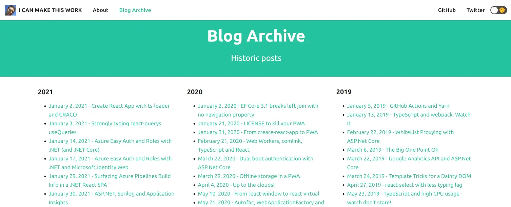
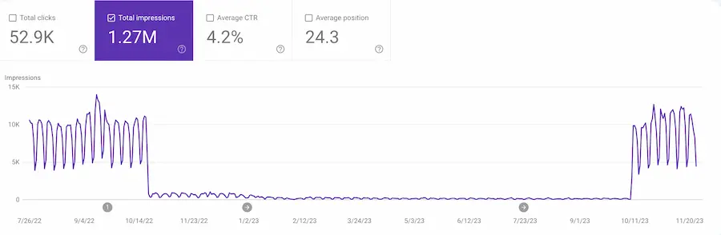

We might also call this:

## I ruined my SEO and a stranger from Hacker News help me fix it

This is a follow up to my ["How I ruined my SEO"](../2023-01-15-how-i-ruined-my-seo/index.md) post. That was about how my site stopped ranking in Google's search results around October 2022. This post is about how [Growtika](https://growtika.com/) and I worked together to fix it.

As we'll see, the art of SEO (Search Engine Optimisation) is a mysterious one. We made a number of changes that we believe helped. All told, my site spent about a year out in the cold - barely surfacing in search results. But in October 2023 it started ranking again. And it's been ranking ever since.

I put that down to the assistance rendered by Growtika. What was the nature of that assistance? I'll tell you. This post is a biggie; so buckle up!


<!--truncate-->

## Growtika steps up!

I wrote ["How I ruined my SEO"](../2023-01-15-how-i-ruined-my-seo/index.md) almost as self therapy. I was frustrated that my site's traffic had dropped. I knew it didn't really matter; my motivation for writing my blog is, in large part, about creating a long term memory for myself. But I was still frustrated. I write things that I know people find useful, and so it was suboptimal that my posts were no longer being found.

I should include myself in that. When I'm trying to remember how to do something (and I know I once knew how to do it) I'll often Google it. Hoping to see a blog post I once wrote that answers my question. But, no more. My own site was no longer being found by me. I was missing me. Vanity.

I shared the post on Hacker News, not really expecting much to happen. But it ranked, and in amongst the conversation that followed, [someone named Growtika offered to help](https://news.ycombinator.com/item?id=34389421#34390189).


I hadn't heard of Growtika before; SEO is not my world. But it turned out that Growtika specialise in helping organisations with that. Out of the goodness of their hearts, they offered to assist me. Never one to look a gift horse in the mouth, I leapt at the offer.

## The mysterious SEO feedback loop

I spent some time with Growtika talking through my site. They made some suggestions around getting my site to align with best practices. They also schooled me on some of the basics of SEO. I was very much a novice in this area, and so I was grateful for the education.

Here's the thing: SEO is a mystery. Or at least, it's not fully understood. Like Coke haven't published their recipe, Google doesn't publish its (ever evolving) algorithm. They do publish [SEO guidelines](https://developers.google.com/search/docs/fundamentals/seo-starter-guide), but they are just that: guidelines. And so, whilst there are best practices, there is no guarantee that following them will result in success.

What's more, the feedback loop for changes is **long**. It's not like fixing a program with a bug, where you tweak the code, run the tests and see if it's fixed. It's more like making a change to a program, and then waiting weeks or months to see if it's fixed. And if it's not, you have to wait again to see if the next change you make fixes it.

Cause and effect are just not as obvious as you might like, when it comes to SEO. So whilst I'm going to share what we did, I can't say for sure what actually lead to the improvement in my site's SEO. I'm confident that they were all good things to do. But I cannot be certain which of them made the difference.

As an aside, Growtika think that it's pretty absurd that developers who write high quality technical articles (and for the sake of this point, let's say mine fit into this category sometimes), need to run the gauntlet of SEO best practices to get ranked. It really shouldn't be necessary. With one of the recent Google algorithm updates; [the helpful content algorithm update](https://developers.google.com/search/docs/appearance/helpful-content-system), it feels like Google are starting to understand that it and prioritize it in their search engine. But there's still a long way to go.

## The changes we made

Over the time we worked together, Growtika made a number of suggestions. Changes we might make that could improve my SEO. I'm going to go through the suggestions over the rest of the post. I'll also share some of the rationale as I go along.

### E-E-A-T all you can!

There's a concept used by Google for ranking known as Experience, Expertise, Authoritativeness, and Trust (E-E-A-T). It's about how much Google trusts the content on your site. When evaluating an author's profile for a blog post, it's worth considering the following E-E-A-T aspects:

- **Experience**: What is the author's practical experience in the topic area?
- **Expertise**: Does the author have specialized knowledge or educational background in the subject?
- **Authoritativeness**: How is the author recognized by peers or industry experts? Are there publications or professional achievements highlighting their authority?
- **Trustworthiness**: Can the reader rely on the author for accurate and ethical information? Consider their track record and any endorsements by credible sources.

I didn't have much that addressed these points on my site.

#### 1. Author profile

On each blog post I had a profile picture. But it wasn't being all it could be; it looked like this:


It's my face and the text _"John Reilly"_ which linked through to my Twitter (now X) profile page. Nice enough but not really demonstrating my expertise and authority on topics. I updated it to look like this:


Alongside my picture and name I added a byline to demonstrate my expertise and authority on topics: _"OSS Engineer - TypeScript, Azure, React, Node.js, .NET"_. Alongside that, I switched the link to the about page on my site instead of Twitter.

#### 2. About page

Since the author profile at the top of each post didn't answer all the E-E-A-T points, enriching my about page was the way forward. I updated the [about](/about) page to include a richer bio and a list of places where my site has been featured:


This was to demonstrate my expertise and authority on topics. We even snuck in some structured data - more on that later!

### Duplicate content

My site is built using [Docusaurus](https://docusaurus.io/). Now I love Docusaurus, but it's not perfect. One of the problems with it is that it generates a number of pages that are not helpful for SEO as they **duplicate content**. (This is a bad thing for SEO.) Consider this report:


The report suggests there was a good amount of duplicate content on my site. This was because Docusaurus generates "pagination" pages which allow you to navigate click by click through the whole history of a blog.


Also Docusaurus creates "tag" (or category) pages that reproduce blog posts under tags that have been used to categorise the posts:


In both cases, these pages duplicate content - which lead to the above report. Rather frustratingly, the pages also feature `canonical` link tags which rather suggest that they are the canonical source of the content:


In my case, some of these pagination or tags pages were being prioritised over the original blog posts. This felt quite strange from a readers point of view. We took a number of steps to address this.

#### 1. Remove or `noindex` unnecessary pages

I wanted to remove or `noindex` the pagination and tags pages to provide a clear signal to search engines about which pages were the most important. I couldn't remove the pages without breaking the navigation on my site, so I chose instead to `noindex` them. My site is hosted on [Azure Static Web Apps](../2023-02-01-migrating-from-github-pages-to-azure-static-web-apps/index.md) and so I was able to achieve this fairly easily by adding the following to my [`staticwebapp.config.json`](https://learn.microsoft.com/en-us/azure/static-web-apps/configuration) file:

```json title="staticwebapp.config.json"
{
  "route": "/page/*",
  "headers": {
    "X-Robots-Tag": "noindex"
  }
},
{
  "route": "/tags/*",
  "headers": {
    "X-Robots-Tag": "noindex"
  }
},
```

This meant that the pagination and tags pages (which were served up under URLs beginning `/page/` and `/tags/` respectively) were still available, but search engines were encouraged [not to index them by the `X-Robots-Tag: noindex` header](https://developers.google.com/search/docs/crawling-indexing/robots-meta-tag#xrobotstag) that these pages now served.

I might see if I could land a change like this in Docusaurus itself. I think it would be helpful for others. The mechanism would need to be slightly different, as Docusaurus doesn't have control over headers your site serves. But I think it would be possible to add a `noindex` meta tag to the pagination and tags pages HTML as is [suggested here](https://developers.google.com/search/docs/crawling-indexing/block-indexing#implementing-noindex):

```html
<meta name="robots" content="noindex" />
```

#### 2. Docusaurus truncate

As I've mentioned, we have pagination and tags pages that duplicate content. It's possible to make this slightly better by truncating the content on the pagination and tags pages. It amounts to adding a `truncate` marker early into the content of each blog post.

With this in place, the pagination and tags pages don't duplicate the content of the blog posts in full, but instead just feature a snippet of the content. There's documentation on how to do this in [Docusaurus here](https://docusaurus.io/docs/blog#blog-list).

I did this for every page on my blog. Given I have quite a lot of posts, doing it manually would have been tedious. So I scripted the insertion of a truncate marker after the first paragraph of each post, and it was done in a jiffy.

### Tags review

I also performed something of a tag rationalisation. I had a lot of tags, and many of them were not used on more than one blog post. Also, many of them were not the greatest of tags, as this slightly embarrassing screenshot demonstrates:


As is probably apparent, I'd not really thought about tags much. I'd just added them as I'd written blog posts. I'd tagged first, asked questions later. I removed a lot of the (rather pointless) tags I had and also added a tags to blog posts that were missing them. This removed the "noise", so search engines understand the content of my blog posts, and readers also. Less is more.


Much better!

### `sitemap.xml` and `robots.txt`

Alongside `noindex`ing the pagination and tags pages, we took a look at my `sitemap.xml` - this is automatically generated by Docusaurus. I removed the pagination and tags pages from the `sitemap.xml` as it's a little confusing to `noindex` a page and then include it in the `sitemap.xml`.

Further to that, I write posts for other websites sometimes and cross post it on my own blog, with a canonical pointing to the original post. Having these posts in the `sitemap.xml` wasn't quite right as they are not the canonical source of the content. I removed them.

I've a number of post processing steps that run in my build step of my site, and I included this filtering in it. In the end it amounted to [filtering an XML file; which is pretty straightforward - I wrote about it to demonstrate](../2022-11-22-xml-read-and-write-with-node-js/index.md).

As well as filtering my `sitemap.xml`, I went a little further and added `lastmod` timestamps to the `sitemap.xml` based on the git commit date of the markdown file that the blog post was generated from. This was to help search engines understand how recent the content on my site is. [I wrote about how I did this](../2022-11-25-adding-lastmod-to-sitemap-git-commit-date/index.md). Google have subsequently announced that they use [`lastmod` as a signal for scheduling re-crawling URLs](https://developers.google.com/search/blog/2023/06/sitemaps-lastmod-ping#the-lastmod-element) and so this turns out to have been a helpful change to make.

Alongside this, I added a `robots.txt` to my site. These are files that search engines use to understand the structure of a site and what they should and should not index. I didn't previously have one and the one I added was pretty rudimentary:

```text title="robots.txt"
User-agent: *
Allow: /

Sitemap: https://johnnyreilly.com/sitemap.xml
```

I don't know how much this helped, but it certainly didn't hurt.

### Internal linking / footer links

We next looked at our internal linking strategy. This is about how we link to other pages on our blog from within our blog posts. The idea is that we should link to other pages on our blog that are relevant to the topic of the blog post. This helps search engines understand the structure of our blog and the relationships between the pages.

This was something that I did a little, but I didn't really think about. I'm now much more intentional around internal linking. I'm very much an editor of my content, and as I'm editing my posts / writing new posts I'll take a look at whether I'm linking to other relevant posts on my blog and whether perhaps I should be.

You'll possibly have noticed a good number of internal links in this post! I'm careful about how I do this - I have internal links where they are relevant and where I think it adds value. I don't have internal links for the sake of it. Whilst I want to improve my SEO, the main readers of my blog are humans, and I want to make sure that I'm not making the experience worse for them.

Alongside upping my internal linking game, Growtika suggested that the footer of my site was a prime place to add links to notable posts on my site, and also to provide an indication of topics that this site seeks to cover.

A picture is worth a thousand words, so here's what the footer of my site used to look like:


And here is what it looks like now:


As you can see, the difference is significant. With the new enhanced footer I can call out particular articles around themes that I cover, I can highlight popular articles, and I can also emphasise articles that I think are particularly important, or recently updated. This is both about helping search engines understand what I consider to be important in my site, it's also helpful for humans that might scroll that far down. And goshdarnit, I think it looks rather fine too!

### Pages crawl depth

You likely know that a primary way that search engines find content on your site is by following links. They have [crawlers](https://developers.google.com/search/docs/crawling-indexing/overview-google-crawlers) that do this. The more links that a crawler has to follow to get to a page, the more difficult it is for the crawler to find that page. This is known as the pages crawl depth.

My initial site structure was not great. I had a number of pages that were 4+ clicks away from the home page:


A primary reason for my pages crawl depth this was the pagination and tags pages I mentioned earlier. We originally displayed a single full length (not truncated) blog post per page, and so the pagination pages were many. Likewise, we had a lot of tags, and so the tags pages were many. This meant that the pages crawl depth was high. You want to keep the pages crawl depth as low as possible. Less is more.

We increased the number of blog posts displayed per page from **1** to **20** which dramatically reduced the amount of work the crawlers had to do. So instead of having few hundred pagination pages we reduced it to 16. Much better.

### Remove date from urls

It used to be the case that the URLs for my blog posts always featured the date of publication. This was a hangover from when I used to use Blogger as my blogging platform. I'd [migrated from Blogger to Docusaurus](../2021-03-15-definitive-guide-to-migrating-from-blogger-to-docusaurus/index.md), and I'd kept the date in the URL. It so happens that Docusaurus has a similar behaviour too.

Growtika suggested that I remove the date from the URL. This was to make the URLs shorter and more readable. Search engines also have a preference both for shorter URLs and for pages that are recent, rather than pages that are old. So removing the date from the URL would help with both of those things. Or at least it would stop search engines that looked for the date in the URL from thinking that older content was irrelevant. (And with our `lastmod` timestamps in the `sitemap.xml` we were already helping search engines understand how recent the content on my site was.)

I must admit, I didn't really want to make this change. I rather liked having the date in the URL. But, in Growtika we trust. I did it.

Where you used to go to:

https://johnnyreilly.com/2019/10/08/definitely-typed-movie

You now go to:

https://johnnyreilly.com/definitely-typed-the-movie

And of course, we made sure a redirect mechanism was in place to ensure that the old URLs still worked. More on that later - you can test the redirect if you like!


To implement this we used the [slug feature of Docusaurus](https://docusaurus.io/docs/api/plugins/@docusaurus/plugin-content-blog#slug). If you want to see the mega PR that implemented this on nearly 300 blog posts [it's here](https://github.com/johnnyreilly/blog.johnnyreilly.com/pull/423/files). You won't be surprised to learn I scripted this change - life's too short to do boring things by hand.

### Blog archive renamed to blog

As I've said, Docusaurus is _great_ but it historically has had some defaults that hurt SEO from a blogging perspective. One of these I identified when I was first planning to migrate from Blogger to Docusaurus. Docusaurus didn't ship with a blog archive. This is a page that allows you to browse through your historic blog posts. A place where you can see all that you've written and when. I find this very helpful. It's also helpful for search engines to understand the structure of your site.

I hand-rolled [my own blog archive for Docusaurus](../2021-05-01-blog-archive-for-docusaurus/index.md) before I migrated. It looked like this:



My implementation was later made part of Docusaurus itself by [Gabriel Csapo](https://github.com/gabrielcsapo) in [this PR](https://github.com/facebook/docusaurus/pull/5428). So now by default, all Docusaurus sites have a blog archive that lives at `/archive` in the blog. This is great news for Docusaurus users!

In one if the more speculative changes we made, we changed the URL of the blog archive from `/archive` to `/blog` (and the associated navbar label).
It was a wild guess (and it may not have made any difference) but the thinking was that it might affect the CTA (call to action) of people who see my site on Google. If they saw old date in the URL and "archive" in the breadcrumbs, maybe they'd think the site is "not relevant for the search I have now"?

So our tweaked blog archive page now looked like this:


We also added a `301` redirect from `/archive` to `/blog` to ensure that any links to the old URL would still work.

### Structured data

One of the most intriguing strategies we followed was to build on the structured data support in my site. Structured data is a way of providing metadata about a page in a machine readable format. It's a way of providing a clear signal to search engines about the content of a page; it makes their lives easier.

As it turned out, I already had some structured data support in my site; [I'd written about how to add it previously](../2021-10-15-structured-data-seo-and-react/index.md). But we were to go further!

#### 1. FAQs with Structured Data

One of the experiments we ran was to add FAQs to a post, and with that, the equivalent FAQ Structured Data. The intent being to see if this would help with the SEO for that post. So, because I'm super meta, I wrote a [post about how to do that](../2023-04-08-docusaurus-structured-data-faqs-mdx/index.md) which included FAQs and the equivalent structured data.

I also added FAQ structured data to another post and Growtika resubmitted it to Google for indexing. Then two things happened. Firstly, the page was indexed:


And then the page started featuring FAQs in the search results:


I've included the reactions at the bottom of each screenshot above - we were quite excited!

#### 2. Site wide structured data

Beyond adding individual structured data to each page and post, I added site wide structured data. This would proclaim from the rooftops about the nature of my site.

So I decided to add site wide structured data of the following types: (there are many types of structured data which you can read about at https://schema.org/ and in [this Google document on the topic](https://developers.google.com/search/docs/appearance/structured-data/search-gallery))

- Website
- Organisation / Brand
- Person

You can see how the structured data is implemented in [this PR](https://github.com/johnnyreilly/blog.johnnyreilly.com/pull/676). We used the [`headTags` API in Docusaurus](https://docusaurus.io/docs/api/docusaurus-config#headTags) to add site wide JSON-LD structured data. Funnily enough, [I contributed the `headTags` API to Docusaurus](https://github.com/facebook/docusaurus/pull/8151) long before I thought I'd end up using it for this!

In this change we are _heavily_ inspired by the full structured data graph work [Yoast have done](https://yoast.com/rich-results-schema-structured-data-story/). With site wide structured data in place, every page that search engines index on my site will have structured data that describes the site as a whole.

#### 3. Breadcrumbs with Structured Data

Finally I added breadcrumbs to my blog posts. Breadcrumbs are a way of indicating to search engines where a page sits in the hierarchy of a site. [I wrote about how I did this](../2023-02-05-docusaurus-blogs-adding-breadcrumb-structured-data/index.md). It's worth noting that the approach outlined in that post I've subsequently simplified. Originally I added a breadcrumb for the page structure and also one per tag on the post. I've since removed the tag breadcrumbs as they were not adding much value. Less is more.

### Do backlinks better!

I mentioned in ["How I ruined my SEO"](../2023-01-15-how-i-ruined-my-seo/index.md) that I had a number of backlinks to my site. I also mentioned that I had broken a number of the backlinks by my carelessness. I planned to fix the broken backlinks and also do a better job of backlinks in general.

I'd already implemented support for dynamic redirects on my site. What this meant was, if someone linked through to a non-existent page on my site, rather than having just a 404 Not Found, I could do some fairly sophisticated work to redirect them to the correct URL. Thus protecting (and unbreaking previously broken) backlinks. By the way, using Azure Static Web Apps as my hosting mechanism really helped me out here as the dynamic redirect mechanism I had was super powerful - I wasn't limited to regexes. If you want see how I did that [have a read of this](../2022-12-22-azure-static-web-apps-dynamic-redirects-azure-functions/index.md).

What I had was good, but I could do better. I did the following:

- exhaustively fix all my broken backlinks; getting them all to redirect to the correct place. This meant logging broken backlinks and repairing them over time. Tedious, but worth it.
- add a redirect from my old site domain to my new one (blog.johnnyreilly.com -> johnnyreilly.com)
- redirect **only once**. I had a number of redirects that were chained together. I had a 301 leading to 301 leading to 301 (yes!) and only then leading to a 200. Redirecting only once would be better. This would ensure that search engines didn't have to follow a chain of redirects to get to the content they were looking for. Search engines don't like that; you lose "link juice" the more redirects there are. Also, multi redirects make my website work harder than it needs to.

Again, less is more. With these changes made, I had a much better backlink story.

### Improving site performance

Another aspect which factors into SEO is performance. Google has a [Core Web Vitals](https://web.dev/articles/vitals) measurement which is about evaluating the performance of websites. It covers how fast a website loads, how responsive it is / how quickly it becomes interactive.

The thing that was hurting my site's performance was images. The images on my site were generally not optimised at all. They were also not lazy loaded. This meant that the images were slowing down the loading of my site, and this reflected in my [Lighthouse](https://developer.chrome.com/docs/lighthouse/overview/) scores.

I took a number of actions to improve the site image performance.

#### 1. Improved performance using TinyPNG's image optimisation API

The first, and most obvious, was to optimise the images on my site. There's many ways you can do this; I chose to use [TinyPNG's API](https://tinypng.com/developers). I wrote about [how I did this](../2023-01-22-image-optimisation-tinypng-api/index.md). Ultimately I wrote a script that optimised all the images on my site, and allowed me to run it on demand for the images of a particular post.

This shrunk the file size of images on my site served significantly, and improved the performance. Once again, less is more.

I also [added Lighthouse to my site's build step](../2022-03-20-lighthouse-meet-github-actions/index.md), so I could get some performance measurements surfaced into my pull requests. This made it easy to catch potential regressions, where I might accidentally add unoptimised images to my site.

#### 2. Improved performance using Cloudinary's on demand image transformation CDN

Having tackled the low hanging fruit of images not being optimal in the first place, I then went further. Cloudinary offer a [CDN that can transform images on demand](https://cloudinary.com/documentation/image_transformations). This means that you can serve the same image in different sizes, formats and qualities depending on the device that is requesting it. This is a great way to improve performance.

I was able to plug the Cloudinary CDN into my site using by building a the [`rehype-cloudinary-docusaurus` plugin](https://github.com/johnnyreilly/rehype-cloudinary-docusaurus) which can be used to integrate Cloudinary into Docusaurus. You can [read more about how it works here](../2022-12-26-docusaurus-image-cloudinary-rehype-plugin/index.md).

Now when my site serves an image, it serves the optimal image for the device that is requesting it. This improves the performance of my site. (And you can do this too if you're using Docusaurus!)

In fact I went a little further and scripted the patching of my [Open Graph images](../2021-12-12-open-graph-sharing-previews-guide/index.md) to make use of Cloudinary too. This meant that the images that were shared on social media were also optimised for the device that was requesting them. I don't think this helped with SEO, but I'd noticed that large and / or slow loading Open Graph images aren't always used by platforms that support the Open Graph protocol. With the Cloudinary image transformation CDN in place, this became much less of an issue.

Incidentally, Cloudinary got wind of this change and invited me onto their [DevJams live stream to talk about it](https://youtube.com/watch?v=G4WTEEwI6Qs). I was very flattered to be asked and it was a lot of fun!

#### 3. Improved performance using `fetchpriority="high"` and `loading="lazy"`

So far we'd handled the performance of images on my site by optimising them and serving them in an optimal way. But there was more we could do. We could also make sure that the images on my site were loaded in an optimal way.

We did this by adding `fetchpriority="high"` to the first image on each blog post; the "title" image if you will. This is a hint to the browser that the image is important and should be loaded as soon as possible. We also added `loading="lazy"` to all the other images on a given blog post. This is a hint to the browser that those images (the "below the fold" images) are not as important, and can be loaded later if and when they are required.

The effect of these two changes combined, is that when a browser lands on a blog post it loads the first image as soon as possible, and then it doesn't immediately load the rest images; it focuses on giving the user a usable page. The upshot of this is that the Largest Contentful Paint (LCP) is loaded as soon as possible and the browser remains more responsive. The remaining images may be loaded... Or they may not - it depends on whether people scroll down to them. This translates into improved perceived performance / user experience.

And again: less is more. [I've written about how using `fetchpriority="high"` and `loading="lazy"` was implemented in depth here](../2023-01-18-docusaurus-improve-core-web-vitals-fetchpriority/index.md).

### Be careful publishing your content on other sites

One of the ideas I'd had as I attempted to fix my SEO was to publish my content on other sites. I'd seen other people do this, and I thought it might be a good idea. So I set up a mechanism that published my blog posts to [dev.to](https://dev.to/johnnyreilly) with the canonical pointing back to my site. I was so pleased with my idea I even wrote about [how I did it](../2022-12-11-publishing-docusaurus-to-devto-with-devto-api/index.md).

Publishing content on other sites isn't inherently negative. However, in my case, it created confusion. I'd hoped that publishing my content on dev.to would help my SEO. It didn't. My content on dev.to ranked higher than the original content on my own website (most times my site didn't rank at all).

Growtika were keen to "cancel the noise", which would improve their understanding of my ranking situation. Since dev.to was ranking instead of my site, it was difficult to analyze how long it took for articles to rank on my site. Stopping the submission of content to external sites would help clarify the situation.

I turned the mechanism off. This helped them determine the time it took for my site to achieve a ranking.

### Get your site featured in relevant places

Whilst actually publishing your content on other sites with a canonical turns out not to be the best idea, getting your site featured in relevant places is a good idea. This is about getting your site linked to from other sites. This is a signal to search engines that your site is relevant and important.

I already had a number of links to my site from other sites. For instance, I'd regularly show up in [Azure Weekly](https://azureweekly.info/), [The Morning Brew](https://blog.cwa.me.uk/) and a number of other sites. Many of these use my RSS feed.

I also submitted my site to a number of other places. For instance, I submitted my site to [daily.dev](https://daily.dev/). A good rule of thumb here for picking places tended to be "where do you go to read about the topics you write about?". But crucially I didn't place my content on others sites, I just linked to my site from other sites.

As a side note, I rather wish that RSS still thrived. I support it - people still use it to read my blog. But it's not as popular as it once was.

### Add meta description to blog posts

The final tweak we're going to cover, is adding meta descriptions to my posts. This is a short description of the content of the blog post that is included in the HTML of the page:

```html
<meta
  name="description"
  content="In October 2022 traffic to my site tanked. Growtika collaborated with me to fix it. This is what we did. Read it if you're trying to improve your SEO."
/>
```

It's not visible to humans, but it is visible to search engines. And it's kind of visible to humans at one remove, in that it is often used as the description of the page in search results.

We followed these meta description guidelines:

- Keep it between 150-155 characters
- Use an active voice and make it actionable / include a call to action
- Use a focused keyphrase
- Make sure it matches the content of the page
- Make it unique.

I'd previously not included meta descriptions on my blog posts. I found myself with the daunting task of writing meta descriptions for nearly 300 blog posts. I decided to script it. I wrote a script that would generate a meta description for each blog post based on the content of the blog post, powered by Azure Open AI. I then ran the script and added the meta descriptions to my blog posts. I wrote about [how I did this here](../2023-09-25-azure-open-ai-generate-article-metadata-with-typescript/index.md).

This left me with meta descriptions for all my blog posts. It was also rather fun to use AI for something that was not GPT or copilot related!

## Drop off and recovery in numbers and graphs

As I mentioned earlier, my SEO has now recovered. I'm ranking again in search results. I'm not ranking quite as highly as I was before; I think my site is possibly still in the throes of recovery. But without a doubt, it's definitely trending in the right direction. I want to show you some graphs and numbers to demonstrate this.

### Ahrefs

Here's a graph from Ahrefs showing my site's performance over the last two years:


Notably, you can see the drop off happened around the time of a Google algorithm update. Likewise, it's really important to highlight that the traffic **increased** around the time Google made _another_ algorithm update. It's impossible to know if the traffic would still have gone up if we had not made our changes. Perhaps it would, maybe to a lesser extent. We just don't know. It does demonstrate the power of Google's algorithm updates though. The graph alone tells a story, a phenomenal drop off in traffic followed by a recovery.

### Google Search Console

A couple of simpler graphs from Google Search Console tell a similar story. Here's a graph showing my site's performance over time:



Observe the massive drop off in October 2022. And then the recovery in October / November 2023. It's a similar story to the ahrefs graph above. Further to that, here is the traffic for 28 days in February 2023 vs 28 days in October / November 2023:


If you're reading on a mobile device you may not even realise that there are two lines on the graph; the February 2023 line is so low and flat as to be almost invisible.

The difference is stark. I couldn't get arrested from a search perspective in February 2023; showing up a mere **5,000** times in search results. That sounds like a big number, but in search terms it's really not. But by October / November 2023 I was back in the game, showing up **274,000** times in search results. That's a **55x** increase!

An interesting aside, that I've excluded from the graph, is that my total clicks increased from **1,160** to **5,470** when comparing Februray to October / November. This is a mere factor of **4**. What does that mean? It means when my site was showing up very rarely in search results, it enjoyed a very healthy click through rate. People clicked on my search results when they saw them!

### Bing webmaster tools

This post has mostly been driven by discussing how Google stopped ranking my site in their search results. What I haven't really mentioned is that other search engines **did not** stop ranking my site. I was still showing up in Bing and DuckDuckGo's search results. Here's a graph from Bing webmaster tools (Bing's equivalent to Google Search Console) showing my site's performance over the last six months:


There's two things to take from the above graph:

1. My site consistently ranked (and ranks) in Bing search results. There was no drop off in Bing as there was in Google.
2. The numbers from Bing are much lower than the numbers from Google. So whilst I was still ranking in Bing, it wasn't making up for the loss of traffic from Google. This is probably a reflection of the fact that Google is the dominant search engine.

### Google Analytics

You might be curious as to what the actual impact of that is on my sites traffic. It's fairly significant; around 80% of my sites traffic comes from search engines. So when my Google SEO tanked, my traffic was significantly (but not terminally) impacted. Consider the graph below from Google Analytics:


It covers a similar time frame to the Google Search Console and ahrefs graphs above. It shows that now, on a weekday (weekends are quieter) I get around **350** unique visitors to my site. Whereas for the comparison period it was more like **100** unique users per day. That's roughly a **3.5x%** increase in traffic; which is not to be sniffed at.

## Conclusion

This is not a post I'd expected to write. SEO used to be something I didn't think about much. But it turns out that a way to get my attention, is taking away my traffic! I'm actually rather grateful that all this happened as it got me to thinking and learning about SEO in a way that I quite enjoyed.

As I say, whilst I can't be certain which of the changes we made made the difference, I'm confident that my site now is better than my site a year ago. It loads faster, it's more performant, it's more structured, it's better linked, it's better optimised. It's better. It looks the part too. I'm really quite proud of it.

I'm also phenomenally grateful to Growtika for their help. I should say that a few others offered pointers and suggestions which I was thankful for. But it was Growtika who stuck by my side for the long haul. For nearly a year they worked with me; and for a long time saw no improvements in my sites traffic at all. They didn't give up. They were patient with me, and they were generous with their time and expertise. I'm very grateful to them for all their help.

If you're looking for help with SEO, I'd recommend you check out [Growtika](https://growtika.com/). They're fantastic folk!
