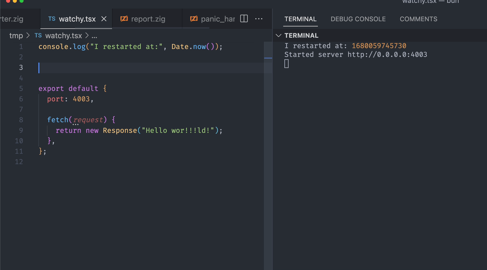

Like Node.js and Deno, Bun is a JavaScript runtime that provides a faster development experience while you’re building frontend applications. It’s gaining ground as a competitor to these widely used runtime environments — and for good reason.

In this evaluation guide, we’ll explore the features that make Bun an excellent choice for developing fast, performant, error-free frontend apps. By the end of this article, you’ll have a clear understanding of when and why you should use Bun in your projects.

<!--truncate-->

## What is Bun?

Bun was created by Jarred Sumner with the intention that, if you currently use Node.js, you should easily be able to swap it out and replace it with Bun instead.

In other words, you should be able to quickly take advantage of Bun’s awesome features without having to deal with a steep learning curve. Generally, you can use the same frameworks, libraries, and conventions you’re used to, often without issue. Keep in mind there may be exceptions to this.

The Bun team released v1.0 on 8 September 2023. However, Bun was already widely known and used long before that. Jarred Sumner even [appeared on PodRocket](https://open.spotify.com/episode/512NHtxknFNeipHSZHIRXP) on 5 August 2022 to discuss Bun, more than a year before the release of v1.0.

Part of the reason for Bun’s rise in popularity even before its stable release is its speed and ease of use.

While Node.js and Deno both use V8 — the Chrome JavaScript engine — Bun uses Apple’s JavaScriptCore. This choice of JavaScript engine supports the [Bun team’s self-described goal](https://bun.sh/blog/bun-v1.0) of “eliminating slowness and complexity without throwing away everything that's great about JavaScript.”

Additionally, Bun is written using Zig, a systems programming language that allows you to write extremely performant software — exactly what Bun intends to enable you to do. Interestingly, while Bun has now hit 1.0, Zig, which has been around longer, has not!

In contrast, Node.js is written in C++, and Deno is written in Rust. Zig makes it possible to write code that is both fast and safe, contributing to Bun’s speed and performance.

## Why use Bun?

JavaScript is a great language, and the npm ecosystem is vast. These combined have powered large numbers of systems and development experiences for years. Given that this is the case, why would you want to use Bun in particular? What are the benefits that make it such a great choice?

If I were to explain why I've been using Bun, it's because it is like using Node.js, but simply a better version of it. Bun is the Node.js I want to use. Let's go through some of the reasons why:

- **Performance/speed:** Bun is fast. Really fast. That speed really makes a difference in terms of your efficiency when developing software
- **TypeScript support:** Bun has great TypeScript support. It's easy to use TypeScript with Bun. You don't need to do anything special to get it to work — it just works
- **Ease of use / DX:** Bun is a joy to use. Because it targets Node.js compatibility, there isn't much to learn if you were using Node.js before; you just use Bun
- **Community & ecosystem:** If you reach out to the Bun community with an issue, you're likely to get a response very quickly — it has a great community and ecosystem, including a very responsive and helpful core team
- **Documentation:** The documentation for Bun is excellent. It's clear, concise, and easy to follow. It's also very comprehensive. If you're looking for something, you'll likely find it in the docs

Bun also provides a built-in bundler, although it’s still in beta and may not be widely used. However, it’s fast, works as a bundler should, and was created by the Bun team, so it's likely to be supported on an ongoing basis.

Keep in mind that — like any tool — Bun isn’t perfect. Let’s take a look at some things you should keep in mind before or while using Bun.

### Considerations while using Bun

Whilst Bun is a fantastic tool with tremendous goals, it’s worth thinking about some of the friction and imperfections around Bun:

- **Limited continuous integration implementations:** If you want to use Bun in GitHub Actions, an integration exists right now. This will download the desired version of Bun to the running machine, install it, and allow you to use Bun in the context of GitHub Actions. However, a similar standard mechanism for downloading and installing Bun may not yet exist if we want to use a different CI technology, like Azure Pipelines
- **Binary `bun.lockb` lock file:** One of Bun’s more unusual aspects is the lock file it employs. Lock files are well established in the Node.js ecosystem, allowing deterministic installs of packages — like `yarn.lock` for Yarn or `package-lock.json` for npm. Bun has trodden a slightly different path with a binary lock file, `bun.lockb`. Using a binary lock file reduces the file size and improves efficiency in areas like parsing, processing, and version control. However, it also makes [working out the difference between an old and a new lock file quite involved](https://bun.sh/docs/install/lockfile). There’s some friction here both in terms of seeing the diff as well as plugging into third-party tools that manage dependency upgrades
- **Not everything works:** While many workflows work just as you would hope, some don’t. For instance, if you want to build a Docusaurus website, [right now you can’t](https://github.com/oven-sh/bun/issues/3426). This is a reflection of how young Bun is at present; as time passes, more and more workflows will be supported. But depending upon the nature of the work you do, you may want to hold off a little while, until more use cases are unblocked

It’s worth noting that these are not particularly significant hindrances, and many are not necessarily long-term issues either. As time passes, they’ll likely become even less problematic. However, as of now, they are worth taking into account before you go all-in on Bun.

## Key Bun features to know

We’ve touched on why Bun was created and looked at some high-level reasons why you should consider using it. Now, it’s time to dive deeper into what exactly Bun offers. Let's take a look at some of its features.

### Node.js compatibility and npm support​

The aim is that Bun will entirely support Node.js APIs. Consequently, the majority of npm packages — which were originally written for the browser and for Node.js — should just work with Bun.

Bun also includes a package manager, `bun install`, which is compatible with npm as well as faster than npm, Yarn, and pnpm by some margin! You can use `bun install` to install packages from npm or from a Bun registry.

Notably, you still use `package.json` to manage your dependencies in Bun. This makes migrating from Node.js to Bun very easy and reduces the learning curve. If you just want to dip your feet in the water of Bun, you could just use it for installs and speed up your GitHub Actions!

### Speed!

​
Bun extends the JavaScriptCore engine — the engine that hails from the Safari browser — but with incredible performance, thanks to its Zig implementation. It's fast. Really fast. It's not only way faster than Node.js but also faster than Deno in most benchmarks.

You'll hear about speed in almost everything that Bun does. Speed is a feature. Bun runs fast. Bun starts fast. Bun installs fast. Bun hot reloads fast. Bun bundles fast. Bun runs tests fast. Bun is fast.

You’re likely now tired of reading the word “fast” — but hopefully, you get the point!

### TypeScript, TSX, and JSX support​

If you use `.ts` and `.tsx` files, Bun can make your life much easier. It can execute these files in the same way Node.js can execute JavaScript. No need to set up a build step or add ts-node — it just works.

One exciting aspect of this feature is that you can write TypeScript directly and execute it in a Node.js style. If you had been relying upon a build step or on JSDoc for strong typing in JavaScript, now you can just use TypeScript!

Similarly, when it comes to React, Bun transpiles it into JavaScript internally — you don’t have to worry about it.

### Hot reloading and watch mode​

Bun has great support for watch mode and hot reloading. These features help you automatically monitor your source files for changes and then update your running application accordingly.

You’re likely used to hot reloading taking some time; it’s usually not instant. But with Bun, it pretty much is. How, you ask? I’ll paraphrase the docs:

Detects changes to files using OS native filesystem watcher APIs
Can scale to larger projects thanks to optimization techniques like setting a higher limit for file descriptors, statically allocating file path buffers, reusing file descriptors whenever possible, and more

In the Bun docs, you can also find a demonstration from the Bun team showing the performance of watch mode:

That is fast.

### Solves pain points of ES modules and CommonJS​

As part of the JavaScript world, you’re likely very aware that the long-standing but nonstandard CommonJS modules are starting to be displaced by standard ES modules.

TypeScript enforces its own set of rules around import extensions that aren't compatible with ESM. Different build tools support path re-mapping via disparate, non-compatible mechanisms. Node.js, for instance, has many “gotchas” around ESM resolution, making it difficult to use in practice.

Bun aims to provide a consistent and predictable module resolution system that just works. It does this very well indeed. Code that Node.js might struggle with, Bun handles with ease.

This is a great example of Bun taking the pain out of using JavaScript. It’s a great example of how Bun saves time and increases happiness.

### Support for web standard APIs​

Some web APIs aren't relevant in the context of a server-first runtime like Bun — for instance, the DOM API or History API. But many APIs are, and Bun embraces them. It doesn't reinvent the wheel; it leans into the ecosystem.

A great example is the Fetch API, an API that has been around for a long time in the browser but is relatively new to Node.js. Bun supports Fetch out of the box, along with providing partial or complete support for many other Web APIs.

### Testing​

Another built-in Bun feature is its ultra-fast test runner, which is compatible with the Jest testing framework. The Bun runtime itself executes the tests, contributing to a smooth DX and optimal performance.

Bun’s testing capabilities support features like the following:

- **TypeScript support:** Write strongly typed tests in TypeScript without needing to transpile your code. This out-of-the-box support can also help you catch type-related errors early. No more adding ts-jest and ts-node into your project to get to the same goal!
- **JSX support:** Test your UI components as you build them — no additional configuration needed
- **Lifecycle hooks:** Set up conditions before tests run, then clean up after them, making your tests more reliable and easier to maintain
- **Snapshot testing:** Snapshot tests are a fantastic way to cut down on the code you have to write for a test and get good coverage of the behavior of portions of your application. If you loved this testing feature with Yarn, Bun provides it too!
- **UI & DOM testing:** If you want to test your DOM without the need for a browser, Bun has you covered
- **Watch mode with `--watch`:** You may prefer to have your tests running in the background and getting that feedback as files are updated. Bun tests give you just what you need with the speed you’ve likely come to expect

These comprehensive testing features are a compelling alternative to what’s out there already. But perhaps more significantly, if you have tests you’re already writing in another test framework — which likely describes the majority of cases — then you can still use them with Bun.

### Debugging​

All platforms benefit from the ability to debug. Presently, Bun supports debugging in two ways:

- [The web debugger](https://bun.sh/guides/runtime/web-debugger)
- [The VS Code debugger](https://bun.sh/guides/runtime/vscode-debugger)

Of these two, the recommended approach at the time of this writing is to use the web debugger. The VS Code debugger is still in beta and has some bugs.

### Additional internal Bun APIs​

[Bun implements a set of native APIs](https://bun.sh/docs/runtime/bun-apis) on the Bun global object and through a number of built-in modules. You can use these APIs, but they generally amount to being aliases for the Node.js API equivalents.

If you’re concerned about vendor lock-in, or if you want your code to be more typical to readers, you may want to use the Node.js APIs over Bun’s.

## Use cases for Bun​

So where would you use Bun? What are some of its ideal use cases?

There are many, but here are some of the use cases that I've used Bun for:

- **Installing npm packages:** Because Bun is compatible with npm, you can use it to install npm packages faster than with Node.js. This gives you back the time you would otherwise waste sitting and looking at your console to install locally or waiting for your CI to install packages
- **Running scripts:** I've long used JavaScript and TypeScript to write command line scripts. Bun is a great way to run these, as it executes them much faster
- **Local development:** Being fast and easy to use makes Bun great for local development. In case I haven’t said it enough, let me say it again: Bun is fast!

You can explore many of the other use cases for Bun in Bun's guides.

## Bun vs. Node.js and Deno​

Bun is a JavaScript runtime. So is Node.js, and so is Deno. So what's the difference between them? Why would you use Bun over Node.js or Deno?

It's possible to look at Bun as "Node.js - but better!". By this I mean it supports the same APIs as Node.js, but it's faster and often easier to use.

For example, you can write TypeScript with Node.js, but you will need to do some work to get it to work. With Bun, you can just write TypeScript. The speed of Bun is also a big selling point. Bun is much faster than Node.js — not just a little bit faster, but a lot faster.

Deno is a very similar project to Bun: a fast JavaScript runtime that supports TypeScript. However, though Deno itself is very fast, Bun is faster in many benchmarks than Deno.

Additionally, Deno is a great project, but [at launch, it intentionally didn't support npm](https://deno.com/blog/v1). This lack of npm compatibility increased friction in the process of migrating a Node.js app to Deno.

Times have changed; Deno now supports npm, and that friction is lessened. But Bun has supported npm from the start and always intended to.

Here’s a comparison table you can use as a quick resource for comparing Node.js, Deno, and Bun:

|                             | Node.js                            | Deno                                                                                                                                 | Bun                                             |
| --------------------------- | ---------------------------------- | ------------------------------------------------------------------------------------------------------------------------------------ | ----------------------------------------------- |
| JavaScript support          | ✅                                 | ✅                                                                                                                                   | ✅                                              |
| TypeScript support          | ❌                                 | ✅                                                                                                                                   | ✅                                              |
| JSX / TSX support           | ❌                                 | ✅                                                                                                                                   | ✅                                              |
| Speed                       | Reasonable                         | Faster than Node.js                                                                                                                  | Faster than Node.js and Deno by many benchmarks |
| Node.js API compatible      | ✅                                 | ✅ — [permissions will need to be granted at runtime](https://docs.deno.com/runtime/manual/node/migrate#runtime-permissions-in-deno) | ✅                                              |
| Module support - CommonJS   | ✅                                 | ❌                                                                                                                                   | ✅                                              |
| Module support - ECMAScript | ✅ — although not without friction | ✅                                                                                                                                   | ✅                                              |

## Conclusion​

If you love writing JavaScript and TypeScript, then you'll love Bun. It's fast, easy to pick up, and a joy to use. Bun is a great project and I'm excited to see where it goes next.

Do take a look at the Bun website to see its documentation and developer guides. I hope this resource will be helpful as you consider a JavaScript runtime to use in your next project.

[This post was originally published on LogRocket](https://blog.logrocket.com/bun-adoption-guide/) and edited by [Megan Lee](https://www.linkedin.com/in/leemeganj/).

<head>
    <link rel="canonical" href="https://blog.logrocket.com/bun-adoption-guide/" />
</head>
