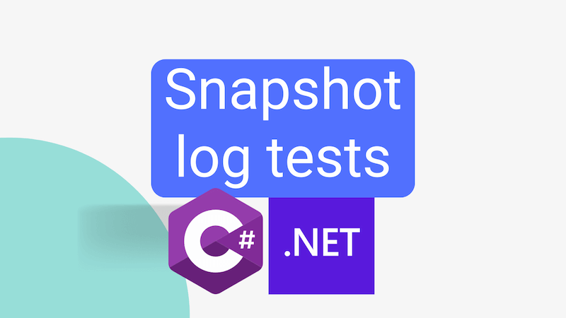

Writing tests is important. The easier it is to write tests, the more likely they'll be written. I've long loved snapshot testing for this reason. Snapshot testing takes away the need to manually write verification code in your tests. Instead, you write tests that compare the output of a call to your method with JSON serialised output you've generated on a previous occasion. This approach takes less time to write, less time to maintain, and the solid readability of JSON makes it more likely you'll pick up on bugs. It's so much easier to scan JSON than it is a list of assertions.

Loving snapshot testing as I do, I want to show you how to write high quality and low effort log assertions using snapshot testing. The behaviour of logging code is really important; it's this that we tend to rely upon when debugging production issues. But how do you test logging code? Well, you could write a bunch of assertions that check how your logger is used. But that's a lot of work, it's not super readable and it's not fun. (Always remember: if it's not fun, you're doing it wrong.)

Instead, we'll achieve this using snapshot testing.



<!--truncate-->

I've written previously about [manually implementing snapshot testing with .NET](../2018-11-17-snapshot-testing-for-c/index.md). That was great, but I subsequently moved to use the excellent [Snapshooter](https://github.com/SwissLife-OSS/snapshooter) instead. In this post we'll use that. I'm using XUnit as my test framework; but Snapshooter also supports MSTest and NUnit if they are your preference.

## How to test `ILogger`?

Before we get into the details of how to test logging code, let's first consider how we might test a method that uses `ILogger`. Here's a simple example:

```cs
using Microsoft.Extensions.Logging;

namespace MyApp.Tests.Services;

public class GreetingService(ILogger<GreetingService> log)
{
    private readonly ILogger<GreetingService> _log = log;

    public string GetGreeting(string name)
    {
        _log.LogInformation($"Greeting {{{nameof(name)}}}", name);

        return $"Hello, {name}!";
    }
}
```

If we look at the class above, we can see it has a dependency on `ILogger<GreetingService>`. This is a common pattern in .NET applications. The `ILogger` interface is used to write log messages. I wouldn't be surprised if it's the most commonly used interface in .NET applications.

If we execute the `GetGreeting` method above, we'll both get a greeting returned and a log message will be written. In order that we can test this method, we need to be able to verify that the log message was written correctly. We're going to do that by making use of a fake logger.

## `FakeLogger`

As of .NET 8, there is a `FakeLogger` that ships as part of .NET. You can read more about that here: https://devblogs.microsoft.com/dotnet/fake-it-til-you-make-it-to-production/#logging-fake

We're going to make use of the official `FakeLogger` in this post. However, I'm mindful that not everyone is on .NET 8 yet. So, I'm going to show you how to implement a fake logger yourself. So if you're on .NET 6 / .NET 7 then you can use this.

Whichever fake logger we use, it is a simple implementation of `ILogger<T>`. It's a fake because it doesn't actually write anything to a log. Instead, it records the log messages it's asked to write in a list of `FakeLogRecord`. We can then use this list to verify that the log messages were written correctly.

### `FakeLogger` for .NET 8+

If you're working with .NET 8 or later, you can use the `FakeLogger` that ships with .NET. To add this to your project, add the [`Microsoft.Extensions.Logging.Testing`](https://www.nuget.org/packages/Microsoft.Extensions.Logging.Testing) and [`Microsoft.Extensions.TimeProvider.Testing`](https://www.nuget.org/packages/Microsoft.Extensions.TimeProvider.Testing) packages to your test project:

```bash
dotnet add package Microsoft.Extensions.Diagnostics.Testing
dotnet add package Microsoft.Extensions.TimeProvider.Testing
```

#### `FakeLogger` for earlier .NET versions

If you're working with an earlier version of .NET, you can implement a fake logger yourself:

```cs
using Microsoft.Extensions.Logging;

namespace MyApp.Tests.TestUtilities;

public record FakeLogRecord(LogLevel Level, string Message, Exception? Exception);

public class FakeLogger<T> : ILogger<T>
{
    public IReadOnlyList<FakeLogRecord> GetSnapshot() => _records;
    readonly List<FakeLogRecord> _records = [];

    public IDisposable? BeginScope<TState>(TState state) where TState : notnull => NullScope.Instance;

    public bool IsEnabled(LogLevel logLevel) => true;

    public void Log<TState>(LogLevel logLevel, EventId eventId, TState state, Exception? exception, Func<TState, Exception?, string> formatter) =>
        _records.Add(new FakeLogRecord(logLevel, formatter(state, exception), exception));

    /// <summary>
    /// Reference: https://github.com/aspnet/Logging/blob/master/src/Microsoft.Extensions.Logging.Abstractions/Internal/NullScope.cs
    /// </summary>
    sealed class NullScope : IDisposable
    {
        public static NullScope Instance { get; } = new NullScope();

        private NullScope()
        {
        }

        public void Dispose()
        {
        }
    }
}
```

This implementation is inspired by both the .NET 8 `FakeLogger` implementation and [David Nguyen's post](https://pnguyen.io/posts/verify-ilogger-call-in-dotnet-core/). It's not identical to the official implementation, but it's close enough for our purposes.

## Testing `ILogger` with Snapshooter

Now that we have a fake logger, we can use it to test the logging caused by calling our `GetGreeting` method.

### Testing `ILogger` with Snapshooter for .NET 8+

Here's how we might do that with our .NET 8 `FakeLogger`:

```cs
using Microsoft.Extensions.Logging.Testing;
using Microsoft.Extensions.Options;
using Microsoft.Extensions.Time.Testing;

using Snapshooter.Xunit;

namespace MyApp.Tests.Services;

public class GreetingServiceTests
{
    [Fact]
    public void GetGreeting_greets_and_logs()
    {
        // Arrange
        var fixedTimeLogCollector = new FakeLogCollector(Options.Create(new FakeLogCollectorOptions {
            TimeProvider = new FakeTimeProvider()
        }));
        var log = new FakeLogger<GreetingService>(fixedTimeLogCollector);

        var greetingService = new GreetingService(log);

        // Act
        var greeting = greetingService.GetGreeting("John");

        // Assert
        Snapshot.Match(new { log = log.Collector.GetSnapshot(), greeting });
    }
}
```

Here, we create an instance of `FakeLogger<GreetingService>`. That `FakeLogger` is instantiated with an instance of `FakeLogCollector`. We're doing this because we want to stub out the time provider. If we don't do this, the log messages will contain the current time. That would will make our snapshot tests brittle. By stubbing out the time provider, we can ensure that the log messages will always contain the same time. This will make our snapshot tests more robust.

If you'd like to learn more about stubbing out the time provider, I recommend you read [Andrew Lock's post on the subject](https://andrewlock.net/exploring-the-dotnet-8-preview-avoiding-flaky-tests-with-timeprovider-and-itimer/#testing-with-the-microsoft-extensions-timeprovider-testing-library).

Our `FakeLogger` is passed into the `GreetingService` constructor, ready to be used. We call `GetGreeting`, and then we use Snapshooter to verify that the log messages were written correctly and that the greeting generated is what we expect. The log messages are acquired by calling the `GetSnapshot` method of the `FakeLogCollector`.

When the test is first run, a `GreetingServiceTests.GetGreeting_greets_and_logs.snap` snapshot is created. This snapshot contains the serialised `log` and `greeting` objects. Subsequent runs of the test will compare the current output with the snapshot. If the output matches the snapshot, the test passes. If it doesn't, the test fails. Here is what the contents of the snapshot should look like:

```json
{
  "log": [
    {
      "Level": "Information",
      "Id": {
        "Id": 0,
        "Name": null
      },
      "State": [
        {
          "Key": "name",
          "Value": "John"
        },
        {
          "Key": "{OriginalFormat}",
          "Value": "Greeting {name}"
        }
      ],
      "StructuredState": [
        {
          "Key": "name",
          "Value": "John"
        },
        {
          "Key": "{OriginalFormat}",
          "Value": "Greeting {name}"
        }
      ],
      "Exception": null,
      "Message": "Greeting John",
      "Scopes": [],
      "Category": "MyApp.Tests.Services.GreetingService",
      "LevelEnabled": true,
      "Timestamp": "2000-01-01T00:00:00+00:00"
    }
  ],
  "greeting": "Hello, John!"
}
```

And that's it, we're done! We've tested our logging code with minimal effort; the only assertion we wrote was `Snapshot.Match`. If we change behaviour of the `GetGreeting` method, the test will fail. To remedy we can then update the snapshot and we're good to go.

### Testing `ILogger` with Snapshooter for earlier .NET versions

If we were using our own `FakeLogger` implementation, we'd almost the same thing:

```cs
using Snapshooter.Xunit;

namespace MyApp.Tests.Services;

public class GreetingServiceTests
{
    [Fact]
    public void GetGreeting_greets_and_logs()
    {
        // Arrange
        var log = new FakeLogger<GreetingService>();

        var greetingService = new GreetingService(log);

        // Act
        var greeting = greetingService.GetGreeting("John");

        // Assert
        Snapshot.Match(new { log = log.GetSnapshot(), greeting });
    }
}
```

You'll notice that actually less code is involved this time. That's because we don't need to stub out the time provider. Our simple implementation of `FakeLogger` doesn't bother with time. So we can just call `GetSnapshot` on the `FakeLogger` instance.

The snapshot generated by this test will look like this:

```json
{
  "log": [
    {
      "Level": "Information",
      "Message": "Greeting John",
      "Exception": null
    }
  ],
  "greeting": "Hello, John!"
}
```

There's a lot less information in this snapshot. That's because our simple implementation of `FakeLogger` doesn't bother with all of the things the official `FakeLogger` does. But for what we're doing here, it's enough.

## Conclusion

In this post we've seen how to use Snapshooter to test logging code.

This approach is easy to implement, easy to maintain and easy to read. Significantly: it involves very little work on our part. If you're not already using snapshot testing, I hope this post has inspired you to give it a try. If you are already using snapshot testing, I hope this post has inspired you to use it to test your logging code.
