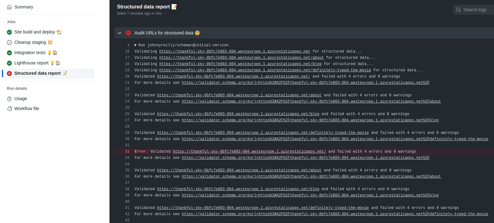
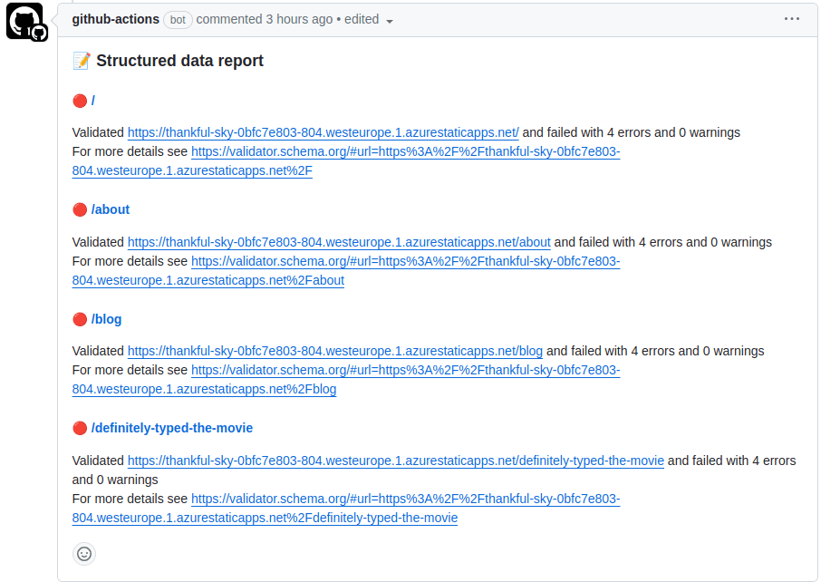
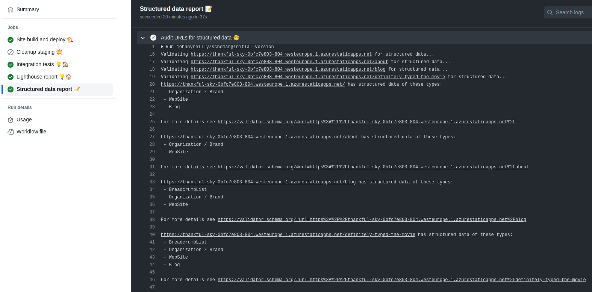
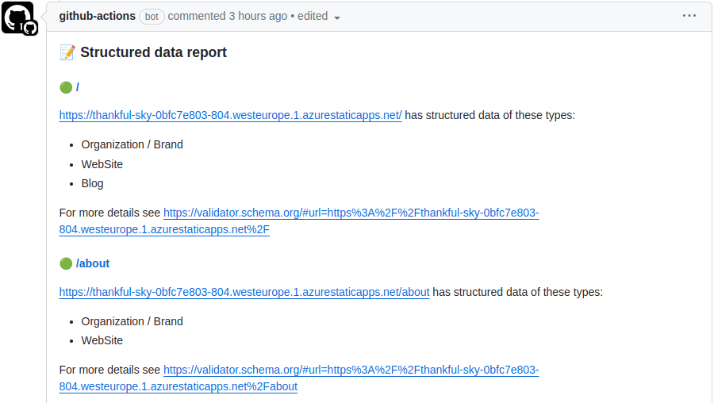

Of late, I've found myself getting more and more into structured data. Structured data is a way of adding machine-readable information to web pages. To entertain myself, I liken it to static typing for websites. I've written about structured data before, but in this post I want to focus on how to validate structured data.

Specifically, how can we validate structured data in the context of a GitHub workflow? I've created a GitHub Action called [Schemar](https://github.com/marketplace/actions/schemar-ci-action) that facilitates just that. In this post we'll see how to use it.


<!--truncate-->

If you'd like to read more about structured data, you might like to read these posts:

- [Structured data, SEO and React](../2021-10-15-structured-data-seo-and-react/index.md)
- [How we fixed my SEO](../2023-11-28-how-we-fixed-my-seo/index.md)
- [Docusaurus blogs: adding breadcrumb structured data](../2023-02-05-docusaurus-blogs-adding-breadcrumb-structured-data/index.md)

## What is Schemar?

Schemar is a GitHub Action that validates structured data. It's a wrapper around the [Schema Markup Validator](https://validator.schema.org/) tool.

If you haven't heard of Schema.orgs validator; it originally started at Google as the Structured Data Testing Tool but was [repurposed and gifted to the community](https://developers.google.com/search/blog/2020/12/structured-data-testing-tool-update).

That tool is a website; Schemar is a wrapper around the tool that makes it easy to validate structured data in the context of a GitHub workflow. Let's imagine it's very important to you that your structured data is both present and valid. You could use Schemar to validate your structured data as part of your CI/CD pipeline.

Imagine Schemar to be the structured data equivalent of the [`lighthouse-ci-action`](https://github.com/treosh/lighthouse-ci-action) GitHub Action.

## Using Schemar

I'm going to take my blog (that's what you're reading right now BTW) and use Schemar to validate the structured data on it. I already have a GitHub Action that builds and deploys my blog to a staging environment in Azure Static Web Apps and [validates it with Lighthouse](../2022-03-20-lighthouse-meet-github-actions/index.md). So I'm going to add Schemar to that.

But before we do that, let's look at simple usage of Schemar. If you were to add a `.github/workflows/schemar.yml` file to your repo with the following contents:

```yaml
jobs:
  release:
    runs-on: ubuntu-latest
    steps:
      - uses: johnnyreilly/schemar@v0.1.1
        with:
          urls: https://johnnyreilly.com

name: Validate structured data

on:
  pull_request: ~
  push:
    branches:
      - main
```

Then you'd have a GitHub workflow that would validate the structured data on `https://johnnyreilly.com` and fail if it wasn't valid.

The `urls` input of Schemar is a list of URLs to validate. In this case, we're just validating only one. The results look like this:

> Validating https://johnnyreilly.com for structured data...
>
> https://johnnyreilly.com has structured data of these types:
>
> - Organization / Brand
> - WebSite
> - Blog
>
> For more details see https://validator.schema.org/#url=https%3A%2F%2Fjohnnyreilly.com

We can see that the home page of my blog has structured data of the types `Organization / Brand`, `WebSite` and `Blog`. And we can even click into the Schema Markup Validator to see the details.

If at some point I were to omit or break the structured data on my blog, then Schemar would fail the build. This is a great way to ensure that your structured data is always present and valid.

We're going to see what usage looks like in a minute, as we dive into a more sophisticated example.

## Surfacing Schemar results in your pull requests

Now that we've seen a basic example, let's see what it looks like to use Schemar in a more sophisticated way. We're going to add Schemar to run against my blogs pull request previews, in the same way we're already running Lighthouse against them.

### Adding Schemar to the GitHub Action

I won't reiterate the whole GitHub workflow that spins up a preview environment here, but I'll show the key parts. You can see the whole thing in the [`build-and-deploy-static-web-app.yml` of the blog repo](https://github.com/johnnyreilly/blog.johnnyreilly.com/blob/main/.github/workflows/build-and-deploy-static-web-app.yml). You'll note I'm using Azure Static Web Apps to host my blog - but any web platform will do.

Here is the key part of the GitHub workflow:

```yaml
structured_data_report_job:
  name: Structured data report 📝
  needs: build_and_deploy_swa_job
  if: github.event_name == 'pull_request' && github.event.action != 'closed'
  runs-on: ubuntu-latest
  steps:
    - uses: actions/checkout@v4

    - name: Wait for preview ${{ needs.build_and_deploy_swa_job.outputs.preview-url }} ⌚
      id: static_web_app_wait_for_preview
      uses: nev7n/wait_for_response@v1
      with:
        url: '${{ needs.build_and_deploy_swa_job.outputs.preview-url }}'
        responseCode: 200
        timeout: 600000
        interval: 1000

    - name: Audit URLs for structured data 🧐
      id: structured_data_audit
      uses: johnnyreilly/schemar@v0.1.1
      with:
        urls: |
          ${{ needs.build_and_deploy_swa_job.outputs.preview-url }}
          ${{ needs.build_and_deploy_swa_job.outputs.preview-url }}/about
          ${{ needs.build_and_deploy_swa_job.outputs.preview-url }}/blog
          ${{ needs.build_and_deploy_swa_job.outputs.preview-url }}/definitely-typed-the-movie

    - name: Format structured data results
      id: format_structured_data_results
      if: always()
      uses: actions/github-script@v7
      with:
        script: |
          const structuredDataCommentMaker = (await import('${{ github.workspace }}/.github/workflows/structuredDataCommentMaker.mjs')).default;
          const results = ${{ steps.structured_data_audit.outputs.results }};
          core.setOutput("comment", structuredDataCommentMaker('${{ needs.build_and_deploy_swa_job.outputs.preview-url }}', results));

    - name: Add structured data results as comment ✍️
      id: structured_data_comment_to_pr
      if: always()
      uses: marocchino/sticky-pull-request-comment@v2
      with:
        number: ${{ github.event.pull_request.number }}
        header: structured_data
        message: ${{ steps.format_structured_data_results.outputs.comment }}
```

Along with the following `structuredDataCommentMaker.mjs` script:

```js title="structuredDataCommentMaker.mjs"
// @ts-check

/**
 * @typedef {Object} Result
 * @prop {string} url
 * @prop {ProcessedValidationResult} processedValidationResult
 */

/**
 * @typedef {Object} ProcessedValidationResult
 * @prop {boolean} success
 * @prop {string} resultText
 */

/**
 * @param {string} baseUrl
 * @param {Result[]} results
 */
function createStructuredDataReport(baseUrl, results) {
  const comment = `### 📝 Structured data report

${results
  .map((result) => {
    const shortUrl = result.url.replace(baseUrl, '') || '/';
    return `#### ${
      result.processedValidationResult.success ? '🟢' : '🔴'
    } [${shortUrl}](${result.url}) 
${result.processedValidationResult.resultText}`;
  })
  .join('\n')}
`;
  return comment;
}

export default createStructuredDataReport;
```

Let's break this down:

- We're using the [`nev7n/wait_for_response`](https://github.com/nev7n/wait_for_response) GitHub Action to wait for the preview to be available. This is because the preview URL is not available immediately after the preview is created.
- We're running Schemar against four URLs in our pull request preview. These pages should have structured data; and if any fail then it's likely a sign that something has gone wrong with my sites structured data story.
- We then take the output of the Schemar run and format it into a comment that we can add to the pull request - to do that we use the `structuredDataCommentMaker.mjs` script.
- Finally, we add the comment to the pull request using the [`marocchino/sticky-pull-request-comment`](https://github.com/marocchino/sticky-pull-request-comment) GitHub Action.

### Testing it out

Let's see what this looks like in action. I've created a pull request that breaks the structured data from my blog. This is what the pull request looks like:

```diff
-'@type': 'Person',
+'@type': 'Blarg', // let's break the schema!
```

The question is, what does the pull request look like after the GitHub Action has run? Here's the answer:



It failed! And it put a comment on the PR that looks like this:



Let's unbreak the structured data and see what happens:

```diff
-'@type': 'Blarg', // let's break the schema!
+'@type': 'Person',
```



It succeeded! And it put a comment on the PR that looks like this:



This is great! It means that I can be confident that my structured data is always present and valid. And if it isn't, then I'll know about it. I can even click through to the Schema Markup Validator to see the details.

## Conclusion

My hope is that Schemar can be used to increase the quality of structured data on the web. I'm using it to increase the quality of structured data on my blog. I hope you'll find it useful too.

I've also [shared this with the good folk of Schema.org](https://github.com/schemaorg/schemaorg/discussions/3432) in the hope they'll find it useful too. The [source code of Schemar can be found here](https://github.com/johnnyreilly/schemar).
