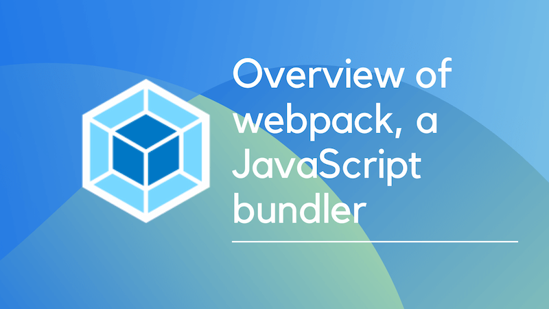
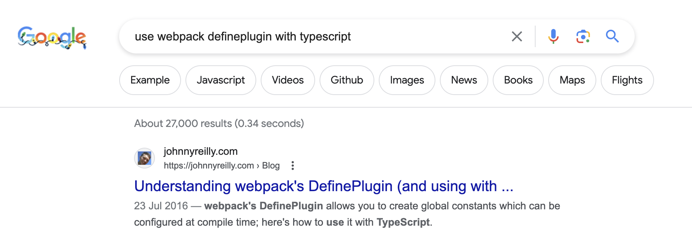

If you're a JavaScript developer, you've probably heard of webpack. It's a JavaScript bundler that helps you bundle your code into a single file. It's a great tool for optimizing your code and improving performance. This article will give you an overview of webpack, its history and how it works.

It'll be a little different than your typical "what is webpack?" article, in that I write this as the maintainer of [`ts-loader`](https://github.com/TypeStrong/ts-loader), a loader used for integrating TypeScript with webpack. I've worked in the webpack ecosystem for some years now and I'll share some of my experiences with you. I'm go through a little history around bundling, and try to understand why webpack came to be such a popular choice.

## A short history of web development

To answer the question "what is webpack?", we need to understand what a bundler is. To grasp that, we first need a little history lesson.

### The early days of JavaScript

If you started web development after 2016, you might not realise that bundling is a relatively new concept.

Let's roll back the clock to the late 2000's. This was when JavaScript development started to become mainstream. Around that time, jQuery was becoming popular and the web was a very different place. We didn't have the same tools we have today. We didn't have npm, we didn't have webpack, we didn't have React, we didn't have TypeScript. We didn't even have ES2015. We were still writing JavaScript in ES5.

So what did building a front end application look like back then? Well, I was a web developer back then, and I can tell you that it was a lot of work. To make a simple app you would have to:

- Go to the websites of libraries you wanted to use, usually jQuery and jQuery UI.
- Download the library files you needed (both `jquery-1.4.4.js` and the minified `jquery-1.4.4.min.js` because there weren't minification tools back then)
- Include the library files in your HTML file, and significantly **before** other JavaScript files that would depend upon jQuery.
- For bonus points, you would also download the jQuery UI CSS files and include them in your HTML file.
- For extra bonus points, you would figure out a way to serve up non-minified versions of your JavaScript files in development, and minified versions in production.

What I'm hoping you can see from this is that it was a lot of work. And it was very error prone. If you forgot to include a library, or included it in the wrong order, or included the wrong version, or forgot to minify your files, or forgot to include the CSS files, your app would break. And it would be very difficult to debug.

### Rise of the task runners

As web development became more popular, people started to realise that there was a lot of repetition in the process. So they started to automate it. Around 2012 we started to see the birth of the task runner. There were two main task runners that became popular: [Grunt](https://gruntjs.com/) and [Gulp](https://gulpjs.com/).

These task runners allowed you to automate the process of combining and minifying JavaScript and CSS files, and including them in your HTML file. They also allowed you to automate other tasks, like running tests, linting your code, and deploying your app. They did improve the web development experience, but they didn't solve all the problems.

It was still very easy to make mistakes. You could still forget to include a library, or include it in the wrong order, or get a path wrong, or forget to minify your files, or forget to include the CSS files. And it was still very difficult to debug.

But it was **so much better** than what we had before. So it became very popular.

### The rise of the module bundler

Around 2014, a new tool started to become popular: the module bundler. But what is a module bundler? Well, it's a tool that allows you to write your code in modules, and then bundle those modules into a single file. It also allows you to use other tools, like TypeScript, and CSS preprocessors like Sass and Less.

That's a lot of words, let's unpack them a little. For some time, the defacto way of acquiring JavaScript libraries has been through npm. npm is a package manager for JavaScript. However, it's worth remembering its history. npm started out as the package manager for Node.js. It was originally used to house packages that were used to build Node.js applications. It was never intended to be used for front end development. In fact, for a while there was an alternative front end package manager called [Bower](https://bower.io/).

The thing is, there's a lot of commonality between Node.js and front end development. Both use JavaScript. You're unlikely to need to run a web server in the browser. However, whether running in a browser or on a server, you might want to order an array with lodash, or make use of TypeScript, or perform validation with Zod. So it makes sense to use the same package manager for both.

The first tool that tackled this was [Browserify](http://browserify.org/). As the name suggests, it was a tool that allowed you to use Node.js style modules in the browser. It did this by taking your code, and recursively walking through it, finding all the `require` calls, and bundling them into a single file.

By doing this, it performed two useful functions:

1. It opened up the ecosystem of Node.js packages to front end developers.
2. It allowed you to write your code in modules, which made it easier to reason about.

Both of these are tremendously significant. The first one is obvious. The second one is less obvious, but it's very important. It's worth remembering that JavaScript didn't have modules until ES2015. But npm had its own module standard called CommonJS. Given that Browserify and webpack were both created before ES2015, they both used CommonJS modules in the context of the browser. This was a huge improvement over the previous way of doing things, which was to include a bunch of script tags in your HTML file. The reason it's so wildly different is because the dependencies in your codebase moved from being **implicit** to being **explicit**. Instead of having to remember to include a bunch of script tags in your HTML file, you could just `require` the modules you needed. This made it much easier to reason about your codebase. What's more, you had a a `package.json` file that listed all your dependencies, so you could see at a glance what your dependencies were.

## What is webpack?

Now we understand a little of the history, we come to webpack. By the way, it's definitely not "Webpack" or "WebPack". It's "webpack". The person initially behind webpack is [Tobias Koppers](https://github.com/sokra); an engineer from Germany. Many, many people have contributed to the project since then, but Tobias is the person who has done the most work on it.

I mentioned that I was a web developer whilst the web was evolving its developer tooling. In my case I was a longtime user of Gulp, and then Browserify. I moved to webpack in 2015. I can't remember exactly why I moved, but I think it was because I wanted to use TypeScript, and webpack had better TypeScript support than Browserify (more on this later). I also think I was attracted to webpack because it was a more holistic solution than Browserify. It had a plugin system, and it had loaders. I'll talk about those in a moment.

First and foremost, it's worth saying that webpack is a module bundler. It takes your code, and recursively walks through it, finding all the `require` or `import` calls, building up a dependency graph, performing preprocessing tasks and producing runnable output, in the form of HTML, CSS and JavaScript. It also allows you to use other tools, like TypeScript, and CSS preprocessors like Sass and Less.

One of the most surprising things about webpack has been both its popularity, and how it has lasted. The web development world is famous for having the attention span of a distracted toddler. Tools replace tools, libraries replace libraries, and frameworks replace frameworks. But webpack has been around for a long time, and it's still the most popular bundler. At the time of writing it still has 110 million downloads a month. Why is that?

I think there are a few reasons.

Firstly, because of the richness of the ecosystem and the flexibility of the tool, it's possible to solve pretty much all web development problems with webpack. There are newer, shinier tools (and as we'll see later, webpack is starting to be displaced by some of these) but as a reliable tool that can solve all your problems, webpack is hard to beat.

That doesn't mean it's the easiest tool to work with on all occasions. The internet is awash with people bitterly complaining about the scars they bear from configuring webpack. It's true that webpack can be difficult to configure. But it's also true that webpack is a very powerful tool. Once you have it working, you generally don't have to touch it again.

A second reason why webpack is so popular, is that it has become a "primitive". What I mean by that, is that it has become a library that other libraries depend upon. If you use Docusaurus, you're also using webpack as the underlying build tool. Many projects have a need of a build tool and have picked webpack to be that. This has led to a huge ecosystem of plugins and loaders. It's also led to a plethora of tutorials and blog posts. If you have a problem, it's likely that someone else has had the same problem and has written a blog post about it.

By way of example, a [blog post I wrote in 2016 about the webpack `DefinePlugin`](https://johnnyreilly.com/using-webpacks-defineplugin-with-typescript) still ranks highly in Google for "use webpack defineplugin with typescript" and is (to my surprise) one of my most popular blog posts. Here's a screenshot of it in Google search results:

This speaks to the level of popularity around all things webpack.

## Getting started
