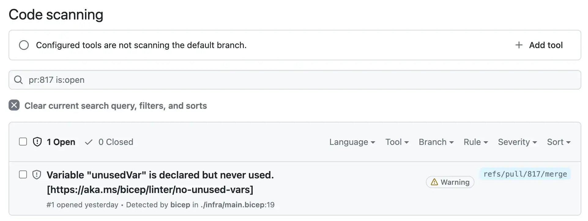
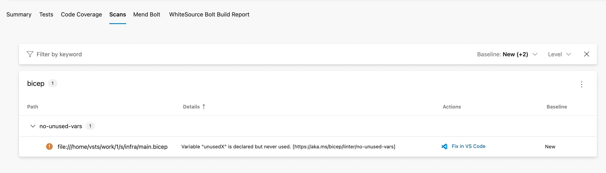
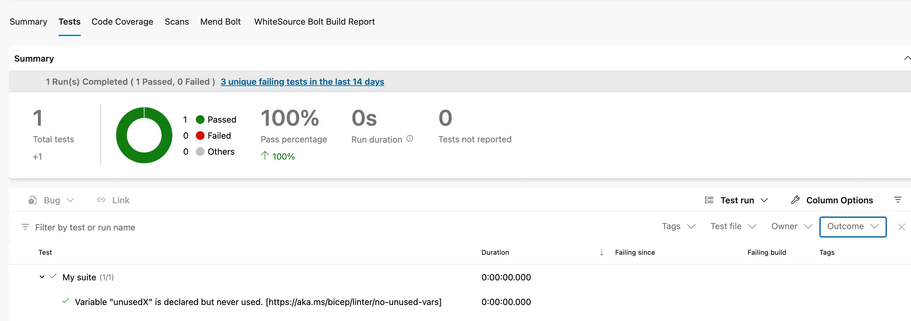

Bicep has had linting [since version 0.4.1](https://github.com/Azure/bicep/releases/tag/v0.4.1). It's a great way to ensure that your bicep files conform to best practices. Interestingly, when the linting feature first shipped, there wasn't an explicit lint command as part of the CLI. Instead, you had to run `bicep build` and it would run the linter as part of the build process. This was a little confusing as it was not obvious that the linter was running.

As of [version 0.21.1](https://github.com/Azure/bicep/releases/tag/v0.21.1) there is a dedicated [`bicep lint`](https://learn.microsoft.com/en-us/azure/azure-resource-manager/bicep/linter) command. This is a nice step forwards; it allows you to explicitly lint your your code, rather than have it happen as a side effect of build. And it is useful if you want to run the linter as part of a CI/CD pipeline. What's more the `bicep lint` command is now available in the Azure CLI as well. You can run [`az bicep lint`](https://docs.microsoft.com/en-us/cli/azure/bicep?view=azure-cli-latest#az-bicep-lint) to lint your bicep files.

In this post we'll look at how to run lint Bicep in Azure Pipelines and GitHub Actions, and surface the output in the UI.


<!--truncate-->

## The general approach

The general approach is the same for both Azure Pipelines and GitHub Actions. One way or another, we'll run the Bicep `lint` command to lint our Bicep files and capture the output. As yet, there is no option to export the results of the lint command as a file. This may come, and [there is a discussion about it](https://github.com/Azure/bicep/issues/11960). However, there is a way to achieve our goal, which came out in discussion with [Anthony Martin](https://github.com/anthony-c-martin) of the Bicep team. We can write the output of the `lint` command to a file like so:

```
bicep lint main.bicep --diagnostics-format sarif > lint.sarif
```

This will write the output of the `lint` command to a file called `lint.sarif`. This is a [SARIF](https://sarifweb.azurewebsites.net/) file. SARIF stands for Static Analysis Results Interchange Format. It's a standard for representing the results of static analysis tools. It's a JSON file, easy to parse and has integrations with GitHub Actions / Azure Pipelines. An example SARIF output is below:

```json
{
  "$schema": "https://schemastore.azurewebsites.net/schemas/json/sarif-2.1.0-rtm.6.json",
  "version": "2.1.0",
  "runs": [
    {
      "tool": {
        "driver": {
          "name": "bicep"
        }
      },
      "results": [
        {
          "ruleId": "no-unused-vars",
          "message": {
            "text": "Variable \"unusedVar\" is declared but never used. [https://aka.ms/bicep/linter/no-unused-vars]"
          },
          "locations": [
            {
              "physicalLocation": {
                "artifactLocation": {
                  "uri": "file:///home/runner/work/blog.johnnyreilly.com/blog.johnnyreilly.com/./infra/main.bicep"
                },
                "region": {
                  "startLine": 19,
                  "charOffset": 5
                }
              }
            }
          ]
        }
      ],
      "columnKind": "utf16CodeUnits"
    }
  ]
}
```

In the example above we directly used the `bicep lint` command. An alternative approach is to use the Azure CLI like so:

```
az bicep lint --file main.bicep --diagnostics-format sarif > lint.sarif
```

This is a little more verbose, but it does mean that you don't need to install the Bicep CLI on your build agent. You can use the Azure CLI instead; and this is already a first class citizen of Azure Pipelines and GitHub Actions, with dedicated support. (That said, there is a slight issue with this approach at the time of writing, which we'll come to later.)

However we generate it, we can take the SARIF file and use it to surface the results of the linting process in Azure Pipelines and GitHub Actions.

## Linting Bicep in GitHub Actions with the Azure CLI

We'll start off by looking at how to lint Bicep in GitHub Actions with the Azure CLI. But before we do that, we need something to lint. Within your `main.bicep` file you should have something like this:

```bicep
var unusedVar = 1 // unused variable
```

As it suggests, this is an unused variable. We're just using this to demonstrate the linting process. And alongside that, we want a [`bicepconfig.json`](https://aka.ms/bicep/config) file that looks like this:

```json
{
  "analyzers": {
    "core": {
      "rules": {
        "no-unused-vars": {
          "level": "warning"
        }
      }
    }
  }
}
```

This explicitly enables the [`no-unused-vars`](https://learn.microsoft.com/en-us/azure/azure-resource-manager/bicep/linter-rule-no-unused-variables) rule, and sets it to `warning` level. This means that the linter will warn us about unused variables, but it won't fail the build. We could set it to `error` level, and then the build would fail if there were any unused variables. We'll come back to this later.

In a GitHub workflow in your repository you should have steps like these:

```yaml
- name: Lint Bicep
  uses: azure/CLI@v2
  with:
    inlineScript: |
      az bicep install
      az bicep lint --file ./infra/main.bicep --diagnostics-format sarif > bicep.sarif

- name: Upload SARIF
  if: (success() || failure())
  uses: github/codeql-action/upload-sarif@v3
  with:
    category: bicep
    sarif_file: bicep.sarif
```

The above:

- Installs Bicep to the Azure CLI
- Runs the `lint` command and writes the results to a file called `bicep.sarif`
- Uploads the SARIF file to GitHub

The `upload-sarif` action is provided by GitHub. [It allows surfacing the results of static analysis tools in GitHub](https://docs.github.com/en/code-security/code-scanning/integrating-with-code-scanning/uploading-a-sarif-file-to-github). Doing this will show the results of the linting process in the GitHub UI, and it will also show them in the GitHub Security / Code Scanning UI, like so:



## Linting Bicep in GitHub Actions with the Bicep CLI

We can also lint Bicep in GitHub Actions with the Bicep CLI. At the time of writing, there's a reason you might want to favour this approach over the Azure CLI approach. I won't drill into it in depth, but at present if `az bicep lint` fails / returns a non-0 exit code then no output is produced. We could make this happen by updating the `bicepconfig.json` to dial up the `no-unused-vars` rule to `error` level, like so:

```json
{
  "analyzers": {
    "core": {
      "rules": {
        "no-unused-vars": {
          "level": "error"
        }
      }
    }
  }
}
```

Now an unused variable will cause the build to fail. But the output of the `lint` command will not be surfaced in the GitHub UI. This is because the Azure CLI is not surfacing the output of the `lint` command when it fails.

The issue with the Azure CLI will hopefully be remedied; [you can track that here](https://github.com/Azure/azure-cli/issues/28259). For now you can use the Bicep CLI directly, where this isn't an issue. We'll do that now.

I'm basing this approach on Anthony Martin's example of [Bicep linting with GitHub Actions](https://github.com/anthony-c-martin/bicep-on-k8s/blob/e6dfa61fe7eae6fd6b148670f940041f3e294b20/.github/workflows/ci.yml#L36-L50):

```yml
- name: Setup Bicep
  uses: anthony-c-martin/setup-bicep@v0.3

- name: Lint Bicep
  run: |
    bicep lint ./infra/main.bicep --diagnostics-format sarif > bicep.sarif

- name: Upload SARIF
  if: always()
  uses: github/codeql-action/upload-sarif@v3
  with:
    category: bicep
    sarif_file: bicep.sarif
```

The above does the same as the Azure CLI approach, but it uses the Bicep CLI directly. The [`setup-bicep` action](https://github.com/marketplace/actions/setup-bicep) is provided by Anthony Martin and installs the Bicep CLI on your build agent.

As I say, right now you may want to favour this approach over the Azure CLI approach to cover both surfacing warnings and errors. But hopefully that will change soon.

## Linting Bicep in Azure Pipelines with the Azure CLI

We've now seen how to lint Bicep in GitHub Actions with both the Azure CLI and the Bicep CLI. We can do the same in Azure Pipelines; but only the Azure CLI approach (as I'm not sure if there's a `setup-bicep` equivalent for Azure Pipelines).

How you want to surface the results in Azure Pipelines is up to you. You could surface into the "Scans" portion of Azure Pipelines UI or into "Tests". I'll show you how to do both.

### Surface the results in Scans

To surface the results in the scans part of Azure Pipelines you need to publish the SARIF file as a build artifact. You can do that like so:

```yml
jobs:
  - job: LintInfra
    displayName: Lint Infra
    dependsOn: []
    pool:
      vmImage: 'ubuntu-latest'
    steps:
      - task: AzureCLI@2
        displayName: Lint main.bicep
        inputs:
          azureSubscription: service-connection-with-access-to-registry # you may not need this
          scriptType: bash
          scriptLocation: inlineScript
          inlineScript: |
            az bicep install
            az bicep lint --file infra/main.bicep --diagnostics-format sarif > $(System.DefaultWorkingDirectory)/bicep.sarif

      - task: PublishBuildArtifacts@1
        condition: always()
        inputs:
          pathToPublish: $(System.DefaultWorkingDirectory)/bicep.sarif
          artifactName: CodeAnalysisLogs # required to show up in the scans tab
```

The above is essentially the same as the GitHub Actions example, but it uses the Azure CLI instead of the Bicep CLI. The `PublishBuildArtifacts` task is provided by Azure Pipelines. It allows you to publish build artifacts, which will show up in the Scans part of Azure Pipelines. You can see the results of the linting process in Scans, like so:



You'll notice that the path above has a `file:///home/vsts/work/1/s` prefix before the bicep path report of `infra/main.bicep`. This is unfortunate and breaks "clickability". You cannot click on this and be taken to the file. It's possible to remedy this behaviour by doing a little find and replace magic on the SARIF file. You don't need to do this, but it does add to the developer experience.

Below is the same portion of the Azure Pipelines yaml file but with some additional bash that will use `sed` to replace all instances of the `file:///home/vsts/work/1/s` prefix with an empty string:

```yml
jobs:
  - job: LintInfra
    displayName: Lint Infra
    dependsOn: []
    pool:
      vmImage: 'ubuntu-latest'
    steps:
      - task: AzureCLI@2
        displayName: Lint main.bicep
        inputs:
          azureSubscription: service-connection-with-access-to-registry # you may not need this
          scriptType: bash
          scriptLocation: inlineScript
          inlineScript: |
            az bicep install
            az bicep lint --file infra/main.bicep --diagnostics-format sarif > $(System.DefaultWorkingDirectory)/bicep.sarif

            STRING_TO_REPLACE='file://$(Build.SourcesDirectory)/'
            echo "##[group]Bicep linting results before $STRING_TO_REPLACE replace:"
            cat $(System.DefaultWorkingDirectory)/bicep.sarif
            echo "##[endgroup]"

            sed -i "s|$STRING_TO_REPLACE||g" $(System.DefaultWorkingDirectory)/bicep.sarif

            echo "##[group]Bicep linting results after $STRING_TO_REPLACE replace:"
            cat $(System.DefaultWorkingDirectory)/bicep.sarif
            echo "##[endgroup]"

      - task: PublishBuildArtifacts@1
        condition: always()
        inputs:
          pathToPublish: $(System.DefaultWorkingDirectory)/bicep.sarif
          artifactName: CodeAnalysisLogs # required to show up in the scans tab
```

And hey presto! Clickability restored.

### Surface the results in Tests

You can also surface the results in the tests part of Azure Pipelines. To do that we're going to borrow a [suggestion from Anthony Martin](https://github.com/Azure/bicep/issues/11960#issuecomment-1737226501) and use the [`sarif-junit`](https://www.npmjs.com/package/sarif-junit) package. This package allows us to convert a SARIF file to a JUnit file. JUnit is a standard for representing test results and can be used with the `PublishTestResults` task.

```yml
jobs:
  - job: LintInfra
    displayName: Lint Infra
    dependsOn: []
    pool:
      vmImage: 'ubuntu-latest'
    steps:
      - task: NodeTool@0
        displayName: 'Install Node.js'
        inputs:
          versionSpec: '18.x'

      - task: AzureCLI@2
        displayName: Lint main.bicep
        inputs:
          azureSubscription: service-connection-with-access-to-registry # you may not need this
          scriptType: bash
          scriptLocation: inlineScript
          inlineScript: |
            az bicep install
            az bicep lint --file infra/main.bicep --diagnostics-format sarif > $(System.DefaultWorkingDirectory)/bicep.sarif
            npx -y sarif-junit -i $(System.DefaultWorkingDirectory)/bicep.sarif -o $(System.DefaultWorkingDirectory)/bicep.xml

      - task: PublishTestResults@2
        condition: always()
        inputs:
          testResultsFormat: 'JUnit'
          testResultsFiles: '$(System.DefaultWorkingDirectory)/bicep.xml'
```

So the above is the same approach again but requires Node.js to be installed, and the results end up in the Tests part of Azure Pipelines. You can see the results of the linting process in Tests, like so:



## Summary

That's it! We've seen how to lint Bicep in Azure Pipelines and GitHub Actions. We've seen how to surface the results in the scans and tests parts of Azure Pipelines and in GitHub. We've seen how to do it with the Azure CLI and the Bicep CLI. And we've seen how to do it with warnings and errors. Hopefully this will help you to ensure that your Bicep files conform to best practices.

Many thanks to Anthony Martin for his help, which laid the groundwork for much of what we explored in this post.
