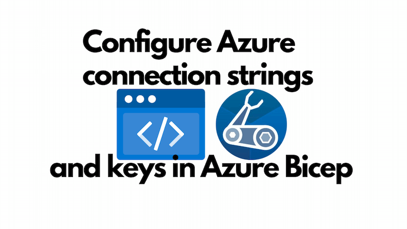
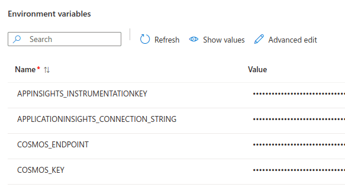

Imagine you're deploying a solution to Azure. It'll feature some resources like a database or a storage account. How do can you configure your application with access to these resources? One approach would be using Managed Identity. Another approach is configuring the connection strings and access keys in our application's configuration store as the Bicep templates are deployed. This is a common approach when working with Azure Functions, Azure Static Web Apps, Azure Container Apps and similar.



A wonderful aspect of this approach is that no human need ever get to see the connection strings / access keys. They'll be discovered and consumed by Azure during a deployment, and known to your application at runtime, but untrustworthy humans need never get to see them. This is secure, and therefore _good_.

<!--truncate-->

## Configure an Azure Static Web App with a connection string and an access key

The blog you are reading this on is hosted on Azure Static Web Apps and deployed with Bicep. It also has an Azure Cosmos DB database and an Application Insights instance. The Azure Static Web App has access to the database via its access key and has access to the Application Insights instance through a connection string. The key and connection string are supplied to the configuration of the SWA during deployment.

Let's look at the Bicep configuration that deploys a database. Here's a snippet of the Bicep template:

```bicep
resource databaseAccount 'Microsoft.DocumentDB/databaseAccounts@2023-04-15' = {
  name: cosmosDbAccountName
  kind: 'GlobalDocumentDB'
  location: location
  tags: tags
  properties: {
    consistencyPolicy: { defaultConsistencyLevel: 'Session' }
    locations: locations
    enableAutomaticFailover: true
    databaseAccountOfferType: 'Standard'
    publicNetworkAccess: 'Enabled'
    ipRules: [for ipAddress in ipAddresses: {
      ipAddressOrRange: ipAddress
    }]
    backupPolicy: { type: 'Periodic', periodicModeProperties: { backupIntervalInMinutes: 240, backupRetentionIntervalInHours: 720 }}
  }
}
```

Here's a snippet of the Bicep template that deploys the Application Insights instance:

```bicep
resource appInsights 'Microsoft.Insights/components@2020-02-02' = {
  name: appInsightsName
  location: location
  kind: 'other'
  properties: {
    Application_Type: 'web'
    Flow_Type: 'Bluefield'
    WorkspaceResourceId: workspace.id
    RetentionInDays: 90
    IngestionMode: 'LogAnalytics'
    publicNetworkAccessForIngestion: 'Enabled'
    publicNetworkAccessForQuery: 'Enabled'
  }
}
```

Given that both of these resources are deployed, we can reference them subsequently and acquire connection strings / access keys.

So when we're getting ready to deploy the Azure Static Web App, we are able reference both the database and the Application Insights instance. Here's a snippet of the Bicep template that acquires the references:

```bicep
resource databaseAccount 'Microsoft.DocumentDB/databaseAccounts@2023-04-15' existing = {
  name: cosmosDbAccountName
}

resource appInsightsResource 'Microsoft.Insights/components@2020-02-02' existing = {
  name: appInsightsName
}
```

With those references in hand, we can now configure the Azure Static Web App with the connection string and access key. Here's a snippet of the Bicep template that configures the Azure Static Web App with the connection string and access key:

```bicep
// deploy the Azure Static Web App
resource staticWebApp 'Microsoft.Web/staticSites@2022-09-01' = {
  name: staticWebAppName
  location: location
  tags: tagsWithHiddenLinks
  sku: {
    name: 'Free'
    tier: 'Free'
  }
  properties: {
    repositoryUrl: 'https://github.com/johnnyreilly/blog.johnnyreilly.com'
    repositoryToken: repositoryToken
    branch: branch
    provider: 'GitHub'
    stagingEnvironmentPolicy: 'Enabled'
    allowConfigFileUpdates: true
    buildProperties:{
      skipGithubActionWorkflowGeneration: true
    }
  }
}

// configure the Azure Static Web App with the connection string and access key
resource staticWebAppAppSettings 'Microsoft.Web/staticSites/config@2022-09-01' = {
  name: 'appsettings'
  kind: 'config'
  parent: staticWebApp
  properties: {
    APPINSIGHTS_INSTRUMENTATIONKEY: appInsightsResource.properties.InstrumentationKey
    APPLICATIONINSIGHTS_CONNECTION_STRING: appInsightsResource.properties.ConnectionString // <-- connection string
    COSMOS_ENDPOINT: databaseAccount.properties.documentEndpoint
    COSMOS_KEY: databaseAccount.listKeys().primaryMasterKey // <-- access key
  }
}
```

I've slightly tweaked the code to make it more readable, if you'd like to see the full configuration of the Azure Static Web App in the source of my blog, you can find it [here](https://github.com/johnnyreilly/blog.johnnyreilly.com/blob/df2382e31dab82604e98d91f83967b8b559eb507/infra/static-web-app.bicep#L47C1-L57C2).

You can see the effect of this configuration in the Azure Portal. Here's a screenshot of the configured environment variables of the Azure Static Web App:



## Configure an Azure Container App with a connection string and an access key

What's hopefully apparent from the previous section is that in the end this amounts to injecting a string to the appropriate place in the configuration of the resource. This is true for Azure Container Apps as well. Here's a snippet of the Bicep template that configures an Azure Container App with a connection string and access key:

```bicep
var appInsightsInstrumentationRef = 'app-insights-instrumentation-key'
var appInsightsConnectionStringRef = 'app-insights-connection-string'
var cosmosKeyRef = 'cosmos-key'

resource webServiceContainerApp 'Microsoft.App/containerApps@2023-05-01' = {
  name: webServiceContainerAppName
  tags: tags
  location: location
  properties: {
    // ...
    configuration: {
      secrets: [
        {
          name: appInsightsInstrumentationRef
          value: appInsightsResource.properties.InstrumentationKey
        }
        {
          name: appInsightsConnectionStringRef
          value: appInsightsResource.properties.ConnectionString // <-- connection string
        }
        {
          name: cosmosKeyRef
          value: databaseAccount.listKeys().primaryMasterKey // <-- access key
        }
        // ...
      ]
      // ...
    }
    template: {
      containers: [
        {
          // ...
          env: [
            {
              name: 'APPINSIGHTS_INSTRUMENTATIONKEY'
              secretRef: appInsightsInstrumentationRef
            }
            {
              name: 'APPLICATIONINSIGHTS_CONNECTION_STRING'
              secretRef: appInsightsConnectionStringRef
            }
            {
              name: 'COSMOS_ENDPOINT'
              value: databaseAccount.properties.documentEndpoint
            }
            {
              name: 'COSMOS_KEY'
              secretRef: cosmosKeyRef
            }
            // ...
          ]
        }
      ]
      // ...
    }
  }
}
```

The mechanism is slightly different, as befits the different service being used, but the principle is the same. We're injecting the connection string and access key into the configuration of the resource.

## Conclusion

In this post we've demonstrated how to deploy resources, acquire reference to them and safely configure Azure Static Web Apps and Azure Container Apps such that they can access the resources.

The pattern we've used here is generally applicable in the Azure world. The same technique can be used to configure Azure Functions, Azure KeyVault, and many other Azure resources. The key is to understand the configuration of the resource you're working with and to understand how to inject the relevant secrets into that configuration.
