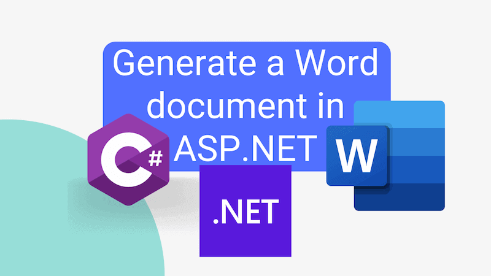

Generating a Word document in the context of an ASP.NET controller is quite simple to do. However, it took me a little experimentation to work out just what was required. This post documents (pun **very** much intended) what we need to do.



<!--truncate-->

## Open XML

To generate a Word document in .NET, the most straightforward way is to use the [Open XML library](https://github.com/dotnet/Open-XML-SDK). We can install the library using the following command:

```sh
dotnet add package DocumentFormat.OpenXml
```

## Generating a Word document in an ASP.NET controller

With the Open XML library installed, we can create a new Word document in the context of an ASP.NET controller. The following code demonstrates how to do this:

```cs
using Microsoft.AspNetCore.Mvc;
using DocumentFormat.OpenXml;
using DocumentFormat.OpenXml.Packaging;
using DocumentFormat.OpenXml.Wordprocessing;

namespace MyApp.Controllers;

[ApiController]
public class WordDocumentController() : ControllerBase
{
    [HttpGet("api/generate-word-document")]
    public IActionResult GetWordDocument()
    {
        // Create a new Word document
        using var stream = new MemoryStream();
        using var document = WordprocessingDocument.Create(stream, WordprocessingDocumentType.Document);

        var mainPart = document.AddMainDocumentPart();
        mainPart.Document = new Document();

        // Add content to the document
        var body = mainPart.Document.AppendChild(new Body());
        var paragraph = body.AppendChild(new Paragraph());
        var run = paragraph.AppendChild(new Run());
        run.AppendChild(new Text("Hello, World!"));

        // Save the document to a memory stream
        document.Save();
        var byteArray = stream.ToArray();

        // Return the document as a file
        return File(byteArray, "application/vnd.openxmlformats-officedocument.wordprocessingml.document", "document.docx");
    }
}
```

In this example, the `GetWordDocument` method creates a new Word document and adds the text "Hello, World!" to it. If we navigate to the `/api/generate-word-document` endpoint, we will receive a Word document with the text "Hello, World!" in it.

The document is then saved to a memory stream and returned as a file. The `File` method is used to return the document as a file with the MIME type `application/vnd.openxmlformats-officedocument.wordprocessingml.document` (which basically is the server saying "Hey! This is a Word document!").

## Conclusion

Generating a Word document in an ASP.NET controller is quite simple to do using the Open XML library. We can create a new Word document, add content to it, and return it as a file using the `File` method.

To learn more about how to add content to a Word document using the Open XML library, it's worth reading the [Open XML SDK documentation](https://learn.microsoft.com/en-us/office/open-xml/word/overview).

I hope this post helps you to generate Word documents in your ASP.NET applications!
