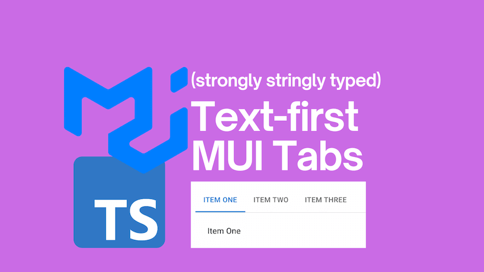

I love the Material-UI (MUI) library for React. It's a fantastic library that provides a lot of components out of the box. One of the components that I use frequently is the tabs component. However, I've found that the tabs component can be a little tricky to use in a text-first way that remains strongly typed. This post documents how to use the MUI tabs component in a text-first way that remains strongly typed.



<!--truncate-->

## Official example

The tabs component in MUI is a great way to display content in a tabbed interface:


The official MUI documentation provides an example of how to use the tabs component:

```tsx
import * as React from 'react';
import Tabs from '@mui/material/Tabs';
import Tab from '@mui/material/Tab';
import Typography from '@mui/material/Typography';
import Box from '@mui/material/Box';

interface TabPanelProps {
  children?: React.ReactNode;
  index: number;
  value: number;
}

function CustomTabPanel(props: TabPanelProps) {
  const { children, value, index, ...other } = props;

  return (
    <div
      role="tabpanel"
      hidden={value !== index}
      id={`simple-tabpanel-${index}`}
      aria-labelledby={`simple-tab-${index}`}
      {...other}
    >
      {value === index && (
        <Box sx={{ p: 3 }}>
          <Typography>{children}</Typography>
        </Box>
      )}
    </div>
  );
}

function a11yProps(index: number) {
  return {
    id: `simple-tab-${index}`,
    'aria-controls': `simple-tabpanel-${index}`,
  };
}

export default function BasicTabs() {
  const [value, setValue] = React.useState(0);

  const handleChange = (event: React.SyntheticEvent, newValue: number) => {
    setValue(newValue);
  };

  return (
    <Box sx={{ width: '100%' }}>
      <Box sx={{ borderBottom: 1, borderColor: 'divider' }}>
        <Tabs
          value={value}
          onChange={handleChange}
          aria-label="basic tabs example"
        >
          <Tab label="Item One" {...a11yProps(0)} />
          <Tab label="Item Two" {...a11yProps(1)} />
          <Tab label="Item Three" {...a11yProps(2)} />
        </Tabs>
      </Box>
      <CustomTabPanel value={value} index={0}>
        Item One
      </CustomTabPanel>
      <CustomTabPanel value={value} index={1}>
        Item Two
      </CustomTabPanel>
      <CustomTabPanel value={value} index={2}>
        Item Three
      </CustomTabPanel>
    </Box>
  );
}
```

This example is great, but (personally) I find it a little hard to read. There's a direct relationship between the tabs and the tab panels, but it's not immediately obvious. When you see the `0` passed to `a11yProps` and the `0` passed to `CustomTabPanel`, it's not immediately clear that they're related. And if the `a11yProps` function call was not present, it would be even less clear.

I'd like to see the tabs and tab panels together in a more text-first way.

## Text-first tabs

The code I'd like to see would look something like this:

```tsx
<Box sx={{ width: '100%' }}>
  <Box sx={{ borderBottom: 1, borderColor: 'divider' }}>
    <Tabs
      value={selectedTab}
      onChange={handleChange}
      aria-label="basic tabs example"
    >
      <Tab {...customTabProps('Item One')} />
      <Tab {...customTabProps('Item Two')} />
      <Tab {...customTabProps('Item Three')} />
    </Tabs>
  </Box>
  <CustomTabPanel selectedTab={selectedTab} tab="Item One">
    Item One
  </CustomTabPanel>
  <CustomTabPanel selectedTab={selectedTab} tab="Item Two">
    Item Two
  </CustomTabPanel>
  <CustomTabPanel selectedTab={selectedTab} tab="Item Three">
    Item Three
  </CustomTabPanel>
</Box>
```

In this code snippet, the tabs and tab panels are together in a more text-first way. The `customTabProps` function is used to generate the props for the tabs (it's an evolution of the `a11yProps` function that handles accessibility props as well as all others). The `CustomTabPanel` component is used to render the tab panels. The `selectedTab` state is used to keep track of the selected tab.

How does this work? And is it strongly typed? Let's find out.

## Strongly typed tabs

Yes, it's strongly typed! We achieve this by defining a mapping of tab text to tab index:

```ts
const tabs = {
  'Item One': 0,
  'Item Two': 1,
  'Item Three': 2,
} as const;

type TabText = keyof typeof tabs;

type TabIndex = (typeof tabs)[TabText];
```

So "Item One" is `0`, "Item Two" is `1`, and "Item Three" is `2`.

We then do some TypeScript magic to strongly type this. We use `as const` to tell TypeScript this is an immutable object. With that done we can then extract the keys and values from the object and use them to create the types `TabText` and `TabIndex`. So `TabText` is `"Item One" | "Item Two" | "Item Three"` and `TabIndex` is `0 | 1 | 2`. If we should subsequently amend the `tabs` object in our code, TypeScript will ensure that the `TabText` and `TabIndex` types are updated accordingly.

We can then use these types in our components:

```tsx
function customTabProps(tab: TabText) {
  const index = tabs[tab];
  return {
    id: `simple-tab-tab-${index}`,
    'aria-controls': `simple-tab-tabpanel-${index}`,
    label: tab,
  };
}

interface CustomTabPanelProps {
  children?: React.ReactNode;
  tab: TabText;
  selectedTab: TabIndex;
}

function CustomTabPanel(props: CustomTabPanelProps) {
  const { children, selectedTab, tab, ...other } = props;
  const index = tabs[tab];

  return (
    <div
      role="tabpanel"
      hidden={selectedTab !== index}
      id={`simple-tab-tabpanel-${index}`}
      aria-labelledby={`simple-tab-tab-${index}`}
      {...other}
    >
      {selectedTab === index && (
        <Box sx={{ p: 3 }}>
          <Typography>{children}</Typography>
        </Box>
      )}
    </div>
  );
}
```

Then our final example code looks like this:

```tsx
export default function BasicTabs() {
  const [selectedTab, setSelectedTab] = React.useState<TabIndex>(
    tabs['Item One'],
  );
  const handleChange = (event: React.SyntheticEvent, newValue: TabIndex) => {
    setSelectedTab(newValue);
  };

  return (
    <Box sx={{ width: '100%' }}>
      <Box sx={{ borderBottom: 1, borderColor: 'divider' }}>
        <Tabs
          value={selectedTab}
          onChange={handleChange}
          aria-label="basic tabs example"
        >
          <Tab {...customTabProps('Item One')} />
          <Tab {...customTabProps('Item Two')} />
          <Tab {...customTabProps('Item Three')} />
        </Tabs>
      </Box>
      <CustomTabPanel selectedTab={selectedTab} tab="Item One">
        Item One
      </CustomTabPanel>
      <CustomTabPanel selectedTab={selectedTab} tab="Item Two">
        Item Two
      </CustomTabPanel>
      <CustomTabPanel selectedTab={selectedTab} tab="Item Three">
        Item Three
      </CustomTabPanel>
    </Box>
  );
}
```

Note how we use our `TabIndex` types to strongly type the `selectedTab` state and the `handleChange` function. And also how the `TabText` type is used to strongly type the `tab` prop in the `CustomTabPanel` component and the `tab` argument in the `customTabProps` function. With this in place, we cannot provide invalid tab text to the `customTabProps` function or the `CustomTabPanel` component. TypeScript would fight us every step of the way if we tried.

## Conclusion

So now we have a strongly typed, text-first way to use the MUI tabs component. We've used TypeScript to ensure that our tabs and tab panels are related in a way that is clear and easy to understand. This approach makes our code more maintainable and easier to work with. The full code is below:

```tsx
import * as React from 'react';
import Tabs from '@mui/material/Tabs';
import Tab from '@mui/material/Tab';
import Typography from '@mui/material/Typography';
import Box from '@mui/material/Box';

const tabs = {
  'Item One': 0,
  'Item Two': 1,
  'Item Three': 2,
} as const;

type TabText = keyof typeof tabs;

type TabIndex = (typeof tabs)[TabText];

function customTabProps(tab: TabText) {
  const index = tabs[tab];
  return {
    id: `simple-tab-tab-${index}`,
    'aria-controls': `simple-tab-tabpanel-${index}`,
    label: tab,
  };
}

interface CustomTabPanelProps {
  children?: React.ReactNode;
  tab: TabText;
  selectedTab: TabIndex;
}

function CustomTabPanel(props: CustomTabPanelProps) {
  const { children, selectedTab, tab, ...other } = props;
  const index = tabs[tab];

  return (
    <div
      role="tabpanel"
      hidden={selectedTab !== index}
      id={`simple-tab-tabpanel-${index}`}
      aria-labelledby={`simple-tab-tab-${index}`}
      {...other}
    >
      {selectedTab === index && (
        <Box sx={{ p: 3 }}>
          <Typography>{children}</Typography>
        </Box>
      )}
    </div>
  );
}

export default function BasicTabs() {
  const [selectedTab, setSelectedTab] = React.useState<TabIndex>(
    tabs['Item One'],
  );
  const handleChange = (event: React.SyntheticEvent, newValue: TabIndex) => {
    setSelectedTab(newValue);
  };

  return (
    <Box sx={{ width: '100%' }}>
      <Box sx={{ borderBottom: 1, borderColor: 'divider' }}>
        <Tabs
          value={selectedTab}
          onChange={handleChange}
          aria-label="basic tabs example"
        >
          <Tab {...customTabProps('Item One')} />
          <Tab {...customTabProps('Item Two')} />
          <Tab {...customTabProps('Item Three')} />
        </Tabs>
      </Box>
      <CustomTabPanel selectedTab={selectedTab} tab="Item One">
        Item One
      </CustomTabPanel>
      <CustomTabPanel selectedTab={selectedTab} tab="Item Two">
        Item Two
      </CustomTabPanel>
      <CustomTabPanel selectedTab={selectedTab} tab="Item Three">
        Item Three
      </CustomTabPanel>
    </Box>
  );
}
```

It's certainly more complicated than the official example (and this may well be why the official example is the way it is), but I find it easier to work with and understand. I hope you do too!
