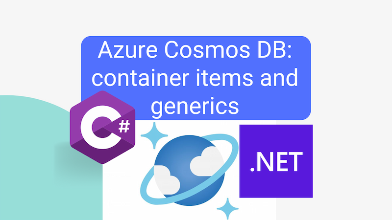

Cosmos DB is a great database for storing objects. But what if you want to store subtly different types of object in the same container? This post demonstrates how you can use generics to store and retrieve different types of object in an Azure Cosmos DB Container using C#.



<!--truncate-->

## The problem

The situation I have in mind isn't entirely different types of object. Rather, it's a standard type of object with a single property that can be of different types. Consider the following record:

```json
{
  "id": "overview",
  "itemName": "vw-beetle",
  "type": "car",
  "data": {
    "Wheels": 4,
    "Colour": "blue"
  },
  "createdAt": "2024-03-28T10:55:57.860484+00:00",
  "createdBy": "john.reilly",
  "updatedAt": "2024-03-28T14:31:37.9882095+00:00",
  "updatedBy": "john.reilly",
  "_rid": "NisFAIjrg3wFAAAAAAAAAA==",
  "_self": "dbs/NisFAA==/colls/NisFAIjrg3w=/docs/NisFAIjrg3wFAAAAAAAAAA==/",
  "_etag": "\"bd005ad6-0000-0c00-0000-66057f4a0000\"",
  "_attachments": "attachments/",
  "_ts": 1711636298
}
```

The `data` property is a JSON object that can be of any shape. In this case, it's a car with four wheels and a blue colour. But it could just as easily be a house with a number of rooms and a garden. Or a person with a name and an age. Or a book with a title and an author. You get the idea.

How can we store and retrieve these objects in a Cosmos DB container with C#?

## A generic solution

The answer is to use generics. Here's the `MyItem` record that we're using in the above code:

```cs title="MyItem.cs"
namespace ContainerApp.Model.Database;

#pragma warning disable IDE1006

public record MyItem(
    string id,
    /// <summary>
    /// This is the partition key
    /// </summary>
    string itemName,
    string type,
    DateTimeOffset createdAt,
    string createdBy,
    DateTimeOffset updatedAt,
    string updatedBy
) : MyItem<object>(id, creditReviewPackName, itemName, type, null, createdAt, createdBy, updatedAt, updatedBy);

public record MyItem<TData>(
    string id,
    /// <summary>
    /// This is the partition key
    /// </summary>
    string itemName,
    string type,
    TData? data,
    DateTimeOffset createdAt,
    string createdBy,
    DateTimeOffset updatedAt,
    string updatedBy
);

#pragma warning restore IDE1006
```

The `MyItem` record is a generic record with a single type parameter `TData`. The first record is a convenience record that uses `object` as the type parameter. This is the record that we'll use when we're writing a record that does not have a `data` property, or when we're reading a record and we don't initially care about the `data` property.

The `type` field represents the type of `data`. This is a string that can be used to distinguish between different types of object. In the example above, the type is "car". In other examples, the type might be "house", "person", or "book". We can use this in future to filter the data by type and to deserialize the `data` property into the correct C# type; for instance `Car`. We just need to know how the `type` string maps to a particular C# type.

## Writing to and reading from the Cosmos DB container

In the `DatabaseMyItemService` class, we have methods to write to and read from the Cosmos DB container:

```cs title="DatabaseMyItemService.cs"
using System.Net;

using Microsoft.Azure.Cosmos;

using ContainerApp.Model.Database;
using ContainerApp.Utilities;

namespace ContainerApp.Services;

public class DatabaseMyItemService : IDatabaseMyItemService
{
    public const string DatabaseName = "my-database";

    public const string ContainerNameMyItems = "my-items";

    private readonly CosmosClient _client;
    private readonly ILogger<DatabaseMyItemService> _logger;

    public DatabaseMyItemService(ILogger<DatabaseMyItemService> logger, AppSettings appSettings)
    {
        _client = new CosmosClient(connectionString: appSettings.CosmosConnectionString);
        _logger = logger;
    }

    public async Task<MyItem<TData>?> UpsertItem<TData>(MyItem<TData> myItem)
    {
        try
        {
            _logger.LogInformation($"Upserting {nameof(MyItem)} with {nameof(myItem.itemName)}: {{{nameof(myItem.itemName)}}}", myItem.itemName);

            var container = _client
                .GetDatabase(DatabaseName)
                .GetContainer(ContainerNameMyItems);

            MyItem<TData>? savedItem = await container.UpsertItemAsync(myItem, new PartitionKey(myItem.itemName));

            return savedItem;
        }
        catch (CosmosException ex)
        {
            _logger.LogError(ex, $"Problem upserting {nameof(MyItem)} with {nameof(myItem.itemName)}: {{{nameof(myItem.itemName)}}}", myItem.itemName);
            throw new Exception($"Problem upserting {nameof(MyItem)} with {nameof(myItem.itemName)}: {myItem.itemName}", ex);
        }
    }

    public async Task<MyItem<TData>?> GetItem<TData>(string itemName)
    {
        try
        {
            _logger.LogInformation($"Looking up {nameof(MyItem)} with {nameof(itemName)}: {{{nameof(itemName)}}}", itemName);

            var container = _client
                .GetDatabase(DatabaseName)
                .GetContainer(ContainerNameMyItems);

            // In this simplified example we're intentionally using id as partition key - https://stackoverflow.com/questions/54636852/implications-of-using-id-for-the-partition-key-in-cosmosdb
            MyItem<TData>? myItem = await container.ReadItemAsync<MyItem<TData>>(itemName, new PartitionKey(itemName));

            return myItem;
        }
        catch (CosmosException ex) when (ex.StatusCode == HttpStatusCode.NotFound)
        {
            return null;
        }
    }

    public async Task<List<MyItem>> GetItems(string itemName)
    {
        try
        {
            _logger.LogInformation($"Looking up {nameof(MyItem)}s by {nameof(itemName)}: {{{nameof(itemName)}}}", itemName);

            var container = _client
                .GetDatabase(DatabaseName)
                .GetContainer(ContainerNameMyItems);

            List<MyItem> myItems = await container.GetItemQueryIterator<MyItem>(
                new QueryDefinition(
                    "SELECT * FROM c WHERE c.itemName = @itemName"
                ).WithParameter("@itemName", itemName)
            ).ReadAllToListAsync();

            return myItems;
        }
        catch (CosmosException ex)
        {
            _logger.LogError(ex, $"Problem getting {nameof(MyItem)}s by {nameof(itemName)}: {{{nameof(itemName)}}}", itemName);
            throw new Exception($"Problem getting {nameof(MyItem)}s by {nameof(itemName)}: {itemName}", ex);
        }
    }
}
```

You'll note that the `UpsertItem` and `GetItem` methods are generic methods that take and return a `MyItem<TData>` record respectively. The `GetItems` method is not generic because it returns a list of `MyItem` records, which are the non-generic records; where `data` is of type `object?`.

Imagine, you might use the `GetItems` method to get all the items. If you wanted to load a particular item, in a strongly typed fashion, you might subsequently use the `GetItem` method to load a single item with a particular type, like so:

```cs
var myCar = await _databaseMyItemService.GetItem<Car>("the-car");
```

## Deserializing the `data` property with `JSON.NET`

If you want to avoid requerying the database to get the object in strongly typed form, you'll need to convert the `data` property into a C# object of a specific type. If you've retrieved the non-generic `MyItem` from Cosmos, as far as C# is concerned, the `data` property is just an `object?` at this point. Well, that's not quite true. It's actually a `JObject` from the `Newtonsoft.Json` library. (This is because the Cosmos DB SDK uses `Newtonsoft.Json` internally.)

You can use `JObject.ToObject<T>()` to convert the `data` property into a C# object of a specific type. Here's an example of how you might do this:

```cs
var data = item.data is not Newtonsoft.Json.Linq.JObject dataJObject
    ? null
    : dataJObject.ToObject<Car>();
```

## Deserializing the `data` property with `System.Text.Json`

You may well find yourself wanting to send a list of items to the front end. However, because the default serializer of ASP.NET is `System.Text.Json.JsonSerializer` you'll need a different approach to deal with the `JObject`, as you can't send a `JObject` to the front end. You need to deserialize it into a format that can be sent to the front end.

It's quite typical to have a method that converts a domain model to a view model; something like this:

```cs
public record MyItemViewModel(
    string ItemName,
    string Type,
    object? Data,
    DateTimeOffset CreatedAt,
    string CreatedBy,
    DateTimeOffset UpdatedAt,
    string UpdatedBy
);
```

Here's an example of how you might convert our domain model to our view model. It includes a mechanism that uses `System.Text.Json.JsonSerializer` to deserialize the `data` property into an `object?` that **can** be sent to the front end:

```cs
public static MyItemViewModel ItemToItemViewModel(MyItem item)
{
    var data = creditReviewPackItem.data switch
    {
        Newtonsoft.Json.Linq.JObject dataJObject => System.Text.Json.JsonSerializer.Deserialize<object>(dataJObject.ToString()),
        Newtonsoft.Json.Linq.JArray dataJArray => System.Text.Json.JsonSerializer.Deserialize<object>(dataJArray.ToString()),
        _ => null
    };

    return new(
        ItemName: item.itemName,
        Type: item.type,
        Data: data,
        CreatedAt: item.createdAt,
        CreatedBy: item.createdBy,
        UpdatedAt: item.updatedAt,
        UpdatedBy: item.updatedBy
    );
}
```

## Conclusion

In this post, we've seen how you can use generics to store and retrieve different types of object in an Azure Cosmos DB Container using C#. We've seen how you can use a generic record to store objects with a single property that can be of different types. We've also seen how you can use `Newtonsoft.Json` to deserialize the `data` property into a C# object of a specific type. And we've seen how you can use `System.Text.Json` to deserialize the `data` property into an `object?` that can be sent to the front end.
