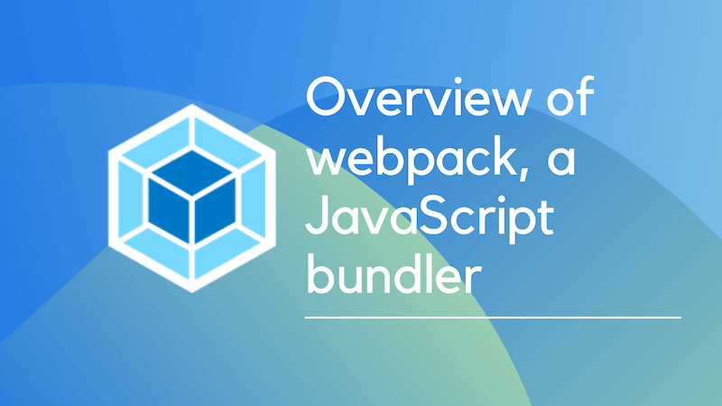
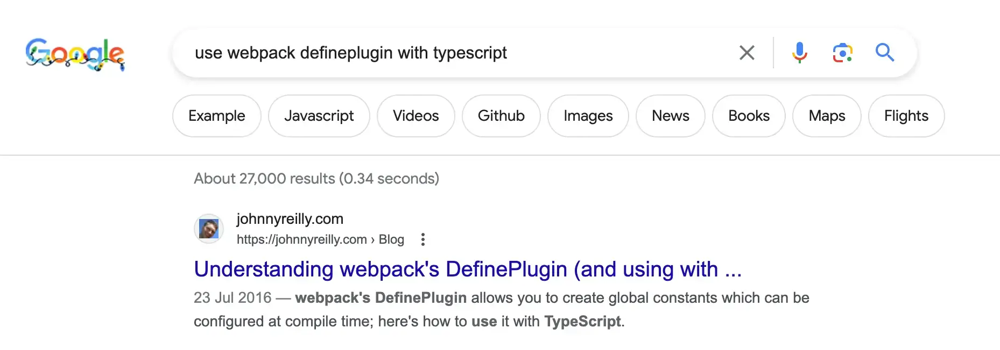
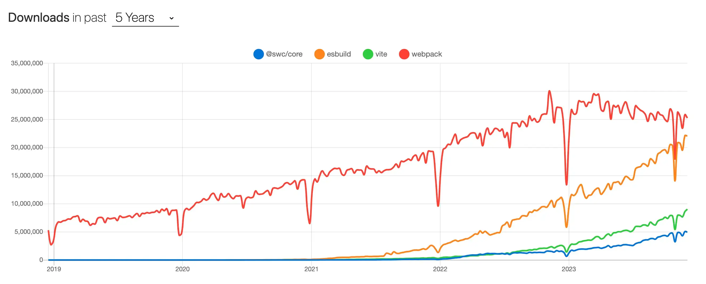

If you're a JavaScript developer, you've probably heard of webpack. It's a JavaScript bundler that helps you bundle your code into a single file. It's a great tool for optimizing your code and improving performance. This article will give you an overview of webpack, its history and how it works.

It'll be a little different than your typical "what is webpack?" article, in that I write this as the maintainer of [`ts-loader`](https://github.com/TypeStrong/ts-loader), a loader used for integrating TypeScript with webpack. I've worked in the webpack ecosystem for some years now and I'll share some of my experiences with you. I'll go through a little history around bundling, and try to understand why webpack came to be such a popular choice.



<!--truncate-->

## A short history of web development

To answer the question "what is webpack?", we need to understand what a bundler is. To grasp that, we first need a little history lesson.

### The early days of JavaScript

If you started web development after 2016, you might not realise that bundling is a relatively new concept.

Let's roll back the clock to the late 2000's. This was when JavaScript development started to go mainstream. Around that time, jQuery was becoming popular and the web was a very different place. We didn't have the same tools we have today. We didn't have npm, we didn't have webpack, we didn't have React, we didn't have TypeScript. We didn't even have ES2015. We were still writing JavaScript in ES5.

So what did building a front end application look like back then? Well, I was a web developer, and I can tell you that it was a lot of work. To make a simple app you would have to:

- Go to the websites of libraries you wanted to use, usually jQuery and jQuery UI.
- Download the library files you needed (both `jquery-1.4.4.js` and the minified `jquery-1.4.4.min.js` because there weren't minification tools back then)
- Include the library files in your HTML file using `script` tags, and significantly **before** other JavaScript files that would depend upon jQuery.
- For bonus points, you would also download the jQuery UI CSS files and include them in your HTML file.
- For extra bonus points, you would figure out a way to serve up non-minified versions of your JavaScript files in development, and minified versions in production.

What I'm hoping you can see from this is that it was a lot of work. And it was very error prone. If you forgot to include a library, or included it in the wrong order, or included the wrong version, or forgot to minify your files, or forgot to include the CSS files, your app would break. And it would be very difficult to debug.

### Rise of the task runners

As web development became more popular, people started to realise that there was a lot of repetition in the process. So they started to automate it. Around 2012 we started to see the birth of the task runner. There were two main task runners that became popular: [Grunt](https://gruntjs.com/) and [Gulp](https://gulpjs.com/).

These task runners allowed you to automate the process of combining and minifying JavaScript and CSS files, and including them in your HTML file. They also allowed you to automate other tasks, like running tests, linting your code, and deploying your app. They did improve the web development experience, but they didn't solve all the problems.

It was still very easy to make mistakes. You could still forget to include a library, or include it in the wrong order, or get a path wrong, or forget to minify your files, or forget to include the CSS files. And it was still very difficult to debug.

But it was **so much better** than what we had before. So it became very popular.

### The rise of the module bundler

Around 2014, a new tool started to become popular: the module bundler. But what is a module bundler? Well, it's a tool that allows you to write your code in modules, and then bundle those modules into a single file. It also allows you to use other tools, like TypeScript, and CSS preprocessors like Sass and Less.

That's a lot of words, let's unpack them a little. For some time, the defacto way of acquiring JavaScript libraries has been through npm. npm is a package manager for JavaScript. However, it's worth remembering its history. npm started out as the package manager for Node.js. It was originally used to house packages that were used to build Node.js applications. It was never intended to be used for front end development. In fact, for a while there was an alternative front end package manager called [Bower](https://bower.io/).

The thing is, there's a lot of commonality between Node.js and front end development. Both use JavaScript. You're unlikely to need to run a web server in the browser. However, whether running in a browser or on a server, you might want to order an array with lodash, or make use of TypeScript, or perform validation with Zod. So it makes sense to use the same package manager for both.

The first tool that tackled this was [Browserify](http://browserify.org/). As the name suggests, it was a tool that allowed you to use Node.js style modules in the browser. It did this by taking your code, and recursively walking through it, finding all the `require` calls, and bundling them into a single file.

By doing this, it performed two useful functions:

1. It opened up the ecosystem of Node.js packages to front end developers.
2. It allowed you to write your code in modules, which made it easier to reason about.

Both of these are tremendously significant. The first one is obvious; there's a rich ecosystem of modules which can be used to speed up the task of web development.

The value of modularity is less obvious, but it's very important. It's worth remembering that JavaScript didn't have modules until ES2015. But npm had its own module standard called CommonJS. Given that Browserify and webpack were both created before ES2015, they both used CommonJS modules in the context of the browser. This was a huge improvement over the previous way of doing things, which was to include a bunch of script tags in your HTML file, and writing all your code in a giant global object. The reason it's so wildly different is because the dependencies in your codebase moved from being **implicit** to being **explicit**. Instead of having to remember to include a bunch of script tags in your HTML file, you could just `require` the modules you needed. This made it much easier to reason about your codebase. What's more, you had a a `package.json` file that listed all your dependencies, so you could see at a glance what your dependencies were.

## What is webpack?

Now we understand a little of the history, we come to webpack. By the way, it's definitely not "Webpack" or "WebPack". It's ["webpack"](https://webpack.js.org/branding/). The person initially behind webpack is [Tobias Koppers](https://github.com/sokra); an engineer from Germany. Many, many people have contributed to the project since then, but Tobias is the person who has done the most work on it.

I mentioned that I was a web developer whilst the web was evolving its developer tooling. In my case I was a longtime user of Gulp, and then Browserify. I moved to webpack in 2015. I can't remember exactly why I moved, but I think it was because I wanted to use TypeScript, and webpack had better TypeScript support than Browserify (more on this later). I also think I was attracted to webpack because it was a more holistic solution than Browserify. It had a plugin system, and it had loaders. I'll talk about those in a moment.

First and foremost, it's worth saying that webpack is a module bundler. It takes your code, and recursively walks through it, finding all the `require` or `import` calls, building up a dependency graph, performing preprocessing tasks and producing runnable output, in the form of HTML, CSS and JavaScript. It also allows you to use other tools, like TypeScript, and CSS preprocessors like Sass and Less.

One of the most surprising things about webpack has been both its popularity, and how it has lasted. The web development world is famous for having the attention span of a distracted toddler. Tools replace tools, libraries replace libraries, and frameworks replace frameworks. But webpack has been around for a long time, and it's still the most popular bundler. At the time of writing it still has **110 million downloads a month**. That's a lot! Why is that?

I think there are a few reasons.

Firstly, because of the richness of the ecosystem and the flexibility of the tool, it's possible to solve pretty much all web development problems with webpack. There are newer, shinier, faster tools (and as we'll see later, webpack is starting to be displaced by some of these) but as a reliable tool that can solve all your problems, webpack is hard to beat.

That doesn't mean it's the easiest tool to work with on all occasions. The internet is awash with people bitterly complaining about the scars they bear from configuring webpack. It's true that webpack can be difficult to configure. But it's also true that webpack is a very powerful tool. Once you have it working, you generally don't have to touch it again.

A second reason why webpack is so popular, is that it has become a "primitive". What I mean by that, is that it has become a library that other libraries depend upon. If you use Docusaurus, you're also using webpack as the underlying build tool. Many projects have a need of a build tool and have picked webpack to be that. This has led to a huge ecosystem of plugins and loaders. It's also led to a plethora of tutorials and blog posts. If you have a problem, it's likely that someone else has had the same problem and has written a blog post about it.

By way of example, a [blog post I wrote in 2016 about the webpack `DefinePlugin`](https://johnnyreilly.com/using-webpacks-defineplugin-with-typescript) still ranks highly in Google for "use webpack defineplugin with typescript" and is (to my surprise) one of my most popular blog posts. Here's a screenshot of it in the Google search results:



This speaks to the level of popularity around all things webpack.

## Getting started

This article is intended to be an overview of webpack. The documentation, as you might expect from such a big project, is comprehensive and can be found here: https://webpack.js.org

Whilst we won't go through every scenario and use case of webpack, we want to give you a sense of what working with webpack looks like. For the purposes of this article, let's get started with a simple example. We'll create a simple "Hello, webpack" app. And we'll enrich it as we go through the piece.

## Creating a simple app

First, let's make a folder, create a `package.json` file and install the webpack dependencies we need:

```bash
mkdir hello-webpack
cd hello-webpack
npm init -y
npm install webpack webpack-cli webpack-dev-server html-webpack-plugin --save-dev
```

The dependencies we're installing are:

- webpack
- [`webpack-cli`](https://github.com/webpack/webpack-cli) - a command line interface for webpack
- [`webpack-dev-server`](https://webpack.js.org/configuration/dev-server/) - a development server that allows you to serve up your app in a browser
- [`html-webpack-plugin`](https://github.com/jantimon/html-webpack-plugin/) - a plugin that allows you to generate an HTML file that includes your bundled JavaScript file(s)

### Configuration with `webpack.config.js`

Whilst it is possible to use webpack without configuring it, it's more typical to have a configuration file. This file is often called `webpack.config.js`; where a single configuration file is being used. It's also comon to may have more than one configuration file; perhaps one for development and one for production. We'll create a single `webpack.config.js` to use with our example app:

```javascript
const path = require('path');
const HtmlWebpackPlugin = require('html-webpack-plugin');

module.exports = {
  mode: 'development', // mode can be "development", "production" or "none" https://webpack.js.org/configuration/mode/
  entry: './src/index.js', // the entry point of our app https://webpack.js.org/concepts/entry-points/
  devtool: 'inline-source-map', // the type of sourcemap to generate for debugging https://webpack.js.org/configuration/devtool/
  plugins: [
    new HtmlWebpackPlugin(), // a plugin to generate an HTML file https://github.com/jantimon/html-webpack-plugin
  ],
  output: {
    // where to put the bundled output https://webpack.js.org/concepts/output/
    filename: '[name].[contenthash].js',
    path: path.resolve(__dirname, 'dist'),
    clean: true,
  },
};
```

This may seem a little overwhelming, so we'll through this configuration file property by property in a moment.

The one thing that you might be puzzled by, is the absence of a `module` section to cover loaders. This is because webpack supports processing JavaScript by default. We'll add a `module` section later when we want to process other types of files.

#### `mode`

This is the mode that webpack will run in, and it essentially tells webpack to provide helpful defaults around how builds are performed. It can be `development`, `production` or `none`. We're using `development` because we're developing locally. If we were building for production, we'd use `production`.

Read more about modes here: https://webpack.js.org/configuration/mode/

Incidentally, we can override this on the command line with the `--mode` flag. And we will.

#### `entry`

This is the entry point of our app. It's the file that webpack will start with. In this case, it's `src/index.js`. It is possible to have multiple entry points, but we'll keep it simple for now.

Read more about entry points here: https://webpack.js.org/concepts/entry-points/

#### `devtool`

This is the type of sourcemap that webpack will generate. We're using `inline-source-map` because we're developing locally and we'd like to be able to debug our source code in the browser. If we were building for production, we might make a different choice.

Read more about sourcemaps here: https://webpack.js.org/configuration/devtool/ - there are many different types of sourcemap, and they all have different tradeoffs.

#### `plugins`

This is a list of plugins that we want to use. We're using the `HtmlWebpackPlugin` to generate an HTML file that includes our bundled JavaScript file(s).

Read more about plugins here: https://webpack.js.org/concepts/plugins/ - we'll talk more about plugins later.

#### `output`

This is where we want webpack to put the bundled output. We're using `dist` as the folder name. We're also using a `[name].[contenthash].js` naming convention for our bundled JavaScript file. This means that webpack will generate a file called `main.[contenthash].js` in the `dist` folder. The `[contenthash]` part is a hash of the contents of the file. This is useful because it means that if the contents of the file change, the hash will change, and the filename will change. This helps because it means that we can cache the file for a long time, and if the contents change, the filename will change and the browser will download the new file.

We're also providing the [`clean: true`](https://webpack.js.org/guides/output-management/#cleaning-up-the-dist-folder) option which deletes the contents of our `dist` folder on each build.

Read more about output here: https://webpack.js.org/concepts/output/

### Creating a simple app

What we need now, is some code to bundle. Let's create a `src` folder, and a `src/index.js` file; our first JavaScript file:

```javascript
function app() {
  const element = document.createElement('div');

  element.innerHTML = 'Hello, webpack';

  return element;
}

document.body.appendChild(app());
```

### Local development with `webpack-dev-server`

Now we're going to add two scripts to our `package.json` file. One to build our app, and one to serve it up in a browser whilst we're developing it:

```json
  "scripts": {
    "build": "webpack build --mode production",
    "start": "webpack serve --open"
  },
```

With this in place, we can develop locally with `npm start`. This will serve up our app in a browser at `http://localhost:8080/` using `webpack-dev-server`:

```bash
> hello-webpack@1.0.0 start
> webpack serve --open

<i> [webpack-dev-server] Project is running at:
<i> [webpack-dev-server] Loopback: http://localhost:8080/
<i> [webpack-dev-server] On Your Network (IPv4): http://172.30.170.28:8080/
<i> [webpack-dev-server] On Your Network (IPv6): http://[fe80::1]:8080/
<i> [webpack-dev-server] Content not from webpack is served from '/Users/jreilly/code/github.com/hello-webpack/public' directory
<i> [webpack-dev-middleware] wait until bundle finished: /
asset main.4d4379bc3adfa037dc27.js 621 KiB [emitted] [immutable] (name: main)
asset index.html 252 bytes [emitted]
runtime modules 27.3 KiB 12 modules
modules by path ./node_modules/ 178 KiB
  modules by path ./node_modules/webpack-dev-server/client/ 71.8 KiB 16 modules
  modules by path ./node_modules/webpack/hot/*.js 5.3 KiB
    ./node_modules/webpack/hot/dev-server.js 1.94 KiB [built] [code generated]
    ./node_modules/webpack/hot/log.js 1.86 KiB [built] [code generated]
    + 2 modules
  modules by path ./node_modules/html-entities/lib/*.js 81.8 KiB
    ./node_modules/html-entities/lib/index.js 7.91 KiB [built] [code generated]
    ./node_modules/html-entities/lib/named-references.js 73 KiB [built] [code generated]
    ./node_modules/html-entities/lib/numeric-unicode-map.js 339 bytes [built] [code generated]
    ./node_modules/html-entities/lib/surrogate-pairs.js 537 bytes [built] [code generated]
  ./node_modules/ansi-html-community/index.js 4.16 KiB [built] [code generated]
  ./node_modules/events/events.js 14.5 KiB [built] [code generated]
./src/index.js 163 bytes [built] [code generated]
webpack 5.89.0 compiled successfully in 861 ms
```

If we open the browser at `http://localhost:8080`, we'll see our "Hello, webpack" message.

### Building for production

We can build our app for production with `npm run build`:

```bash
npm run build

> hello-webpack@1.0.0 build
> webpack build --mode production

asset main.82d3f64b186c8eec8e7c.js 862 bytes [emitted] [immutable] [minimized] (name: main)
asset index.html 235 bytes [emitted]
./src/index.js 163 bytes [built] [code generated]
webpack 5.89.0 compiled successfully in 516 ms
```

This has created a `dist` folder, and a `dist/index.html` file. Alongside that, it's created a `dist/main.82d3f64b186c8eec8e7c.js` file. If you open the `index.html` file in a browser, you'll see your "Hello, webpack" message.

At this point we have a simple app built with webpack. It's not doing much, but it's a start. And it'll give us a chance to talk about some concepts. Let's add some more features.

## Integrating with plugins and loaders

If you want to do anything more than the most basic of apps, you'll need to use plugins and loaders. Let's add some more features to our app, and we'll use plugins and loaders to do it.

### Loaders

The first thing we'll do is look at loaders. Loaders allow webpack to process other types of files (for example, TypeScript) and convert them into valid modules that can be consumed by your application and added to the dependency graph. An example of a loader is [`ts-loader`](https://github.com/TypeStrong/ts-loader) which allows you to use TypeScript with webpack.

I should not brush past this, I'm the primary maintainer of `ts-loader` and I'm very proud of it. It gets around 30 million downloads a month at the time of writing. That suggests that roughly a quarter of webpacks users are also `ts-loader` users. `ts-loader` is a great loader, and I'm very happy to have worked on it since 2016. There's actually a story behind how I came to work on it, [you can read it here](https://johnnyreilly.com/but-you-cant-die-i-love-you-ts-loader).

Let's install `ts-loader` and TypeScript, and create a `tsconfig.json` file:

```bash
npm install typescript ts-loader --save-dev
npx tsc --init
```

Now we need to configure webpack to use `ts-loader`. We do this by updating our entry point to be a TypeScript file and adding a `module` section to our `webpack.config.js` file:

```diff
const path = require('path');
const HtmlWebpackPlugin = require('html-webpack-plugin');

module.exports = {
  mode: 'development', // mode can be "development", "production" or "none" https://webpack.js.org/configuration/mode/
-  entry: './src/index.js', // the entry point of our app https://webpack.js.org/concepts/entry-points/
+  entry: './src/index.ts', // the entry point of our app https://webpack.js.org/concepts/entry-points/
  devtool: 'inline-source-map', // the type of sourcemap to generate for debugging https://webpack.js.org/configuration/devtool/
  plugins: [
    new HtmlWebpackPlugin(), // a plugin to generate an HTML file https://github.com/jantimon/html-webpack-plugin
  ],
+  module: {
+    rules: [
+      {
+        test: /\.([cm]?ts|tsx)$/,
+        loader: 'ts-loader',
+      },
+    ],
+  },
  output: {
    // where to put the bundled output https://webpack.js.org/concepts/output/
    filename: '[name].[contenthash].js',
    path: path.resolve(__dirname, 'dist'),
    clean: true,
  },
};
```

The `test` property is a regular expression that matches the files we want to process. In this case, we're matching `.ts`, `.tsx`, `.cts` and `.cts` files. The `loader` property is the name of the loader we want to use; `ts-loader`.

Let's rename our `src/index.js` file to `src/index.ts` and change the code to use TypeScript:

```typescript
function app(): HTMLDivElement {
  // the only TypeScript change we made is to add a return type
  const element = document.createElement('div');

  element.innerHTML = 'Hello, webpack';

  return element;
}

document.body.appendChild(app());
```

And just like that, we can use TypeScript in our app!

What is `ts-loader` actually doing? Well, it's taking our TypeScript code, and converting it into JavaScript. For each TypeScript file, `ts-loader` is invoked. It takes the TypeScript code, and passes it to the TypeScript compiler. The TypeScript compiler converts the TypeScript code into JavaScript. `ts-loader` then takes the JavaScript code and passes it to webpack. webpack then takes the JavaScript code and bundles it.

This is what all loaders do; they take a file, process it, and pass it to webpack. There are many loaders available, and you can even write your own. They aren't restricted to languages that compile to JavaScript. You can find a list of loaders here: https://webpack.js.org/loaders/

### Plugins

We've covered loaders, now we'll cover plugins. Plugins allow you to do all kinds of things with webpack. The definition in the webpack documentation is delightfully broad:

> Plugins are the backbone of webpack. ... They serve the purpose of doing anything else that a loader cannot do.

This is helpful when you remind yourself that a loader takes a file, processes it, and passes the output of that processing to webpack. It is single-file-oriented, if you like. A plugin is what you use when you want to do something that isn't single-file-oriented.

So maybe it's easier to give you some examples. We already have one plugin in our app, the `HtmlWebpackPlugin`. This plugin generates an HTML file that includes our bundled JavaScript file(s).

#### `DefinePlugin`

Let's add another plugin to our app. We'll add the [`DefinePlugin`](https://webpack.js.org/plugins/define-plugin/). This plugin allows you to define global constants that can be used in your code. Let's add it to our `webpack.config.js` file:

```diff
const path = require("path");
+const webpack = require("webpack");
const HtmlWebpackPlugin = require("html-webpack-plugin");

module.exports = {
  mode: "development",
  entry: './src/index.ts', // the entry point of our app https://webpack.js.org/concepts/entry-points/
  devtool: "inline-source-map",
  plugins: [
      new HtmlWebpackPlugin(),
+      new webpack.DefinePlugin({
+        'MODE': JSON.stringify("PRODUCTION"),
+      })
  ],
  module: {
    rules: [
      {
        test: /\.([cm]?ts|tsx)$/,
        loader: 'ts-loader',
      },
    ],
  },
  output: {
    filename: "[name].[contenthash].js",
    path: path.resolve(__dirname, "dist"),
    clean: true,
  },
};
```

With the change above, we've added the `DefinePlugin` to our list of plugins. We've also defined a global constant called `MODE` that will be available in our code. We've set the value of `MODE` to be the value of the `NODE_ENV` environment variable. We'll use this in our code in a moment.

Let's update our `src/index.ts` file to use the `MODE` constant, and tell TypeScript about it:

```diff
+declare const MODE: string;

function app(): HTMLDivElement {
  const element = document.createElement("div");

-  element.innerHTML = 'Hello, webpack';
+  element.innerHTML = `Hello, webpack, we are in ${MODE} mode.`;

  return element;
}

document.body.appendChild(app());
```

Now if we build our app, we'll see that the `MODE` constant is available in our code, and we can use it. At runtime it will be replaced with the value we defined in our `webpack.config.js` file and our app will say:

> Hello, webpack, we are in PRODUCTION mode.

#### `fork-ts-checker-webpack-plugin`

Before we move on, let's add one more plugin to our app. We're going to add the [`fork-ts-checker-webpack-plugin`](https://github.com/TypeStrong/fork-ts-checker-webpack-plugin). This plugin allows you to run the TypeScript compiler in a separate process, and relieve `ts-loader` of the responsibility of handling type checking. This is useful because it means that webpack can run in parallel with the TypeScript compiler. This can significantly speed up your build times. I have worked on this plugin, as it has a sibling relationship with `ts-loader`. It's quite common to use both together; `ts-loader` to compile your code, and `fork-ts-checker-webpack-plugin` to type check it.

Let's install `fork-ts-checker-webpack-plugin`:

```bash
npm install fork-ts-checker-webpack-plugin --save-dev
```

And let's configure it in our `webpack.config.js` file:

```diff
const path = require("path");
const webpack = require("webpack");
const HtmlWebpackPlugin = require("html-webpack-plugin");
const ForkTsCheckerWebpackPlugin = require('fork-ts-checker-webpack-plugin');

module.exports = {
  mode: "development",
  entry: './src/index.ts', // the entry point of our app https://webpack.js.org/concepts/entry-points/
  devtool: "inline-source-map",
  plugins: [
      new HtmlWebpackPlugin(),
      new webpack.DefinePlugin({
        'MODE': JSON.stringify('PRODUCTION'),
      }),
+      new ForkTsCheckerWebpackPlugin()
  ],
  module: {
    rules: [
      {
        test: /\.([cm]?ts|tsx)$/,
        loader: 'ts-loader',
+        // we only need to explicitly specify transpileOnly option if you use ts-loader < 9.3.0
+        options: {
+          transpileOnly: true
+        }
      },
    ],
  },
  output: {
    filename: "[name].[contenthash].js",
    path: path.resolve(__dirname, "dist"),
    clean: true,
  },
};
```

We can see here that we're providing some configuration to `ts-loader`; setting it to `transpileOnly: true`. This means that `ts-loader` will only transpile our code, and not type check it. We're also adding the `ForkTsCheckerWebpackPlugin` to our list of plugins. This will run the TypeScript compiler in a separate process and perform type checking there.

It's worth noting that because of [this excellent PR](https://github.com/TypeStrong/ts-loader/pull/1451) by the primary maintainer [Piotr Oleś](https://github.com/piotr-oles), we don't need to explicitly specify `transpileOnly: true` anymore. It's the default behaviour of `ts-loader` when the `fork-ts-checker-webpack-plugin` is detected. I've left it in the example above to illustrate what configuring a loader looks like.

To test that this is working, let's add a type error to our `src/index.ts` file:

```diff
declare const MODE: string;

function app(): HTMLDivElement {
  const element = document.createElement("div");

  element.innerHTML = `Hello, webpack, we are in ${MODE} mode.`;

-  return element;
+  return elemen;
}

document.body.appendChild(app());
```

And let's build our app:

```bash
npm run build

> hello-webpack@1.0.0 build
> webpack build --mode production

assets by status 1.09 KiB [cached] 2 assets
./src/index.ts 204 bytes [built] [code generated]

ERROR in ./src/index.ts:8:10
TS2552: Cannot find name 'elemen'. Did you mean 'element'?
     6 |   element.innerHTML = `Hello, webpack, we are in ${MODE} mode.`;
     7 |
  >  8 |   return elemen;
       |          ^^^^^^
     9 | }
    10 |
    11 | document.body.appendChild(app());

webpack 5.89.0 compiled with 1 error in 1710 ms
```

We can see that the TypeScript compiler has picked up our type error. If we remove the `fork-ts-checker-webpack-plugin` from our list of plugins, we'll see that the type error is no longer picked up:

```bash
npm run build

> hello-webpack@1.0.0 build
> webpack build --mode production

asset main.a1d11e49d0129cad93aa.js 885 bytes [emitted] [immutable] [minimized] (name: main)
asset index.html 235 bytes [emitted] [compared for emit]
./src/index.ts 204 bytes [built] [code generated]
webpack 5.89.0 compiled successfully in 772 ms
```

So we can see that the `fork-ts-checker-webpack-plugin` is working.

### Using plugins and loaders - some resources

We've seen a number of examples of plugins. Almost all customisation of webpack is done through plugins and loaders. If you want to do something with webpack, it's likely that there's a plugin or loader that will help you do it. If you want to learn more about plugins and loaders, I recommend the following resources:

- [How to detect dead code in a frontend project](https://blog.logrocket.com/how-detect-dead-code-frontend-project/#using-webpack-for-dead-code-detection)
- [Tree shaking JSON files with webpack](https://blog.logrocket.com/tree-shaking-json-files-webpack/)
- [Tree shaking and code splitting in webpack](https://blog.logrocket.com/tree-shaking-and-code-splitting-in-webpack/)
- [Building micro-frontends with webpack’s Module Federation](https://blog.logrocket.com/building-micro-frontends-webpacks-module-federation/)
- [Improve your webpack build with the DLL plugin](https://blog.logrocket.com/speed-up-your-webpack-build-with-the-dll-plugin/)
- [Slimming down your bundle size](https://blog.logrocket.com/slimming-down-your-bundle-size/)
- [Parsing raw text inputs in web applications using ANTLR](https://blog.logrocket.com/parsing-raw-text-inputs-in-web-applications-using-antlr/)
- [An in-depth guide to performance optimization with webpack](https://blog.logrocket.com/guide-performance-optimization-webpack/)

## webpack and the competition

There has been a lot of competition in the bundler space. For a long time, webpack has been the most popular bundler. But it's not the only game in town, and never has been. It's beyond the scope of this article to do a full comparison of webpack and its competitors, but there's some excellent articles out there that do just that:

- [Snowpack vs. webpack: A build tool comparison](https://blog.logrocket.com/snowpack-vs-webpack-build-tool-comparison/)
- [Migrating to SWC: A brief overview](https://blog.logrocket.com/migrating-swc-webpack-babel-overview/)
- [webpack or esbuild: Why not both?](https://blog.logrocket.com/webpack-or-esbuild-why-not-both/)
- [Switching to Parcel from webpack](https://blog.logrocket.com/switching-to-parcel-from-webpack/)
- [Why you should migrate to Rspack from webpack](https://blog.logrocket.com/migrate-rspack-webpack/)
- [Introducing Turbopack: A Rust-based successor to webpack](https://blog.logrocket.com/introducing-turbopack-rust-based-successor-webpack/)
- [Benchmarking bundlers 2020: Rollup vs. Parcel vs. webpack](https://blog.logrocket.com/benchmarking-bundlers-2020-rollup-parcel-webpack/)

For the longest time, webpack has been the most popular bundler. Apparently incapable of being dislodged from that position. However, it looks like that might be changing. If we look at the npm download stats for webpack for the last five years, we can see that, for the first time, its popularity is starting to decrease. It's still the most popular bundler, but it's starting to decrease in popularity and competitors are starting to increase. This chart shows the npm download stats for webpack, esbuild, swc and vite over the last five years:



[Vite](https://vitejs.dev/) is a bundler that came out of the Vue ecosystem. It's a very fast bundler that uses esbuild under the hood. [esbuild](https://esbuild.github.io/) is a bundler that came out of the Go ecosystem. [swc](https://github.com/swc-project/swc) is a super-fast TypeScript / JavaScript compiler written in Rust. All of these compete with webpack in some way.

The thing to note about all these competitors is that they are all faster than webpack. There's a reason for that. webpack is written in JavaScript. For most of the history of bundlers, JavaScript was what bundlers were implemented in. But the next generation of tools are written in other languages. esbuild is written in Go. swc is written in Rust. These languages have allowed massively improved performance. In terms of speed, webpack cannot compete with these tools. It's worth noting that even the creator of webpack, Tobias Koppers is now working on a [Rust-based successor to webpack named Turbopack](https://turbo.build/pack).

Next generation tools keep appearing. [Bun](https://blog.logrocket.com/bun-adoption-guide/) is an alternative JavaScript runtime, implemented in Zig. It also ships with its own built in [Bun bundler](https://bun.sh/docs/bundler) which is reportedly even faster than esbuild and Rspack! We're likely to see even more of these tools in the future.

Speed is a very attractive proposition, and as we can see, we're starting to see the community move away from webpack. It's not a mass exodus, when people are starting new projects now, they're more than likely to use one of the newer tools. When I've started a new project over the last year I've tended to use Vite. I've not used webpack for a new project for a long time. I'm not alone in this.

To be clear: webpack is not going anywhere. But it's fair to say that it is starting to be displaced by some of the newer tools. This trend is only going to continue.

## Conclusion

In this article we've looked at what webpack is, and why it's so popular. We've looked at its history, and how it came to be the most popular bundler. We've examined how to get started with webpack, some of the high level concepts such as plugins and loaders. We've also considered some of the competition, and how webpack is starting to be displaced by some of the newer tools.

[This post was originally published on LogRocket.](https://blog.logrocket.com/webpack-adoption-guide/)

<head>
    <link rel="canonical" href="https://blog.logrocket.com/webpack-adoption-guide/" />
</head>
