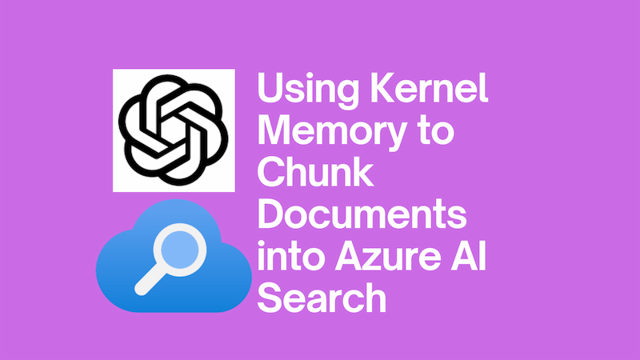

I've recently been working on building RAG (Retrieval Augmented Generation) experiences into applications; building systems where large language models (LLMs) can query documents. To achieve this, you first need a strategy to chunk those documents and make them LLM-friendly. [Kernel Memory](https://github.com/microsoft/kernel-memory), a sister project of [Semantic Kernel](https://github.com/microsoft/semantic-kernel) supports this.

<!--truncate-->

If you haven't heard of Kernel Memory before, it's a library that, amongst other things, provides a way to chunk documents into smaller pieces. To quote the [Kernel Memory GitHub repository](https://github.com/microsoft/kernel-memory?tab=readme-ov-file#kernel-memory-km-and-semantic-memory-sm):

> Kernel Memory (KM) is a service built on the feedback received and lessons learned from developing Semantic Kernel (SK) and Semantic Memory (SM). It provides several features that would otherwise have to be developed manually, such as storing files, extracting text from files, providing a framework to secure users' data, etc. The KM codebase is entirely in .NET, which eliminates the need to write and maintain features in multiple languages. As a service, KM can be used from any language, tool, or platform, e.g. browser extensions and ChatGPT assistants.

In this post, I'll show you how to use Kernel Memory to chunk documents in the background of an ASP.NET application.

## Serverless vs Kernel Memory Service

There's two ways that you can run Kernel Memory: "Serverless" and "Service".

Running the full service is more powerful and complex, but effectively requires running a separate service. Given that I'm building a simple ASP.NET application, I'll be using the "Serverless" approach, which allows us to run Kernel Memory as well as our own application code within the context of a single application.

The documentation is very clear that if you want to scale then you'll likely want to consider the "Service" approach. But my own experience has been that "Serverless" works well for small to medium-sized applications.

We can still have the experience of running Kernel Memory as a separate service, but within the context of our ASP.NET application. This is achieved by running Kernel Memory as a [hosted service](https://learn.microsoft.com/en-us/aspnet/core/fundamentals/host/hosted-services?view=aspnetcore-8.0) - this is the standard ASP.NET mechanism for background tasks.

## Setting up Kernel Memory
