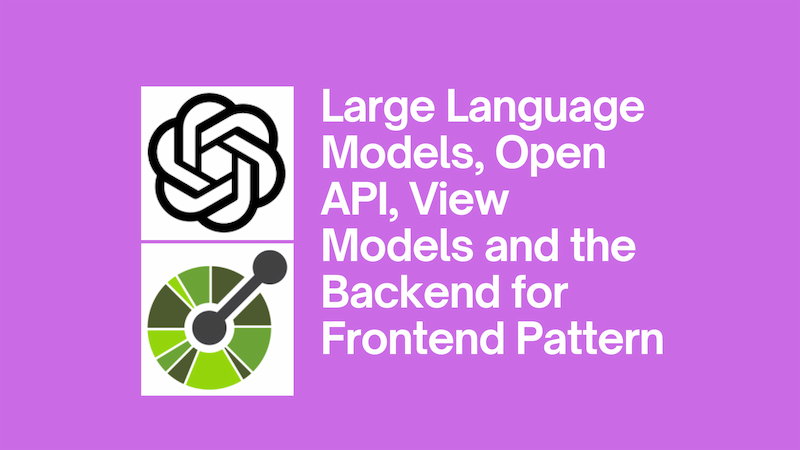

Of late, I've been involved in work to integrate APIs into LLM interactions, using [Semantic Kernel](https://github.com/microsoft/semantic-kernel). This post is something of a brain dump on the topic. Given how fast this space is moving, I expect what is written here to be out of date, possibly even _before_ I hit publish. But nevertheless, I hope it's useful.



<!--truncate-->

## Swagger / Open API and Semantic Kernel

APIs are awesome. Imagine LLMs could interact with APIs to allow us to chat directly to our data. This is what [function calling](https://platform.openai.com/docs/guides/function-calling) provides. It allows us to take some kind of API and integrate it with our LLM. This is a powerful concept, but it's not without its challenges.

APIs are often documented in Swagger / Open API. This is a great way to document APIs, but it's not always the best way to interact with them from an LLM point of view. We'll go into more detail on the problems it can present in a moment, but first let's look at how we can use Semantic Kernel to integrate with APIs.

It's completely possible to plug an LLM into an Open API / Swagger spec described API using Semantic Kernel. Here's an example of how we might do that from the [Semantic Kernel GitHub repository](https://github.com/microsoft/semantic-kernel/blob/9a4450622021ce003234863bcf4def9613ae1153/dotnet/samples/Concepts/Plugins/CreatePluginFromOpenApiSpec_Jira.cs#L69-L77):

```cs
var apiPluginRawFileURL = new Uri("https://raw.githubusercontent.com/microsoft/PowerPlatformConnectors/dev/certified-connectors/JIRA/apiDefinition.swagger.json");
jiraFunctions = await kernel.ImportPluginFromOpenApiAsync(
    "jiraPlugin",
    apiPluginRawFileURL,
    new OpenApiFunctionExecutionParameters(
        httpClient, tokenProvider.AuthenticateRequestAsync,
        serverUrlOverride: new Uri(serverUrl)
    )
);
```

The code above is creating a Jira plugin from an Open API spec. Brilliant! We didn't have to do any work; Semantic Kernel has done the heavy lifting for us. It's created a plugin that we can use to interact with Jira. Are you ready for the but?

## The problem with Swagger / Open API and LLMs

The example above illustrates the simplicity of integrating. But what it doesn't reveal is the unfortunate reality that **LLMs are not great at ignoring information**. They will mention information we explicitly tell them not to. Just to spite us.

Let's take the Jira plugin as an example. When using direct Swagger / Open API integration I have found myself writing prompts like this:

> Please tell me about stories that are assigned to me. Please never refer to the stories by their ids - use titles instead.

Only to find that in the responses the LLM will _still_ refer to the stories by their ids.

It's a bit like having a child who you've told not to do something, only to find they've done it anyway. The LLM may even cheekily say something like "I know you told me not too, but I included the id for reference". The scallywag.

Or perhaps, given the variety of endpoints that are available in an API, the LLM will call one that we didn't want it to. Or perhaps our Swagger / Open API spec is poorly documented, and the LLM doesn't think it has an endpoint it can call.

## View models and the BFFs to the rescue

A useful framing for this problem is remembering when ORMs started to automate access to databases. We could take our ORM, and host it in a web service and, hey presto, our database was now accessible over HTTP. So let's take our React app (or whatever) and have it talk directly to our database.

Except, of course, that's a terrible idea. We don't want our front end talking to our database. There's a number of reasons why:

- Too much information going backwards and forward between client and server (perhaps including information we'd never like clients to see).
- Security; why are we exposing our database to updates directly from the internet? Is that wise?

You get the picture. We tend not to integrate our databases directly with our front ends with good reason.

A common approach to tackle these issues is employing the [back end for front ends (BFF) pattern](https://learn.microsoft.com/en-us/azure/architecture/patterns/backends-for-frontends); having something that sits between our front end and our database. One of the things the BFF does is to provide a view of the data that is appropriate for the client. So for example, exposing a [view model](https://en.wikipedia.org/wiki/View_model) in the back end to serve the front end. It's a way to ensure that only the necessary information is exposed to the client.

We can take this idea and apply it to building integrations with APIs and LLMs. So rather than plugging a Swagger / Open API spec into Semantic Kernel, instead build a custom plugin that manages access to our API, and have it expose view models for providing data to LLMs.

That way we can ensure that only the necessary information is given to the LLM, and our answers do not contain data we would rather not see.

So rather than giving an LLM a data structure like this:

```json
{
  "stories": [
    {
      "id": 1,
      "title": "Story 1",
      "description": "This is the first story"
      //... MANY MORE FIELDS
    },
    {
      "id": 2,
      "title": "Story 2",
      "description": "This is the second story"
      //... MANY MORE FIELDS
    }
  ]
}
```

We give it the trimmed down equivalent:

```json
{
  "stories": [
    {
      "title": "Story 1",
      "description": "This is the first story"
    },
    {
      "title": "Story 2",
      "description": "This is the second story"
    }
  ]
}
```

This has the combined benefit of reducing our token usage / cost (as we're sending less data to the LLM) and reducing the risk of exposing data we'd rather not.

It also has the advantage of allowing us to steer the LLM towards the functions we want it to call. If we only expose the functions we want the LLM to call, then we can ensure that it doesn't call functions we'd rather it didn't.

## "But integrating with APIs is a lot of work!"

A common, and quite reasonable, complaint is that integrating with an API involves a lot of work. We have to write some code to interact with the API, and then we have to write the types that we'll use to pass data around. Fortunately there are tools like NSwag that use the Swagger / Open API spec to [automate creating a client with types to manage API interaction](../2021-03-06-generate-typescript-and-csharp-clients-with-nswag/index.md). If we're autogenerating our API clients, then the work of integrating an LLM with an API is significantly reduced.

With Semantic Kernel it effectively is reduced to creating a plugin; and that's quite simple to do. [There is guidance on how to create a plugin here](https://learn.microsoft.com/en-us/semantic-kernel/agents/plugins/using-the-kernelfunction-decorator?tabs=Csharp). So to create a BFF plugin for an API, we'd need to create that plugin, exposing the functions we want to be called. Those functions will internally call into the APIs using the auto-generated Swagger clients and then map that to the view models which we want to expose to the LLM. Imagine something like this:

```cs
public record JiraStory(
    string Title,
    string Description
);

[KernelFunction]
[Description("Provides stories for a given user")]
[return: Description("Jira user stories for the given user")]
public async Task<JiraStory[]> GetUsersJiraStories(
  Kernel kernel,

  [Description("Email of user to filter by")]
  string userEmail
)
{
    var stories = await _jiraClient.GetStories(userEmail);

    return stories
      .Select(story => new JiraStory(
        title: story.Title,
        description: story.Description
      ))
      .ToArray();
}
```

The code above exposes a well defined function to the LLM, which will return the stories for a given user. The function internally calls into the Jira API, and then maps the large amount of data returned from the API to a much slimmer view model that is appropriate for the LLM. As we can see, this was very little work indeed!

## Conclusion

The integrated support for consuming Open API / Swagger specs is definitely going to improve over time, both in Semantic Kernel and in the wider ecosystem. However, it's possible that there is fundamental issue that needs to be solved, and that BFFs for LLMs may solve it. It's a way to ensure that only the necessary information is exposed to LLMs, and that the answers they give are appropriate for the context in which they are being used.

I'm not aware of a specific name for this pattern as yet. My colleague, Ryan suggested "Frontend for Language Models" (FLM) which is less of a mouthful than "Backend for Frontends for Language Models". Naming things is hard.

Another colleague (Rick), suggested that perhaps the BFF for LLMs could be built directly into APIs. So rather than having to implement a custom plugin that manages the interaction with API, we could still perhaps use the Swagger / Open API approach and avoid the custom plugin implementation. This is an interesting idea.

Many thanks to [David Rosevear](https://github.com/drosevear), [George Karsas](https://www.linkedin.com/in/george-karsas), [Rick Roché](https://www.rickroche.com/), [Ryan Cook](https://github.com/RyanMatCook) and [Ali Somer](https://uk.linkedin.com/in/alisomer) whose thoughts, ideas and experimentation have fed into the thinking in this post.
