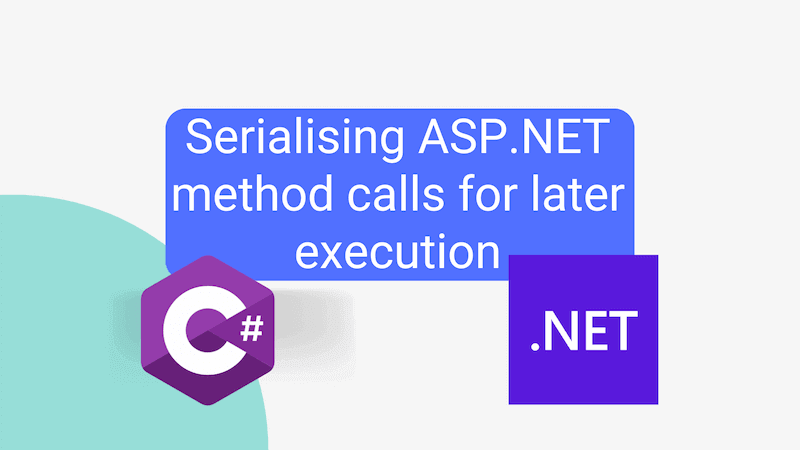

Let's start with "why". Imagine you have an operation that you'd like to perform, but you need an explicit record of what method is to be executed, and it needs to be approved by a third party before execution takes place.

Now you could, if course, build a mechanism to manually cater for each method call. But that's a lot of work and given we potentially want to do this a lot, wouldn't scale particularly well. What would start as a simple mechanism would grow and grow very quickly.

So how can we take a method call, serialise it, perhaps store it in a database, and then later rehydrate and execute?



<!--truncate-->

## What does serialising our method call require?

To serialise a method call, what do we need to store? Three things:

1. The type of object that contains the method we want to subsequently invoke
2. The method on that object
3. The parameter values that will be passed to the method when it is called

Pretty simple, right? It's worth highlighting that there is an underlying assumption for this approach:

_The method call does not depend on the object being in a specific state_

So if, before calling a method on that object you can to, for example, call another method called `OpenConnection` then this approach would not work. Likewise if subsequent cleanup was required, this approach would not work. I'm not sure this an entirely accurate analogy, but think of each method call as needing to be an atomic operation and you're probably heading in the right direction.

How then, can we serialise our method call?

## How do we serialise our method call?

First of all, we need a data structure to store the information we need. We could use a `record` like this:

```cs
public record MethodCall(string ServiceName, string MethodName, object[] Parameters);
```

This record will store the name of the service, the name of the method, and the parameters that will be passed to the method when it is called.

Next we need an example service that we can call. Here's a simple example:

```cs
public interface IOurService
{
    Task<bool> DoAThing(string name, decimal amount, bool isApproved);
}
```

An implementation of this service would be registered with the DI container when the application starts up. We don't need to know anything about the implementation of the service, just that it exists and that we can call methods on it.

```cs
MethodCall methodCall = new (
    ServiceName: typeof(IOurService).FullName ?? throw new InvalidOperationException("Service name cannot be null"),
    MethodName: nameof(IOurService.DoAThing),
    Parameters: [ "the name", 100m, true]
);
string json = Newtonsoft.Json.JsonConvert.SerializeObject(methodCall);
MethodCall deserialized = Newtonsoft.Json.JsonConvert.DeserializeObject<MethodCall>(json) ?? throw new Exception("Problem deserializing");
object? result = await new MethodCallInvoker(_serviceProvider, deserialized).InvokeAsync();
```

Why `Newtonsoft.Json`? Because I'm using Cosmos DB to persist my method call, and it uses JSON.NET for JSON handling. Otherwise I'd likely use `System.Text.Json`. If you're using SQL Server, you could use System.Text.Json.
