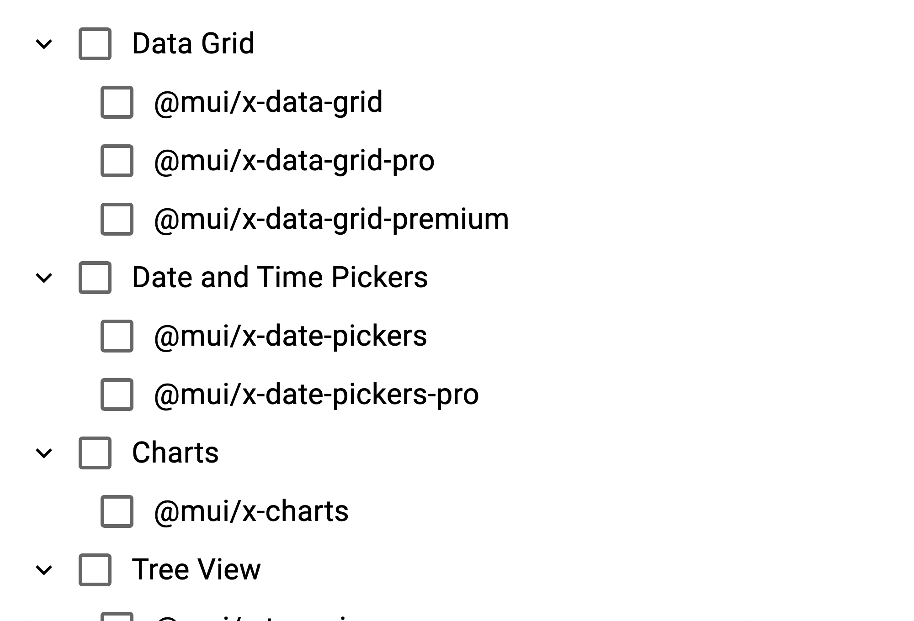

Every now and then, I need to use a treeview component in a React application. The Material-UI (MUI) library provides a [treeview component](https://mui.com/x/react-tree-view/) that is very useful. However, some of the default behaviours of the component differ from that which you typically find in a treeview component. I'm speaking, of course, about node selection. I'm used to a treeview component that, when a parent node is selected, auto selects the child nodes underneath. And by turn, when nodes are deselected, the parent nodes get deselected.

This post documents how to implement this behaviour with the MUI treeview component.

Since initially writing this, I've learned that it is likely that the kind of behaviour I'm hand-rolling here, will natively land in the component. So, all being well, what follows should become unnecessary! To track native support [watch this GitHub issue](https://github.com/mui/mui-x/issues/12883).


<!--truncate-->

## The default behaviour and the desired behaviour

By default, the MUI treeview component checks and unchecks nodes individually. Each node is an island; when a node is selected or deselected, it has no bearing on any other nodes.

What I'd rather is some relationship between parent and child nodes during selection / deselection. The behaviour I'd like has the following characteristics:

- when a parent node is selected, all child nodes are selected
- when a parent node is deselected, all child nodes are deselected
- when a child node is deselected, the parent node is deselected, and any children are deselected also
- finally, if all children are selected, the parent node should be selected.

This is the behaviour that I'm used to in a treeview component. In action it looks like this:



## The code

We can implement this behaviour by tracking the selected nodes and then determining which nodes should be selected based on the current selection. The code below demonstrates how to do this:

```tsx
import * as React from 'react';
import Box from '@mui/material/Box';
import { RichTreeView } from '@mui/x-tree-view/RichTreeView';
import { TreeViewBaseItem } from '@mui/x-tree-view/models';

const MUI_X_PRODUCTS: TreeViewBaseItem[] = [
  {
    id: 'grid',
    label: 'Data Grid',
    children: [
      { id: 'grid-community', label: '@mui/x-data-grid' },
      { id: 'grid-pro', label: '@mui/x-data-grid-pro' },
      { id: 'grid-premium', label: '@mui/x-data-grid-premium' },
    ],
  },
  {
    id: 'pickers',
    label: 'Date and Time Pickers',
    children: [
      { id: 'pickers-community', label: '@mui/x-date-pickers' },
      { id: 'pickers-pro', label: '@mui/x-date-pickers-pro' },
    ],
  },
  {
    id: 'charts',
    label: 'Charts',
    children: [{ id: 'charts-community', label: '@mui/x-charts' }],
  },
  {
    id: 'tree-view',
    label: 'Tree View',
    children: [{ id: 'tree-view-community', label: '@mui/x-tree-view' }],
  },
];

function getParentNode(
  items: TreeViewBaseItem[],
  id: string,
): TreeViewBaseItem | undefined {
  for (const item of items) {
    if (item.children) {
      if (item.children.some((child) => child.id === id)) {
        // The current item is the parent of the supplied id
        return item;
      } else {
        // Recursively call the function for the children of the current item
        const parentNode = getParentNode(item.children, id);
        if (parentNode) {
          return parentNode;
        }
      }
    }
  }

  // No parent found
  return undefined;
}

function getAllParentIds(items: TreeViewBaseItem[], id: string) {
  const parentIds: string[] = [];
  let parent = getParentNode(items, id);
  while (parent) {
    parentIds.push(parent.id);
    parent = getParentNode(items, parent.id);
  }
  return parentIds;
}

function getSelectedIdsAndChildrenIds(
  items: TreeViewBaseItem[],
  selectedIds: string[],
) {
  const selectedIdIncludingChildrenIds = new Set([...selectedIds]);

  for (const item of items) {
    if (selectedIds.includes(item.id)) {
      // Add the current item's id to the result array
      selectedIdIncludingChildrenIds.add(item.id);

      // Recursively call the function for the children of the current item
      if (item.children) {
        const childrenIds = item.children.map((child) => child.id);
        const childrenSelectedIds = getSelectedIdsAndChildrenIds(
          item.children,
          childrenIds,
        );
        childrenSelectedIds.forEach((selectedId) =>
          selectedIdIncludingChildrenIds.add(selectedId),
        );
      }
    } else if (item.children) {
      // walk the children to see if selections lay in there also
      const childrenSelectedIds = getSelectedIdsAndChildrenIds(
        item.children,
        selectedIds,
      );
      childrenSelectedIds.forEach((selectedId) =>
        selectedIdIncludingChildrenIds.add(selectedId),
      );
    }
  }

  return [...Array.from(selectedIdIncludingChildrenIds)];
}

function determineIdsToSet(
  items: TreeViewBaseItem[],
  newIds: string[],
  currentIds: string[],
) {
  const isDeselectingNode = currentIds.length > newIds.length;
  if (isDeselectingNode) {
    const removed = currentIds.filter((id) => !newIds.includes(id))[0];

    const parentIdsToRemove = getAllParentIds(items, removed);

    const childIdsToRemove = getSelectedIdsAndChildrenIds(items, [removed]);

    const newIdsWithParentsAndChildrenRemoved = newIds.filter(
      (id) => !parentIdsToRemove.includes(id) && !childIdsToRemove.includes(id),
    );

    return newIdsWithParentsAndChildrenRemoved;
  }

  const added = newIds.filter((id) => !currentIds.includes(id))[0];
  const idsToSet = getSelectedIdsAndChildrenIds(items, newIds);
  let parent = getParentNode(items, added);
  while (parent) {
    const childIds = parent.children?.map((node) => node.id) ?? [];
    const allChildrenSelected = childIds.every((id) => idsToSet.includes(id));
    if (allChildrenSelected) {
      idsToSet.push(parent.id);
      parent = getParentNode(items, parent.id);
    } else {
      break;
    }
  }
  return idsToSet;
}

export default function CheckboxSelection() {
  const [selectedIds, setSelectedIds] = React.useState<string[]>([]);

  const handleSelectedItemsChange = (
    _event: React.SyntheticEvent,
    ids: string[],
  ) => {
    setSelectedIds(determineIdsToSet(MUI_X_PRODUCTS, ids, selectedIds));
  };

  return (
    <Box sx={{ height: 264, flexGrow: 1, maxWidth: 400 }}>
      <RichTreeView
        defaultExpandedItems={MUI_X_PRODUCTS.map((x) => x.id)}
        multiSelect={true}
        checkboxSelection={true}
        selectedItems={selectedIds}
        onSelectedItemsChange={handleSelectedItemsChange}
        items={MUI_X_PRODUCTS}
      />
    </Box>
  );
}
```

You'll see above that we're using the `RichTreeView` component from `@mui/x-tree-view`. We're setting it to `multiSelect` and `checkboxSelection` to allow for multiple selections and to show checkboxes next to each node. We're also tracking the selected nodes in the `selectedIds` state variable.

The `handleSelectedItemsChange` function is called whenever the selection changes. It determines which nodes should be selected based on the current selection and the new selection. The `determineIdsToSet` function is responsible for this logic.

The first thing it does is determine if a node is being deselected or selected, by comparing the length of the current selection with the new selection. If a node is being deselected, it finds the parent and child nodes of the deselected node and removes them from the new selection. If a node is being selected, it selects all the children of that node. It also finds the parent node and checks if all child nodes are selected. If they are, it selects the parent node.

## Conclusion

The code above demonstrates how to implement a treeview component with parent-child node selection behaviour. This behaviour is, in my opinion, more intuitive and user-friendly than the default behaviour of the MUI treeview component.

You can also see this code in action [on StackBlitz](https://stackblitz.com/edit/mui-react-tree-view-check-children-uncheck-parents?file=Demo.tsx).
