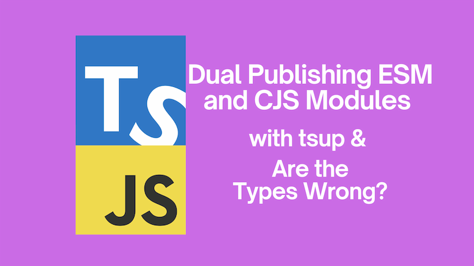

If you need to publish a package that supports both ECMAScript modules (ESM) and CommonJS modules (CJS), you can use [`tsup`](https://github.com/egoist/tsup) to do so. This post will show you how to do that and how to ensure that the types are correct using the tool [`Are the Types Wrong?`](https://github.com/arethetypeswrong/arethetypeswrong.github.io).



<!--truncate-->

## Package support for ESM and CJS with tsup

I recently needed to build a package that supported both ESM and CJS modules. After attempting to implement this myself, and frankly aging ten years, I decided to see if there was a tool out there that could help me. Happily, there are a number of tools that can help with this and I found that the excellent `tsup` was the easiest to use.

`tsup` is a zero-config TypeScript bundler with a focus on speed and simplicity. It's a great tool for building and bundling your TypeScript code into ESM and CJS modules and is powered by [`esbuild`](https://github.com/evanw/esbuild).

To get started, you can install `tsup` to your project:

```bash
npm install tsup --save-dev
```

Then you can add a script to your `package.json` to build your package:

```json
{
  "scripts": {
    "build": "tsup src/index.ts --format cjs,esm --dts --clean --sourcemap"
  }
}
```

In this example, we're building the `src/index.ts` file into both CJS and ESM modules, generating type definitions, cleaning up the output directory prior to build, and generating sourcemaps. You can, if you like, use a `tsup.config.ts` file to configure `tsup` but I found the above to be sufficient for my needs.

When you run `npm run build`, you'll see that `tsup` has created a `dist` directory with the following structure:

```bash
dist/
  index.cjs
  index.cjs.map
  index.d.cts
  index.js
  index.js.map
  index.d.ts
```

The `index.js` and `index.js.map` files are the ESM modules and the `index.cjs` and `index.cjs.map` files are the CJS modules. The `index.d.ts` and `index.d.cts` files contain the type definitions.

This is great news! You now have a package that supports both ESM and CJS modules. But now we need to get our `package.json` file set up correctly.

## Linting your package.json file with Are the Types Wrong?

When you're publishing a package, it's important to ensure that your `package.json` file is set up correctly. It is the manifest that other packages consume. If it is not set up correctly, things won't work at runtime and you'll have an unpleasant engineering experience in your IDE as well. Getting it right includes ensuring that the `exports` field is set up correctly to support both ESM and CJS modules. This can be a bit tricky to get right, so it's a good idea to use a tool to help you.

I made the following additions to my `package.json` file to support both ESM and CJS modules:

```json
{
  "//": "This is the correct way to set up a package with a `src/index.ts` root file that supports both ESM and CJS modules.",
  "type": "module",
  "main": "./dist/index.cjs",
  "module": "./dist/index.js",
  "types": "./dist/index.d.ts",
  "exports": {
    "import": {
      "types": "./dist/index.d.ts",
      "import": "./dist/index.js"
    },
    "require": {
      "types": "./dist/index.d.cts",
      "require": "./dist/index.cjs"
    }
  }
}
```

Let's break this down:

- The `type` field is set to `module` to indicate that the package supports ESM modules.
- The `main` field is set to `./dist/index.cjs` to indicate the entry point for CJS modules.
- The `module` field is set to `./dist/index.js` to indicate the entry point for ESM modules.
- The `types` field is set to `./dist/index.d.ts` to indicate the type definitions file for ESM modules.

We then set up the `exports` field to support both ESM and CJS modules. The `import` field is set up to support ESM modules and the `require` field is set up to support CJS modules. In each, the `types` field is set to the relevant type definitions file - significantly, the `types` comes first.

Here I've jumped straight to the good part here. I've given you the correct way to set up the `exports` field for a package that supports both ESM and CJS modules. But how do you know if your `package.json` file is set up correctly?

Well, in my case I used the tool [`Are the Types Wrong`](https://arethetypeswrong.github.io/) to lint my `package.json` file. `Are the Types Wrong` is a tool that checks your `package.json` file to ensure that it's set up correctly for publishing a package that supports both ESM and CJS modules. You're possibly aware of the [website](https://arethetypeswrong.github.io/) but did you know that there's a CLI tool that you can use to lint your `package.json` file?

There is.

If you would like to read the full documentation on the CLI tool, you can find it [here](https://github.com/arethetypeswrong/arethetypeswrong.github.io/blob/main/packages/cli/README.md). However, if you're like me and in a hurry, you can just use it like this:

- cd into your project directory
- run `npx --yes @arethetypeswrong/cli --pack .`
- et voila, your `package.json` file will be linted for type issues

To see what this looks like, here's the output from running `npx @arethetypeswrong/cli` in the project directory of a package with the `package.json` file _not_ set up correctly:

```bash
api v1.0.0

Build tools:
- typescript@^5.2.2

❌ Import resolved to JavaScript files, but no type declarations were found. https://github.com/arethetypeswrong/arethetypeswrong.github.io/blob/main/docs/problems/UntypedResolution.md


┌───────────────────┬─────────────┐
│                   │ "api"       │
├───────────────────┼─────────────┤
│ node10            │ ❌ No types │
├───────────────────┼─────────────┤
│ node16 (from CJS) │ ❌ No types │
├───────────────────┼─────────────┤
│ node16 (from ESM) │ ❌ No types │
├───────────────────┼─────────────┤
│ bundler           │ ❌ No types │
└───────────────────┴─────────────┘
```

By contrast, here's how it looks when you use the correct `package.json` file:

```bash
shared v1.0.0

Build tools:
- typescript@^5.4.5
- tsup@^8.1.0

 No problems found 🌟


┌───────────────────┬──────────┐
│                   │ "api"    │
├───────────────────┼──────────┤
│ node10            │ 🟢       │
├───────────────────┼──────────┤
│ node16 (from CJS) │ 🟢 (CJS) │
├───────────────────┼──────────┤
│ node16 (from ESM) │ 🟢 (ESM) │
├───────────────────┼──────────┤
│ bundler           │ 🟢       │
└───────────────────┴──────────┘
```

Isn't that great? You can now be confident that your `package.json` file is set up correctly for publishing a package that supports both ESM and CJS modules, both from a runtime code and a types perspective. So the full `package.json` might look something like this:

```json
{
  "name": "our-package",
  "version": "1.0.0",
  "description": "",
  "scripts": {
    "build": "tsup src/index.ts --format cjs,esm --dts --clean --sourcemap"
  },
  "author": "",
  "license": "ISC",
  "dependencies": {},
  "devDependencies": {
    "tsup": "^8.1.0",
    "typescript": "^5.4.5"
  },
  "type": "module",
  "main": "./dist/index.cjs",
  "module": "./dist/index.js",
  "types": "./dist/index.d.ts",
  "exports": {
    "import": {
      "types": "./dist/index.d.ts",
      "import": "./dist/index.js"
    },
    "require": {
      "types": "./dist/index.d.cts",
      "require": "./dist/index.cjs"
    }
  }
}
```

## Conclusion

In this post, we've seen how to publish a package that supports both ESM and CJS modules using `tsup`. We've also seen how to ensure that the types are correct using the tool `Are the Types Wrong`.

It's probably worth saying that `Are the Types Wrong` doesn't check everything, and that `tsup`s method of dual compilation makes some unchecked assumptions too. Using these tools isn't a silver bullet, given how complicated the ESM/CJS compatibility story is, but they do their best to help.

Thanks to [Andrew Branch](https://github.com/andrewbranch) for putting together `Are the Types Wrong` and to the folk that work on `tsup` for making it easy to build packages that support both ESM and CJS modules. Thanks also to Andrew for his help in reviewing this post.

Remember, friends don't let friends publish packages with incorrect types!
