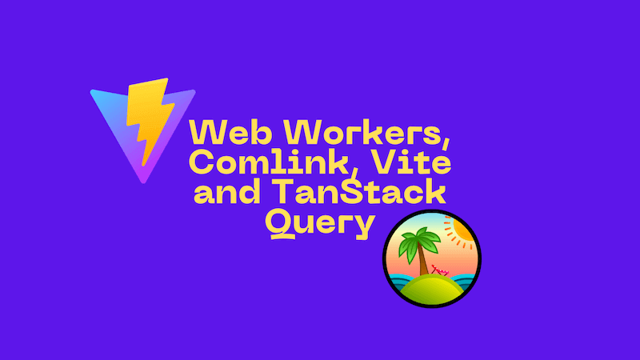

I've written previously about combining [Web Workers and Comlink](../2020-02-21-web-workers-comlink-typescript-and-react/index.md). I recently found myself needing to use Web Workers again. As I picked them up this time I found myself making some different choices, now I was working in a codebase that used Vite to build. I ended up using [TanStack Query](https://github.com/tanstack/query) in combination with my [Web Workers](https://developer.mozilla.org/en-US/docs/Web/API/Web_Workers_API/Using_web_workers) and [Comlink](https://github.com/GoogleChromeLabs/comlink). It was a really good fit and this post will show you how to use Web Workers with Comlink and TanStack Query.



<!--truncate-->

## A use case for Web Workers

Web Workers are a great way to offload work from the main thread. This can be particularly useful if you have a long running task that you don't want to block the UI thread. In my case, I was working on a feature that required a lot of computation. I wanted to keep the UI responsive whilst the numbers got crunched.

Imagine the following function in our `calculations.ts` file:

```typescript
export function expensiveCalculation(
  data: BigLumpOfData,
  from: Date,
  to: Date,
): number {
  // SUPER EXPENSIVE COMPUTATION CODE HERE...
  return importantNumber;
}
```

This function is doing some very expensive computation. We don't want to block the main thread with it. We want to use a Web Worker to offload this work. But the naked Web Worker API is a bit of a pain to work with. Instead then, we can use Comlink to make it easier.

## Vite Comlink setup with `vite-plugin-comlink`

As I've mentioned, we're working with Vite in this codebase. To get Comlink working with Vite, we can use the dedicated plugin named [`vite-plugin-comlink`](https://github.com/mathe42/vite-plugin-comlink). It is a wrapper around Comlink that simplifies using it with Vite.

To get started, we need to install the plugin and Comlink:

```bash
npm i --save-dev vite-plugin-comlink
npm i --save comlink
```

We need the plugin at build time and Comlink at runtime. We can then add the plugin to our Vite config:

```typescript
import react from '@vitejs/plugin-react';
import { defineConfig } from 'vite';
import { comlink } from 'vite-plugin-comlink';

// https://vitejs.dev/config/
export default defineConfig({
  plugins: [comlink(), react()],
  worker: {
    plugins: () => [comlink()],
  },
});
```

Note that we're adding the `comlink` plugin to both the main Vite config and the worker config. This is because we want to use Comlink in both places. The order of the plugins is important. We want to make sure that `comlink` is added right at the start.

This is a TypeScript project, so we update our `vite-env.d.ts` file to include the Comlink types:

```typescript
/// <reference types="vite/client" />
/// <reference types="vite-plugin-comlink/client" />
```

## Migrating our expensive calculations to Comlink

Now we have Comlink set up, we can move our expensive calculations to a Web Worker. This is very easily achieved; we just need to create a variable that points to our Web Worker file:

```typescript
const calculationsWorker = new ComlinkWorker<
  typeof import('./calculations.js')
>(new URL('./calculations.js', import.meta.url), {
  name: 'calculationsComlink',
  type: 'module',
});
```

There's not much code above, but it's doing a lot. We're creating a new Web Worker with Comlink using the `ComlinkWorker`. This is an affordance provided by `vite-plugin-comlink` and it creates a Web Worker with Comlink. We're pointing it at our `calculations.js` file (`.js` as this is an ESM import representing the `calculations.ts` file). We're also giving the Web Worker a name, `calculationsComlink` - this will be handy when debugging. Finally, we're telling the Web Worker that it's a module. So we can use ESM imports in our Web Worker. Actually, we're not do that right now, but we could.

Note also that the types will be inferred from the `calculations.js` file thanks to the `typeof import('./calculations.js')`. This is a really nice feature of TypeScript.

The API of the `calculationsWorker` is the same as the `calculations.ts` file, with one subtle difference. All sync functions will move to being `Promise` based. So the API of the `calculationsWorker` is

```typescript
expensiveCalculation: (data: BigLumpOfData, from: Date, to: Date) =>
  Promise<number>;
```

Which is pretty much the same as the original function in `calculations.ts`:

```typescript
expensiveCalculation: (data: BigLumpOfData, from: Date, to: Date) => number;
```

The only difference is that the return type is now a `Promise<number>` rather than a `number`. If your function was `async` / `Promise`-based originally, then the API remains identical.

Incidentally; this is terrific. The journey from a standard codebase to a Web Worker enabled codebase is really smooth.

## Using TanStack Query to interact with the Comlink Web Worker

The final piece of the puzzle is to use TanStack Query (AKA React Query) to interact with our Web Worker. TanStack Query is a fantastic library for managing data in applications. It's a great fit for working with our Web Worker because it's designed to work with async data. We can use TanStack Query to manage interactions with our Web Worker.

To install it we run:

```bash
npm i @tanstack/react-query
```

We can then use it in our component like so:

```typescript
const expensiveCalculationResult = useQuery({
  queryKey: ['expensiveCalculation', data, from, to],
  queryFn: () =>
    calculationsWorker.expensiveCalculation(data, new Date(from), new Date(to)),
  staleTime: Infinity,
});
```

This is a pretty standard use of TanStack Query. We're using the `useQuery` hook to fetch data. We're passing in a `queryKey` that represents the data we're fetching. We're passing in a `queryFn` that fetches the data. In this case, it's calling our Web Worker. We're also setting `staleTime` to `Infinity` so that the data never goes stale. This is an optimisation, because we're not going to be refetching the data unless the dependencies change. (If you'd like to understand more about `staleTime` read [TkDodo's excellent post](https://tkdodo.eu/blog/practical-react-query#the-defaults-explained)).

This is a really nice way to interact with our Web Worker. We're using TanStack Query to manage the data fetching and Comlink to interact with the Web Worker. It's a really nice fit.

## Putting it all together

Here's the full component that uses the Web Worker, Comlink and TanStack Query:

```tsx
import { useQuery } from '@tanstack/react-query';

const calculationsWorker = new ComlinkWorker<
  typeof import('./calculations.js')
>(new URL('./calculations.js', import.meta.url), {
  name: 'calculationsComlink',
  type: 'module',
});

export function WorkerDemo({
  data,
  from,
  to,
}: {
  data: BigLumpOfData;
  from: string;
  to: string;
}) {
  const expensiveCalculationResult = useQuery({
    queryKey: ['expensiveCalculation', data, from, to],
    queryFn: () =>
      calculationsWorker.expensiveCalculation(
        data,
        new Date(from),
        new Date(to),
      ),
    staleTime: Infinity,
  });

  return (
    <div>
      <h1>Web Workers, Comlink and Tanstack Query in action!</h1>

      {expensiveCalculationResult.data ? (
        <p>Calculation result: {expensiveCalculationResult.data}</p>
      ) : expensiveCalculationResult.isPending ? (
        <p>Calculating...</p>
      ) : expensiveCalculationResult.error ? (
        <p>Error: {expensiveCalculationResult.error}</p>
      ) : (
        <p>...</p>
      )}
    </div>
  );
}
```

This is a really nice way to use Web Workers with TanStack Query. We're using Comlink to interact with the Web Worker and TanStack Query to manage the data fetching. It's a really nice fit. I hope this helps you to use Web Workers in your Vite projects. Enjoy!
