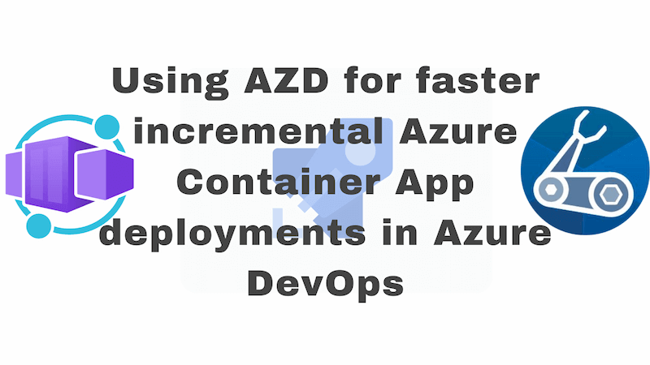

When deploying Azure Container Apps from Azure DevOps, you can use the `azd` command to speed up deployments that do not affect infrastructure. Given that when you're deploying, it's far more common to be making a code and / or content change and not an infrastructure one, this can be a significant time saver.



<!--truncate-->

## Faster deployments from `azd` 1.4 and beyond

The azd v1.4.0 release contained a significant feature: `azd provision` is now faster when there are no infrastructure changes.

To quote a trimmed down version of the [announcement](https://devblogs.microsoft.com/azure-sdk/azure-developer-cli-azd-october-2023-release/#azd-provision-is-now-faster-when-there-are-no-infrastructure-changes):

> If you’ve been using the Azure Developer CLI for a while, you may have noticed that sometimes `azd provision` takes a long time to complete when it may not need to. The wait time was because, prior to version 1.4.0, `azd provision` would always reprovision regardless of whether the underlying Infrastructure as Code had changed... As of today’s 1.4.0 release, `azd provision` now checks the most recent deployment upstream on Azure to see if the state is the same as what’s represented in the Infrastructure as Code that’s been used to provision. If the state is the same, the provision is skipped... with this new experience, you should also notice improved performance when running `azd up` in a CI/CD pipeline as provisioning will be automatically skipped when there are no changes.

I want this. We're going to unpack how to use this feature in the context of an Azure DevOps pipeline with Azure Container Apps. It turns out that there's a little more to it than just running `azd provision` and hoping for the best. In fact, there's gotchas aplenty - but it's totally achievable.

I'm going to start with a pre-existing Azure Pipeline that deploys an Azure Container App. It uses the classic [`AzureResourceManagerTemplateDeployment@3` ARM template deployment v3 task](https://learn.microsoft.com/en-us/azure/devops/pipelines/tasks/reference/azure-resource-manager-template-deployment-v3?view=azure-pipelines) to deploy our infrastructure in the form of a `main.bicep` (and it's submodules) file.

This existing pipeline and infrastructure as code payload is in a good state. But it's slow. Every time the pipeline runs, the bicep section takes **8 minutes**. We're going to make it faster. Spoiler: we're going to get it down to **1 minute**.

## Hello `azure.yml`

Our project has no integration with `azd`. But we need `azd` to take advantage of the new `azd provision` feature. We're going to add a new file to our project: `azure.yml`. This file is going to contain the configuration for our `azd` project.

```yaml
# yaml-language-server: $schema=https://raw.githubusercontent.com/Azure/azure-dev/main/schemas/v1.0/azure.yaml.json

name: my-container-app
metadata:
  template: azd-init@1.9.4
services:
  web:
    image: myregistry.azurecr.io/my-project/my-container-app:${WEB_VERSION_TAG}
    host: containerapp
```

The yaml above describes a container app service called `web` that uses an image from an Azure Container Registry. The `WEB_VERSION_TAG` is a variable that we'll need to provide in our Azure DevOps pipeline. It's worth noticing the link at the top to the schema for the `azure.yml` file: https://raw.githubusercontent.com/Azure/azure-dev/main/schemas/v1.0/azure.yaml.json - much of the work around figuring out how to use `azd` was achieved by looking at the schema for the `azure.yml` file.

One thing we learned as we looked at the schema, was that many parameters support environment variable substitution at runtime:


You might imagine that the `WEB_VERSION_TAG` used in the `image` parameter we pass is one of those variables. But it's not.


We'll find another way to pass this value to `azd` later on.

## Bicep modifications

I mentioned that we're adding a level of `azd` support to an existing pipeline. As part of that, we need to make modifications to our existing Bicep modules.

### Using resource group scoped deployments with azd

We're going to start off with a minor tweak to our `main.bicep` file; the entry point to our Bicep deployments. The change allows us to use `azd` deployments targeted at existing resource groups. The default mode of operation for `azd` deployments is deploying a resource group to a subscription. We are seeking to deploy to an existing resource group.

Now, strictly speaking, this isn't necessary for speeding up deployments with `azd`. But if you're not one for creating a resource group per deployment (as I am not), then this is a good idea. It means that you can [target an existing resource group with `azd` deployments](https://learn.microsoft.com/en-us/azure/developer/azure-developer-cli/resource-group-scoped-deployments). This kind of deployment requires less permissions and may well align with your organisation's security posture.

We'll need to make another change to our pipeline to support this later on. For now, we'll add the following statement to the top of our `main.bicep` file:

```bicep
targetScope = 'resourceGroup'
```

### The "does your container app exist?" parameter

We're going to add a "magic" parameter to our `main.bicep` file. This parameter is going to be used to determine whether the container app we're deploying already exists. This is important because if the container app already exists, we will reuse the existing deployed container image during the `azd provision` stage. If it does not, then we'll deploy a new container image.

```bicep
@description('Specifies if the container app exists - azd will provide this')
param containerAppExists bool = false
```

We'll look later at where this value comes from, but for now, we're just adding it to our `main.bicep` file. How do we use this parameter?

In the module where we deploy our container app, we're going to make a couple of changes:

```bicep
module fetchLatestImage '../modules/fetch-container-image.bicep' = {
  name: '${name}-fetch-image'
  params: {
    exists: containerAppExists
    name: name
  }
}

resource app 'Microsoft.App/containerApps@2023-05-01' = {
  name: name
  location: location
  tags: union(tags, {'azd-service-name':  'web' }) // note the "web" matches the service name in azure.yml
  // ...
  properties: {
	// ...
    template: {
      containers: [
        {
          image: fetchLatestImage.outputs.?containers[?0].?image ?? 'mcr.microsoft.com/azuredocs/containerapps-helloworld:latest'
		  // ...
        }
      ]
	  // ...
    }
  }
}
```

In the code above, we're using the `containerAppExists` parameter to determine whether we should fetch the currently deployed image from the existing container app. If the container app exists, we'll use the existing image. If it does not, we'll use a default image. We'd typically only expect to use the default image when we're deploying the container app for the first time. You might be wondering how the new version of the application gets deployed. The answer is `azd deploy` and we'll get to that later.

The `fetch-container-image.bicep` file is a new module that is responsible for attempting to fetch the existing image from the currently deployed container app:

```bicep
param exists bool
param name string

resource existingApp 'Microsoft.App/containerApps@2023-05-01' existing = if (exists) {
  name: name
}

output containers array = exists ? existingApp.properties.template.containers : []
```

This is based on what you get when you do an `azd init`, but customised for the specific version of the `Microsoft.App/containerApps` resource we're using.

### Parameters in `main.bicep` must be immutable per environment

unless infra actually changes
if not then full deploy happens

## Welcome `main.bicepparam`

https://github.com/Azure/azure-dev/blob/837d4e8592c53375c7d9aa6df8b134c23cdeb487/cli/azd/pkg/project/service_target_containerapp.go#L174-L190

```golang
func (at *containerAppTarget) addPreProvisionChecks(ctx context.Context, serviceConfig *ServiceConfig) error {
	// Attempt to retrieve the target resource for the current service
	// This allows the resource deployment to detect whether or not to pull existing container image during
	// provision operation to avoid resetting the container app back to a default image
	return serviceConfig.Project.AddHandler("preprovision", func(ctx context.Context, args ProjectLifecycleEventArgs) error {
		exists := false

		// Check if the target resource already exists
		targetResource, err := at.resourceManager.GetTargetResource(ctx, at.env.GetSubscriptionId(), serviceConfig)
		if targetResource != nil && err == nil {
			exists = true
		}

		at.env.SetServiceProperty(serviceConfig.Name, "RESOURCE_EXISTS", strconv.FormatBool(exists))
		return at.envManager.Save(ctx, at.env)
	})
}
```

## Azure DevOps pipeline modifications

https://dev.azure.com/investec/investec-cloud-experience/_git/ae-notebooks/pullrequest/149734?_a=files
