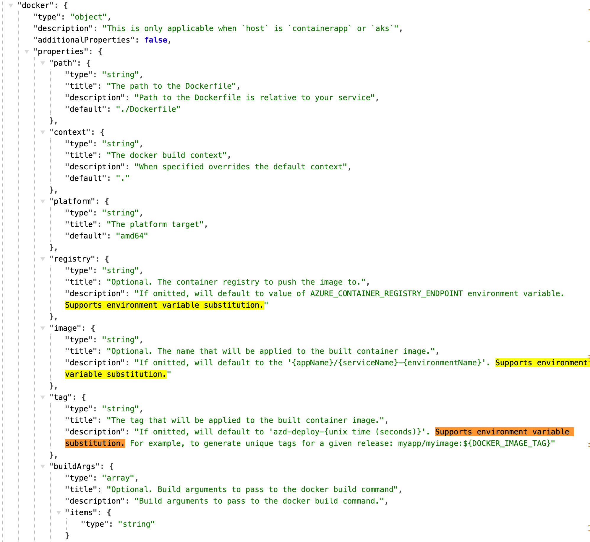

When deploying Azure Container Apps from Azure DevOps, you can use the `azd` command to speed up deployments that do not affect infrastructure. Given that when you're deploying, it's far more common to be making a code and / or content change and not an infrastructure one, this can be a significant time saver.


<!--truncate-->

## Faster deployments from `azd` 1.4 and beyond

The azd v1.4.0 release contained a significant feature: `azd provision` is now faster when there are no infrastructure changes.

To quote a trimmed down version of the [announcement](https://devblogs.microsoft.com/azure-sdk/azure-developer-cli-azd-october-2023-release/#azd-provision-is-now-faster-when-there-are-no-infrastructure-changes):

> If you’ve been using the Azure Developer CLI for a while, you may have noticed that sometimes `azd provision` takes a long time to complete when it may not need to. The wait time was because, prior to version 1.4.0, `azd provision` would always reprovision regardless of whether the underlying Infrastructure as Code had changed... As of today’s 1.4.0 release, `azd provision` now checks the most recent deployment upstream on Azure to see if the state is the same as what’s represented in the Infrastructure as Code that’s been used to provision. If the state is the same, the provision is skipped... with this new experience, you should also notice improved performance when running `azd up` in a CI/CD pipeline as provisioning will be automatically skipped when there are no changes.

I want this. We're going to unpack how to use this feature in the context of an Azure DevOps pipeline with Azure Container Apps. It turns out that there's a little more to it than just running `azd provision` and hoping for the best. In fact, there's gotchas aplenty - but it's totally achievable.

## What about Bicep `what-if`?

You might be thinking at this point: "What about Bicep `what-if`?" It's a good question. `what-if` is a feature of the Azure CLI that allows you to see what changes would be made if you were to deploy a Bicep file. Unfortunately, my own experience of using `what-if` has been that it's quite unreliable. It will detect changes where there are none, and it will fail to detect changes where there are some. I'd love to use it, but I can't trust it. If you'd like to watch a more in depth discussion of the issue, [this video is a good place to start](https://www.youtube.com/watch?v=jlkwH-fP--M).

There appear to be some known issues with `what-if` that you can follow the progress of here:

- https://github.com/Azure/arm-template-whatif/issues/83
- https://github.com/Azure/arm-template-whatif/issues/157

Given that `what-if` is not reliable, we're going to use `azd` to speed up our deployments.

## Embracing `azd` in an existing Azure DevOps pipeline

I'm going to start with a pre-existing Azure Pipeline that deploys an Azure Container App. It uses the classic [`AzureResourceManagerTemplateDeployment@3` ARM template deployment v3 task](https://learn.microsoft.com/en-us/azure/devops/pipelines/tasks/reference/azure-resource-manager-template-deployment-v3?view=azure-pipelines) to deploy our infrastructure in the form of a `main.bicep` (and it's submodules) file.

This existing pipeline and infrastructure as code payload is in a good state. But it's slow. Every time the pipeline runs, the bicep section takes **8 minutes**. We're going to make it faster. Spoiler: we're going to get it down to **1 minute**.

## Hello `azure.yml`

Our project has no integration with `azd`. But we need `azd` to take advantage of the new `azd provision` feature. We're going to add a new file to our project: `azure.yml`. This file is going to contain the configuration for our `azd` project.

```yaml
# yaml-language-server: $schema=https://raw.githubusercontent.com/Azure/azure-dev/main/schemas/v1.0/azure.yaml.json

name: my-container-app
metadata:
  template: azd-init@1.9.4
services:
  web:
    image: myregistry.azurecr.io/my-project/my-container-app:${WEB_VERSION_TAG}
    host: containerapp
```

The yaml above describes a container app service called `web` that uses an image from an Azure Container Registry. The `WEB_VERSION_TAG` is a variable that we'll need to provide in our Azure DevOps pipeline. It's worth noticing the link at the top to the schema for the `azure.yml` file: https://raw.githubusercontent.com/Azure/azure-dev/main/schemas/v1.0/azure.yaml.json - much of the work around figuring out how to use `azd` was achieved by looking at the schema for the `azure.yml` file.

One thing we learned, as we looked at the schema, was that many parameters support environment variable substitution at runtime:



You might imagine that the `WEB_VERSION_TAG` used in the `image` parameter we pass is one of those variables. But, alas, it's not.


RAISE A GITHUB ISSUE

We'll find another way to pass this value to `azd` later on.

Incidentally, we're using an approach whereby the image is built and pushed to the registry independently of `azd`. You could equally use `azd` to build and push the image. But we're not doing that here.

## Bicep modifications

I mentioned that we're adding a level of `azd` support to an existing pipeline. As part of that, we need to make modifications to our existing Bicep modules.

### Using resource group scoped deployments with azd

We're going to start off with a minor tweak to our `main.bicep` file; the entry point to our Bicep deployments. The change allows us to use `azd` deployments targeted at existing resource groups. The default mode of operation for `azd` deployments is deploying a resource group to a subscription. We are seeking to deploy to an existing resource group.

Now, strictly speaking, this isn't necessary for speeding up deployments with `azd`. But if you're not one for creating a resource group per deployment (as I am not), then this is a good idea. It means that you can [target an existing resource group with `azd` deployments](https://learn.microsoft.com/en-us/azure/developer/azure-developer-cli/resource-group-scoped-deployments). This kind of deployment requires less permissions and may well better align with your organisation's security posture.

We'll need to make another change to our pipeline to support resource group scoped deployments later on. For now, we'll add the following statement to the top of our `main.bicep` file:

```bicep
targetScope = 'resourceGroup'
```

### The "does your service exist?" parameter

We're going to add a "magic" parameter to our `main.bicep` file. This parameter is going to be used to determine whether the container app we're deploying already exists. This is important because if the container app already exists, we will reuse the existing deployed container image during the `azd provision` stage. If it does not, then we'll deploy a new container image.

```bicep
@description('Specifies if the container app exists - azd will provide this')
param containerAppExists bool = false
```

We'll look later at where this value comes from, but for now, we're just adding it to our `main.bicep` file. How do we use this parameter? In the module where we deploy our container app, we're going to make a couple of changes:

```bicep
module fetchLatestImage '../modules/fetch-container-image.bicep' = {
  name: '${name}-fetch-image'
  params: {
    exists: containerAppExists
    name: name
  }
}

resource app 'Microsoft.App/containerApps@2023-05-01' = {
  name: name
  location: location
  tags: union(tags, {'azd-service-name':  'web' }) // note the "web" matches the service name in azure.yml
  // ...
  properties: {
	// ...
    template: {
      containers: [
        {
          image: fetchLatestImage.outputs.?containers[?0].?image ?? 'mcr.microsoft.com/azuredocs/containerapps-helloworld:latest'
		  // ...
        }
      ]
	  // ...
    }
  }
}
```

You can see we tag the container app with the service name from the `azure.yml` file (`web`). This is important because it allows `azd` to determine whether the container app already exists and so power the `containerAppExists` parameter we added to our `main.bicep` file.

We're using the `containerAppExists` parameter to determine whether we should fetch the currently deployed image from the existing container app. If the container app exists, we'll use the existing image. If it does not, we'll use a default image. We'd typically only expect to use the default image when we're deploying the container app to an environment for the first time. (You might be wondering how the new version of the application gets deployed; given that we're not using the new container image. It turns out that `azd deploy` is the command responsible for deploying the new image; we'll get to that later.)

You'll have noticed that we're using a new module called `fetch-container-image.bicep`. This module is responsible for attempting to fetch the existing image from the currently deployed container app:

```bicep
param exists bool
param name string

resource existingApp 'Microsoft.App/containerApps@2023-05-01' existing = if (exists) {
  name: name
}

output containers array = exists ? existingApp.properties.template.containers : []
```

This is based on what files are generated when you perform an `azd init`, but has been customised for the specific version of the `Microsoft.App/containerApps` resource we're using.

### Tagging resources with the environment name

Another addition we're going to make to our `main.bicep` file is to tag our resources with the environment name. This allows `azd` to determine the environment of a given resource. It's achieved by using the our already existing `envName` parameter and adding it to the tags of our resources:

```bicep
@description('Environment eg dev, prod')
param envName string

// ...

var combinedTags = union(tags, { 'azd-env-name': envName })
```

### Parameters in `main.bicep` must be immutable per environment

It's gotcha time! One thing we learned the hard way is that parameters in `main.bicep` must be **immutable per environment**. This means that you can't change the value of a parameter in a `main.bicep` file between deployments to an environment. This is because `azd` uses the `main.bicep` file to determine whether a deployment is incremental or not. If the parameters change, then `azd` will assume that the deployment requires infrastructure changes, and will reprovision the resources.

What's more, as things stand, `azd` only has the ability to **fully** reprovision your resources. If your app consists of a database and a container app, and you only want to deploy a new version of the container app, you're out of luck. `azd` will deploy the database again too. This is a limitation of `azd` at the time of writing.

RAISE A GITHUB ISSUE

## Welcome `main.bicepparam`

Prior to using `azd`, we were using a `main.bicep` file to deploy our infrastructure and we provided parameters to this file via our Azure DevOps pipeline. We're going to make a change to our pipeline to use a [`main.bicepparam`](https://learn.microsoft.com/en-us/azure/azure-resource-manager/bicep/parameter-files?tabs=Bicep) file instead. This file is going to contain the parameters that we were previously providing to our `main.bicep` file.

The `main.bicepparam` file is going to contain the parameters that we were previously providing to our `main.bicep` file. It's going to pick these up from environment variables that we'll declare. We're also going to add our new `containerAppExists` parameter to this file, which will also collect its value from an environment variable. But it won't be us that provides that value; it will be `azd`.

Consider the following (cut down) `main.bicepparam` file:

```bicep
using './main.bicep'

param envName = readEnvironmentVariable('AZURE_ENV_NAME', '')
param location = readEnvironmentVariable('AZURE_LOCATION', '')
param serviceConnectionPrincipalId = readEnvironmentVariable('AZURE_PRINCIPAL_ID', '')

param tags = {
  branch: readEnvironmentVariable('TAGS_BRANCH', '')
  repo: readEnvironmentVariable('TAGS_REPO', '')
}

// ...

// azd will provide the following parameters
param containerAppExists = bool(readEnvironmentVariable('SERVICE_WEB_RESOURCE_EXISTS', 'false'))
```

The `containerAppExists` parameter is determined by the `SERVICE_WEB_RESOURCE_EXISTS` environment variable to provide this value. What's happening here is that we're picking up on a convention that `azd` uses to provide confirmation that a service already exists. `SERVICE_[SERVICENAME]_RESOURCE_EXISTS` is the pattern that `azd` uses to provide this information; where `[SERVICENAME]` is the name of the service as defined in the `azure.yml` file. In our case, it's `web` (or rather `WEB`).

If you're curious about how this actually works [you can read the source code here](https://github.com/Azure/azure-dev/blob/837d4e8592c53375c7d9aa6df8b134c23cdeb487/cli/azd/pkg/project/service_target_containerapp.go#L174-L190):

```golang
func (at *containerAppTarget) addPreProvisionChecks(ctx context.Context, serviceConfig *ServiceConfig) error {
	// Attempt to retrieve the target resource for the current service
	// This allows the resource deployment to detect whether or not to pull existing container image during
	// provision operation to avoid resetting the container app back to a default image
	return serviceConfig.Project.AddHandler("preprovision", func(ctx context.Context, args ProjectLifecycleEventArgs) error {
		exists := false

		// Check if the target resource already exists
		targetResource, err := at.resourceManager.GetTargetResource(ctx, at.env.GetSubscriptionId(), serviceConfig)
		if targetResource != nil && err == nil {
			exists = true
		}

		at.env.SetServiceProperty(serviceConfig.Name, "RESOURCE_EXISTS", strconv.FormatBool(exists))
		return at.envManager.Save(ctx, at.env)
	})
}
```

Now that we have our `main.bicepparam` file, we're ready to migrate to our pipeline to use `azd`.

## Azure DevOps pipeline modifications

There's no two ways about it; our Azure DevOps pipeline modifications are pretty extensive. Where we were previously using the `AzureResourceManagerTemplateDeployment@3` task to deploy our Bicep files, we're now going to use the `azd` command to deploy our infrastructure and our container app.

Here's a cut down version of our pipeline replacing the single `AzureResourceManagerTemplateDeployment@3` task with a series of tasks that use the `azd` command:

```yaml
- task: setup-azd@0
  displayName: Install azd

# If you can't use above task in your organization, you can remove it and uncomment below task to install azd
# - task: Bash@3
#   displayName: Install azd
#   inputs:
#     targetType: "inline"
#     script: |
#       curl -fsSL https://aka.ms/install-azd.sh | bash

- pwsh: |
    azd config set auth.useAzCliAuth "true"
    azd config set alpha.resourceGroupDeployments on
  displayName: Configure `azd` config options.

- task: AzureCLI@2
  displayName: Login to ACR
  inputs:
    azureSubscription: $(registryServiceConnection)
    scriptType: bash
    scriptLocation: inlineScript
    inlineScript: |
      az acr login -n myregistry

- task: AzureCLI@2
  displayName: Provision Infra
  inputs:
  	azureSubscription: $(serviceConnection)
  	scriptType: bash
  	scriptLocation: inlineScript
  	inlineScript: |
      azd provision --no-prompt
  env:
	# https://learn.microsoft.com/en-us/azure/developer/azure-developer-cli/manage-environment-variables#environment-variables-provided-by-azd
	# Poss based on this https://learn.microsoft.com/en-gb/azure/developer/azure-developer-cli/configure-devops-pipeline?tabs=azdo
	AZURE_LOCATION: $(location)
	AZURE_SUBSCRIPTION_ID: $(subscriptionId)
	AZURE_ENV_NAME: ${{parameters.env}}
	# https://learn.microsoft.com/en-us/azure/developer/azure-developer-cli/manage-environment-variables#user-provided-environment-variables
	AZURE_RESOURCE_GROUP: $(resourceGroupName)
	AZURE_PRINCIPAL_ID: $(serviceConnectionPrincipalId)
	# Define the additional variables or secrets that are required only for provision
	TAGS_BRANCH: $(Build.SourceBranch)
	TAGS_REPO: $(repo)
	# ...

- bash: |
	sed -i "s/\${WEB_VERSION_TAG}/$(containerImageTag)/g" azure.yaml
  displayName: "Update WEB_VERSION_TAG in azure.yaml"

- task: AzureCLI@2
  displayName: Deploy Application
  retryCountOnTaskFailure: 2
  inputs:
	azureSubscription: $(serviceConnection)
	scriptType: bash
	scriptLocation: inlineScript
	inlineScript: |
	  azd deploy --no-prompt
  env:
	# We appear to be overriding the environment variables provided by azd here
	# https://learn.microsoft.com/en-us/azure/developer/azure-developer-cli/manage-environment-variables#environment-variables-provided-by-azd
	AZURE_LOCATION: $(location)
	AZURE_SUBSCRIPTION_ID: $(subscriptionId)
	AZURE_ENV_NAME: ${{parameters.env}}
	# https://learn.microsoft.com/en-us/azure/developer/azure-developer-cli/manage-environment-variables#user-provided-environment-variables
	AZURE_RESOURCE_GROUP: $(resourceGroupName)
	# Define the additional variables or secrets that are required only for deploy
	# ...
```

What's happening here? We'll take it step by step:

- We're installing `azd` using the `setup-azd@0` task.
- We're configuring `azd` to use the Azure CLI for authentication and to enable resource group scoped deployments.
- We're logging into our Azure Container Registry. (If you're not building your image independently of `azd`, then you may not need this step.)
- We're provisioning our infrastructure using `azd provision --no-prompt`. Note that we're providing a number of environment variables to `azd` which will be detected in our `main.bicepparam` file.
- We're updating the `azure.yml` file with the `WEB_VERSION_TAG` that we need to provide.
- We're deploying our application using `azd deploy --no-prompt`.
