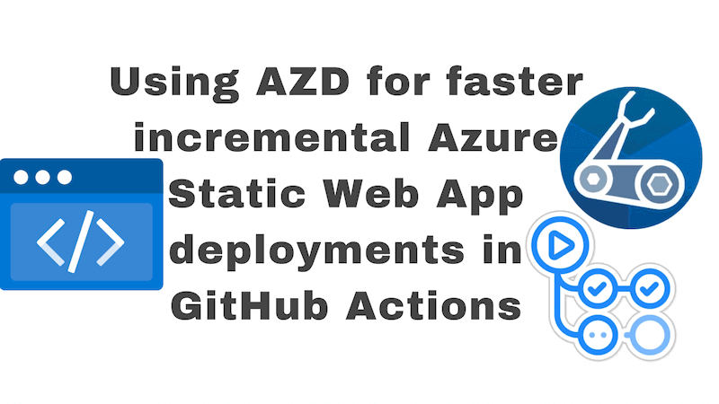

This post is a follow on from the post [Using AZD for faster incremental Azure Container App deployments in Azure DevOps](../2024-07-15-using-azd-for-faster-incremental-azure-container-app-deployments-in-azure-devops/index.md). In that post, we looked at how to speed up deployments of Azure Container Apps in Azure DevOps using [Azure Developer CLI (`azd`)](https://learn.microsoft.com/en-us/azure/developer/azure-developer-cli/). In this post, we're going to look at how to speed up deployments of Azure Static Web Apps in GitHub Actions using `azd`.

There's going to be a lot of overlap between the two posts. I don't want to force you to read two posts, so I'll duplicate some of the content from the previous post here. But I'll also add some new content that's specific to Azure Static Web Apps in GitHub Actions.



<!--truncate-->

## Faster deployments from `azd` 1.4 and beyond

The `azd` v1.4.0 release contained a significant feature: `azd provision` is now faster when there are no infrastructure changes.

To quote a trimmed down version of the [announcement](https://devblogs.microsoft.com/azure-sdk/azure-developer-cli-azd-october-2023-release/#azd-provision-is-now-faster-when-there-are-no-infrastructure-changes):

> If you’ve been using the Azure Developer CLI for a while, you may have noticed that sometimes `azd provision` takes a long time to complete when it may not need to. The wait time was because, prior to version 1.4.0, `azd provision` would always reprovision regardless of whether the underlying Infrastructure as Code had changed... As of today’s 1.4.0 release, `azd provision` now checks the most recent deployment upstream on Azure to see if the state is the same as what’s represented in the Infrastructure as Code that’s been used to provision. If the state is the same, the provision is skipped... with this new experience, you should also notice improved performance when running `azd up` in a CI/CD pipeline as provisioning will be automatically skipped when there are no changes.

This can help us speed up deployments of Azure Static Web Apps in GitHub Actions.

## Background

You're reading this post on my blog, which, at the time of writing, runs using Azure Static Web Apps. And has done for years. Every time I push a change, a deployment pipeline runs that deploys the changes to Azure. There's two distinct parts to the deployment pipeline:

1. deploying infrastructure (the Azure resources that the blog relies upon such as the Azure Static Web App, a Cosmos DB etc)
2. building and deploying the application code (the blog itself)

It takes the princely time of **3 minutes** to deploy the infrastructure. Every time the pipeline runs. But most of the time, there are no changes to be made to the infrastructure. So it's a waste of time. I want to speed this up and I think that `azd` can help me do that.

Specifically, I want to replace my usage of `az deployment group create` to using `azd provision`. Because `azd provision` is faster when there are no infrastructure changes. We will drop the infrastructure deployment job time from **3 minutes** to **20 seconds** when there are no infrastructure changes.

Now when I started trying to see if doing faster deployments of Static Web Apps was possible with `azd`, I couldn't discover any documentation. So I've come to write the documentation I wish had existed. There may be a better way to do this. But this is what I've come up with.

To be clear on scope, my intention here is only to speed up how we handle the deployment of the infrastructure. I don't want to deploy infrastructure if there are no changes and `azd` can help with that. I'm not going all in on `azd` for the deployment of the application code as well. For now, we'll focus solely on the infrastructure piece. Maybe we'll come back to the application code in a future post.

From here on out, we'll go through the changes we need to make to our project to replace `az deployment group create` with `azd provision` for faster incremental Azure Static Web App deployments in GitHub Actions.

## Hello `azure.yml`

To migrate to `azd`, we'll requires an `azure.yml` file in our project. This file is going to contain the configuration for our `azd` project. Here's what it looks like:

```yaml
# yaml-language-server: $schema=https://raw.githubusercontent.com/Azure/azure-dev/main/schemas/v1.0/azure.yaml.json

name: my-static-web-app
metadata:
  template: azd-init@1.9.6
services:
  web:
    host: staticwebapp
    resourceName: ${STATIC_WEB_APP_NAME}
    project: ./blog-website
    language: js
```

The particular things to note in this file are:

- we have one service - `web` - this is the service that represents our Static Web App
- our host is `staticwebapp` - this means we're deploying a Static Web App
- we provide the resource name of our static web app name in the `STATIC_WEB_APP_NAME` environment variable. (The `resourceName` parameter supports environment variable substitution)
- we provide the path to the project that contains the code for our Static Web App in the `project` parameter and specify it is `js` code in the `language` parameter. Neither of these parameters are used by `azd` during provisioning, but they are required.

## Bicep modifications

The feature we want to consume from `azd` is the ability to avoid provisioning infrastructure when there are no changes. To do this, we need to make some modifications to our Bicep files in order that `azd` can determine whether there are changes or not.

### Using resource group scoped deployments with azd

We're going to start off with a minor tweak to our `main.bicep` file; the entry point to our Bicep deployments.

```bicep
targetScope = 'resourceGroup'
```

The change above allows us to use `azd` deployments targeted at existing resource groups. The default mode of operation for `azd` deployments is deploying a resource group to a subscription. We are seeking to [deploy to an existing resource group](https://learn.microsoft.com/en-us/azure/developer/azure-developer-cli/resource-group-scoped-deployments).

Now, strictly speaking, this isn't necessary for speeding up deployments with `azd`. But if you're not one for creating a resource group per deployment (as I am not), then this is a good idea. This kind of deployment requires less permissions and aligns with the principle of least privilege.

We'll need to opt into using this feature with `azd` later on in the pipeline; at present resource group scoped deployments are considered "alpha".

### New parameters in `main.bicep`

We're going to add an `envName` parameter that will be used to populate `azd-env-name` tags on resources. We're also going to add a parameter that will be used to determine whether the static web app already exists:

```bicep
@description('Environment eg dev, prod')
param envName string

// ...

@description('Specifies if the static web app exists - azd will provide this')
#disable-next-line no-unused-params
param staticWebAppExists bool = false
```

Whilst the equivalent "exists" parameter **is** used by Container App provisioning, it's not clear if Static Web Apps need it also. I have a feeling this could be omitted, given that the parameter is unused. (As indicated by the `#disable-next-line no-unused-params` to quiet the linter.) But I'm going to include the parameter for now.

### Tagging resources with the azd tags

Now that we've passed the `envName` parameter to our `main.bicep` file, we're going to use it to tag our resources with the environment name. This allows `azd` to determine the environment of a given resource. We already have a `tags` object, let's add the value of the `envName` parameter to it with the special property name of `azd-env-name`:

```bicep
var combinedTags = union(tags, { 'azd-env-name': envName })
```

We'll make use of the `combinedTags` object as we tag our resources instead of the `tags` object. We will also add an extra tag to the static web app resource to identify it as our `web` service:

```bicep
var tagsForStaticWebApp = union({
  // ...
  'azd-service-name': 'web' // note the "web" matches the service name in azure.yml
}, combinedTags)

resource staticWebApp 'Microsoft.Web/staticSites@2022-09-01' = {
  name: staticWebAppName
  location: location
  tags: tagsForStaticWebApp
  // ...
}
```

### Migrating to `main.bicepparam`

Prior to using `azd`, we were using a `main.bicep` file to deploy our infrastructure and we provided parameters to this file via our GitHub Actions workflow. We're going to make a change to our pipeline to use a [`main.bicepparam`](https://learn.microsoft.com/en-us/azure/azure-resource-manager/bicep/parameter-files?tabs=Bicep) file instead.

The `main.bicepparam` file is going to contain the parameters that we were previously providing directly to our `main.bicep` file. It's going to pick these up from environment variables that we'll declare and from environment variables provided by `azd`; such as the one to drive environment name and whether our service exists. So there's a little more indirection in our parameter passing now. It used to be:

GitHub Actions -> `main.bicep`

Now it will be:

GitHub Actions -> `main.bicepparam` -> `main.bicep`

Consider the following (cut down) `main.bicepparam` file:

```bicep
using './main.bicep'

param envName = readEnvironmentVariable('AZURE_ENV_NAME', '')
param location = readEnvironmentVariable('AZURE_LOCATION', '')
param branch = readEnvironmentVariable('REPOSITORY_BRANCH', '')
param staticWebAppName = readEnvironmentVariable('STATIC_WEB_APP_NAME', '')

param tags = {
  owner: readEnvironmentVariable('TAGS_OWNER', '')
  emain: readEnvironmentVariable('TAGS_EMAIL', '')
}

// ...

// azd will provide the following parameters
param staticWebAppExists = bool(readEnvironmentVariable('SERVICE_WEB_RESOURCE_EXISTS', 'false'))
```

## Updating our GitHub Actions workflow to use `azd`

We're going to need to install and configure `azd` in our GitHub Actions workflow:

```yml
- name: Install azd 🔧
  uses: Azure/setup-azd@v1.0.0

- name: Set `azd` config options 🔧
  run: |
    azd config set auth.useAzCliAuth "true"
    azd config set alpha.resourceGroupDeployments on
```

As well as installing `azd`, we're setting two configuration options. The first option tells `azd` to use the Azure CLI for authentication - we already have the [Azure Login Action](https://github.com/marketplace/actions/azure-login) in our workflow, logging in so we can use the Azure CLI. With this option set, `azd` can make use of that existing authentication rather than implementing its own. The second option enables resource group scoped deployments because we're using resource group scoped deployments in our Bicep files as we discussed earlier.

Get rid of this:

```yml
- name: Infra - deploy 🔧
  id: static_web_app_deploy
  uses: azure/CLI@v2
  with:
    inlineScript: |
      az deployment group create \
        --resource-group ${{ env.RESOURCE_GROUP }} \
        --name "${{ steps.deployment_name.outputs.DEPLOYMENT_NAME }}" \
        --template-file ./infra/main.bicep \
        --parameters \
            branch='main' \
            location='${{ env.LOCATION }}' \
            staticWebAppName='${{ env.STATICWEBAPPNAME }}' \
            tags='${{ env.TAGS }}' \
            rootCustomDomainName='${{ env.ROOTCUSTOMDOMAINNAME }}' \
            blogCustomDomainName='${{ env.BLOGCUSTOMDOMAINNAME }}'
```

Replace it with this:

```yml
- name: Infra - provision 🔧
  run: azd provision --no-prompt
  env:
    # See https://learn.microsoft.com/en-gb/azure/developer/azure-developer-cli/configure-devops-pipeline?tabs=azdo
    AZURE_LOCATION: ${{ env.AZURE_LOCATION }}
    AZURE_SUBSCRIPTION_ID: ${{ vars.AZURE_SUBSCRIPTION_ID }}
    AZURE_ENV_NAME: prod # I only have one environment - you might have more
    # https://learn.microsoft.com/en-us/azure/developer/azure-developer-cli/manage-environment-variables#user-provided-environment-variables
    AZURE_RESOURCE_GROUP: ${{ env.AZURE_RESOURCE_GROUP }}

    # Define the additional variables or secrets that are required only for provision - see main.bicepparam
    REPOSITORY_BRANCH: main # we only provision for the main branch
    STATIC_WEB_APP_NAME: ${{ env.STATIC_WEB_APP_NAME }}

    TAGS_OWNER: ${{ env.TAGS_OWNER }}
    TAGS_EMAIL: ${{ env.TAGS_EMAIL }}

    ROOT_CUSTOM_DOMAIN_NAME: ${{ env.ROOT_CUSTOM_DOMAIN_NAME }}
    BLOG_CUSTOM_DOMAIN_NAME: ${{ env.BLOG_CUSTOM_DOMAIN_NAME }}
```

You'll see that we're populating environment variables that will be picked up by our `main.bicepparam` file. These were the same variables that were being passed explicitly to our `main.bicep` file when we were using `az deployment group create`. Now it will be `azd` that will be responsible for passing these values to our `main.bicep` file, using `main.bicepparam` as the connective tissue.

When `azd provision` runs, it will look at the existing infrastructure and determine whether there are changes to be made. If there are no changes, then the deployment will be skipped. This is the magic of `azd`.

https://github.com/johnnyreilly/blog.johnnyreilly.com/pull/913/files

https://learn.microsoft.com/en-us/azure/developer/azure-developer-cli/configure-devops-pipeline?tabs=GitHub
