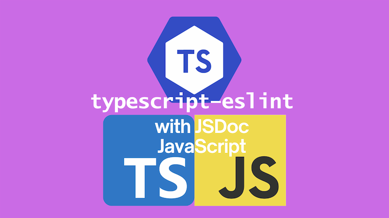
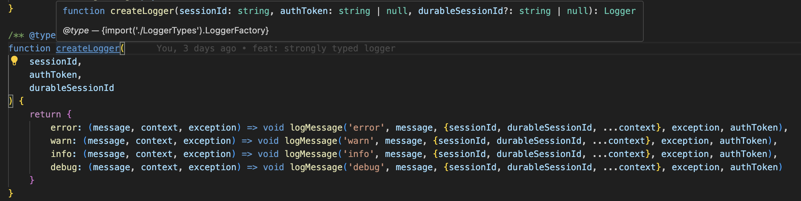

It's possible to statically type check a JavaScript codebase with TypeScript with JSDoc annotation. [Read this post to learn more.](../2021-11-22-typescript-vs-jsdoc-javascript/index.md) It's possible to go a little further, and use `typescript-eslint` to lint your codebase with the benefits of type information. This post will show you how to set this up and talk about some of the gotchas.



<!--truncate-->

## Background

I recently worked on a project where we had a five year old React JavaScript codebase. There wasn't time to convert the codebase to TypeScript, but we wanted to see if we could get some of the benefits of TypeScript by using JSDoc annotations. The codebase also didn't have linting in place. So we thought we'd see to use `typescript-eslint` to lint our codebase. This was a little tricky to set up, so I thought I'd write a post to help others who might be in the same situation.

## Setting up TypeScript

First things first, you'll need to set up TypeScript in your project. You can do this by running:

```bash
npm install --save-dev typescript
```

We now have TypeScript installed in our project. We'll need to create a `tsconfig.json` file to configure TypeScript to work with our JavaScript codebase:

```json
{
  "compilerOptions": {
    /* Visit https://aka.ms/tsconfig to read more about this file */

    /* Language and Environment */
    "lib": [
      "DOM",
      "DOM.Iterable",
      "ESNext"
    ] /* Specify a set of bundled library declaration files that describe the target runtime environment. */,
    "jsx": "preserve" /* Specify what JSX code is generated. */,

    /* Modules */
    "module": "esnext" /* Specify what module code is generated. */,
    "moduleResolution": "node" /* Specify how TypeScript looks up a file from a given module specifier. */,
    "resolveJsonModule": true /* Enable importing .json files. */,

    /* JavaScript Support */
    "allowJs": true /* Allow JavaScript files to be a part of your program. Use the 'checkJS' option to get errors from these files. */,
    "checkJs": true /* Enable error reporting in type-checked JavaScript files. */,
    // "maxNodeModuleJsDepth": 1,                        /* Specify the maximum folder depth used for checking JavaScript files from 'node_modules'. Only applicable with 'allowJs'. */

    /* Emit */
    "noEmit": true /* Disable emitting files from a compilation. */,

    /* Interop Constraints */
    "allowSyntheticDefaultImports": true /* Allow 'import x from y' when a module doesn't have a default export. */,
    "esModuleInterop": true /* Emit additional JavaScript to ease support for importing CommonJS modules. This enables 'allowSyntheticDefaultImports' for type compatibility. */,
    "forceConsistentCasingInFileNames": true /* Ensure that casing is correct in imports. */,

    /* Type Checking */
    "strict": true /* Enable all strict type-checking options. */,

    /* Completeness */
    "skipLibCheck": true /* Skip type checking all .d.ts files. */
  },
  "include": ["src", "eslint.config.mjs"]
}
```

The main things to draw from the above `tsconfig.json` are:

- enables type checking of JavaScript files with JSDoc annotations with the `allowJs` / `checkJs` options
- tells the TypeScript compiler to expect a modern browser environment with the `lib` option
- tells the TypeScript compiler to expect React JSX with the `jsx` option
- tells the TypeScript compiler not to emit any files with the `noEmit` option (as we're only using TypeScript for type checking - we will have no files output)
- tells the TypeScript compiler to run in strict mode with the `strict` option - I'm going all in for type checking; you may want to be more selective

Finally we need to add a script to our `package.json` to run the TypeScript compiler:

```json
  "scripts": {
    "typecheck": "tsc --noEmit"
  }
```

You could omit the `--noEmit` flag given we've set `noEmit` to `true` in our `tsconfig.json`, but I like to be explicit.

We can now run `npm run typecheck` to type check our JavaScript codebase with TypeScript. This will check all the JavaScript files in our `src` directory. At this point, you'll almost certainly see a lot of errors. Without some JSDoc annotations, TypeScript will struggle to infer some types for your codebase. Particularly parameters of functions.

Your mission now is to add JSDoc annotations to your codebase to help TypeScript out. This is a bit of a grind, but it's worth it. You'll get a lot of the benefits of TypeScript without having to convert your codebase to TypeScript. Should you reach the point where all the errors are dealt with, you can include the `typecheck` script in your CI pipeline to ensure that new code is type checked / existing code doesn't regress.

## JSDoc and the Type Annotations ECMAScript proposal

If you're looking for references on how to write JSDoc annotations, the [TypeScript handbook](https://www.typescriptlang.org/docs/handbook/jsdoc-supported-types.html) is a great place to start. It's also worth reading Gil Tayar's post on [JSDoc typings](https://gils-blog.tayar.org/posts/jsdoc-typings-all-the-benefits-none-of-the-drawbacks/).

Gil, it's worth noting, is one of the people working on the [Type Annotations ECMAScript proposal](https://github.com/tc39/proposal-type-annotations) for adding support for type annotations to JavaScript. I've [a post about that proposal](../2022-04-16-type-annotations-proposal-strong-types-weakly-held/index.md) which you might find useful.

The fact that the proposal exists in the first place, points to how much the community would rather write TypeScript rather than JavaScript. At the time I write this, Bun, Deno and even Node.js now support running TypeScript directly; without a transpilation stage. And should the Type Annotations proposal one day reach Stage 4, then hopefully we can all move to that in browsers as well.

Because what's clear is that writing JSDoc is less fun than writing TypeScript.

## Playing JSDoc on easy mode

But in the situation I'm in now, I have to write JSDoc. But I can combine writing JSDoc with also writing TypeScript, **when the code in question is type only**. Confused? Let me explain.

In our codebase we have a `logger.js` file which contains the following JavaScript function:

```
function createLogger(
    sessionId,
    authToken,
    durableSessionId
) {
    return {
        error: (message, context, exception) => void logMessage('error', message, {sessionId, durableSessionId, ...context}, exception, authToken),
        warn: (message, context, exception) => void logMessage('warn', message, {sessionId, durableSessionId, ...context}, exception, authToken),
        info: (message, context, exception) => void logMessage('info', message, {sessionId, durableSessionId, ...context}, exception, authToken),
        debug: (message, context, exception) => void logMessage('debug', message, {sessionId, durableSessionId, ...context}, exception, authToken)
    }
}
```

This function is a factory function that returns a logger object. The logger object has four methods: `error`, `warn`, `info`, and `debug`. Each method logs a message at a different level. The `logMessage` function is a private function that does the actual logging (and it logs asynchronously hence the `void`).

Now to provide that level of information in JSDoc, we'd write something like this:

```js
/**
 * @typedef {function(string, object=, unknown=): void} LogMethod
 */

/**
 * @typedef {Object} Logger
 * @property {LogMethod} warn
 * @property {LogMethod} error
 * @property {LogMethod} info
 * @property {LogMethod} debug
 */

/**
 * @typedef {function(string, string|null, string|null): Logger} LoggerFactory
 */

/**
 * @typedef {"debug" | "info" | "warn" | "error"} LogLevel
 */
```

For my money, this is not that readable. I would much rather write it in TypeScript:

```ts
type LogMethod = (
  message: string,
  context?: object,
  exception?: unknown,
) => void;

export interface Logger {
  warn: LogMethod;
  error: LogMethod;
  info: LogMethod;
  debug: LogMethod;
}

export type LoggerFactory = (
  sessionId: string,
  authToken: string | null,
  durableSessionId?: string | null,
) => Logger;

export type LogLevel = 'debug' | 'info' | 'warn' | 'error';
```

This is pure TypeScript code. The tremendous news is that we can write this and we can consume this in a JSDoc file **because there is no runtime code in here**. It's purely type information. We'll write this in a `.d.ts` file and then we can `import` it into in our JS files.

So let's imagine we have a `loggerTypes.d.ts` file with the above TypeScript code in it. We can then import the `LoggerFactory` into our `logger.js` file like this:

```diff
+/** @type {import('./loggerTypes').LoggerFactory} */
function createLogger(
    sessionId,
    authToken,
    durableSessionId
) {
    return {
        error: (message, context, exception) => void logMessage('error', message, {sessionId, durableSessionId, ...context}, exception, authToken),
        warn: (message, context, exception) => void logMessage('warn', message, {sessionId, durableSessionId, ...context}, exception, authToken),
        info: (message, context, exception) => void logMessage('info', message, {sessionId, durableSessionId, ...context}, exception, authToken),
        debug: (message, context, exception) => void logMessage('debug', message, {sessionId, durableSessionId, ...context}, exception, authToken)
    }
}
```

And with this single line addition to our `logger.js` file, we've now got type information for our `createLogger` function. This is what it looks like in VS Code once you've added that JSDoc annotation:



So here we've had one line of JSDoc and we've got all the type information we need **using TypeScript**. Our runtime code is still JavaScript, but our type information is TypeScript. This is a great way to get the benefits of TypeScript without having to write all your type information in JSDoc.

## A note on `.d.ts` file naming

I was intentional around the naming of the `.d.ts` file. I've called it `loggerTypes.d.ts` because I want to make it clear that this file is all about types. It's not a `.js` file, it's a `.d.ts` file. I've also been deliberate about calling it `[filename]Types.d.ts` for two reasons:

1. Due to suffixless imports, the TypeScript compiler can be confused if you have a `logger.js` and a `logger.d.ts` file in the same directory and write a `import('./loggerTypes')` statement. Having `Types` in the name removes this ambiguity.
2. Although in my case I'm working on a React app and am not likely to be publishing my types, if I were writing a library, I might want to emit types from my JavaScript. The following `tsconfig.json` option would allow me to do that:

```json
{
  "compilerOptions": {
    "emitDeclarationOnly": true,
    "declarationDir": "types",
    "declaration": true
  }
}
```

If it was emitting types from a `logger.js` file, it would overwrite the types emitted from an existing `logger.d.ts` file. Having `Types` in the name means that should that case arise, we are safe.

## Setting up `typescript-eslint`

But you didn't come here to just type check your codebase, you want to lint it too! Let's set up [`typescript-eslint`](https://typescript-eslint.io/) to lint our codebase with the benefits of type information.

```bash
npm install --save-dev eslint @eslint/js @types/eslint__js typescript typescript-eslint eslint-plugin-react globals
```
