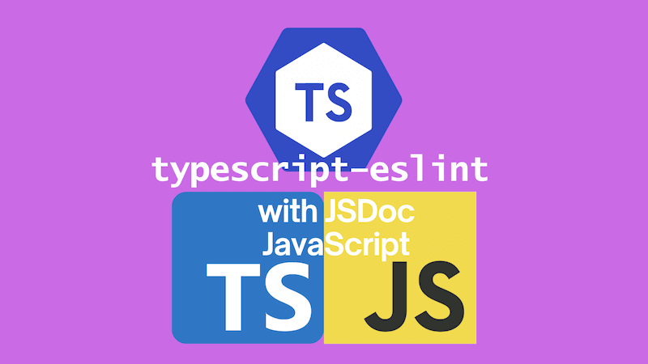
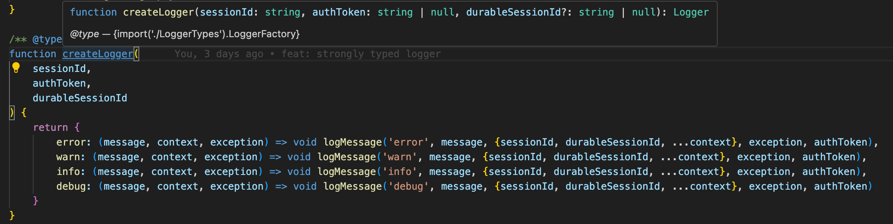

It's possible to statically type check a JavaScript codebase with TypeScript with JSDoc annotations. Going a little further, and using `typescript-eslint` to lint your codebase with the benefits of type information can improve your code quality even more. This post will show you how to set this up and talk about some of the gotchas.



We'll also talk a little about how to use TypeScript in combination with JSDoc annotations in a JavaScript codebase.

<!--truncate-->

## Background

I recently worked on a project where we had a five year old React JavaScript codebase. There wasn't time to convert the codebase to TypeScript, but we wanted to see if we could get some of the benefits of TypeScript by using JSDoc annotations. The codebase also didn't have linting in place. So we thought we'd see if we could use `typescript-eslint` to lint our codebase. This was a little tricky to set up, so I thought I'd write a post to help others who might be in the same situation.

## Setting up TypeScript

First things first, you'll need to set up TypeScript in your project. You can do this by running:

```bash
npm install --save-dev typescript
```

We now have TypeScript installed in our project. We'll need to create a `tsconfig.json` file to configure TypeScript to work with our JavaScript codebase:

```json
{
  "compilerOptions": {
    /* Visit https://aka.ms/tsconfig to read more about this file */

    /* Language and Environment */
    "lib": [
      "DOM",
      "DOM.Iterable",
      "ESNext"
    ] /* Specify a set of bundled library declaration files that describe the target runtime environment. */,
    "jsx": "preserve" /* Specify what JSX code is generated. */,
    "target": "ESNext", /* Set the JavaScript language version for emitted JavaScript and include compatible library declarations. */

    /* Modules */
    "module": "preserve" /* Specify what module code is generated. */,
    "resolveJsonModule": true /* Enable importing .json files. */,

    /* JavaScript Support */
    "checkJs": true /* Enable error reporting in type-checked JavaScript files. Implicitly sets `allowJs: true` */,
    // "maxNodeModuleJsDepth": 1,                        /* Specify the maximum folder depth used for checking JavaScript files from 'node_modules'. Only applicable with 'allowJs'. */

    /* Emit */
    "noEmit": true /* Disable emitting files from a compilation. */,

    /* Type Checking */
    "strict": true /* Enable all strict type-checking options. */,

    /* Completeness */
    "skipLibCheck": true /* Skip type checking all .d.ts files. */
  },
  "include": ["src", "eslint.config.mjs"]
}
```

The main things to draw from the above `tsconfig.json` are:

- it enables type checking of JavaScript files with JSDoc annotations with the `allowJs` / `checkJs` options
- it tells the TypeScript compiler to expect a modern browser environment with the `lib` option
- it tells the TypeScript compiler to expect React JSX with the `jsx` option
- it tells the TypeScript compiler not to emit any files with the `noEmit` option (as we're only using TypeScript for type checking - we will not be transpiling TypeScript into JavaScript)
- it tells the TypeScript compiler to run in strict mode with the `strict` option - I'm going all in on type checking; you may want to be more selective

Finally we need to add a script to our `package.json` to typecheck our codebase with the TypeScript compiler:

```json
  "scripts": {
    "typecheck": "tsc --noEmit"
  }
```

You could omit the `--noEmit` flag given we've set `noEmit` to `true` in our `tsconfig.json`, but I like to be explicit.

We can now run `npm run typecheck` to type check our JavaScript codebase with TypeScript. This will check all the JavaScript files in our `src` directory. At this point, you'll almost certainly see a lot of errors. Without some JSDoc annotations, TypeScript will struggle to infer some types for your codebase. Particularly parameters of functions.

Your mission now is to add JSDoc annotations to your codebase to help TypeScript out. This is a bit of a grind, but it's worth it. You'll get a lot of the benefits of TypeScript without having to convert your codebase to TypeScript. Should you reach the point where all the errors are dealt with, you can include the `typecheck` script in your CI pipeline to ensure that new code is type checked / existing code doesn't regress.

## JSDoc and the Type Annotations ECMAScript proposal

If you're looking for references on how to write JSDoc annotations, the [TypeScript handbook](https://www.typescriptlang.org/docs/handbook/jsdoc-supported-types.html) is a great place to start. It's also worth reading Gil Tayar's post on [JSDoc typings](https://gils-blog.tayar.org/posts/jsdoc-typings-all-the-benefits-none-of-the-drawbacks/).

[Gil](https://gils-blog.tayar.org/about/), it's worth noting, is one of the people working on the [Type Annotations ECMAScript proposal](https://github.com/tc39/proposal-type-annotations) for adding support for type annotations to JavaScript. I've written [a post about that proposal](../2022-04-16-type-annotations-proposal-strong-types-weakly-held/index.md) which you might find useful.

The fact that the proposal exists in the first place, points to how much the community would rather write TypeScript rather than JavaScript. At the time I write this, Bun, Deno and even Node.js now support running TypeScript directly; without a transpilation stage. And should the Type Annotations proposal one day reach Stage 4, then hopefully we can all move to that in browsers as well.

This is subjective, but it feels like a fairly common view that writing JSDoc is less fun than writing TypeScript.

## Playing JSDoc on easy mode (JSDoc `.js` + `.ts`)

But in the situation I'm in now, I have to write JSDoc. But I can combine writing JSDoc with also writing TypeScript, **when the code in question is type only**. Confused? Let me explain.

In our codebase we have a `logger.js` file which contains the following JavaScript function:

```
function createLogger(
    sessionId,
    authToken,
    durableSessionId
) {
    return {
        error: (message, context, exception) => void logMessage('error', message, {sessionId, durableSessionId, ...context}, exception, authToken),
        warn: (message, context, exception) => void logMessage('warn', message, {sessionId, durableSessionId, ...context}, exception, authToken),
        info: (message, context, exception) => void logMessage('info', message, {sessionId, durableSessionId, ...context}, exception, authToken),
        debug: (message, context, exception) => void logMessage('debug', message, {sessionId, durableSessionId, ...context}, exception, authToken)
    }
}
```

This function is a factory function that returns a logger object. The logger object has four methods: `error`, `warn`, `info`, and `debug`. Each method logs a message at a different level. The `logMessage` function is a private function that does the actual logging (and it logs asynchronously hence the `void`).

Now to provide that level of information in JSDoc, we'd write something like this:

```js
/**
 * @typedef {function(string, object=, unknown=): void} LogMethod
 */

/**
 * @typedef {Object} Logger
 * @property {LogMethod} warn
 * @property {LogMethod} error
 * @property {LogMethod} info
 * @property {LogMethod} debug
 */

/**
 * @typedef {function(string, string|null, string|null): Logger} LoggerFactory
 */

/**
 * @typedef {"debug" | "info" | "warn" | "error"} LogLevel
 */
```

For my money, this is not that readable. I would much rather write it in TypeScript:

```ts
type LogMethod = (
  message: string,
  context?: object,
  exception?: unknown,
) => void;

export interface Logger {
  warn: LogMethod;
  error: LogMethod;
  info: LogMethod;
  debug: LogMethod;
}

export type LoggerFactory = (
  sessionId: string,
  authToken: string | null,
  durableSessionId?: string | null,
) => Logger;

export type LogLevel = 'debug' | 'info' | 'warn' | 'error';
```

This is pure TypeScript code. The tremendous news is that we can write type-only TypeScript and we can consume it in a JSDoc JavaScript file **because there is no runtime code in here**. It's purely type information. We'll write this in a `.ts` file and then we can `import` it into in our JS files.

So let's imagine we have a `loggerTypes.ts` file with the above TypeScript code in it. We can then import the `LoggerFactory` into our `logger.js` file like this:

```diff
+/** @type {import('./loggerTypes').LoggerFactory} */
function createLogger(
    sessionId,
    authToken,
    durableSessionId
) {
    return {
        error: (message, context, exception) => void logMessage('error', message, {sessionId, durableSessionId, ...context}, exception, authToken),
        warn: (message, context, exception) => void logMessage('warn', message, {sessionId, durableSessionId, ...context}, exception, authToken),
        info: (message, context, exception) => void logMessage('info', message, {sessionId, durableSessionId, ...context}, exception, authToken),
        debug: (message, context, exception) => void logMessage('debug', message, {sessionId, durableSessionId, ...context}, exception, authToken)
    }
}
```

And with this single line addition to our `logger.js` file, we've now got type information for our `createLogger` function. This is what it looks like in VS Code once you've added that JSDoc annotation:



So here we've had one line of JSDoc and we've got all the type information we need **using TypeScript**. Our runtime code is still JavaScript, but our type information is TypeScript. This is a great way to get the benefits of TypeScript without having to write all your type information in JSDoc.

## A note on `.ts` file naming

I was intentional around the naming of the `.ts` file. I've called it `loggerTypes.ts` because I want to make it clear that this file is all about types. It's not a (runtime) `.js` file, it's a `.ts` file - relevant for compile time. The `Types` suffix is deliberate too; it's not `logger.ts` entirely as planned.

The TypeScript compiler doesn't understand a world in which there is a `logger.js` file which imports types from a `logger.ts` file. Expect difficulty if you should try to use that approach. Particularly in a world in which ESM has lead to all imports being from `.js` files even when they are actually `.ts` source files.

What's more, you would not typically see code like that in a TypeScript (or JavaScript) codebase. It would invite head scratching from anyone who came across it. So having `Types` in the name means that the compiler is not confused, and hopefully neither are your colleagues. You are unambiguously importing a different file. (By the way, having a 1-1 relationship between `.ts` and `.js` files as I'm doing isn't mandatory, but I've found it to be a useful pattern.)

I did also consider the idea that the files I wrote should be `.d.ts` files rather than `.ts` files. After a [healthy discussion on Twitter](https://twitter.com/robpalmer2/status/1829856562422124734) I was directed by [Rob Palmer](https://twitter.com/robpalmer2) to what's probably the definitive answer on this from [Andrew Branch](https://github.com/andrewbranch) of the TypeScript team:

As ever in life, I find I cannot improve on [Andrew's guidance](https://github.com/microsoft/TypeScript/issues/52593#issuecomment-1419505081) and so I'll quote his views on the use of `.d.ts` files for storing hand-written utility types in full:

> I would say it’s discouraged or even harmful (though it won’t be “deprecated”). At best, it’s a technique with serious pitfalls that can be leveraged by people who understand them enough to set up additional tooling and safeguards to make it viable. Because `.d.ts` files only occur “naturally” as a pair with a `.js` file, together as outputs of a `.ts` file, a `.d.ts` file always implies the existence of a `.js` file. So the potential harm is readily apparent: if you hand-author `only-types.d.ts` and then write `import {} from "./only-types.js"`, this resolves and is legal in all settings, but in `verbatimModuleSyntax`, the import will be preserved and crash at runtime. While TypeScript has type-only imports and exports, it lacks the analogous concept of a type-only module, one which exists for type information purposes but is known to not exist at runtime, though I’ve casually suggested multiple times that such a concept could be useful.
>
> But the main reason I personally avoid this is just because it doesn’t copy into `outDir`. For my purposes, I’d rather just eat the cost of the empty JS file (which also protects you from crashes should you accidentally import it at runtime).

Thanks also to [Remco Haszing](https://remcohaszing.nl/) for sharing that [even local `.d.ts` files should not be validated if you use `skipLibCheck`](https://twitter.com/remcohaszing/status/1829808165459804330). (Oddly, I didn't see that behaviour in my own testing, but I wouldn't be surprised if I was doing something quirky.)

## Setting up `typescript-eslint`

But you didn't come here to just type check your codebase, you want to lint it too! Let's set up [`typescript-eslint`](https://typescript-eslint.io/) to lint our codebase with the benefits of type information. We're going to need to install a few more packages:

```bash
npm install --save-dev eslint @eslint/js @types/eslint__js typescript typescript-eslint eslint-plugin-react globals
```

We'll also need to create an `eslint.config.mjs` file to configure `eslint` to work with TypeScript (the eagle eyed amongst you will have noticed that we included this file in our `tsconfig.json` earlier). Here's what that file looks like:

```js
/* eslint-disable @typescript-eslint/no-unsafe-member-access */
import eslint from '@eslint/js';
import globals from 'globals';
import tseslint from 'typescript-eslint';
//@ts-expect-error no type definitions for eslint-plugin-react
import pluginReact from 'eslint-plugin-react';

export default [
  { files: ['**/*.{js,mjs,cjs,ts,jsx,tsx}'] },
  { languageOptions: { globals: globals.browser } },
  eslint.configs.recommended,
  ...tseslint.configs.recommendedTypeChecked, // yes we are using type checked
  {
    languageOptions: {
      parserOptions: {
        project: true,
        projectService: true,
        tsconfigRootDir: import.meta.dirname,
      },
    },
  },
  pluginReact.configs.flat.recommended,
  {
    settings: {
      react: {
        version: 'detect',
      },
    },
  },
  {
    rules: {
      // Not compatible with JSDoc according to @bradzacher and https://github.com/typescript-eslint/typescript-eslint/issues/8955#issuecomment-2097518639
      '@typescript-eslint/explicit-function-return-type': 'off',
      '@typescript-eslint/explicit-module-boundary-types': 'off',
      '@typescript-eslint/parameter-properties': 'off',
      '@typescript-eslint/typedef': 'off',
    },
  },
];
```

A common misconception is that you cannot use [`typescript-eslint`s linting with type information](https://typescript-eslint.io/getting-started/typed-linting) in JSDoc. You can. And here we are. However, there are some rules that are not compatible with JSDoc. We're turning those off in the `rules` section of the above `eslint.config.mjs` file.

The four rules we're turning off are rules that are not compatible with JSDoc according to [this thread on GitHub](https://github.com/typescript-eslint/typescript-eslint/issues/8955). In general, this is because the syntax required to satisfy the rule is not compatible with JS / JSDoc.

## Conclusion

In this post we've set up a JavaScript project to be type checked with JSDoc and the TypeScript compiler. We've also set up `typescript-eslint` to lint the codebase, including using type information. Hopefully this will help increase the type safety of JavaScript projects of your own.

I should say, it's been a learning exercise writing this post, and as I continue working on enriching the type safety of this particular codebase I'm likely to learn more. I'll be updating this post as I do.

[To read more on TypeScript vs JavaScript with JSDoc, you may want to read this post.](../2021-11-22-typescript-vs-jsdoc-javascript/index.md)
