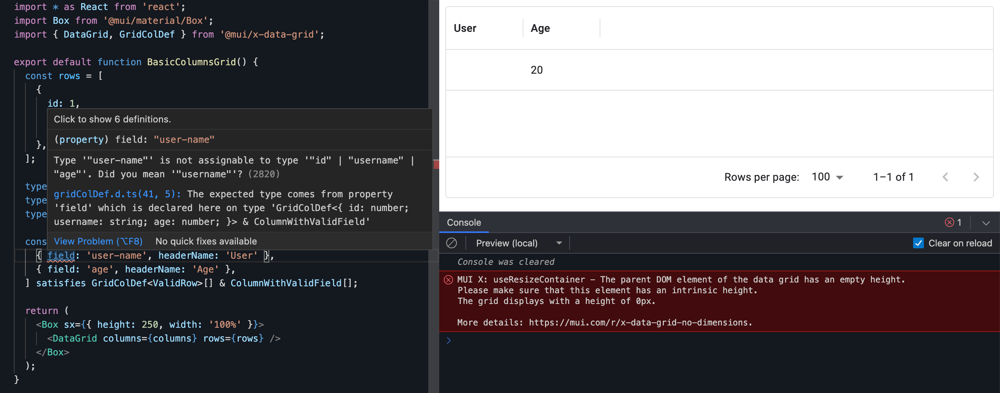

The [MUI X Data Grid](https://mui.com/x/react-data-grid/) is a really handy component for rendering tabular data in React applications. But one thing that is not immediately obvious is how to use TypeScript to ensure that the columns you pass to the component are correct. This post will show you how to do that.


Why does it matter? Well look at this screenshot of the Data Grid with incorrect column names:


<!--truncate-->

Interestingly, the `User` column is blank. Given the code, we'd probably expect to see a users name there.

Let's take look at the code for that screenshot:

```tsx
import * as React from 'react';
import Box from '@mui/material/Box';
import { DataGrid } from '@mui/x-data-grid';

export default function BasicColumnsGrid() {
  const rows = [
    {
      id: 1,
      username: '@MUI',
      age: 20,
    },
  ];

  const columns = [
    { field: 'user-name', headerName: 'User' },
    { field: 'age', headerName: 'Age' },
  ];

  return (
    <Box sx={{ height: 250, width: '100%' }}>
      <DataGrid columns={columns} rows={rows} />
    </Box>
  );
}
```

The issue is that the `field` property in the column definition is incorrect. It should be `username` not `user-name`. We know that, but the TypeScript compiler doesn't. And the Data Grid doesn't appear to know that either; there's no error in the console surfacing an issue.

## Using TypeScript to extract type information from the rows

It's possible to use TypeScript to ensure that the columns you pass to the Data Grid are valid. What we want, is TypeScript to say: "Hey, you've passed the wrong column name to the Data Grid" (in it's own inimitable way). We can do that.

What we want to do, is use TypeScript to analyse the `rows` array and extract type information. We can do that like so:

```diff
  const rows = [
    {
      id: 1,
      username: '@MUI',
      age: 20,
    },
  ];

+  type ValidRow = (typeof rows)[number];
+  type ValidField = keyof ValidRow;
+  type ColumnWithValidField = { field: ValidField };
```

The `ValidRow` type is the type of an element in the `rows` array:

```ts
type ValidRow = {
  id: number;
  username: string;
  age: number;
};
```

The `ValidField` type is derived from the `ValidRow` type; it is the keys of the `ValidRow` type. So, the `ValidField` type is:

```ts
type ValidField = 'id' | 'username' | 'age';
```

Finally, we can create a type that represents a column with a valid field in the form of the `ColumnWithValidField` type:

```ts
type ColumnWithValidField = {
  field: 'id' | 'username' | 'age';
};
```

The type above says explicitly that the `field` property of a column must be one of the keys of the `ValidRow` type. This is the type information we require to ensure that the columns we pass to the Data Grid are correct.

## Applying the type information to the columns

Now we have this type information, we can then use that information to type the `columns` array. We can do that like so:

```diff
  const columns = [
    { field: 'username', headerName: 'User' },
    { field: 'age', headerName: 'Age' },
-  ];
+  ] satisfies GridColDef<ValidRow>[] & ColumnWithValidField[];
```

Whereas previously the `columns` array was not explicitly typed. Now it is with the `satisfies` operator. (For an excellent explanation of `satifies` read [Matt Pocock's post](https://www.totaltypescript.com/clarifying-the-satisfies-operator).)

We are saying that `columns` is an array of `GridColDef<ValidRow>` **and** that the `field` property of each element in the array is definitely one of the provided fields in the `rows` data. We need both of these conditions to be true:

- Using `GridColDef<ValidRow>` ensures that the general columns schema matches what the Data Grid component needs.
- Using `ColumnWithValidField` ensures that the `field` property of each column is correct; based upon the `rows` field.

Let's validate this approach works, trying to use our buggy input with this new approach:



We can now see an error from the TypeScript compiler in VS Code: `Type '"user-name"' is not assignable to type '"id" | "username" | "age"'. Did you mean '"username"'?` It's even an actionable error, suggesting the correct field name!

## Putting it all together

Here's the full code (with the error corrected):

```tsx
import * as React from 'react';
import Box from '@mui/material/Box';
import { DataGrid, GridColDef } from '@mui/x-data-grid';

export default function BasicColumnsGrid() {
  const rows = [
    {
      id: 1,
      username: '@MUI',
      age: 20,
    },
  ];

  type ValidRow = (typeof rows)[number];
  type ValidField = keyof ValidRow;
  type ColumnWithValidField = { field: ValidField };

  const columns = [
    { field: 'username', headerName: 'User' },
    { field: 'age', headerName: 'Age' },
  ] satisfies GridColDef<ValidRow>[] & ColumnWithValidField[];

  return (
    <Box sx={{ height: 250, width: '100%' }}>
      <DataGrid columns={columns} rows={rows} />
    </Box>
  );
}
```

With this approach, you can be confident that the columns you pass to the Data Grid are correct. This is a great way to ensure that your code is correct and that you are using the Data Grid component as intended.

## The importance of memoizing columns

The [MUI docs say](https://mui.com/x/react-data-grid/column-definition/):

> The `columns` prop should keep the same reference between two renders. The columns are designed to be definitions, to never change once the component is mounted. Otherwise, you take the risk of losing elements like column width or order. You can create the array outside the render function or memoize it.

My own experience has been that I noticed no ill effects on my own use cases by **not** memoizing. When I asked the question I was advised this was still important [when you use a big number of columns and rows](https://github.com/mui/mui-x/issues/14862). To apply that to the example we've been working with, it would look like this:

```tsx
import * as React from 'react';
import Box from '@mui/material/Box';
import { DataGrid, GridColDef } from '@mui/x-data-grid';

export default function BasicColumnsGrid() {
  const rows = [
    {
      id: 1,
      username: '@MUI',
      age: 20,
    },
  ];

  type ValidRow = (typeof rows)[number];
  type ValidField = keyof ValidRow;
  type ColumnWithValidField = { field: ValidField };

  const columns = React.useMemo(() => [
    { field: 'username', headerName: 'User' },
    { field: 'age', headerName: 'Age' },
  ] satisfies GridColDef<ValidRow>[] & ColumnWithValidField[], []);

  return (
    <Box sx={{ height: 250, width: '100%' }}>
      <DataGrid columns={columns} rows={rows} />
    </Box>
  );
}
```
