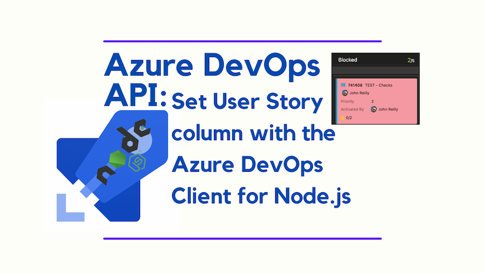
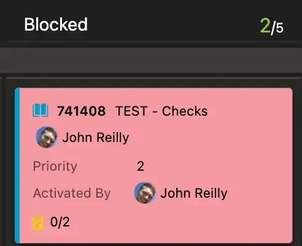

When I attempted to set the column of a User Story in Azure DevOps using the Azure DevOps Client for Node.js, I was surprised to find that the field `System.BoardColumn` was read-only and I bumped into the error:

> TF401326: Invalid field status 'ReadOnly' for field 'System.BoardColumn'.



This post explains how to set the column of a User Story in Azure DevOps using the Azure DevOps Client for Node.js and it's based in part on a [Stack Overflow question](https://stackoverflow.com/questions/56165538/how-to-modify-boardcolumn-field-of-a-work-item-using-rest-api).

<!--truncate-->

The [Azure DevOps Client for Node.js](https://github.com/microsoft/azure-devops-node-api) is a great way to interact with the Azure DevOps API if you're building with TypeScript. The library provides an API and the types. In this post, we'll use the client to set the column of a User Story in Azure DevOps rather than directly working with the API.



## Getting the WorkItemTrackingApi

Consider the following code:

```ts
import * as nodeApi from 'azure-devops-node-api';
import {
  type WorkItem,
  WorkItemExpand,
} from 'azure-devops-node-api/interfaces/WorkItemTrackingInterfaces.js';
import type { IWorkItemTrackingApi } from 'azure-devops-node-api/WorkItemTrackingApi.js';

// ...

const authHandler = pat // If running locally you will use a Personal Access Token
  ? nodeApi.getPersonalAccessTokenHandler(
      pat,
      /** allowCrossOriginAuthentication */ true,
    )
  : // If running in Azure DevOps you will use the System.AccessToken
    nodeApi.getHandlerFromToken(
      sat,
      /** allowCrossOriginAuthentication */ true,
    );

const webApi = new nodeApi.WebApi(
  'https://dev.azure.com/johnnyreilly/',
  authHandler,
);
const workItemTrackingApi = await webApi.getWorkItemTrackingApi();
```

This code sets up the Azure DevOps Client for Node.js and gets the `WorkItemTrackingApi`. The `WorkItemTrackingApi` is the API we'll use to set the column of a User Story. You'll need to replace `pat` and `sat` with your Personal Access Token and System Access Token, respectively (depending on where this code executes). And the organisation you use will likely be different from `johnnyreilly`.

## Getting the User Story

We can now load our user story, given its ID:

```ts
const userStory = await workItemTrackingApi.getWorkItem(
  userStoryId,
  /** fields */ undefined,
  /** asOf */ undefined,
  /** expand */ WorkItemExpand.All,
);
```

This code loads the User Story with the ID `userStoryId`. We're using the `WorkItemExpand.All` option to ensure we get all the fields of the User Story.When you look at the User Story, you'll see that the `System.BoardColumn` field is there. This is the field we want to set, but we can't do it directly. If we try we'll encounter the notorious error:

> TF401326: Invalid field status 'ReadOnly' for field 'System.BoardColumn'.

However, if you look closely at the User Story you'll see two very similar fields:

```json
"System.BoardColumn": "Blocked",

// ...

"WEF_1D7E8E9B92454212B8A5E6DFBCED0D17_Kanban.Column": "Blocked",
```

The `System.BoardColumn` field is read-only, but the `WEF_1D7E8E9B92454212B8A5E6DFBCED0D17_Kanban.Column` field is not. This is the field we can set to change the column of the User Story. And that will, in turn, set the `System.BoardColumn` field. Why this is the case is a mystery to me, but it works.

## What columns can we set?

This may be more than what you need, but as someone who has bumped into the error:

> TF401320: Rule Error for field State. Error code: Required, HasValues, LimitedToValues, SetByRule, InvalidEmpty.

You might want to know what columns you can set, in order that you can avoid this error happening. Or at least you might want to know what columns you can set so that you can provide a helpful error message to the user. Here's how you can get the columns for a board:

```ts
const workApi = await webApi.getWorkApi();

const columns = await workApi.getBoardColumns(
  {
    project: 'my-project',
    team: 'my-team',
  },
  'Stories',
);

const validColumns = columns
  .map((column) => column.name ?? '')
  .filter((name) => name);
```

This is optional, but I've found it useful.

## Setting the Column

With all that taken care of, we can now set the column of the User Story with this code:

```ts
async function updateUserStoryColumn({
  userStory,
  workItemTrackingApi,
  columnName,
  validColumns,
  whatIf,
}: {
  userStory: WorkItem;
  workItemTrackingApi: IWorkItemTrackingApi;
  columnName: string;
  validColumns: string[];
  whatIf: boolean;
}) {
  const isAValidColumn = validColumns.includes(columnName);
  if (!isAValidColumn) {
    throw new Error(
      `We cannot move a User Story to the column "${columnName}"; these are the columns that a User Story can be moved to: ${validColumns.map((column) => `"${column}"`).join(', ')}`,
    );
  }

  if (!userStory.fields) {
    throw new Error('No fields found');
  }

  // We are looking for a field like this:
  // 'WEF_1D7E8E9B92454212B8A5E6DFBCED0D17_Kanban.Column': 'In-Progress',

  const wefField = [...Object.entries(userStory?.fields)].find(
    ([fieldName, _value]) => fieldName.includes('_Kanban.Column'),
  );

  if (!wefField) {
    throw new Error('No WEF field found');
  }
  const fieldToUpdate = wefField[0];

  // Define the update
  const patchDocument = [
    {
      op: 'add', // surprisingly, this is the operation for updating a field - see https://learn.microsoft.com/en-us/rest/api/azure/devops/wit/work-items/update?view=azure-devops-rest-7.1&tabs=HTTP#update-a-field
      path: `/fields/${fieldToUpdate}`,
      value: columnName,
    },
    // COMMENTED OUT AS WILL NEVER WORK - LEFT FOR ILLUSTRATION
    // {
    //     op: "add",
    //     path: `/fields/System.BoardColumn`,
    //     value: columnName,
    // },
  ];

  try {
    if (whatIf) {
      console.log(
        `Would update User Story ${userStory.id} to column ${columnName}`,
        patchDocument,
      );
      return;
    }

    // Update the work item
    const updatedWorkItem = await workItemTrackingApi.updateWorkItem(
      /** customHeaders */ undefined,
      /** document */ patchDocument,
      /** id */ userStory.id!,
    );
    console.log(`User Story ${updatedWorkItem.id} moved to ${columnName}`);
  } catch (err) {
    console.error(
      `Error moving User Story ${userStory.id} to ${columnName}`,
      err,
    );
  }
}

await updateUserStoryColumn({
  userStory,
  workItemTrackingApi,
  columnName: 'Prioritised',
  validColumns,
  whatIf: false,
});
```

The code above:

- Checks that the column we want to move the User Story to is a valid column.
- Finds the curiously named `WEF_1D7E8E9B92454212B8A5E6DFBCED0D17_Kanban.Column` style field we need to update, purely by looking for a field that contains `_Kanban.Column`.
- Defines the update using the [mechanism documented here](https://learn.microsoft.com/en-us/rest/api/azure/devops/wit/work-items/update?view=azure-devops-rest-7.1&tabs=HTTP#update-a-field).
- Updates the User Story.

You can also see there's a `whatIf` option. If you set this to `true`, the code will log what it would do without actually doing it. This is useful for testing.

And this mechanism works - the User Story is moved to the column you specify as desired.
