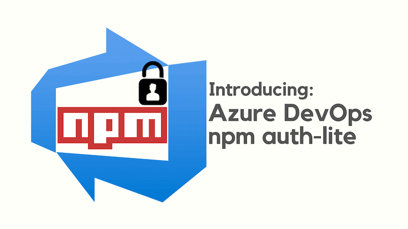
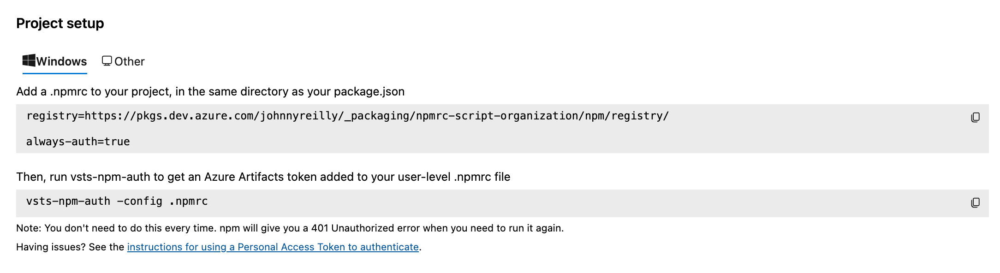
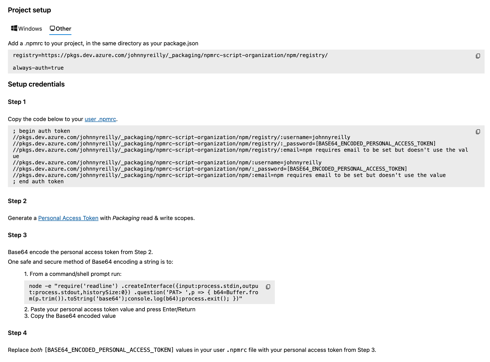

Azure DevOps has a feature called Azure Artifacts that supports publishing npm packages to a feed for consumption. Typically those npm packages are intended to be consumed by a restricted audience. To install a package published to a private feed you need to configure authentication, and for non Windows users this is a convoluted process.



Azure DevOps npm auth-lite exists to ease the setting up of local authentication to Azure DevOps npm feeds, particularly for non Windows users.

<!--truncate-->

## What problem are we solving?

Consider the onboarding process for a Windows user for consuming an Azure Artifact npm feed:



Now consider the onboarding process for a non Windows user:



As we can see, there is a significant difference in the onboarding experience between operating systems. The instructions walk through manually creating an `.npmrc` file in a users home directory which contains information including a base 64 encoded Azure DevOps Personal Access Token with the Packaging read and write scopes. It is tedious to do.

`ado-npm-auth-lite` aims to automate the toil, and make the onboarding experience for non Windows users as simple as it is for Windows users.

There is an official package named [`ado-npm-auth`](https://github.com/microsoft/ado-npm-auth). However, [due to issues I experienced in using the `ado-npm-auth` package](https://github.com/microsoft/ado-npm-auth/issues/50), I found myself creating `ado-npm-auth-lite`. By the way, the "lite" in `ado-npm-auth-lite` doesn't represent anything in particular; I just couldn't think of another good name.

## When do I need to run `ado-npm-auth-lite`?

Should you encounter the following message when you try to `npm i`:

```shell
npm error code E401
npm error Unable to authenticate, your authentication token seems to be invalid.
npm error To correct this please try logging in again with:
npm error npm login
```

That means either:

- You have no user `.npmrc` file **OR**
- The token in your user `.npmrc` file is out of date

In either case, running `ado-npm-auth-lite` should resolve the issue. To get `ado-npm-auth-lite` to create the necessary user `.npmrc` file for local development, run the following command:

```shell
npx --yes ado-npm-auth-lite --config .npmrc
```

`ado-npm-auth-lite` requires the project `.npmrc` file exists in order that it can acquire the information to run. There is an optional `config` parameter which allows selection of a specific project `.npmrc` file. If the `config` parameter is not supplied, `ado-npm-auth-lite` will default to use the `.npmrc` in the current project directory. 

Should you not have one already, there will be information in your Azure DevOps Artifacts section for connecting to the npm feed around creating a project `.npmrc` file. The required file should look something like this:

```shell
registry=https://pkgs.dev.azure.com/johnnyreilly/_packaging/npmrc-script-organization/npm/registry/

always-auth=true
```

## Authenticating to Azure

`ado-npm-auth-lite` requires that you are authenticated with Azure to acquire an Azure DevOps Personal Access Token. Internally it uses the Azure authentication token to acquire a Personal Access Token with the Packaging read and write scopes. To authenticate, run `az login`. [If you need to install the Azure CLI, follow these instructions](https://learn.microsoft.com/en-us/cli/azure/install-azure-cli). It is not necessary to run `az login` if you are already authenticated with Azure.

## Using a `preinstall` script

A great way to integrate `ado-npm-auth-lite` is by using it in a `preinstall` script in your `package.json`:

```json
"scripts": {
  "preinstall": "npx --yes ado-npm-auth-lite"
},
```

The `--yes` flag above is not mandatory; it simply skips having npm challenge the user as to whether to download the package.

With the above `preinstall` script in place, when the user performs `npm i` or similar, before attempting to install, the relevant user `.npmrc` file will be put in place so that installation just works™️. This is a **great** developer experience.

You might be worried about `ado-npm-auth-lite` trying to create user `.npmrc` files when running CI builds. Happily this does not happen; it detects whether it is running in a CI environment and does **not** create a user `.npmrc` file in that case.

## Summary

If you're a Mac or a Linux user, hopefully `ado-npm-auth-lite` can significantly ease the friction experienced doing local development with Azure DevOps npm feeds. You can see the [project code on GitHub here](https://github.com/johnnyreilly/ado-npm-auth-lite).
