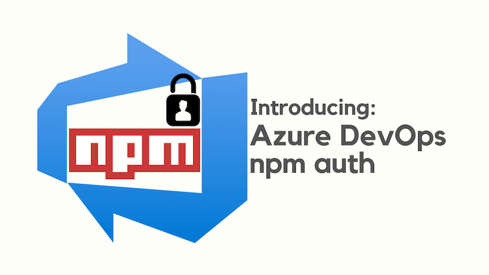
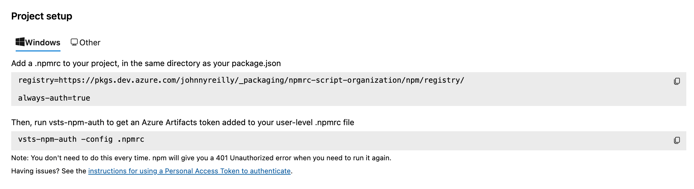
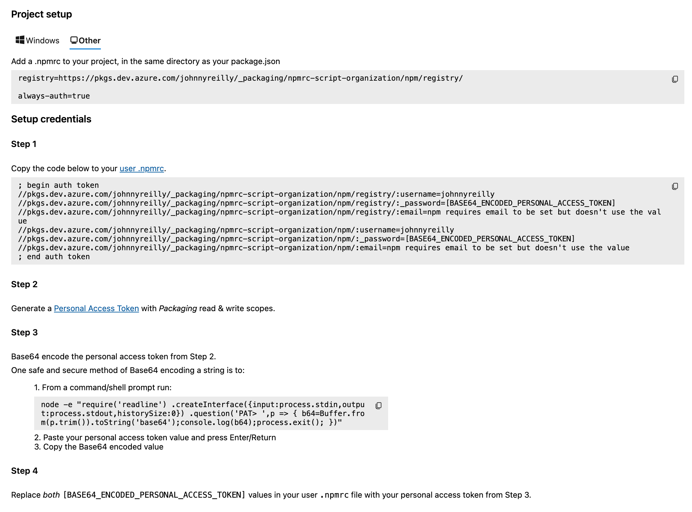

Azure DevOps has a feature called Azure Artifacts that supports publishing npm packages to a feed for consumption. Typically those npm packages are intended to be consumed by a restricted audience. To install a package published to a private feed you need to configure authentication, and for non Windows users this is a convoluted process.



[`azdo-npm-auth`](https://github.com/johnnyreilly/azdo-npm-auth) exists to ease the setting up of local authentication to Azure DevOps npm feeds, particularly for non Windows users.

<!--truncate-->

## What problem are we solving?

Consider the onboarding process for a Windows user for consuming an Azure Artifact npm feed:



Now consider the onboarding process for a non Windows user:



As we can see, there is a significant difference in the onboarding experience between operating systems. Windows users can use a tool named [`vsts-npm-auth`](https://www.npmjs.com/package/vsts-npm-auth) which automates onboarding. Non Windows users have a longer road to follow. The instructions walk through manually creating an `.npmrc` file in a users home directory which contains information including a base 64 encoded Azure DevOps Personal Access Token with the Packaging read and write scopes. It is tedious to do.

`azdo-npm-auth` aims to automate the toil, and make the onboarding experience for non Windows users as simple as it is for Windows users.

There is an official package named [`ado-npm-auth`](https://github.com/microsoft/ado-npm-auth). However, [due to issues I experienced in using the `ado-npm-auth` package](https://github.com/microsoft/ado-npm-auth/issues/50), I found myself creating `azdo-npm-auth`. By the way, the package was briefly named `ado-npm-auth-lite`; I renamed it as I felt `azdo-npm-auth` was a better name.

## When do I need to run `azdo-npm-auth`?

Should you encounter the following message when you try to `npm i`:

```shell
npm error code E401
npm error Unable to authenticate, your authentication token seems to be invalid.
npm error To correct this please try logging in again with:
npm error npm login
```

OR

```shell
npm error code E401
npm error Incorrect or missing password.
npm error If you were trying to login, change your password, create an
npm error authentication token or enable two-factor authentication then
npm error that means you likely typed your password in incorrectly.
npm error Please try again, or recover your password at:
npm error   https://www.npmjs.com/forgot
npm error
npm error If you were doing some other operation then your saved credentials are
npm error probably out of date. To correct this please try logging in again with:
npm error   npm login
```

That means either:

- You have no user `.npmrc` file **OR**
- The token in your user `.npmrc` file is out of date

In either case, running `azdo-npm-auth` should resolve the issue. But the way you run it is important. To get `azdo-npm-auth` to create the necessary user `.npmrc` file for local development, run the following command:

```shell
npx -y --registry https://registry.npmjs.org azdo-npm-auth
```

It is possible to use environment variables to control the `registry` setting as well; consider the following (non-Windows compatible) example:

```shell
npm_config_registry=https://registry.npmjs.org npx azdo-npm-auth
```

You might be wondering what the `--registry https://registry.npmjs.org` part is for. It is a way to ensure that the `npx` command uses the **public** npm registry to install `azdo-npm-auth`. Without this, you might encounter a `npm error code E401` error like those above.

## Configuration

`azdo-npm-auth` requires that a project `.npmrc` file exists in order that it can acquire the information to run.

There is an optional `config` parameter which allows selection of a specific project `.npmrc` file. If the `config` parameter is not supplied, `azdo-npm-auth` will default to use the `.npmrc` in the current project directory.

Should you not have one of these files already, there will be information in your Azure DevOps Artifacts section for connecting to the npm feed around creating a project `.npmrc` file. The required file should look something like this:

```shell
registry=https://pkgs.dev.azure.com/johnnyreilly/_packaging/npmrc-script-organization/npm/registry/

always-auth=true
```

## Authenticating to Azure

If you would like `azdo-npm-auth` to acquire a token on your behalf, then it requires that your [Azure DevOps organisation is connected with your Azure account / Microsoft Entra ID](https://learn.microsoft.com/en-us/azure/devops/organizations/accounts/connect-organization-to-azure-ad?view=azure-devops). Then, assuming you are authenticated with Azure, it can acquire an Azure DevOps Personal Access Token on your behalf. To authenticate, run `az login`. [If you need to install the Azure CLI, follow these instructions](https://learn.microsoft.com/en-us/cli/azure/install-azure-cli). It is not necessary to run `az login` if you are already authenticated with Azure.

If you would like to acquire a PAT token manually, there is a `--pat` option for that very circumstance.

## Integration with `package.json`

### Using a `preinstall` script

A great way to integrate `azdo-npm-auth` is by using it in a `preinstall` script in your `package.json`:

```json
"scripts": {
  "preinstall": "npx --yes azdo-npm-auth --config ./subdirectory-with-another-package-json/.npmrc"
},
```

The `--yes` flag above simply skips having npm challenge the user as to whether to download the package.

However, as you're probably noticing, this requires having multiple `package.json`s and only having the `.npmrc` file in the nested one. Assuming that works for you, brilliant. It may not - no worries. We'll talk about that in a second.

With the above `preinstall` script in place, when the user performs `npm i` or similar, before attempting to install, the relevant user `.npmrc` file will be put in place so that installation just works™️. This is a **great** developer experience.

### Using an `auth` script

If the complexity of nested `package.json`s doesn't work for you, we generally advise setting up a script like the one below:

```json
"scripts": {
  "auth": "npx -y --registry https://registry.npmjs.org azdo-npm-auth"
},
```

And running `npm run auth` when a `npm error code E401` is encountered. (Your script doesn't have to be called `auth` necessarily - if you like you could call it `fix-code-e401`, or something else entirely.)

## What about CI?

You might be worried about `azdo-npm-auth` trying to create user `.npmrc` files when running CI builds. Happily this does not happen; it detects whether it is running in a CI environment and does **not** create a user `.npmrc` file in that case.

## Summary

If you're a Mac or a Linux user, hopefully `azdo-npm-auth` can significantly ease the friction experienced doing local development with Azure DevOps npm feeds. You can see the [project code on GitHub here](https://github.com/johnnyreilly/azdo-npm-auth).
