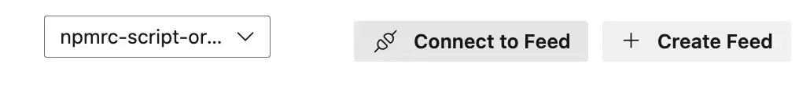

Azure DevOps has a feature called Azure Artifacts that supports publishing npm packages to a feed for consumption. Publishing a private npm package with Azure DevOps is a common scenario for teams that want to share code across projects or organizations. This post shows how to publish a private npm package with Azure DevOps.


Publishing a private npm package with Azure DevOps is fairly straightforward, but surprisingly documentation is a little sparse.

<!--truncate-->

## What feeds are available in Azure Artifacts?

If you don't already have a feed to publish your npm package to, you can create one in Azure DevOps [by following these instructions](https://learn.microsoft.com/en-us/azure/devops/artifacts/concepts/feeds?view=azure-devops).

If you're trying to find out what feeds are available in Azure Artifacts, you can find them in the Azure DevOps UI. Go to the Artifacts section in Azure DevOps and you'll see a list of feeds. The URL for the feed will be in the format `https://dev.azure.com/[ORGANIZATION]/_artifacts/feed`.

There you'll see a dropdown with the feeds you have access to:


You'll see from the screenshot that I have access to a feed called `npmrc-script-organization`. Let's use that feed to publish a private npm package.

## Setting up the `.npmrc` file

So that you can publish to a private feed, you need to set up an `.npmrc` file in your project. This file will contain the URL of the feed you want to publish to, and your credentials. To set up the `.npmrc` file, you can click on the "Connect to Feed" button in the Azure DevOps UI:



Then select `npm` and you'll see the instructions for setting up the `.npmrc` file:


## Publishing with Azure Pipelines

Now we're ready to publish our npm package with Azure DevOps. Here's an example of an Azure Pipelines YAML file that publishes a private npm package:

```yml
trigger:
  batch: true

pool:
  vmImage: ubuntu-latest

variables:
  isMainBranch: ${{ eq(variables['Build.SourceBranch'], 'refs/heads/main') }}

stages:
  - stage: Build_Package_Publish
    displayName: Build package and publish
    jobs:
      - job:
        steps:
          - task: NodeTool@0
            inputs:
              versionSpec: 20
            displayName: Install Node.js

          - task: npmAuthenticate@0
            inputs:
              workingFile: $(System.DefaultWorkingDirectory)/.npmrc

          - bash: npm install
            displayName: 'npm install'

          - bash: npm run build
            displayName: 'npm build'

          - task: Npm@1
            displayName: Publish Package
            inputs:
              command: 'publish'
              publishRegistry: 'useFeed'
              publishFeed: 'npmrc-script-organization'
```

Let's break down the steps in this YAML file:

- We're installing Node.js and authenticating with the `.npmrc` file.
- We're running `npm install` and `npm run build`. These are standard steps for building a Node.js project; yours might vary; what's important is that you are able to get your built package set up.
- Finally, we use the `Npm@1` task to publish the package. We specify the `publishRegistry` as `useFeed` and the `publishFeed` as `npmrc-script-organization`. This is the feed we're publishing to.

## Conclusion

In this post, we've seen how to publish a private npm package with Azure DevOps. We've set up the `.npmrc` file, and we've used an Azure Pipelines YAML file to publish the package. This is a common scenario for teams that want to share code across projects or organizations. I hope this post has been helpful to you!
